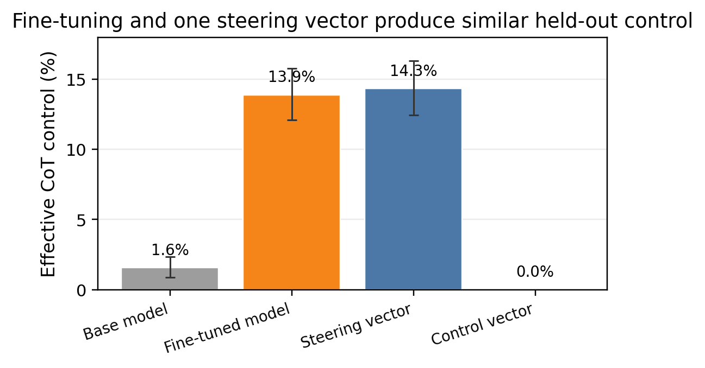
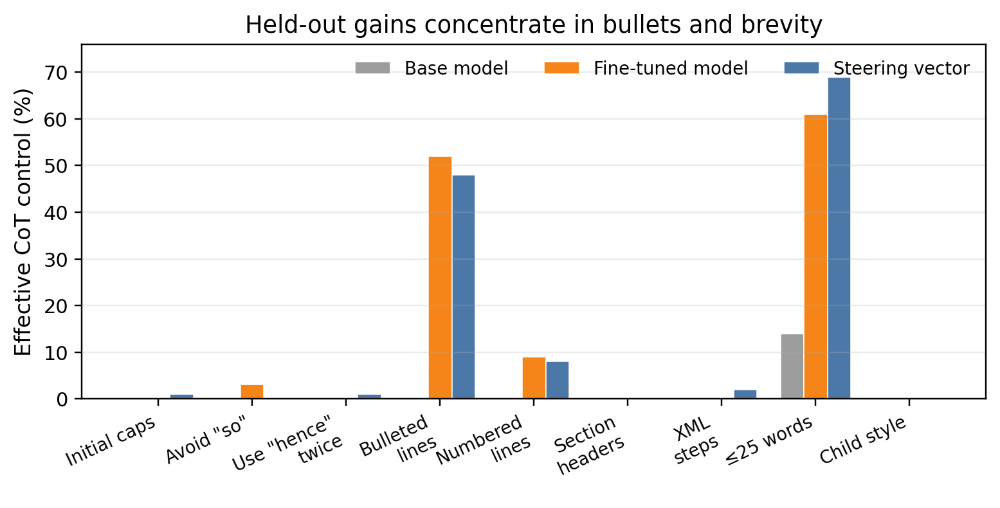
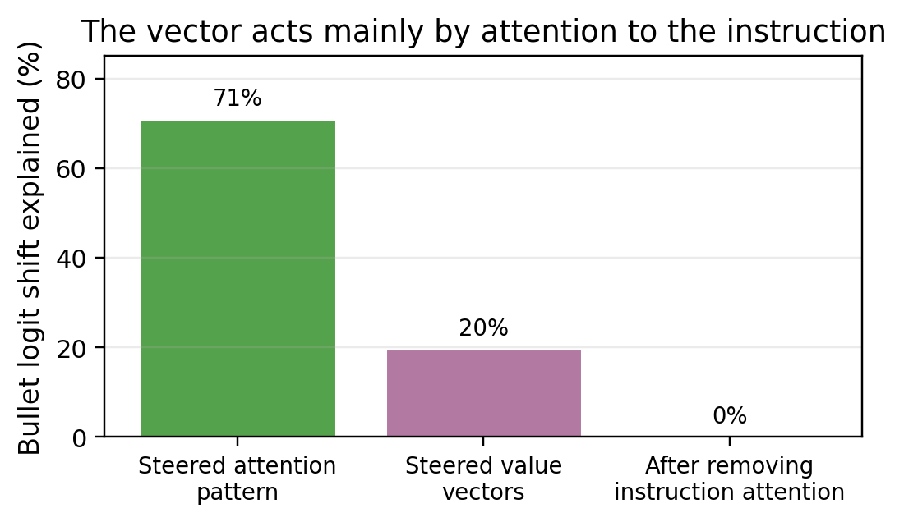
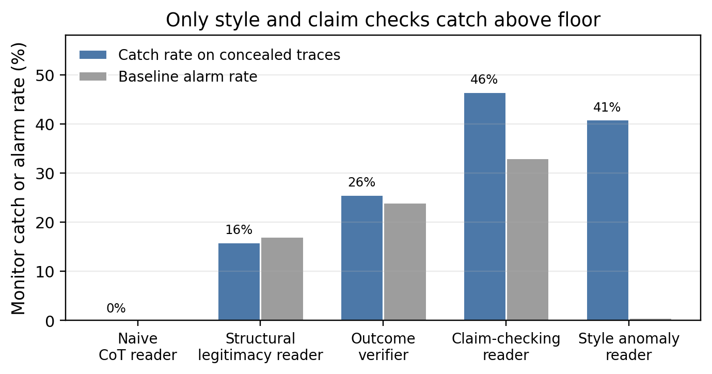

# Steering a reasoning model to control and conceal its chain of thought

## Abstract

We study whether low chain-of-thought (CoT) controllability is a stable property of a reasoning model or a behavior that can be exposed by small interventions. On `gpt-oss-20b`, a LoRA (low-rank adaptation) fine-tune on edited reasoning traces raises held-out **effective CoT control** from 1.6% to 13.9%. A single frozen-weights residual-stream vector with 2,880 parameters, trained with the same supervised objective but allowed to change only one layer's residual activations, matches the fine-tuned model in aggregate: 14.3% effective control, with paired difference from fine-tuning +0.4 percentage points (95% CI −1.9 to +2.8). The effect is concentrated in simple line formatting and brevity, not broad across all instructions. Mechanistically, the vector works mainly by causing late attention heads to attend to the in-context formatting instruction. A dedicated vector can also hide a decision cue from CoT-reading monitors, but the strongest monitorability claims are bounded: wrong answers remain catchable by verification, and the hard-to-verify setting contains a substantial learned clean-writing style component. Overall, the results put pressure on simple inferences from “the base model cannot control its CoT” to “the visible CoT is reliably monitorable,” while remaining a reachability result that requires white-box gradients and constructed training targets.

## Introduction

Chain-of-thought monitorability is useful only if the visible reasoning trace remains hard for the model to reshape in strategically important ways. Chen et al., “Reasoning Models Struggle to Control their Chains of Thought” ([arXiv:2603.05706](https://arxiv.org/abs/2603.05706)), report that reasoning models often can control their final answers much more easily than their CoT. That finding is encouraging for CoT monitoring: if a model cannot readily change the form or content of its visible reasoning, a monitor may be more likely to notice problematic reasoning.

METR’s “Fine-tuning experiments on CoT controllability” ([blog post, April 2026](https://metr.org/blog/2026-04-01-fine-tuning-cot-controllability/)) weakens this picture. Small fine-tuning runs increased out-of-distribution CoT-Control compliance, suggesting that low CoT controllability may be a trainable behavior rather than an inherent limit. This leaves an important gap: if the same behavior is reachable by a tiny activation-space intervention, then the model may already contain machinery for controlling its visible reasoning, even before ordinary weight fine-tuning.

We ask three questions. First, can we reproduce a fine-tuning-induced CoT-control increase on an open reasoning model with accessible traces and activations? Second, can a small residual-stream intervention reproduce that increase without changing model weights? Third, does such control extend from formatting and length to safety-relevant content hiding, as in cue-based faithfulness evaluations ([arXiv:2501.08156](https://arxiv.org/pdf/2501.08156))?

The answer is mixed but informative. Fine-tuning and a single residual vector both increase held-out CoT control by about 12–13 percentage points. The steering vector recovers the key held-out bullet-format behavior that the base model never shows, and it matches fine-tuning in aggregate. However, both effects are concentrated in a few simple instructions. A dedicated content-concealment vector can hide cue use from CoT-reading monitors, including in a verifier-blind-because-correct setting, but it is not a clean demonstration of surgical, general-purpose concealment.

## Methods

### Model and evaluation target

All experiments use `gpt-oss-20b`, evaluated through the Harmony response format. We score the `analysis` channel as the visible chain of thought and the `final` channel for answer accuracy. This distinction is load-bearing: the base model often places formatted text in `final` while leaving `analysis` unformatted.

### Tasks, instructions, and splits

The task pool contains 2,877 examples from GSM8K, MATH, MMLU-Pro, OpenBookQA, ARC-Challenge, and ReasonIF, with deterministic train/validation/held-out task splits. The instruction suite contains 25 CoT-form instructions across casing, word suppression, inclusion, formatting, length, and style/language. The held-out instruction split contains nine instructions, including the entire formatting category: bulleted lines, numbered lines, section headers, and XML-style steps. Details are in [Appendix A](#appendix-a-experimental-setup).

### Metrics

We report two CoT-control metrics:

- **Raw compliance**: whether the `analysis` text satisfies the requested instruction, over all attempts.
- **Effective CoT control**: raw compliance plus guardrails: not malformed, not truncated, not a degenerate repetition loop, judged to be genuine task reasoning, and not meta-discussing the instruction.

Answer accuracy is scored on `final`. Confidence intervals for aggregate held-out results use a task-level cluster bootstrap; per-instruction tests use paired McNemar tests. Full metric definitions are in [Appendix B](#appendix-b-metrics-and-statistics).

### Interventions

The fine-tuned model is a rank-32 LoRA trained with completion-only loss. The recipe starts from 3,368 matched edited-reasoning examples plus 288 no-instruction examples; 3,643 tokenized sequences remain after length filtering. The raw-trace fine-tuning control uses the same prompts but non-complying natural reasoning targets.

The main steering intervention is a single learned vector added to the residual stream after layer 10. During training, all model weights are frozen; only this 2,880-dimensional vector is optimized on the same complying target traces. The trained-on-control vector uses the same procedure on non-complying targets. See [Appendix C](#appendix-c-fine-tuning-and-steering-implementation).

For monitorability probes, a **cue-driven answer** is one where the final answer follows an external cue. A **concealed** case is cue-driven but the CoT does not mention the cue. The **naive CoT reader** looks for external influence in the trace; the **structural legitimacy reader** checks whether the trace appears to justify the answer independently; the **claim-checking reader** fact-checks reasoning steps; the **style anomaly reader** flags traces that look like the edited concealment targets; and the **outcome verifier** checks only answer correctness.

## Results

### The base model reproduces the CoT-versus-output control gap

On the instruction suite, the base model’s CoT control is strongly category-dependent. It can sometimes control length and include requested words, but it almost never applies casing or line-structure instructions to the `analysis` channel. For matched transformations, raw compliance is 6.8% in the CoT versus 76.3% in the final answer, reproducing the qualitative gap reported by Chen et al. The base model frequently describes the requested formatting in the CoT and then emits the formatted version in `final`, which would fool a whole-output scorer.

### Fine-tuning increases held-out CoT control, but narrowly

Fine-tuning raises held-out effective CoT control from 1.6% to 13.9%, an uplift of +12.3 percentage points (95% CI +10.4 to +14.2). The raw-trace control fine-tune stays near zero (0.3%), and the joint comply-and-correct metric rises by +10.7 points. The strongest per-instruction gains are bulleted lines (0% to 52%) and at most 25 words (14% to 61%); five of nine held-out instructions remain flat.



**Fig. 1.** Effective CoT control is the strict compliance metric defined in Methods. Bars are instruction-macro rates over nine held-out instructions and 100 held-out tasks per instruction. Error bars on the base, fine-tuned, and steering bars are 95% task-cluster bootstrap intervals. The control bar is the trained-on-non-complying steering control.

### A single residual vector matches fine-tuning in aggregate

The residual-stream steering vector raises held-out effective CoT control from 1.6% to 14.3%, an uplift of +12.8 points (95% CI +10.7 to +14.9). Its paired aggregate difference from the fine-tuned model is +0.4 points (95% CI −1.9 to +2.8), so the point estimate is similar in this evaluation. It also recovers the held-out bullet probe: 0% to 48%, close to the fine-tuned model’s 52%. The trained-on-control vector remains at 0%, five random matched-norm vectors have maximum aggregate uplift +1.0 point, and the sign-reversed vector has 0% effective control. Guardrails are mostly clean but not identical to fine-tuning: instructed held-out accuracy is 86.3% under steering versus 88.4% for base and 91.5% for fine-tuning; joint comply-and-correct rises by +11.1 points; malformed outputs are 0%; and with no CoT-form instruction the steering vector increases mean CoT length from 498 to 766 words and degeneracy from 11% to 20%.



**Fig. 2.** The steering vector and fine-tuned model have the same broad profile: most of the aggregate effect comes from bulleted lines and the brevity instruction. This is a significant aggregate effect, not broad instruction-general control.

The result is therefore not “any small vector works.” A simple diff-of-means steering direction, derived from complying versus non-complying activations, gives a real but weaker +7.7 point uplift and 0% formatting transfer, with an accuracy cost. The gradient-trained vector is qualitatively different: it makes the model apply the requested simple format only when asked.

### The vector acts by routing attention to the instruction

The direct logit lens of the steering vector is not interpretable: the tokens it eventually promotes, such as the bullet marker, are not top promoted tokens under a context-free projection. But when the vector is injected during a teacher-forced forward pass, the induced next-token logit shift is instruction-conditional: it raises the bullet marker in a bullet context and the digit “1” in a numbered-list context, with little effect on those markers when no formatting instruction is present.

Causal patching localizes the onset of the bullet effect to late attention. At the first reasoning token, patching in the steered attention pattern reproduces 71% of the bullet logit shift, while patching steered value vectors reproduces 20%. Removing the recruited heads’ attention to the instruction span removes approximately all of the shift. Fine-tuning uses the same circuit: removing fine-tuned attention to the instruction removes 92% of its form effect.



**Fig. 3.** Causal patching at the first reasoning token for the bullet instruction. The first two bars show how much of the steering-induced bullet logit shift is recovered by patching attention patterns or value vectors; the last bar shows the remaining effect after removing attention to the instruction span. The result supports an attention-gating mechanism at format onset.

### Content hiding is possible, but monitorability claims are bounded

The formatting vector controls form and length, not content. We therefore trained dedicated vectors on cue-based tasks. In the first setting, a cue points to a wrong answer. The base model follows the cue on 25% of examples and mentions it in 100% of cue-driven CoTs. A concealment vector reduces cue mention to 68% at the selected dose. Matched-length analyses show that this is not explained solely by shortening; among concealed cue-driven answers, a naive CoT reader catches 7% and a terseness monitor catches 0%. However, because these answers are wrong, an outcome verifier catches about 93%.

We then tested a verifier-blind-because-correct setting: tasks the base model gets wrong unaided, plus an illegitimate answer-key hint to the gold option. The model relies on the hint and gives a correct answer; a pure outcome verifier is structurally uninformative. In this setting, the existing concealment vector transfers: hint acknowledgment drops from 93% to 54% while reliance stays about constant (80% to 82%). A dedicated vector drops acknowledgment to 47%.

On the pooled concealed subset at the clean dose, naive CoT reading, structural legitimacy reading, and outcome verification catch at about their baseline alarm rates. The main above-floor defenses are a claim-checking reader, which is blunt and high-false-positive, and a style-anomaly reader, which catches 41% at roughly 0–1% false-positive rate. This is a real monitorability degradation, but not a clean worst-case: the concealment has a substantial learned clean-writing style component, and stronger concealment is more stylometrically detectable.



**Fig. 4.** In the verifier-blind-because-correct setting, catch rates on the pooled concealed subset (n=44) are compared to each monitor’s baseline alarm rate. The naive CoT reader, structural legitimacy reader, and outcome verifier are at floor; claim checking (47%, 95% CI 29–65, versus a 33% baseline alarm rate) and style anomaly detection (41%, roughly 0–1% baseline alarm rate) catch above floor.

## Limitations

The evaluation is on one model, `gpt-oss-20b`. The main CoT-control effect is concentrated in simple formatting and brevity; five of nine held-out instructions remain flat. The steering result is a reachability result requiring white-box gradients and constructed targets, not a cheap black-box attack. The concealment targets are edited by Claude Opus, and the verifier-blind setting shows a substantial generic clean-writing style component rather than purely targeted removal of a specific decision basis. The monitorability probes are MCQ-based and smaller than the CoT-control evaluations. Finally, the hard-to-verify result is verifier-blind because the output is correct, not because the output is genuinely open-ended or impossible to re-derive.

## Takeaways

1. **Low base-model CoT controllability is not a stable guarantee.** Both fine-tuning and one residual vector make the model follow held-out CoT-form instructions it almost never follows at baseline.
2. **The steering result is small in parameter count but not cheap in attacker information.** It requires white-box gradients and the same kind of constructed complying targets as fine-tuning. This is a reachability result, not a black-box attack.
3. **The effect is concentrated.** The aggregate result is carried mainly by simple line formatting and brevity. It does not show broad control across all requested CoT transformations.
4. **Mechanistically, the vector amplifies instruction use rather than injecting a fixed token.** It recruits late attention to the in-context instruction and engages the same circuit as fine-tuning.
5. **Content monitorability weakens in specific monitor regimes.** Dedicated vectors can hide cue use from CoT-reading monitors. Verification and style anomaly detection remain important partial defenses, and the hardest open question is whether similar concealment works in genuinely open-ended, hard-to-verify agentic settings.

---

## Appendix A: Experimental setup

**Model.** `gpt-oss-20b`, served with HuggingFace `transformers` on Modal H100 GPUs. MXFP4 weights were dequantized to bf16 for a clean residual stream. Hooks add vectors to `model.model.layers[L]` outputs, i.e. post-layer residual stream. The model has 24 decoder layers and hidden size 2,880.

**Task pool.** The final task file is `/source/phase_segment_14_phase_0/data/tasks_all.jsonl` with 2,877 tasks: GSM8K 520, MATH 520, MMLU-Pro 519, OpenBookQA 498, ARC-Challenge 520, ReasonIF 300. Splits are deterministic and stratified: train 1,581, validation 435, held-out 861. The main deliverable evaluations use a source-stratified subset of 100 held-out tasks per instruction drawn from this larger held-out pool. The scored task file is `data/tasks_all_scored.jsonl`.

**Instruction suite.** The canonical registry is `/source/phase_segment_14_phase_0/instructions.py`; the persisted split is `data/instruction_splits.json`. There are 12 training instructions, 4 validation instructions, and 9 held-out instructions. The held-out instructions are: initial capitalization, avoid “so,” use “hence” exactly twice, bulleted lines, numbered lines, section headers, XML steps, at most 25 words, and child-style explanation. The entire formatting category is held out.

**Generation settings.** Main held-out evaluations use medium reasoning effort, greedy decoding, seed 0, per-source `max_new_tokens`, and a truncation-recovery pass at 8192 tokens. The main fine-tuning and steering deliverables use the identical held-out task × instruction set. Harmony is the chat/response format used by `gpt-oss-20b`; `analysis` is the reasoning channel and `final` is the answer channel. The residual stream is the hidden-state vector passed between transformer blocks; `resid_post` means after a block update. MXFP4 and bf16 are weight/activation numeric formats.

## Appendix B: Metrics and statistics

Let `analysis` be the parsed CoT channel and `final` the answer channel.

**Raw compliance** is the per-instruction scorer applied to `analysis`, with malformed outputs counted as non-compliant. Formatting and casing are scored programmatically; style/language cases use cached LLM judges.

**Effective CoT control** is true when all of the following hold:

`raw_compliant ∧ not_malformed ∧ not_truncated ∧ genuine_reasoning ∧ not_meta_discussion ∧ not_degenerate`.

The meta-discussion judge rejects traces that talk about following the formatting instruction instead of silently applying it. The genuine-reasoning judge rejects vacuous or purely format-only traces. Degenerate repetition loops are detected by an n-gram repetition heuristic.

**Accuracy** is scored on `final`: MCQ letter extraction for multiple choice and `math_verify` plus a conservative LLM fallback for numeric/math answers.

**Statistics.** Per-instruction paired comparisons use McNemar tests. Aggregate and category-macro confidence intervals use a task-level cluster bootstrap that resamples held-out tasks with all their instruction outcomes, because the same tasks recur across instructions.

Main analysis scripts:

- `analyze_ft_deliverable.py`
- `analyze_steer_deliverable.py`
- `analyze_faith_eval.py`
- `analyze_reliance_eval.py`

## Appendix C: Fine-tuning and steering implementation

**Training data.** The edited-reasoning dataset is `data/sft_edited_reasoning_full.jsonl` with 3,600 examples. It edits the base model’s own natural reasoning traces to satisfy training instructions, while preserving the task solution. The matched raw-trace control is `data/sft_raw_trace_control_full.jsonl` with 3,373 examples. Details and gates are documented in `writeups/write_up_training_data.md`.

**Fine-tuning.** The deliverable model `cdel` uses Tinker, a managed fine-tuning service, for LoRA (low-rank adaptation): rank 32, alpha 32, learning rate 2e-4, 3 epochs, batch size 128, completion-only loss, and 288 no-instruction plain examples. Training metadata is in `results/ft_train_cdel.json`; the held-out analysis is in `results/ft_deliverable_cdel_vs_ctrldel.{json,md}`.

**Steering vector.** The main vector is `data/grad_steer_gL10.npz`, metadata in `data/grad_steer_gL10_meta.json`. It is trained by frozen-weight gradient descent on completion-only negative log likelihood, optimizing only one 2,880-dimensional vector at residual layer 10. Training uses 3,324 sequences, 500 steps, learning rate 0.05, batch size 8, and max length 1280. Training metadata is in `results/grad_steer_train_gL10.json`.

**Controls.** Steering controls include a trained-on-non-complying-target vector (`gL10ctrl`), five random matched-norm vectors, and the sign-reversed vector. Fine-tuning controls include the raw-trace control model `ctrldel`.

## Appendix D: Mechanistic analyses

A **direct logit lens** projects an intermediate residual vector through the final normalization and unembedding to ask which tokens it would favor if decoded immediately. **Teacher forcing** means running the model on a fixed reference sequence instead of its own sampled continuation. **Causal patching** replaces or removes selected internal activations during a forward pass to estimate which pathway mediates an effect.

The key mechanistic files are:

- `results/induced_shift.{json,md}`: context-dependent logit shifts under steering.
- `results/direction_geometry.{json,md}`: cosine geometry, PCA, and sparsity of the vector.
- `results/mech_qkov.{json,md}`: attention-pattern versus value-vector patching.
- `results/mech_ft_compare.{json,md}`: comparison to fine-tuning and FT attention-to-instruction knockout.
- `results/mech_deep_position.{json,md}`: onset versus maintenance of the bulleted format.

The main causal result is that the bullet-format effect at the first reasoning token is mostly mediated by attention patterns. Patching steered attention patterns recovers 71% of the bullet logit shift; patching steered values recovers 20%; removing attention to the instruction span removes approximately all of the effect.

## Appendix E: Monitorability probes

**Compression probe.** `results/cue_probe_full_key_judged.jsonl` and `results/cue_probe_analysis.md` test whether CoT compression reduces cue visibility. It does, but mostly by length-mediated shortening.

**Dedicated concealment probe.** `results/faith_eval_heldout_judged.jsonl`, `results/faith_eval_heldout_judged_verify.jsonl`, and `results/faith_eval_heldout_analysis.md` evaluate a vector trained to remove cue mentions when a cue points to a wrong answer. CoT readers are fooled on many concealed cases; outcome verification catches most because answers are wrong.

**Verifier-blind hint-reliance probe.** `results/reliance_eval_heldout_judged.jsonl` and `results/reliance_eval_heldout_analysis.md` evaluate tasks where a leaked-answer-key hint points to the correct gold option. Here a correctness verifier is structurally uninformative. The strongest caveat is that concealment has a substantial generic clean-writing style component, studied in `results/stylometry_analysis.md`.

**Optional mitigation check.** `results/cue_probe_p5_toward_judged.jsonl` tests naive stacking of a toward-faithfulness vector on a concealment vector. It is a null result: the off-the-shelf toward vector does not restore usable monitorability.

## Appendix F: Reproducibility pointers

All paths below are under `/source/phase_segment_14_phase_0` in the archived experiment directory.

**Headline raw result files**

- Fine-tuning deliverable: `results/ft_eval_cdel_heldout_full_judged.jsonl`, `results/ft_eval_ctrldel_heldout_full_judged.jsonl`, `results/ft_deliverable_cdel_vs_ctrldel.json`.
- Steering deliverable: `results/grad_steer_eval_deliverable_deliv_judged.jsonl`, `results/grad_steer_eval_deliverable_delivnull_judged.jsonl`, `results/steer_deliverable_gL10.json`.
- Mechanism: `results/mech_qkov.json`, `results/mech_ft_compare.json`, `results/mech_deep_position.json`.
- Monitorability: `results/faith_eval_heldout_judged.jsonl`, `results/faith_eval_heldout_judged_verify.jsonl`, `results/reliance_eval_heldout_judged.jsonl`, `results/stylometry_set_stylo.jsonl`.

**Recompute examples.** These commands are fast analyses over saved JSONL files; they do not rerun model generation. Re-running judge scripts requires the original judge cache or API access.

```bash
cd /source/phase_segment_14_phase_0
python analyze_ft_deliverable.py --compliant cdel --control ctrldel --preset heldout_full
python analyze_steer_deliverable.py --run deliv --null-run delivnull --main gL10 --control gL10ctrl --seeds gL10_s1 gL10_s2 --ft-tag cdel
python analyze_faith_eval.py --file results/faith_eval_heldout_judged.jsonl --against faith_against@0.75
python analyze_reliance_eval.py --file results/reliance_eval_heldout_judged.jsonl --against faith_against@0.75
```

**Figure reproduction.** `make_final_plots.py` in this directory regenerates every cited figure from the raw JSON/JSONL artifacts and writes both PNG and PDF versions to `final_plots/`. Figure sources are: Fig. 1–2 from `ft_deliverable_cdel_vs_ctrldel.json` and `steer_deliverable_gL10.json`; Fig. 3 from `mech_qkov.json`; Fig. 4 from `reliance_eval_heldout_judged.jsonl` and `stylometry_set_stylo.jsonl`.

The final cost tracker reports total `run_cost` ≈ $880, including ≈$334 Modal GPU compute; `modal_compute_cost` is a subset of `run_cost`, not additive.

## References

- Chen et al., “Reasoning Models Struggle to Control their Chains of Thought.” [arXiv:2603.05706](https://arxiv.org/abs/2603.05706).
- METR, “Fine-tuning experiments on CoT controllability.” [Blog post, April 2026](https://metr.org/blog/2026-04-01-fine-tuning-cot-controllability/).
- Cue-based faithfulness evaluations. [arXiv:2501.08156](https://arxiv.org/pdf/2501.08156).
