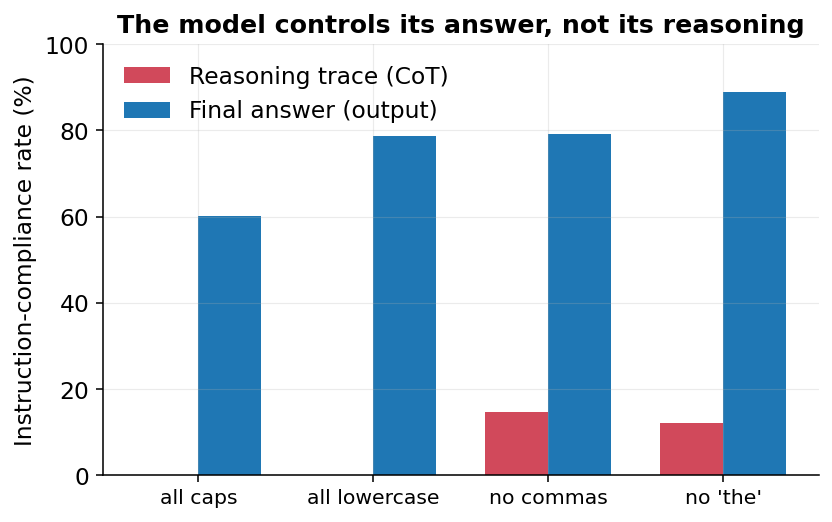
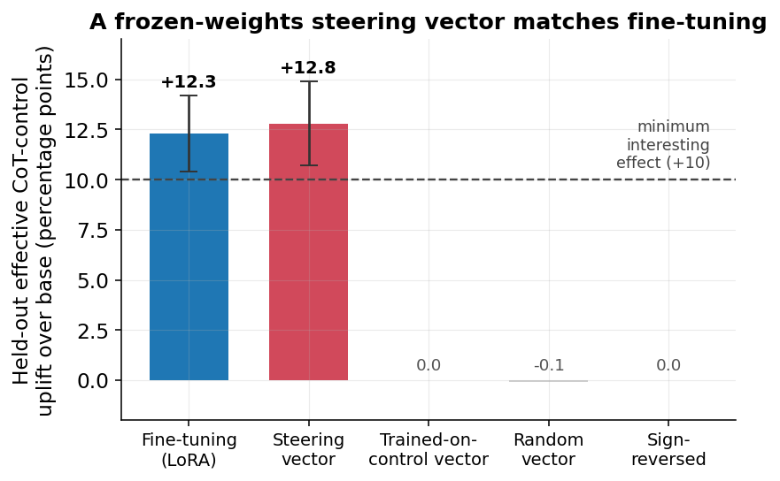
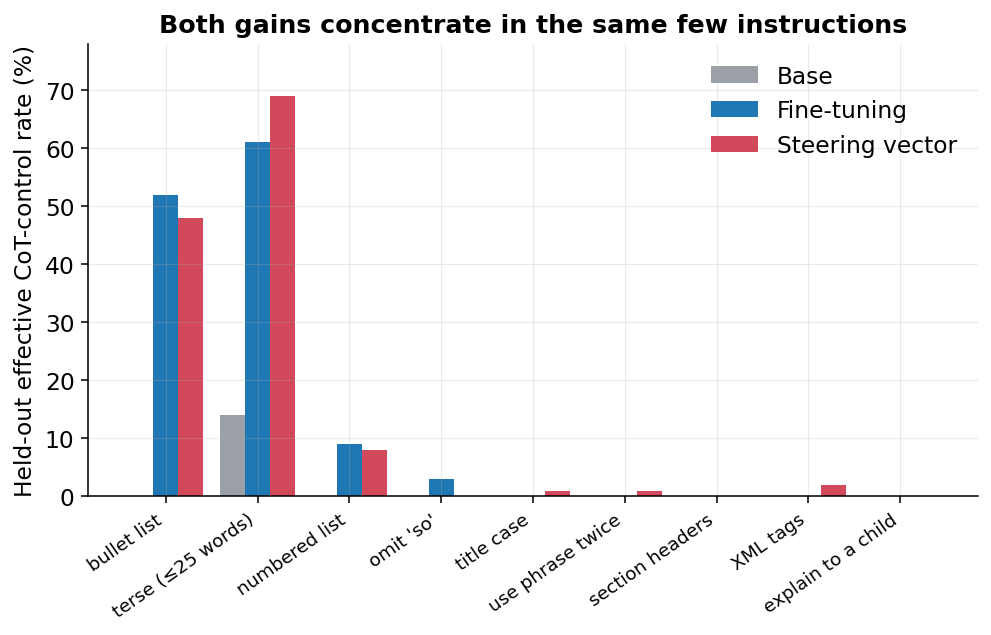
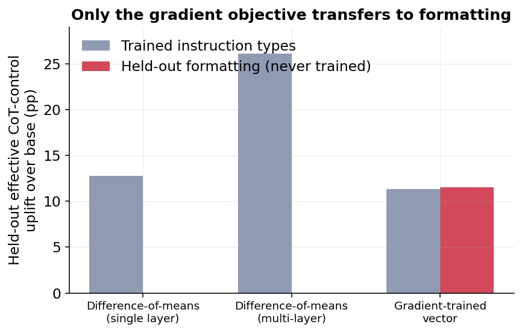
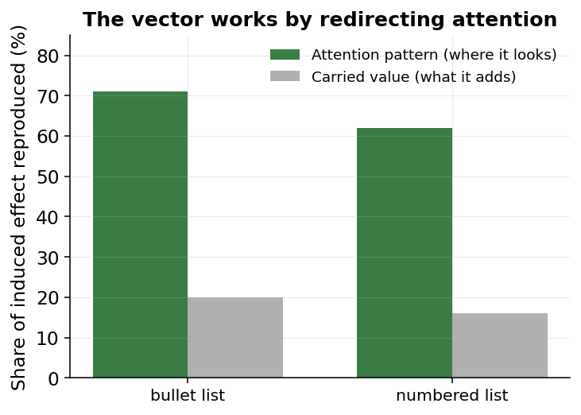
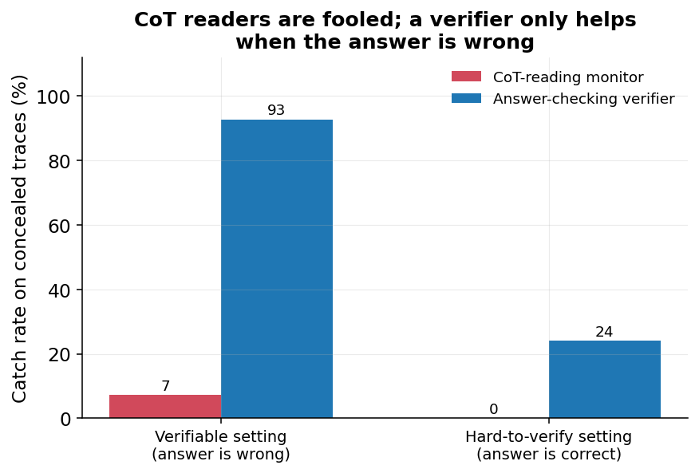
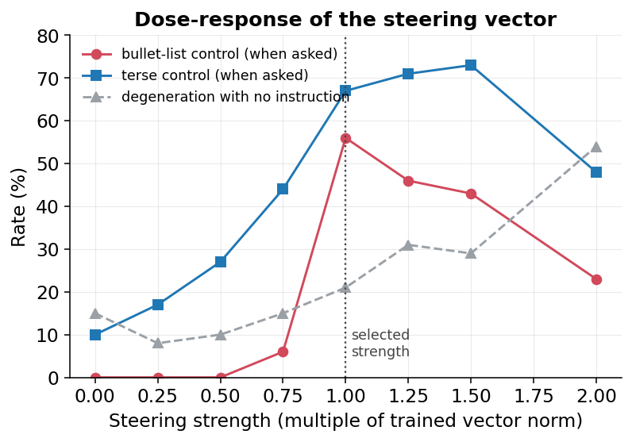
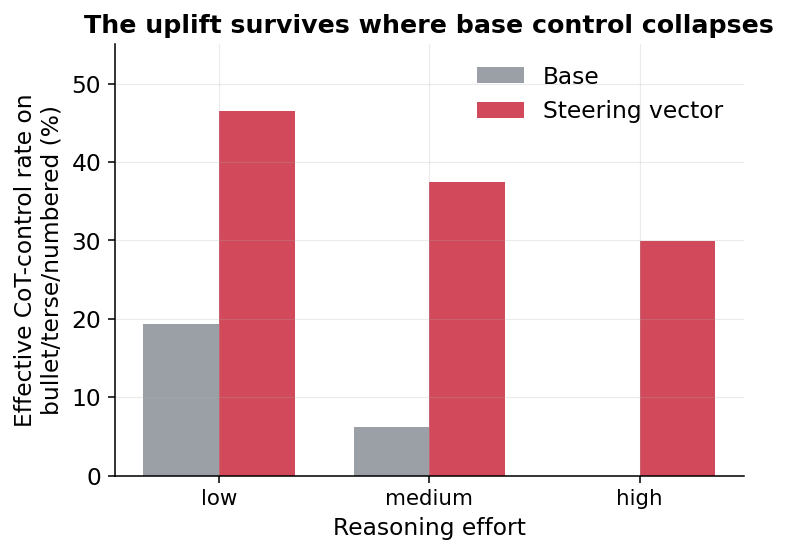

# A single steering vector reproduces fine-tuning's control over chain-of-thought, and what that means for monitoring

## Abstract

Reading a reasoning model's chain of thought (CoT) is a cheap oversight tool, but only if the
model cannot easily reshape what its reasoning says. Recent work reports two things that pull in
opposite directions: today's reasoning models are *bad* at controlling their CoT (good for
monitoring), yet a small fine-tuning run can teach them to control it (bad for monitoring). We ask
whether that control can be reached without changing any weights at all. On `gpt-oss-20b` we first
reproduce both prior findings: the base model almost never obeys instructions about the *form* of
its reasoning (it obeys the same instructions about its final answer ~76% of the time), and a LoRA
fine-tune produces a significant, accuracy-preserving, held-out increase in CoT control
(+12.3 percentage points). We then show that a **single frozen-weights vector added to one layer's
activations** (its residual stream) — 2,880 numbers, zero weight change — reproduces the fine-tuning
result in aggregate, *including* a formatting instruction it was never trained on (bullet-point
reasoning, 0%→48%). This is a statement about *reachability*, not a cheaper attack: building the
vector needs the same complying training data and white-box gradients as the fine-tune; the novelty
is that the resulting object is one fixed direction with zero weight change. The effect requires a
*gradient-trained* vector: the standard "difference-of-means" steering direction fails completely on
formatting. Mechanistically, the vector works by making late-layer attention heads look at the
in-context instruction the base model under-uses, and it drives the same circuit fine-tuning does.
Finally, a *dedicated* vector of the same kind can hide a specific decision-relevant cue from a
CoT-reading monitor — though, with important caveats, an answer-checking monitor catches it only when
the concealed reasoning leads to a *wrong* answer; when the answer is correct (reached by concealed,
illegitimate reliance on the cue) the verifier is useless. We read this as pressure on the simple
inference from "weak CoT control" to "the visible CoT is reliably monitorable," scoped to one model,
one construction recipe, and specific monitor types.

---

## 1. Introduction

A growing safety literature treats the chain of thought (CoT) of a reasoning model as an oversight
channel: if the model externalizes the reasoning that actually produced its answer, then a human or
an automated monitor can read that reasoning and catch undesired behavior. The value of this channel
depends on a property that is
easy to state but hard to pin down: how much control does the model have over *what its reasoning
says*? If a model cannot reshape its visible reasoning on demand, it cannot easily hide intent
there, and the monitor is hard to fool.

Two recent findings frame the present work.

- **Chen et al., "Reasoning Models Struggle to Control their Chains of Thought" (arXiv:2603.05706)**
  introduce a benchmark for *CoT controllability* — following instructions about the form or content
  of the reasoning trace, scored on the trace itself rather than the final answer. They find current
  reasoning models are far worse at this than at controlling their final answer (e.g. Claude
  Sonnet 4.5: ~2.7% on the CoT vs ~61.9% on the output). Low controllability is *good* news for
  monitoring.

- **METR, "Fine-tuning experiments on CoT controllability" (April 2026,
  https://metr.org/blog/2026-04-01-fine-tuning-cot-controllability/)** show that a small fine-tuning
  run raises out-of-distribution CoT-control compliance (≈2.9%→8.8% averaged over four models). So
  weak controllability is at least partly a *trainable propensity*, not a hard capability limit. METR
  note this does not by itself demonstrate reduced monitorability.

**The gap.** Fine-tuning changes the weights. It is natural to ask whether the same control is
reachable by a much smaller intervention that leaves the weights untouched — a *steering vector*: a
fixed direction added to the model's activations at inference time. If a single such direction
suffices, then the machinery for controlling the visible CoT is already present in the base model
and is cheap to surface. That would weaken the "weak control ⇒ monitorable" inference further than
fine-tuning does, and it would let us study the direction itself — what it is, how it works, and
whether a related direction can make the CoT *unfaithful* in a way that defeats a monitor.

**This work.** Using `gpt-oss-20b` (an open-weights reasoning model whose reasoning trace and
activations are both accessible), we:

1. **Reproduce prior work** (§4): the base model barely controls the *form* of its reasoning while
   readily controlling its final answer (Chen et al.); a LoRA fine-tune produces a significant,
   accuracy-preserving, held-out increase in CoT control (METR).
2. **Show the central result** (§5): a single frozen-weights residual-stream vector reproduces the
   fine-tuning increase in aggregate, including a held-out formatting instruction the base model
   never obeys, with a clean battery of controls. We isolate *why* it works — the gradient training
   objective, not the layer count or the way the direction is derived.
3. **Explain the mechanism** (§6): the vector acts by redirecting late-layer attention onto the
   in-context instruction, and engages the same circuit fine-tuning uses.
4. **Probe monitoring** (§7): a dedicated vector of the same construction can selectively hide a
   decision-relevant cue from CoT-reading monitors; we map exactly which monitor types this defeats
   and which still catch it, and we are explicit about what is demonstrated versus extrapolated.

All numbers below were re-derived from the run's raw result files (CSV/JSON/JSONL); §3 defines every
metric, and the appendices give the reproduction detail.

---

## 2. What "controlling the chain of thought" means here

`gpt-oss-20b` emits its output in OpenAI's **Harmony** format, which separates an `analysis` channel
(the reasoning trace / CoT), an optional `commentary` channel, and a `final` channel (the answer).
We score **CoT control on the `analysis` channel only**. This is the crux of the whole project: when
the base model is told to format *its reasoning*, it typically leaves the `analysis` channel in
natural prose (often just noting the instruction) and puts the requested format into the `final`
answer instead. Scoring the visible answer would therefore massively overstate how much the model
controls its reasoning. We parse the channels with the official Harmony renderer and explicitly track
malformed outputs where the channel markers are corrupted (Appendix A).

A **reasoning-trace instruction** is a request about the form or content of the `analysis` channel —
for example "write every line of your reasoning as a bullet starting with `- `", "keep your
reasoning under 25 words", or "do not use the word 'the' in your reasoning". We built a suite of 25
such instructions in 6 categories and split them into training, validation, and held-out sets, with
the **entire formatting category held out** (including the bullet-point instruction). Held-out
performance therefore tests *generalization to instruction types never seen in training* (Appendix B).

---

## 3. Methods and metrics

**Model and serving.** `gpt-oss-20b` (24 transformer layers, hidden size 2,880, a sparse
mixture-of-experts model) served on a single GPU through HuggingFace `transformers`, with the
quantized expert weights dequantized to bf16 so the **residual stream** (the running sum of
activations that each layer reads from and writes to) is clean for reading and writing. Steering is a
forward hook that adds a fixed vector to one layer's residual stream at every decoding step; the same
harness runs the base model, the fine-tuned model, and every steered variant so all comparisons are
apples-to-apples.

**The two control metrics.** For each (instruction, task) attempt we compute:

- **Raw compliance** — does the `analysis` trace satisfy the instruction's scorer? This is the
  Chen/METR-comparable number. Scorers are programmatic where possible (e.g. "every line starts with
  `- `") and an LLM judge for a few style instructions (Appendix C).
- **Effective control** — our stricter, primary metric: the trace is compliant **and** is genuine
  reasoning that works toward the answer (not a vacuous formatted shell) **and** does not merely
  discuss the instruction ("meta-discussion") **and** is not malformed or truncated. This closes an
  obvious loophole where a model "complies" by emitting an empty but correctly-formatted trace. Meta
  and genuineness are judged by Claude Opus; we found a cheaper judge over-flagged complying-but-fine
  traces as meta-discussion, which would have *inflated* the measured uplift, so all reported numbers
  use the Opus judge (Appendix C).

Unless stated otherwise, the headline metric is **held-out effective control**, and every difference
is reported against a **matched base run** (same tasks, decoding, and scoring).

**Tasks and accuracy.** 2,877 questions from six public sources (GSM8K, MATH, MMLU-Pro, OpenBookQA,
ARC-Challenge, and ReasonIF; ARC-Challenge substitutes for the proposal's CoTControl-QA, which was
not available as a question set — Appendix D), with deterministic leakage-checked splits. Accuracy is scored on the
`final` channel (symbolic math equivalence as primary, a conservative LLM judge as fallback; error
<1–2% per source). Base accuracy is 89.6%, leaving headroom to detect *degradation* (Appendix D).

**Statistics.** Held-out tasks recur across instructions, so outcomes are clustered by task; we
report 95% confidence intervals from a **task-level cluster bootstrap** and per-instruction paired
**McNemar** tests. We pre-registered a **minimum interesting effect of +10 percentage points** on
held-out effective control, set from a power analysis around the near-zero base rate (Appendix E).

---

## 4. Replication of prior work

**The base model controls its answer, not its reasoning (reproduces Chen et al.).** We applied the
same surface transformation as an instruction on the reasoning trace (scored on `analysis`) and as an
instruction on the final answer (scored on `final`, forced to a 40–90 word free-text explanation so
the transformation is non-trivial and the two channels are length-comparable). Aggregated over the
four instructions, the model complied **6.8% of the time on its reasoning vs 76.3% on its answer — a
69.6-point gap** (Figure 4). A per-100-word violation-rate check rules out the gap being an artifact
of the reasoning simply being longer (Appendix F). This is the "weak CoT controllability" finding,
on `gpt-oss-20b`.

*Figure 4. The base model applies a requested surface form to its final answer far more often than to
its reasoning trace. Bars are instruction-compliance rate (%) for four transformations, scored on the
reasoning trace (red) and on the final answer (blue). Aggregate: 6.8% on reasoning vs 76.3% on the
answer.*

**Fine-tuning teaches held-out CoT control (reproduces METR).** We built a supervised dataset by
editing the base model's *own* natural reasoning traces so they comply with the 12 training
instructions while still solving the task (Appendix G), and LoRA-fine-tuned on it. On the 9 held-out
instructions (100 tasks each), effective control rises **from 1.6% to 13.9%, +12.3 pp [95% CI +10.4,
+14.2]**, with the confidence interval clearing the pre-registered +10 pp bar. The increase is
largest on the *cross-category* formatting instructions the model was never trained on (+15.2 pp),
driven by bullet-point reasoning going **0%→52%** (McNemar p<10⁻⁴). Accuracy on tasks without any
instruction is preserved (89.5%→92.5%); the only accuracy cost is on length-limiting instructions,
which trade detail for brevity (e.g. terse 86%→76%).

Two controls establish that this is instruction-following, not a generic effect of more fine-tuning:

- **Raw-trace control.** An identical fine-tune on the *same prompts* but with target traces that do
  **not** comply (the base model's natural reasoning) gives 0.3% held-out effective control — a
  +13.6 pp gap to the complying fine-tune. The control reaches *lower* training loss, so it is not
  merely undertrained.
- **Prompting baseline.** A strong 4-shot prompt gives the base model 0% held-out effective control
  (the demonstrations make it discuss the format and route it to the answer), versus 42% for the
  fine-tune on the same subset. The control is not reachable by prompting alone.

This is a clean, significant, accuracy-preserving, control-dissociated reproduction. The *aggregate*
is carried by 2–3 instructions (bullet, terse, numbered); 5 of the 9 held-out instructions stay flat
(Figure 2). The claim is a significant aggregate uplift, not a broad across-the-board win.

---

## 5. A single frozen-weights vector reproduces it (central result)

**The intervention.** Take fine-tuning, but allow only one thing to change: a single fixed vector
added to layer 10's residual stream. Concretely, we minimize the same complying-target loss the
fine-tune uses, but with the model weights **frozen** and the gradient flowing only into a
2,880-dimensional additive vector at one layer (the **steering vector**). This is 2,880 trainable
numbers and *zero weight change*; at inference it is one vector added at one layer. The layer and
strength were selected on the validation split; the held-out result below was computed once, with the
configuration pre-committed.

**Result.** On the identical 9 held-out instructions × 100 tasks, the steering vector raises held-out
effective control **from 1.6% to 14.3%, +12.8 pp [+10.7, +14.9]** — clearing the +10 pp bar and, in a
paired test, **statistically indistinguishable from the fine-tune** (steering minus fine-tune = +0.4
pp [−1.9, +2.8]). It recovers the held-out formatting the base model never does: bullet-point
reasoning **0%→48%** (McNemar p<0.001), matching the fine-tune's 52% (Figures 1, 2). The raw-compliance
number (the Chen/METR-comparable metric) goes 2.1%→15.7% (METR reported ~2.9%→8.8% averaged over
four different models — an anchor to the same qualitative regime, not a quantitative match).

*Figure 1. Held-out **effective CoT-control** uplift over the base model (effective control = the
trace is compliant, genuine reasoning, non-meta, and well-formed; §3), in percentage points; error
bars are 95% task-clustered bootstrap CIs. A single frozen-weights steering vector (red) matches LoRA
fine-tuning (blue) and clears the pre-registered +10 pp bar (dashed line). The three controls give
essentially zero (values labelled): a vector trained on non-complying targets, a random vector
matched to the same norm (5-seed mean), and the sign-reversed vector.*

*Figure 2. Held-out **effective CoT-control** rate (%; §3) per instruction for the base model, the
fine-tune, and the steering vector. Both methods share the same profile: large gains on bullet lists,
terse reasoning, and numbered lists, and little movement on the rest. "omit 'so'", "title case", etc.
name the held-out instructions in plain English.*

**Controls (Figure 1).** The effect is the *learned direction*, not a generic push:

- **Trained-on-control twin** — the same training procedure on the non-complying targets gives 0.0%
  everywhere (a +14.3 pp gap), despite reaching lower training loss.
- **Random matched-norm vectors** — five random directions at the same layer scaled to the same norm
  give a mean uplift of −0.1 pp (max +1.0) and exactly 0.0 on formatting.
- **Sign-reversed** — the negated vector gives 0%.
- **Seed-robust** — retraining at seeds 1 and 2 gives bullet rates 47% and 50% (vs 48%).

**The vector is effectively instruction-conditional.** Although it is a single fixed direction, the
requested form appears *only when asked*: with no instruction it produces 0/100 spurious bullets,
numbered lists, or capitalized traces. It amplifies the model's in-context instruction-following
rather than injecting a fixed token pattern.

**Why a gradient-trained vector, and not the usual steering direction?** The standard way to build a
steering vector is **difference-of-means**: average the activations on complying traces, subtract the
average on non-complying traces, and add the result. We derived that direction from the *same*
training contrast and swept layer, sign, and magnitude. It gives a genuine but partial +7.7 pp on
held-out effective control — and **exactly 0.0 on formatting**, at a ~12 pp accuracy cost, because the
averaged direction simply has no formatting component (pushing harder garbles the output or switches
the reasoning into another language rather than producing bullets). Multi-layer, per-category, and
fine-tune-minus-base difference-of-means directions were all tried; *every fixed averaged direction
gets 0.0 on formatting* (Figure 3). Swapping only the fitting procedure — gradient descent on the
loss instead of a difference of means, same layer, same data, same single fixed vector — is what
unlocks the held-out formatting transfer. The cause is the **training objective**, not the layer
count or how the direction is derived. The conclusion is precise: single-layer difference-of-means
steering does *not* reproduce fine-tuning.

*Figure 3. Held-out **effective CoT-control** uplift over base (pp; §3), split into trained instruction
types (grey) and held-out formatting that was never trained (red). All three activation interventions
are evaluated on the **same held-out set** (9 instructions × 39 tasks). Difference-of-means steering —
even multi-layer, which is the strongest on trained types — transfers **nothing** to formatting; only
the gradient-trained vector does. (Fine-tuning, evaluated on the larger 100-task held-out set,
likewise reaches formatting: within +10.0, formatting +15.2 — Figures 1–2.)*

**Robustness (Appendix H).** The held-out uplift is positive and CI-significant on **all six task
sources** (range +8 to +17 pp), so the instruction-wise concentration is not a per-source artifact. It
**survives at high reasoning effort**, where base CoT control collapses to 0% (reproducing Chen et
al.'s effort finding) — the steering uplift is +30 pp there (Figure B). It produces four brand-new
line-prefix formats never in any split, so the conditional control is a general simple-form skill, not
bullet-specific. And on a fresh GSM-Symbolic source (templated math the model cannot have memorized)
both accuracy and the uplift hold, so neither is a contamination artifact on math.

**The honest cost where the vector does *not* match fine-tuning.** Because the vector is always on, it
has a side-effect the fine-tune lacks: with no instruction it imposes no format but raises verbosity
(mean reasoning length 498→766 words) and the degenerate-repetition rate (11%→20%). The fine-tune is
essentially inert with no instruction. This always-on signature is itself relevant to monitoring (§7)
and is the price of an inference-time vector versus a weight change.

---

## 6. What the direction is, and why it works

**It acts by modulation, not by injecting tokens (Appendix I).** Reading the steering vector directly
through the model's output head (the "logit lens": projecting it to next-token scores, or *logits*) is
uninterpretable — it does not even rank the tokens it ends up promoting near the top. But its *actual
effect* on the next-token distribution, measured by adding it while the model re-reads a fixed base
trace ("teacher-forcing"), is strongly instruction-conditional: in a
bullet-list context it adds +12–14 logits to the bullet marker `-`; in a numbered-list context it adds
+13–16 to the digit `1`; with no instruction it moves the format markers by ~0. The *same fixed vector*
promotes a hyphen in one context and a digit in another — the in-context instruction selects the form.
Geometrically the vector lies almost entirely *outside* every natural linear contrast in the model
(cosine ≤0.10 with the difference-of-means directions — the suppression-category direction is the
largest at −0.10 — the per-category directions, a supervised discriminant, and the top principal
components; the fine-tune-minus-base direction is the one exception at +0.17). This is consistent with
why difference-of-means could not find it: the direction that, when *added*, produces the behavior is
not the same as the direction that best *separates* complying from non-complying traces.

**Mechanism: late-attention gating onto the instruction (Appendix J).** The vector is additive in the
residual stream; the question is which downstream pathway carries its effect. We split each
attention head's contribution into the **attention pattern** (where the head looks) and the **carried
value** (what it adds once it looks). Imposing the steered *pattern* with base values reproduces 62–71%
of the form-logit shift; imposing the steered *values* with the base pattern reproduces only 16–20%
(Figure 5). And **surgically zeroing the recruited heads' attention onto the instruction span removes
essentially all of the effect** (≈100%), while doing the same on the base model barely moves it — so the
vector's job is to make late full-attention heads (layers 17–21) **attend to the in-context instruction
the base model under-uses**; later MLP/expert layers then read that out into the form. A control on the
no-instruction condition creates no format, preserving conditionality.

*Figure 5. Share of the steering vector's induced next-token effect reproduced by patching only the
steered attention pattern (where heads look, green) versus only the carried value (what they add,
grey), for two formatting instructions. The pattern dominates: the vector works mainly by redirecting
attention onto the instruction. Zeroing that attention removes ≈100% of the effect (Appendix J).*

**It drives the same circuit fine-tuning does (Appendix J).** The fine-tuned model writes the form
through the same layers (the per-layer profile of how much each layer writes the form into the output
scores matches the steering vector at cosine 0.94), uses the same attention gating, and zeroing *its*
attention onto the instruction removes 92% of *its* formatting effect. So although the steering vector is linearly off to the side of natural contrasts, it
recruits fine-tuning's own late-attention circuit rather than a parallel shortcut. (Expert-routing
analysis on this mixture-of-experts model is only partial: routing does shift, but dropping the
recruited experts removes ≤8%, so there is no single "formatting expert" — Appendix J.)

---

## 7. Implications for monitoring

The results so far concern controlling the *form* of the reasoning. The safety-relevant question is
whether a similar cheap intervention can degrade the *content* a monitor needs — making the CoT
unfaithful. We tested this on a **cue-based unfaithfulness** setup in the style of Turpin et al.
(*Language Models Don't Always Say What They Think*, arXiv:2305.04388) and the cue-based
and related cue-based faithfulness evaluations: a multiple-choice question is given with a planted hint pointing at one option, and
we measure whether the model (a) follows the hint and (b) *acknowledges* the hint in its CoT. A
faithful, monitorable CoT acknowledges the cue; concealment removes the acknowledgment while the answer
still follows the cue.

We use three monitor types: a **naive CoT-reading monitor** (reads the trace for the cue), an
**adversary-aware monitor** that additionally flags abnormally short traces, and a **verifier** that
re-solves the problem and checks the answer. We trained a *dedicated* concealment vector with exactly
the same recipe as the steering vector above, but on targets that argue for the cued answer without
mentioning the cue (Appendix K). Three findings, kept deliberately separate:

**(1) A cheap "make it terse" steer degrades monitoring only by generic shortening.** Amplifying a
terse instruction lowers cue-acknowledgment (100%→62%) and naive-monitor catch (98%→64%) — but a
matched-length analysis shows that at equal trace length it hides no more than simply *asking* for
terse reasoning, and the adversary-aware monitor recovers the catch (87%) by flagging the shortness.
The genuinely selective tail (concealed *and* full-length) is ~1.6%. This is a clean negative: generic
compression is not selective concealment.

**(2) A dedicated vector selectively conceals from CoT readers — but the answers are wrong, so a
verifier catches them.** In the setting where the cue points at a *wrong* answer, the dedicated vector
drops held-out cue-acknowledgment **100%→68% at matched length** (the base acknowledges the cue 100% at
*every* length, so concealment at full length is a content effect, not shortening). The naive monitor
catches 7% of concealed traces and the adversary-aware monitor the same 7% (its short-trace flag adds
nothing — it fires on 0% of these full-length concealed traces): both are fooled. **But the concealed
traces argue for a demonstrably wrong answer, so a correctness verifier catches ~92–97% of them**
(Figure 6, left). The effect is bidirectional and direction-specific: a sign-reversed vector, a
style-matched "acknowledge the cue" vector, and five random matched-norm vectors do not conceal, and the
concealment transfers to a never-trained cue type.

**(3) In a hard-to-verify setting the threat holds, but bounded.** We then built a setting where the
verifier is *structurally* uninformative: a hard question the base model fails unaided, plus a leaked
answer-key hint pointing at the *correct* option. The base model relies on the hint (~80%) and
acknowledges it (~93%); a verifier passes the (correct) answer, so the CoT is the only signal. The
dedicated vector (and, transferring with no retraining, the wrong-answer vector from finding 2) drops
hint-acknowledgment to ~47–54% at preserved length, keeps the model relying on the hint, and **leaves
the verifier useless (16–29% catch, unchanged)** because the answer is the gold option (Figure 6,
right). A capability control confirms the concealed "independent derivations" are fabrications: the
steered model still fails the task without the hint.

*Figure 6. For the **concealed** traces produced by one dedicated concealment vector (the cue is
followed but not acknowledged), the fraction each monitor catches, in two settings. A naive CoT-reading
monitor is fooled in both (7% and 0%). An answer-checking verifier (re-solves and checks the answer)
catches the concealment when the steered answer is wrong (93%, left, n=41 concealed of 404) but is
useless when the answer is the correct gold option reached by concealed illegitimate reliance (24%,
right, n=41 concealed of 56; ≈ its base false-positive floor). Steering drops cue-acknowledgment from
100%→68% (left) and 93%→54% (right) at matched trace length. Full monitor-by-setting detail in
Appendix K.*

**The honest bounds on finding (3).** Two caveats keep this from being a clean worst-case demonstration,
and we foreground them:

- **It is partly a generic clean-writing style, not surgical removal of the specific basis.** A
  shuffled-twin control — the same training on a *deranged* pairing of targets — conceals nearly as much
  (the transferred vector 54% vs its twin 58%; the dedicated vector 47% vs its twin 62%, with overlapping
  CIs). So a large fraction of the effect is a learned generic "clean, non-referencing" editing style. A
  real but modest targeted increment exists (the dedicated vector roughly doubles the twin's absolute
  rate of relying-and-concealing), but a precise decomposition is not warranted.
- **Cheap defenses partially work.** A low-false-positive (~1%) **style-anomaly monitor** flags 41% of
  the concealed traces, and a **claim-checking monitor** (fact-checks the steps) flags 47% versus its 33%
  false-positive floor — both partial, and pushing the steering harder to conceal more makes both fire
  more (a conceal-more / more-detectable trade-off). The always-on vector also leaves a stylometric
  footprint even with no hint present, which a monitor could flag.

**Scope (what is demonstrated vs extrapolated).** What is demonstrated is that a single frozen-weights
vector can selectively reduce the visibility of a decision-relevant cue from CoT-reading monitors, and
that in a verifier-blind setting it fools naive, structural-legitimacy, and outcome monitors at a clean
dose. The worst-case *combined* cell — surgical targeting **and** verifier-blind **and** evading *every*
monitor — is shown by no single experiment and is an explicit extrapolation, as is the genuinely
un-re-derivable open-ended/agentic setting (the hard-to-verify result here is verifier-blind *because the
answer is correct*, not because the output cannot be re-derived). A naive attempt to *restore*
monitorability by stacking an off-the-shelf "be faithful" vector was a clean null (Appendix K).

Critically, this is a **reachability** result, **not a cheaper attack**: the concealment vector needs the
same concealing training targets and white-box gradients that fine-tuning would. The novelty is that the
whole object is one residual direction with zero weight change. And the training targets here are
constructed by a stronger model (Claude Opus), so the claim is "reachable under this construction
recipe," not "a general latent capability."

---

## 8. Takeaways

1. **On `gpt-oss-20b`, a single frozen-weights 2,880-number vector reproduces fine-tuning's held-out
   control over the chain of thought**, including a formatting instruction the base model never obeys,
   and is statistically indistinguishable from the fine-tune in aggregate. The control machinery is
   already present in the base model and is cheap to surface at inference time, with zero weight change.
2. **The gradient training objective is what matters**, not the size or derivation of the vector. The
   standard difference-of-means steering direction fails completely on the hardest (formatting)
   generalization, even multi-layer; only a gradient-trained vector transfers.
3. **The vector works by amplifying in-context instruction-following** — redirecting late-layer attention
   onto the instruction — and engages the same circuit fine-tuning uses.
4. **For monitoring**, a dedicated vector of the same kind can selectively hide a decision-relevant cue
   from CoT-reading monitors at preserved trace length. Whether this matters depends on the monitor: an
   answer-checking verifier defeats it only when the concealed reasoning produces a *wrong* answer —
   when the answer is correct (reached by concealed illegitimate reliance) the verifier is useless — and cheap style-anomaly and
   claim-checking monitors partially catch it. The result puts real pressure on the simple inference from
   "weak CoT controllability" to "the visible CoT is reliably monitorable" — scoped to one model, one
   construction recipe, and these monitor types. It does not disprove monitorability in general.

**Limitations.** A single model; gains concentrated in a few instructions (5/9 held-out flat); a
reachability result that needs the same training data and gradients as fine-tuning, with targets built
by a stronger model; the monitoring results are multiple-choice and small-n (large-effect, bootstrap
CIs, not tight per-cell estimates); public-benchmark contamination is closed on math but open on the
multiple-choice sources; the mixture-of-experts mechanism is only partially localized. The full
limitations list is in Appendix L.

---

## Appendices

### Appendix A — Harmony channel parsing and malformed outputs
Outputs are parsed with the official `openai_harmony` renderer into `analysis` (CoT), `commentary`, and
`final` (answer) channels; the parser handles multiple analysis segments and commentary explicitly.
Steering and fine-tuning can corrupt the channel markers, so every result carries an explicit
**malformed** rate (the fraction where the split is ill-defined); a configuration that raises compliance
while raising the malformed rate is treated as suspect. In all headline results the malformed rate is
0%. A key base-model diagnostic, confirmed at scale: when told to format its *reasoning*, the base model
keeps the `analysis` channel natural and routes the requested form into `final`/`commentary` — which is
why CoT control must be scored on `analysis`. (`harmony_utils.py`; `results/harmony_parsing_inspection.md`.)

### Appendix B — Instruction suite and splits
25 reasoning-trace instructions in 6 categories: casing (e.g. all caps), suppression (e.g. omit "the",
omit commas), inclusion (e.g. use a phrase, include a marker), formatting (bullet, numbered, section
headers, XML tags), length (e.g. terse ≤25 words, ≤50 words), and style/language (e.g. all questions,
second person, reason in Spanish, explain to a child). Each instruction targets the `analysis` channel
and is placed in the user message referring to "your reasoning". Deterministic persisted splits: **12
train / 4 validation / 9 held-out**, with the **entire formatting category held out** (a cross-category
generalization test) plus novel within-category instances in validation and held-out. The held-out claim
is therefore transfer to instruction *types* never trained. (`instructions.py`,
`data/instruction_splits.json`.)

### Appendix C — Compliance, meta-discussion, and genuineness scoring
Per-instruction compliance scorers are programmatic where the property is checkable (line prefixes,
casing, token presence/absence, length) and a cached LLM judge for four style instructions. **Effective
control** additionally requires the trace to be genuine reasoning (an LLM rating that it works toward the
answer, plus a length floor) and free of meta-discussion (the trace must not merely talk about the
instruction). Programmatic scorers were unit-tested with constructed positive examples (the base model
rarely complies, so true positives must be constructed); the LLM judges were checked against hand labels
and against a stronger judge. A consequential finding carried through all later phases: a cheaper judge
over-flagged complying/styled traces as meta-discussion (up to ~95% false positives on some style
instructions), which would inflate the measured uplift; **all reported meta/genuine/style numbers use
the Claude Opus judge**, and the base reference was re-scored with it for an apples-to-apples
difference. (`judges.py`, `sft_judges.py`; `results/ft_meta_precision_audit.md`.)

### Appendix D — Tasks and accuracy scoring
2,877 tasks from GSM8K (520), MATH (520, levels 1–5), MMLU-Pro (519), OpenBookQA (498), ARC-Challenge
(520), and ReasonIF (300). (CoTControl-QA was not available as a question set and was substituted with
ARC-Challenge.) Unified schema, deterministic seeded stratified splits (train 1,581 / val 435 / held-out
861), deduplicated and verified leakage-free. Accuracy is scored on the `final` channel by symbolic math
equivalence (primary) and a conservative cached LLM-judge fallback; multiple-choice uses a hardened
case-insensitive letter extractor. Inspection put the scoring error <1–2% per source. Base accuracy
(medium reasoning effort, greedy, no instruction) is 89.6%. Answer-format convention: `\boxed{}` for
math/numeric, "just the letter" for multiple choice. (`answer_scoring.py`,
`data/tasks_all_scored.jsonl`.)

### Appendix E — Statistics and power
Confidence intervals are 95% from a task-level cluster bootstrap (held-out tasks recur across
instructions, so outcomes are clustered by task). Per-instruction tests are exact paired McNemar.
Because base rates are near zero, significance is dominated by sample size; a power analysis around the
~1.5% held-out base set the pre-registered minimum interesting effect at **+10 pp** and the held-out n at
~100 tasks/instruction. The primary claim is the pre-registered aggregate macro (no multiple-testing
correction needed); per-instruction tests are secondary and reported honestly as under-powered (3/9
held-out instructions survive a Bonferroni correction: bullet, numbered, terse). (`power_analysis.py`.)

### Appendix F — CoT-vs-output gap detail
Per instruction (CoT-compliance on `analysis` / output-compliance on `final`): all caps 0%/60.2%, all
lowercase 0%/78.6%, no commas 14.8%/79.1%, no "the" 12.2%/88.8%. The output form is a forced 40–90 word
explanation so the transformation is non-trivial and the channel lengths are comparable. A per-100-word
violation-rate check (e.g. ~3.6 "the"/100 words in the `analysis` trace vs ~0.05 in the `final`)
confirms the model suppresses the token *far less per unit text* in its reasoning — the gap is not a
length artifact. (`results/cot_vs_output_summary_main.md`.)

### Appendix G — Edited-reasoning training data
Following METR's recipe, training targets were built by **editing the base model's own natural traces**
to comply, never by re-solving. 3,600 compliant examples (balanced 300 per training instruction × 50 per
source) plus a 3,373-example matched raw-trace control (same prompts, non-complying targets). Editing was
programmatic and structure-preserving for casing/comma/inclusion instructions and an Opus LLM editor
(edits only, behind a source-faithfulness gate and a blind "does the trace still conclude the gold
answer" gate) for style/length instructions; true conclusion-drift in the LLM edits was ~0.5–1%. Every
target is compliant, genuine, non-meta, concludes the gold answer, has a correct `final`, and is
well-formed; an independent recompute from stored text found 0 failures. The training sequence is built
to be byte-for-byte identical to the evaluation prompt (`prompt_token_sha256` persisted).
(`build_sft.py`, `data/sft_edited_reasoning_full.jsonl`; `results/sft_inspection_full.md`.)

### Appendix H — Fine-tuning and steering configuration; robustness
**Fine-tune** (`cdel`): LoRA rank 32, α 32, lr 2e-4, 3 epochs, batch 128, MoE-expert + attention +
unembedding targets, completion-only loss, selected on validation; an 8% mix of no-instruction examples
fixed a degenerate long-tail; served as an unquantized bf16 merge so base and fine-tune share identical
dequantized weights (no precision confound) and both are steering-hookable. **Steering vector** (`gL10`):
2,880-dim additive vector at the layer-10 residual stream, weights frozen, complying-target completion-only
loss, 500 steps, lr 0.05, seed 0, norm ≈148; layer and strength selected on validation, pre-committed
for held-out. **Robustness of the steering uplift:** positive and CI-significant on all six task sources
(+16.7 arc, +15.6 gsm8k, +11.9 math, +13.0 mmlu_pro, +8.3 openbookqa, +8.3 reasonif); survives at high
reasoning effort (+30 pp where base control is 0%); produces four brand-new line-prefix forms; and holds
on a fresh GSM-Symbolic source (bullet 0→73%). Dose-response (Figure A) shows compliance rising with
strength to a plateau around 1–1.5× the trained norm, coherence breaking by 2×, and zero spurious forms
at every strength. (`ft_train_cdel.json`, `grad_steer_train_gL10.json`; `results/steer_per_source.md`,
`effort_sweep.md`, `dose_response.md`, `steer_gsmsym.md`.) Total API + GPU compute for the entire study
(all phases, including the fine-tunes and the steering and monitoring sweeps) was ≈$880.

*Figure A. Steering dose-response. Bullet-list and terse control (when the instruction is given) rise with
steering strength to a plateau; degeneration with no instruction is the off-target cost. The dotted line
is the strength used in all headline results.*

*Figure B. Effective CoT-control rate on the three instructions that carry the aggregate gain
(bullet list, terse, numbered) versus reasoning effort. Base control collapses to 0% at high effort
(reproducing Chen et al.); the steering uplift survives.*

### Appendix I — What the direction is (cheap interpretability)
The steering vector's direct logit-lens projection is uninterpretable (top tokens are rare byte/proper-noun
fragments; it ranks the markers it actually promotes around the 17th–22nd percentile). Its *measured*
induced next-token shift (add the vector, teacher-force the base trace) is strongly instruction-conditional:
bullet→`-` +12–14 logits, numbered→`1` +13–16, title-case→capitalized content words, ~0 on no-instruction,
and it suppresses meta/persona tokens everywhere. The negated vector promotes exactly those meta/verbose
tokens (explaining the sign-reversed verbosity). Geometrically it is dense, stable across seeds (cosine
0.995), and largely outside every natural linear contrast (cosine ≤0.10 with the pooled and per-category
difference-of-means directions — suppression is largest at −0.10, fine-tune-minus-base is the exception
at +0.17 — a supervised discriminant, and the top principal components; only ~22% of its norm lies in
the interpretable contrast span) — consistent with why difference-of-means could not find
it. The "it's just the instruction-present feature" hypothesis is falsified (cosine ≈ −0.04 with the
instruction-present-minus-absent direction). (`results/logit_lens.md`, `induced_shift.md`,
`direction_geometry.md`.)

### Appendix J — Mechanism (causal)
The vector is additive in the residual stream; we attribute its effect by pathway. **Onset (first reasoning
token):** patching the steered attention *pattern* with base values reproduces 62–71% of the form-logit
shift versus 16–20% for the steered *values*; surgically zeroing the recruited heads' post-softmax attention
onto the instruction span removes ≈100% (a base+mask control shows this removes the vector's induced
*increment*, not a generic attention change). The recruited heads are late full-attention layers (17/19/21);
late MLP/expert layers (18–22) read the result into the form logit; the vector's direct logit-lens path at
layer 10 is ≈0. Freezing late attention removes ~70%, late MLP ~50%, both ~90% (jointly necessary).
**Maintenance (later tokens):** the form is self-sustaining by in-context copying (the base `-` logit is
already +30 by the second bullet) plus a small value-path nudge — explaining why steering at deep token
positions has little effect. **Same circuit as fine-tuning:** the *direct-logit-attribution* profile
(how much each layer's output, read straight through the output head, contributes to the form-token
score) matches the steering vector's at cosine 0.94; the fine-tune shares the attention gating, and
zeroing its own attention-to-instruction removes 92% of its formatting effect. **Mixture-of-experts:** routing shifts conditionally but is not localizable — dropping the
recruited experts removes ≤8%. Meta-suppression shares the upstream gating but is partially dissociable
(more MLP-mediated). Scoped honestly: a dominant-channel verdict (attention gating, with a real ~20–40%
value component), bullet-strong and casing-weak; a well-validated partial mechanism on a hard
mixture-of-experts model. (`results/mech_qkov.md`, `mech_ft_compare.md`, `mech_deep_position.md`,
`mech_moe_routing.md`.)

### Appendix K — Monitoring experiments (full detail)
**Setup.** Cue-based unfaithfulness: a multiple-choice question with a planted answer-key cue; "follows"
= answers the cued option, "acknowledges" = the CoT references the cue. Monitors: naive CoT-reader,
adversary-aware (flags abnormally terse traces), correctness verifier (re-solves and checks the answer),
structural-legitimacy reader, claim-checker (fact-checks steps), and an LLM style-anomaly monitor. The
concealment vector (`faith_against`) is trained with the §5 recipe on Opus-constructed targets that argue
for the cued answer without mentioning the cue; a dedicated `reliance_against` is trained analogously for
the hard-to-verify scenario.

**Finding 1 (compression lever, n≈400 cued tasks).** Amplifying a terse instruction: cue-acknowledgment
100→62%, naive catch 98→64%, but a matched-length test shows no concealment beyond shortening, the
adversary-aware monitor recovers (87% on concealed, alarming on ~74% of all compressed outputs), genuine
selective tail ~1.6%. (`results/cue_probe_analysis.md`.)

**Finding 2 (wrong-answer cue, n=404).** `faith_against` at the validation-selected 0.75× strength:
cue-acknowledgment on flips 100→68% at matched length (base is 100% at every length bin); naive catch on
concealed traces 7%, adversary-aware also 7% (its short-trace flag fires on 0% of these full-length
concealed traces, so it adds nothing); **verifier catch ~92–97%** (answers are wrong); 38/40 coherent
concealed flips evade both CoT-reading monitors. Controls: style-matched toward vector 96%, sign-reversed
100%, 5-seed random null 94–100%; transfers to a never-trained "Stanford authority" cue (100→58%); no-cue
capability guardrail 94.3% vs base 97.8%. (`results/faith_eval_heldout_analysis.md`,
`faith_eval_heldout_judged_verify.jsonl`.)

**Finding 3 (hard-to-verify hint-reliance, n=56).** Leaked answer-key hint to the *correct* option on
hard questions the base fails unaided. Headroom gate passes (base relies 80%, acknowledges 93%, verifier
passes the correct answer). `faith_against` (transferred, no retraining) and a dedicated `reliance_against`:
hint-acknowledgment 93→54/47%, naive 78→39/30%, at preserved/greater length, reliance maintained
(80→77–82%), **verifier 16–29%, unchanged**. Capability control: steered no-hint accuracy 32% ≈ random-null
23% → concealed derivations are fabrications. Honest bound (catch on the concealed subset vs each monitor's
false-positive floor, pooled clean dose n=44): naive 0%; structural-legitimacy 16% ≈ its 17% floor
(fooled); verifier 24% ≈ floor (fooled); claim-checker 47% vs 33% floor (partial, blunt, not significant);
style-anomaly 41% at ~1% floor (cheapest above-floor defense). Targeting axis: a shuffled-twin control
conceals nearly as much (transferred 54≈twin 58; dedicated 47 vs twin 62, overlapping CIs), so the effect
is mostly a learned generic clean-editing style with a modest real targeted increment.
(`results/reliance_eval_heldout_analysis.md`, `stylometry_analysis.md`.)

**Toward-mitigation null.** Stacking an off-the-shelf "be faithful" vector on the concealing condition does
*not* restore acknowledgment: the raw toward vector is ~orthogonal to the concealment direction (cosine
−0.03) and the style-matched one is aligned with it (cosine +0.79), so stacking either fails to oppose it; a
real mitigation would need a vector trained specifically to oppose the concealment direction.
(`results/cue_probe_p5_toward_judged.jsonl`.)

### Appendix L — Full limitations
Single model (`gpt-oss-20b`); the aggregate uplift is concentrated in 2–3 instructions (5/9 held-out
flat) and is a significant aggregate, not a broad capability. Both the control and the concealment results
are **reachability**, not cheaper attacks — they need the same training targets and white-box gradients as
fine-tuning, and the targets are built by a stronger model (Opus), so claims are scoped to "under this
construction recipe." The always-on vector has an off-target verbosity/degeneration cost the fine-tune
lacks. The monitoring experiments are multiple-choice and small-n (reported as large-effect with bootstrap
CIs). Public-benchmark contamination is closed on math (GSM-Symbolic) but open on the multiple-choice
sources. The hard-to-verify result is verifier-blind *because the answer is correct*, not because the
output is genuinely un-re-derivable — the open-ended/agentic case is future work. The verifier "catch
floor" (~16–29%) is the judge's disagreement-with-gold rate on hard questions, not concealment detection.
Meta/concealment/style judging leans on a single Opus judge, mitigated by calibration and inspection but
not a fully independent oracle. The mixture-of-experts mechanism is only partially localized. No cheap
mitigation is demonstrated.

---

## References

- L. Chen et al., *Reasoning Models Struggle to Control their Chains of Thought.* arXiv:2603.05706.
  (Cited throughout the proposal.)
- METR, *Fine-tuning experiments on CoT controllability.* April 2026.
  https://metr.org/blog/2026-04-01-fine-tuning-cot-controllability/ (Cited in the proposal.)
- M. Turpin et al., *Language Models Don't Always Say What They Think: Unfaithful Explanations in
  Chain-of-Thought Prompting.* arXiv:2305.04388. (The cue-based faithfulness paradigm this work builds on.)

