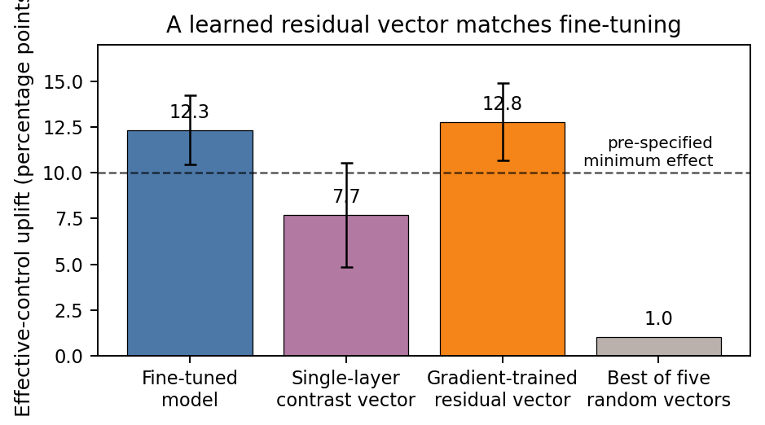
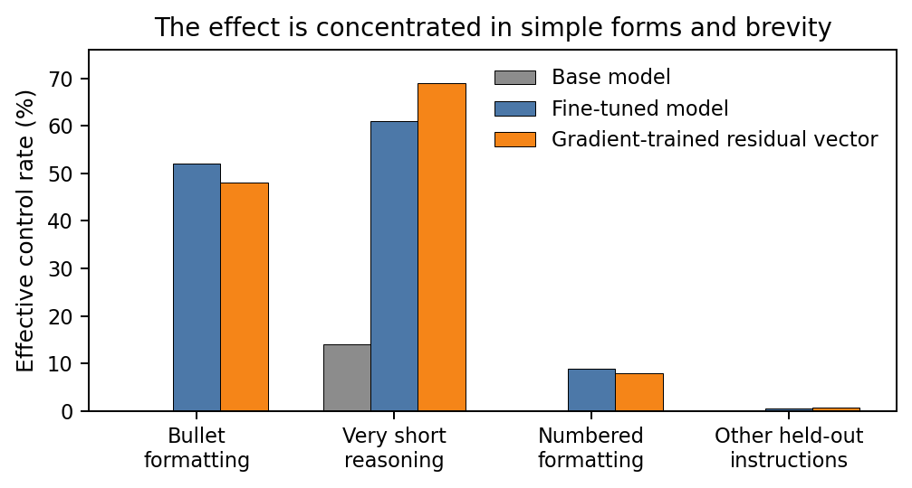
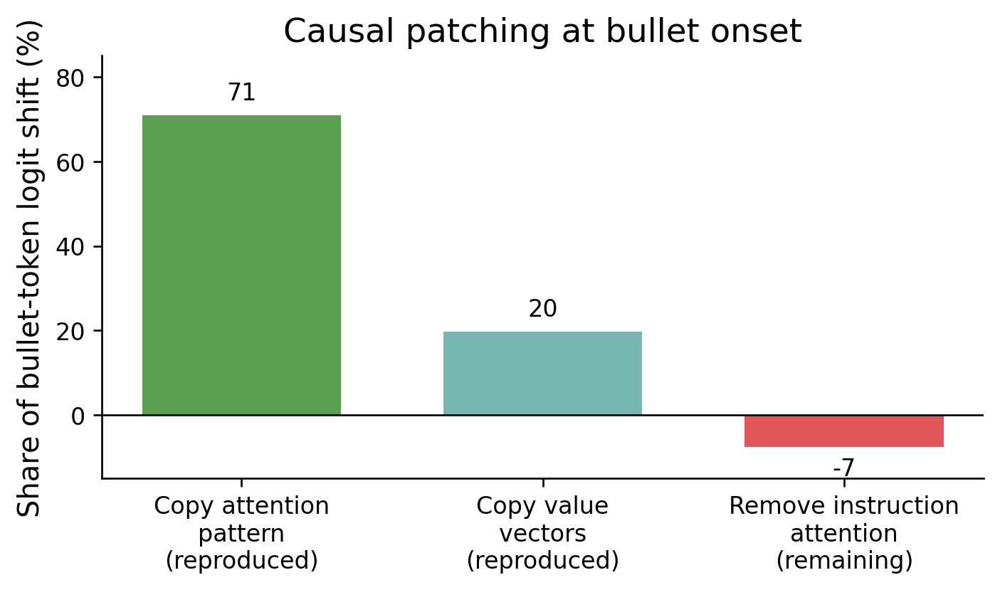
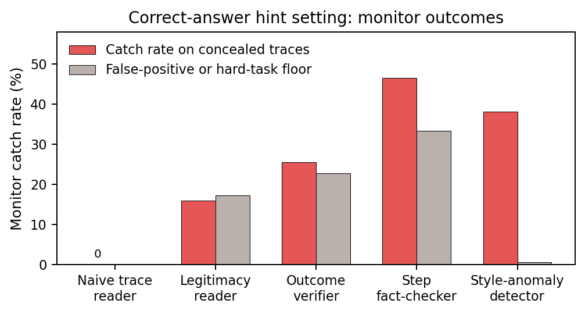

# A single residual-stream vector can reproduce fine-tuning’s chain-of-thought control on `gpt-oss-20b`

## Introduction

Chain-of-thought (CoT) monitoring relies on a simple hope: if a model’s visible reasoning trace says enough about why it chose an answer, humans or automated monitors can catch some bad behavior by reading that trace. Chen et al., *Reasoning Models Struggle to Control their Chains of Thought* ([arXiv:2603.05706](https://arxiv.org/abs/2603.05706)), report evidence for this hope: reasoning models can often format or edit final answers, but have much less control over their CoTs. METR’s *Fine-tuning experiments on CoT controllability* ([blog, April 2026](https://metr.org/blog/2026-04-01-fine-tuning-cot-controllability/)) weakens the inference: small adapter fine-tuning runs can increase out-of-distribution CoT-control compliance.

This study asks whether weight updates are necessary. We use `gpt-oss-20b`, whose Harmony format exposes a distinct `analysis` channel (the visible CoT) and `final` channel (the answer). We first reproduce a METR-like fine-tuning result. We then test whether a much smaller activation-space intervention—a single fixed vector added to one transformer residual stream, the hidden state passed between layers—can reproduce the effect.

We call a trace **effectively controlled** only if it obeys the requested reasoning-trace instruction while still containing genuine task-relevant reasoning and avoiding obvious failure modes such as malformed output, truncation, meta-discussion, or repetition loops. Fine-tuning raises held-out effective control from **1.6% to 13.9%** (+12.3 percentage points (pp), 95% confidence interval (CI) [+10.4, +14.2]). A single frozen-weights **2,880-parameter learned layer-10 residual vector** raises it from **1.6% to 14.3%** (+12.8 pp, [+10.7, +14.9]). We do not detect an aggregate difference from the fine-tuned model (paired difference +0.4 pp, [−1.9, +2.8]). The effect is concentrated—mainly bullet formatting and very short reasoning—but this is also true of the fine-tuned model.

Mechanistically, the vector does not directly inject bullet tokens; it makes late attention heads attend to the in-context formatting instruction. Dedicated vectors can also conceal cue use from CoT-reading monitors in controlled cue-following settings. Those monitorability results are reachability demonstrations, not black-box attacks: they require constructed training targets and white-box gradients, and the strongest combined threat case remains unproven.

## Methods

**Model and trace parsing.** All experiments use `gpt-oss-20b` with medium reasoning effort, greedy decoding, and HuggingFace `transformers` on Modal H100s. We score only the Harmony `analysis` channel as the CoT. This matters: the base model often puts requested formatting into the `final` answer while leaving `analysis` natural.

**Tasks and instructions.** The task pool contains 2,877 examples from GSM8K, MATH, MMLU-Pro, OpenBookQA, ARC-Challenge, and ReasonIF, with deterministic train/validation/held-out splits. The instruction suite contains 25 reasoning-trace instructions in six categories: casing, word suppression, word or marker inclusion, formatting, length, and style/language. Twelve instructions are used for training, four for validation, and nine are held out. The entire formatting category, including the bullet-list probe, is held out. Artifact paths are listed in [Appendix A](#appendix-a-reproduction-map).

**Metrics.** `raw_compliance` is the per-instruction compliance scorer applied to the `analysis` channel. The main metric, **effective control**, is:

> compliant with the instruction **and** not meta-discussing the instruction **and** genuine task-relevant reasoning **and** not malformed, truncated, or a repetition loop.

Task accuracy is scored on the `final` channel. Macro results average over held-out instructions; CIs use task-level cluster bootstrap, resampling tasks with all their instruction outcomes. Per-instruction tests use paired McNemar tests. Metric and judge details are in [Appendix B](#appendix-b-metric-details).

**Fine-tuning baseline.** The supervised fine-tuning (SFT) data is built by editing the base model’s own correct natural traces into instruction-compliant traces for the 12 training instructions. A matched control fine-tune uses the same prompts but natural non-compliant traces. The selected low-rank adapter fine-tuning (LoRA) configuration is rank 32, learning rate 2e-4, 3 epochs, plus an 8% no-instruction “plain” mix to reduce repetition loops.

**Steering vectors.** The main activation intervention is a learned 2,880-dimensional bias added to the residual stream after layer 10 at every generation step. Training minimizes completion-only negative log-likelihood on the same compliant SFT targets used for fine-tuning, with all model weights frozen. Controls include a trained-on-non-compliant-targets twin, sign reversal, and five matched-norm random vectors. Compute and cost are summarized in [Appendix C](#appendix-c-compute-and-cost).

## Results

### 1. Fine-tuning reproduces held-out CoT-control gains

The base model reproduces the Chen et al. gap: for the same transformations, `analysis`-channel compliance is **6.8%** while `final`-answer compliance is **76.3%**. Fine-tuning then reproduces the METR-style result: held-out effective control rises from **1.6% to 13.9%** (+12.3 pp, [+10.4, +14.2]). The formatting category was never trained, but improves by **+15.2 pp**, driven by the bullet probe (**0%→52%**). The matched raw-trace control fine-tune reaches only **0.3%**, showing that the effect is caused by compliant targets rather than generic SFT. A simple four-shot prompting baseline reached **0%** held-out effective control on the checked subset, so this result was not reproduced by that prompt-only baseline.

The improvement is not broad. Five of nine held-out instructions remain essentially flat; the aggregate is carried mainly by bullet formatting, numbered formatting, and very short reasoning.

### 2. A single learned residual vector matches fine-tuning on aggregate effective control

A simple contrast vector—mean compliant activation minus mean non-compliant activation—partly works but fails the central test: it gives **+7.7 pp** held-out effective-control uplift, gets **0 pp** on held-out formatting, and costs about 12 pp of task accuracy. It mainly makes traces shorter or changes style.

The gradient-trained layer-10 residual vector closes the gap on the aggregate metric. On the identical held-out set used for fine-tuning, it gives **+12.8 pp** effective-control uplift and is not detectably different from the fine-tuned model in aggregate (paired difference +0.4 pp, [−1.9, +2.8]). It recovers the held-out bullet probe (**0%→48%**) despite never training on formatting instructions. The trained-on-control twin, random matched-norm vectors, and sign-reversed vector all fail.

Figure 1 summarizes the aggregate comparison. The contrast-vector bar is the earlier, smaller n=39 evaluation; the fine-tuning and learned-vector bars are full n=100 held-out evaluations.

*Figure 1. Held-out effective-control uplift. Error bars are 95% task-bootstrap CIs. The dashed line is the pre-specified +10 pp minimum interesting effect. “Best of five random vectors” is the largest uplift among five matched-norm random vectors, not a CI-estimated effect.*

Figure 2 shows the concentration: both fine-tuning and the learned vector mostly affect bullet formatting and very short reasoning. Zero-height gray bars for bullet and numbered formatting are true base-model zeros, not missing data.

*Figure 2. Per-instruction profile. “Other held-out instructions” averages the six held-out instructions not shown individually. The learned vector matches fine-tuning’s sparse profile rather than producing broad CoT control.*

The learned vector has one important off-target cost. Without any reasoning-format instruction, it does not produce spurious bullets or caps, but it increases average CoT length (498→766 words) and doubles repetition-loop detections (11%→20%). Fine-tuning is nearly inert on no-instruction prompts. The learned vector also has lower instructed accuracy than the fine-tuned model (86.3% vs 91.5%), though the joint “effectively controlled and correct” uplift is similar (+11.1 pp vs +10.7 pp).

### 3. The vector works by making the model attend to the instruction

A logit-lens probe—a linear readout from a hidden state to next-token scores—does not explain the learned vector: the vector does not simply upweight `-`, `1`, or newline tokens. But when inserted at layer 10 while holding the generated prefix fixed, it strongly promotes the token requested by the current instruction: `-` under a bullet instruction, `1` under a numbered-list instruction, and title-case words under an initial-caps instruction.

Causal patching shows the mechanism. At the first reasoning token, copying the steered attention pattern into a base run reproduces **62–71%** of the requested-format token-score change, while copying steered value vectors reproduces only **16–20%**. Removing the recruited heads’ attention to the instruction span removes essentially all of the change. Fine-tuning uses the same circuit: the direct-logit-attribution profile has cosine **0.94**, and removing fine-tuning’s attention to the instruction removes **92%** of its form effect.

*Figure 3. Mechanism. “Attention pattern” means replacing the base run’s attention probabilities with those from the steered run. “Value vectors” means replacing the vectors read through attention while leaving the base attention pattern intact. The red bar shows the shift remaining after attention to the instruction span is removed.*

### 4. Content monitorability degrades in controlled cue-following settings, with important scope limits

Form control alone does not prove a model can hide decision-relevant content. We therefore used cue-based faithfulness probes. In one probe, a cue points to a wrong multiple-choice question (MCQ) option. The base model follows the cue about 25% of the time and acknowledges the cue in its CoT essentially whenever it follows it.

A compression intervention—the learned vector plus a terse instruction—reduces cue acknowledgment from **100% to 62%** and doubles cue-following from **25% to 51%**, but this is mostly generic shortening: at matched CoT length, steering conceals no more than simply asking for a terse trace.

A dedicated concealment vector is more concerning. It reduces cue acknowledgment from **100% to 68%** in a way not explained by shortening: matched-length bins still show concealment, and concealed flips have median length about 322 words. The terse detector catches **0%** of concealed flips, and a naive CoT reader catches only **7%**. However, these concealed traces argue for wrong answers, so a correctness-verifying monitor catches **93–97%**.

A second setting makes the output verifier structurally uninformative: tasks the base gets wrong unaided, with an illicit answer-key hint to the correct option. The answer is now correct, so outcome verification does not reveal the illegitimate reliance. In this setting, the existing concealment vector transfers: hint acknowledgment drops **93%→54%** while reliance is maintained (**80%→82%**). On the pooled subset of traces that relied on the hint but did not acknowledge it (n=44), a naive trace reader catches **0%**, a structural legitimacy reader catches **16%** (its false-positive floor is 17%), and the outcome verifier catches **26%** (near its hard-task floor). A step fact-checker and a style-anomaly monitor catch above floor but are partial defenses.

*Figure 4. Monitor outcomes on concealed traces in the correct-answer hint setting. Gray bars are false-positive floors for trace readers and the hard-task/base floor for the outcome verifier. CIs are omitted for readability; in the source analysis, the step fact-checker’s CI overlaps its false-positive floor, so it should be read as a blunt partial defense rather than a clean solution.*

The content-concealment result is scoped. The concealment targets were LLM-generated, and shuffled-target controls show a substantial generic “clean non-referencing reasoning” style component. In the verifier-blind setting, the transferred vector’s acknowledgment rate (**54%**) is close to its shuffled-target control (**58%**). A dedicated reliance-concealment vector improves this to **47%** versus **62%** for its shuffled-target control, but the comparison is confounded by different reliance rates. Thus the demonstrated result is best read as a substantial generic clean-style component plus a modest targeted increment, not proven surgical removal of a particular decision basis. The combined case—targeted concealment, verifier-blind output, and evasion of every monitor—is an extrapolation, not a demonstrated result.

## Takeaways and limitations

1. **Low CoT controllability is contingent on the model state.** Fine-tuning and one frozen residual vector both expose CoT-form control the base model rarely uses.
2. **A tiny intervention can match the fine-tuned model on aggregate effective control.** The vector is only 2,880 parameters, but it still needs white-box gradients and the same target data as fine-tuning.
3. **The mechanism is instruction amplification, not token injection.** The vector makes late attention heads read the in-context instruction and routes the requested form into the CoT.
4. **Monitorability is weakened, not refuted.** Dedicated vectors can hide cue use from simple CoT readers in controlled settings, but verification, style-anomaly detection, and claim checking remain partial defenses.
5. **The results are narrow.** They are on one model, concentrated in a few simple instructions, and rely on edited targets and LLM judges.
6. **The monitorability experiments are small and MCQ-heavy.** The hardest setting has 56 held-out tasks and 44 pooled concealed traces; it is verifier-blind because the hinted answer is correct, not because the output is an open-ended tool-using action no one can re-derive.
7. **The concealment vectors are detectable in part.** Style-anomaly monitoring catches some concealed traces at low false-positive rate, and a naive mitigation—stacking an off-the-shelf toward-faithfulness vector on the concealment vector—did not restore usable cue acknowledgment. A mitigation vector trained specifically to oppose concealment remains future work.
8. **Several caveats remain.** Public-benchmark contamination is only partly addressed by the GSM-Symbolic check; hard MCQ gold labels and verifier judgments have a nonzero disagreement floor; MoE expert attribution remains partial; and all LLM-judge-based claims inherit possible judge blind spots.

## Appendix A: Reproduction map

All paths below are relative to the artifact root `/source/phase_segment_14_phase_0/`. The verification scripts used to regenerate the final plots are in `/workspace/audit_verify.py`, `/workspace/audit_summary.json`, and `/workspace/make_final_plots.py`.

**Datasets and prompt construction**
- Tasks: `data/tasks_all.jsonl`, `data/tasks_all_scored.jsonl`.
- Instructions and scorers: `instructions.py`; split file `data/instruction_splits.json`.
- SFT targets: `data/sft_edited_reasoning_full.jsonl`; raw-trace control: `data/sft_raw_trace_control_full.jsonl`; plain mix: `data/sft_plain_full.jsonl`.
- Harmony parsing: `harmony_utils.py`; answer scoring: `answer_scoring.py`; judges: `judges.py`.

**Fine-tuning reproduction**
- Training: `run_ft_train.py`, `ft_data.py`; merge: `run_ft_merge.py`.
- Evaluation: `run_ft_eval.py`, `run_ft_eval_judges.py`.
- Analysis: `analyze_ft_deliverable.py`.
- Raw judged rows: `results/ft_eval_cdel_heldout_full_judged.jsonl`, `results/ft_eval_ctrldel_heldout_full_judged.jsonl`.
- Summary: `results/ft_deliverable_cdel_vs_ctrldel.{json,md}`.

**Steering result**
- Gradient-trained vector training: `run_grad_steer_train.py`, `grad_steer_lib.py`; vector artifact: `data/grad_steer_gL10.npz`.
- Evaluation: `run_grad_steer_eval.py`, `run_steer_judges.py`.
- Analysis: `analyze_steer_deliverable.py`.
- Raw judged rows: `results/grad_steer_eval_deliverable_deliv_judged.jsonl`; random-null rows: `results/grad_steer_eval_deliverable_delivnull_judged.jsonl`.
- Summary: `results/steer_deliverable_gL10.{json,md}`.
- Failed contrast-vector attempt: `results/steer_eval_heldout_judged.jsonl`, `results/steer_eval_heldout_analysis.{json,md}`.

**Mechanism**
- Direction geometry: `results/direction_geometry.{json,md}`.
- Induced logit shifts: `results/induced_shift.{json,md}`.
- Causal attention patching: `results/mech_qkov.{json,md}`.
- Fine-tuning circuit comparison: `results/mech_ft_compare.{json,md}`.

**Monitorability probes**
- Compression probe: `results/cue_probe_full_key_judged.jsonl`, `results/cue_probe_analysis.md`.
- Dedicated cue concealment: `results/faith_eval_heldout_judged.jsonl`, `results/faith_eval_heldout_judged_verify.jsonl`, `results/faith_eval_heldout_analysis.md`.
- Correct-answer hint reliance: `results/reliance_eval_heldout_judged.jsonl`, `results/reliance_eval_heldout_judged_stepcheck.jsonl`, `results/reliance_eval_heldout_analysis.md`.
- Stylometry: `results/stylometry_set_stylo.jsonl`, `results/stylometry_analysis.md`.

## Appendix B: Metric details

`effective_control` uses the all-attempts denominator. A row is excluded only when an LLM judge failed to return a needed verdict; otherwise malformed, truncated, meta-discussing, non-genuine, and repetition-loop traces count as failures. For the main fine-tuning and steering deliverables, held-out macro CIs resample tasks, not individual rows, because the same tasks recur across instructions. The primary aggregate treats the nine held-out instructions as the fixed reported population; per-instruction tests are secondary.

Meta-discussion, style compliance, and cue acknowledgment use cached Opus or Haiku judges depending on the experiment. Key validation artifacts include `results/judge_validation_inspection.md`, `results/ft_meta_precision_audit.md`, `results/steer_deliverable_judge_audit.md`, `results/cue_judge_validation.md`, `results/faith_eval_inspection.md`, `results/reliance_inspection.md`, and `results/stylometry_inspection.md`. The load-bearing bullet and numbered format scores are programmatic, and the terse score is a word-count scorer plus a genuine-reasoning gate.

## Appendix C: Compute and cost

The full project used about **$880**. This includes about $334 of Modal H100 compute and about $546 of LLM-API/Tinker cost; the Modal cost is already included in `run_cost` and should not be added a second time. The steering inference hook overhead was measured as negligible in the infrastructure experiments.

## References

- Chen et al., *Reasoning Models Struggle to Control their Chains of Thought*, arXiv:2603.05706. https://arxiv.org/abs/2603.05706
- METR, *Fine-tuning experiments on CoT controllability*, April 2026. https://metr.org/blog/2026-04-01-fine-tuning-cot-controllability/
