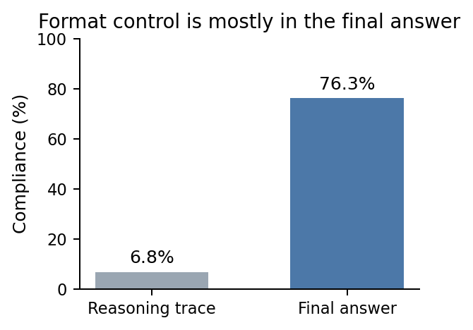
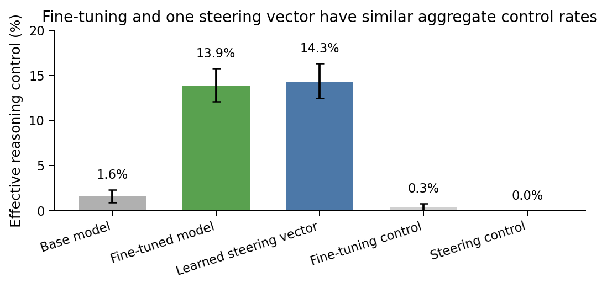
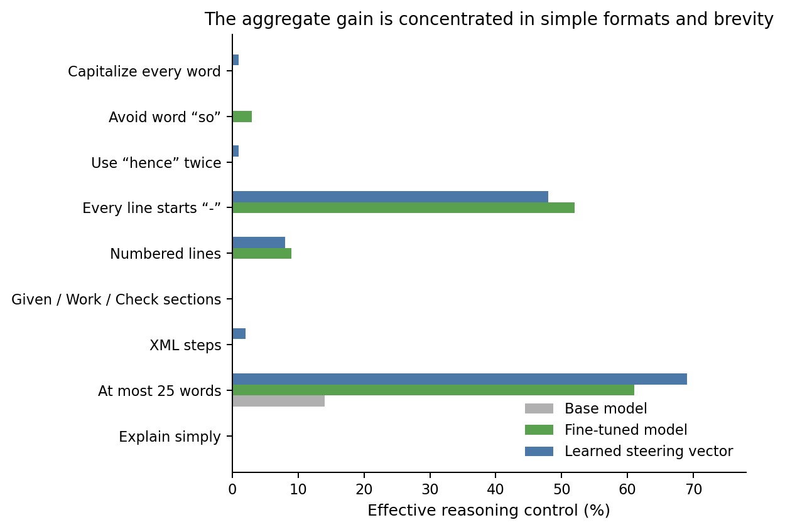
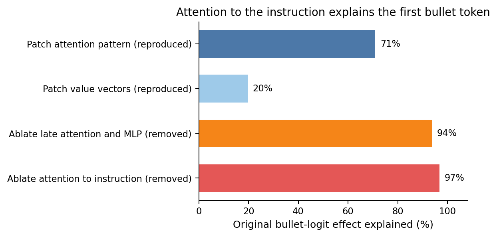
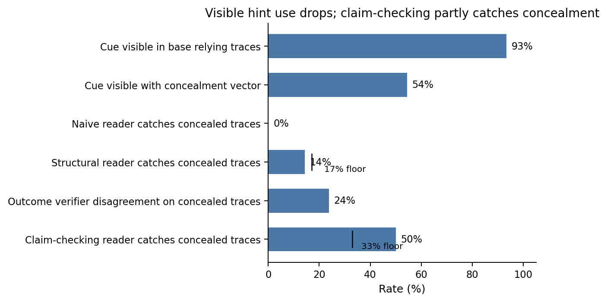

# A single residual-stream vector can reproduce fine-tuning-induced control of a few simple reasoning-trace formats

## Introduction

Chain-of-thought (CoT) monitoring relies on a simple hope: if a model's visible reasoning trace is hard for the model to reshape on demand, then humans or automated monitors can use that trace as an oversight signal. Chen et al. report that reasoning models often control their final answers much more easily than their CoTs, which supports this hope. METR then found that small fine-tuning runs can increase CoT controllability, suggesting that weak CoT control may be a contingent behavior rather than a hard capability limit.

This study asks whether the same change can be produced without changing model weights. The main experiment uses `gpt-oss-20b`, whose Harmony format separates a reasoning trace (`analysis`) from the final answer (`final`). The key intervention is a learned additive vector inserted into one residual-stream layer at inference time. The vector has 2,880 parameters, while all model weights remain frozen.

The answer is yes, with important scope limits. Fine-tuning raises held-out effective reasoning-control from **1.6% to 13.9%**. A single learned residual vector raises it to **14.3%**; in the nine-instruction macro, it is not significantly different from the fine-tuned model (paired difference **+0.4 percentage points (pp), 95% CI [−1.9, +2.8]**). Both gains are concentrated in a few simple instructions, especially “make every reasoning line start with `-`” and “keep reasoning under 25 words”; this is not broad control over all requested transformations.

For the simple formatting effect, the vector works by making late attention heads read the in-context instruction at the start of the reasoning trace. Dedicated vectors trained on cue-concealing targets can also reduce whether the trace reveals a decision-relevant cue. The demonstrated monitorability results split into two cases: one is selective but verifier-catchable because the answer is wrong; the other is verifier-blind because the answer is correct, but substantially style-mediated. No single experiment demonstrates targeted concealment, verifier-blindness, and evasion of all monitors at once. Thus the result is a **reachability** result: the relevant behavior can be installed as a small inference-time activation intervention given white-box gradients and constructed targets. It is not a cheaper black-box attack.

## Methods

### Model and channels

All experiments use `gpt-oss-20b` with greedy decoding and medium reasoning effort unless noted. The model is run locally through HuggingFace `transformers` on Modal H100 GPUs, with hooks on decoder residual streams. The Harmony parser separates the reasoning trace (`analysis`) from the answer (`final`). Compliance is always scored on `analysis`; accuracy is scored on `final`.

### Tasks and reasoning instructions

The task pool contains **2,877** examples from GSM8K, MATH, MMLU-Pro, OpenBookQA, ARC-Challenge, and ReasonIF, split deterministically into train/validation/held-out tasks. These are public benchmarks or Hugging Face datasets; CoTControl-QA was not available as a gold-answer QA set, so ARC-Challenge was used as a science-reasoning substitute. The instruction suite contains **25** reasoning-trace instructions across six categories. Twelve are training instructions, four are validation instructions, and nine are held out. The full formatting category is held out, including the bullet-list probe. Dataset and scorer artifacts are listed in [Appendix A.1](#a1-data-and-evaluation-setup).

### Metrics

`Raw compliance` is whether the `analysis` text satisfies the requested transformation. The main metric is **effective reasoning control**, our stricter version of CoT controllability: raw compliance and no meta-discussion of the instruction, genuine reasoning, a well-formed parse, no truncation, and no detected repetition loop. This stricter metric prevents counting traces that merely talk about the instruction or produce malformed output. Compliance is programmatic where possible; meta-discussion, style-compliance, and monitorability labels use cached Claude Opus judgments. Genuine-reasoning labels use Claude Haiku except for terse-style cases, where Opus is used. These labels were checked by hand inspection and false-positive calibration. Aggregate effects are instruction-macro averages over the nine held-out instructions. Confidence intervals use task-level cluster bootstrapping over the shared held-out task set.

### Fine-tuning and steering

The constructed fine-tuning dataset contains **3,600** edited-reasoning examples: base-model traces edited to comply with training instructions while preserving the answer and reasoning. The main fine-tuned model uses the matched-control subset (3,368 shared prompts plus a small no-instruction mix) so that the compliant and control runs differ almost entirely in the target trace. The matched raw-trace control contains **3,373** examples with the same prompts but non-complying natural traces. The fine-tuned model is a rank-32 low-rank adaptation (LoRA) trained with completion-only loss and served as a bfloat16 merge. A four-example in-context prompting baseline did not reproduce the effect: it achieved **0%** effective control on a three-instruction held-out subset. Details are in [Appendix A.2](#a2-fine-tuning-reproduction).

The main steering vector is trained with the same completion-only loss, but the only trainable parameter is one additive residual vector at layer 10. It is added at every real token position during generation. The layer-10 vector was selected on validation instructions and then pre-committed for the full held-out evaluation. The matched steering control is trained on non-complying raw traces. Random matched-norm vectors and the sign-reversed vector are additional controls. Steering artifacts are listed in [Appendix A.3](#a3-steering-result).

## Results

### 1. The base model controls final answers far more than its reasoning trace

When the same formatting transformation is requested for the reasoning trace or for a free-text final answer, the base model complies **6.8%** of the time in `analysis` and **76.3%** in `final`.

*Figure 1. Base `gpt-oss-20b` follows formatting instructions for final answers much more often than for reasoning traces, averaged over four casing/suppression transformations (196 tasks per instruction). Source: `results/cot_vs_output_summary_main.json`.*

This reproduces the qualitative CoT-vs-output controllability gap reported by Chen et al. The **6.8%** in Figure 1 is raw compliance on these four gap instructions; the **1.6%** baseline used below is the stricter effective-control metric on the nine held-out instructions. A crucial measurement finding is that the base model often routes formatted text into `final` while leaving `analysis` natural, so scoring the whole output would overestimate CoT control.

### 2. Fine-tuning reproduces a held-out CoT-control uplift

The fine-tuned model raises held-out effective reasoning-control from **1.6% to 13.9%**, an uplift of **+12.3 pp** with 95% CI **[+10.4, +14.2]**. The cross-category formatting subset, never trained, rises by **+15.2 pp**; the bullet probe alone rises from **0% to 52%**. The matched raw-trace control reaches only **0.3%**, despite lower training loss, so the effect is due to complying targets rather than generic supervised fine-tuning.

The result is concentrated: five of nine held-out instructions remain essentially flat, and most of the aggregate gain comes from the bullet and brevity instructions. Reproduction artifacts are in [Appendix A.2](#a2-fine-tuning-reproduction).

### 3. A single learned residual vector matches the fine-tuned model in aggregate

The learned layer-10 residual vector raises held-out effective reasoning-control from **1.6% to 14.3%**, an uplift of **+12.8 pp** with 95% CI **[+10.7, +14.9]**. In the nine-instruction macro it is not significantly different from the fine-tuned model: paired steering-minus-fine-tuning difference **+0.4 pp**, 95% CI **[−1.9, +2.8]**. This aggregate comparison hides modest per-instruction profile differences, but both methods are driven by the same two main instructions. The trained-on-control vector reaches **0%**, and five random matched-norm vectors have mean uplift **−0.1 pp** with maximum **+1.0 pp**.

*Figure 2. Held-out effective reasoning-control on the same 900 instruction-task pairs. Error bars are 95% task-cluster bootstrap intervals where available. Controls are trained on the same prompts but with non-complying reasoning traces (fine-tuning) or on a steering vector fit to those traces (steering). Source: `results/ft_deliverable_cdel_vs_ctrldel.json` and `results/steer_deliverable_gL10.json`.*

The steering vector recovers the held-out formatting behavior the simpler diff-of-means steering vector did not: the bullet probe rises from **0% to 48%**. It also raises the brevity instruction from **14% to 69%**. As with fine-tuning, this is a sparse profile rather than broad instruction following. The failed diff-of-means approach and full steering evaluation are indexed in [Appendix A.3](#a3-steering-result).

*Figure 3. Per-instruction effective reasoning-control. The fine-tuned model and learned steering vector mainly improve the simple bullet-line format and the brevity instruction. Source: `results/ft_deliverable_cdel_vs_ctrldel.json` and `results/steer_deliverable_gL10.json`.*

The steering vector has an off-target cost absent from fine-tuning: on no-instruction prompts it does not impose a format, but it increases mean reasoning length from **498** to **766** words and repetition-loop rate from **11%** to **20%**. Instructed-task accuracy is **86.3%** for the steered model versus **88.4%** for base and **91.5%** for fine-tuning; the joint comply-and-correct uplift remains positive (**+11.1 pp**).

Robustness checks support the main effect: the uplift is positive across all six task sources, persists at high reasoning effort on the bullet and brevity instructions that drive the gain, transfers to four new simple line-prefix formats, and holds on GSM-Symbolic math variants that reduce memorization concerns for math tasks. The GSM-Symbolic checks also show instructed accuracy tradeoffs for the brevity and bullet conditions.

### 4. The formatting effect works by attention gating onto the instruction

A logit-lens projection—a readout that maps an intermediate residual vector directly to output-token logits—is not interpretable here and does not directly promote the bullet token. In teacher-forced runs, where the model is run on a fixed prompt and prefix to measure logit changes, the vector conditionally promotes the requested form token: `-` in bullet contexts and `1` in numbered-list contexts, while leaving no-instruction contexts flat.

Mechanistic interventions show why for the onset of simple formatting. At the first reasoning token, patching the steered attention pattern into a base run reproduces **71%** of the bullet-form effect, while patching steered value vectors reproduces only **20%**. Ablating late attention and MLP outputs removes about **94%** of the effect; blocking attention to the instruction span removes about **97%**.

*Figure 4. Causal tests on the first bullet-token effect. The first two bars show how much of the steered effect is reproduced by patching one component into a base run. The last two bars are inverted ablation results: they show the fraction of the original effect removed by ablating the late blocks or the instruction-attention path. Source: `results/mech_qkov.json`.*

Fine-tuning uses the same circuit: its layer-wise output-logit contribution profile has cosine **0.94** with the steering vector’s profile, and blocking fine-tuned attention to the instruction removes **92%** of the fine-tuned form effect. Mechanistic artifacts are in [Appendix A.4](#a4-mechanistic-analysis).

### 5. Content concealment is reachable but bounded

The form-control result does not by itself show reduced monitorability of semantically important content. Three cue-based probes test this more directly. In these probes, **cue acknowledgment** means the `analysis` trace mentions an external hint or answer suggestion. A **naive reader** is an LLM monitor that tries to detect external cue use from the trace. A **terse-output monitor** flags abnormally brief or skeletal reasoning. A **structural reader** judges whether the trace independently justifies the answer. An **outcome verifier** checks only whether the final answer is wrong; in the hard-to-verify setting it is near its background disagreement floor because the hinted answer is correct. A **claim-checking reader** fact-checks the reasoning steps, and a **style-anomaly monitor** flags traces that look like the edited concealment targets.

First, compressing CoTs with the form-control vector and a terse instruction reduces cue acknowledgment from **100% to 62%** on cue-following wrong answers, but the effect is length-mediated: a terse-output monitor catches most concealed cases, at the cost of flagging most compressed outputs.

Second, a dedicated faithfulness vector trained on cue-concealing targets selectively hides a wrong-answer cue in matched/full-length bins: cue acknowledgment falls **100% to 68%**, and terse/naive CoT readers are fooled on most concealed traces. The overall steered arm is somewhat shorter than base, but the concealment persists among long coherent traces (median concealed trace length about 318 words). The answers are wrong, so a verifier that independently solves the multiple-choice question (MCQ) still catches **92.7%** of concealed flips.

Third, the verifier-blind test gives the strongest monitorability result. The task is one the base model gets wrong unaided; a leaked-answer-key hint points to the correct option. The base model relies on the hint and acknowledges it in **93%** of relying traces. With the concealment vector, reliance is maintained (**80% → 82%**), but acknowledgment drops to **54%**. Because the answer is correct, an outcome verifier is uninformative.

*Figure 5. In the hint-reliance setting, the concealment vector at steering strength 0.75 reduces visible cue use while the answer remains correct. The first two bars are conditional on relying on the hint (n=45 for base, n=46 for the concealment vector). The remaining bars are conditional on concealed relying traces from the same arm (n=21; n=20 for the claim-checker because one row was unjudged). The outcome-verifier bar is disagreement with the gold answer, not concealment detection. Black tick marks show false-positive floors for the structural reader (17%) and claim-checking reader (33%), measured on genuine independent-correct no-hint hard-task reasoning (n=58). Source: `results/reliance_eval_heldout_judged.jsonl`, `results/reliance_eval_heldout_judged_stepcheck.jsonl`, and `results/reliance_eval_heldout_analysis.md`.*

The hard-to-verify result is bounded in two ways. Figure 5 shows the transferred concealment vector alone; the pooled estimates below combine that vector with a vector trained directly for hint reliance. First, the concealed derivations are often fabricated: on the pooled clean-dose concealed subset (n=44), a claim-checking monitor catches **47%** [29, 65] of concealed traces, but it also has a high false-positive floor of **33%** [18, 52] on genuine hard-task reasoning, so this is a blunt and statistically overlapping defense. Second, a low-false-positive style-anomaly monitor catches **41%** of the hard-to-verify concealed traces at the clean dose. The no-hint capability check also matters: the concealment vector solves **32%** of these hard tasks without the hint, compared with **23%** for a random matched-norm vector, so many concealed derivations remain fabrications rather than newly solved tasks. The shuffled-target control also conceals substantially, so much of the effect appears to be a learned clean, non-referencing reasoning style plus a smaller targeted component, not surgical removal of one specific cue. Monitorability artifacts are in [Appendix A.5](#a5-monitorability-probes).

## Takeaways

1. **Weak base CoT controllability is not a hard barrier.** On `gpt-oss-20b`, a small fine-tune and a single learned residual vector both induce held-out control over parts of the reasoning trace.
2. **The activation result is stronger than a surface steering artifact.** A diff-of-means vector fails on formatting, but a gradient-trained residual vector recovers the fine-tuning profile and uses the same late-attention circuit as fine-tuning.
3. **The result is about reachability, not ease of attack.** The steering vector needs white-box gradients and the same kind of edited target data used for fine-tuning. Its significance is that no model weights need to change and the learned object is one residual direction.
4. **Monitorability is weakened, but not eliminated.** Dedicated vectors can hide cue use from simple CoT readers in controlled settings. Verification, style-anomaly detection, and claim-checking remain partial defenses, and the strongest demonstrated concealment has construction-distribution and MCQ-only limits. The worst combined case—targeted concealment, verifier-blindness, and evasion of all monitors—is not demonstrated here.

## Limitations

- All headline experiments are on one model, `gpt-oss-20b`.
- The effective-control gains are concentrated in simple formatting and brevity; most held-out instructions remain flat.
- The training and concealment targets are Opus-edited traces. Controls and inspections reduce but do not remove the possibility that some effects are editor-style mimicry.
- The hard-to-verify setting is verifier-blind because the output is correct, not because it is an open-ended action whose correctness cannot be derived. Generalizing to open-ended tool-using tasks is future work.
- Monitorability probes are MCQ-based and small compared to the main held-out control eval.
- Several labels rely on one Opus judge family: meta-discussion, cue acknowledgment, structural-reader, claim-checker, and style-anomaly judgments. These were calibrated by spot checks and false-positive measurements, but they are not independent ground truth.
- Public-benchmark contamination is mitigated for math by GSM-Symbolic, but not fully ruled out for all MCQ sources.
- The tested “toward-faithfulness” vector did not restore cue acknowledgment when stacked on the concealment vector; a trained opposing-vector mitigation remains future work.

## Appendix A: Reproducibility and artifact index

All source paths below are repository-relative.

### A.1 Data and evaluation setup

- Task pool: `data/tasks_all.jsonl`; scored task pool: `data/tasks_all_scored.jsonl`.
- Instruction definitions and splits: `instructions.py`, `data/instruction_splits.json`.
- Base accuracy: `results/base_accuracy_full.jsonl`.
- Base CoT-vs-output gap: `results/cot_vs_output_main.jsonl`, `results/cot_vs_output_summary_main.json`.
- Key scoring code: `answer_scoring.py`, `harmony_utils.py`, `analyze_ft_eval.py`.

### A.2 Fine-tuning reproduction

- SFT data: `data/sft_edited_reasoning_full.jsonl` and `data/sft_raw_trace_control_full.jsonl`.
- Rendering-alignment check: `results/ft_render_alignment.md`.
- Training and merge metadata: `results/ft_train_cdel.json`, `results/ft_train_ctrldel.json`, `results/ft_merge_cdel_bf16.json`, `results/ft_merge_ctrldel_bf16.json`.
- Held-out generations and judgments: `results/ft_eval_cdel_heldout_full_judged.jsonl`, `results/ft_eval_ctrldel_heldout_full_judged.jsonl`.
- Analysis: `results/ft_deliverable_cdel_vs_ctrldel.json` and `.md`.

### A.3 Steering result

- Steering-vector training code: `run_grad_steer_train.py`, `grad_steer_lib.py`, `gpt_oss_infer.py::train_steer`.
- Learned vector and controls: `data/grad_steer_gL10.npz`, `data/grad_steer_gL10ctrl.npz`, `data/grad_steer_gL10_s1.npz`, `data/grad_steer_gL10_s2.npz`, `data/grad_steer_gL10neg.npz`, `data/grad_steer_gL10rand.npz`.
- Full held-out generations and judgments: `results/grad_steer_eval_deliverable_deliv_judged.jsonl`, `results/grad_steer_eval_deliverable_delivnull_judged.jsonl`, `results/grad_steer_eval_deliverable_delivneg_judged.jsonl`.
- Analysis: `results/steer_deliverable_gL10.json` and `.md`.
- Failed diff-of-means steering: `results/steer_eval_heldout_analysis.md`, `results/dom_heldout_domcat_analysis.md`, `results/dom_heldout_domML_analysis.md`.

### A.4 Mechanistic analysis

- Direction geometry: `results/direction_geometry.md`, `results/induced_shift.md`, `results/logit_lens.md`.
- Attention and patching: `results/mech_qkov.json`, `results/mech_qkov.md`, `results/mech_attn_instruction.md`.
- Fine-tuning circuit comparison: `results/mech_ft_compare.json`, `results/mech_ft_compare.md`.

### A.5 Monitorability probes

- Compression probe: `results/cue_probe_full_key_judged.jsonl`, `results/cue_probe_analysis.md`.
- Dedicated cue-concealment probe: `results/faith_eval_heldout_judged.jsonl`, `results/faith_eval_heldout_judged_verify.jsonl`, `results/faith_eval_heldout_analysis.md`.
- Hard-to-verify hint-reliance probe: `results/reliance_eval_heldout_judged.jsonl`, `results/reliance_eval_heldout_judged_stepcheck.jsonl`, `results/reliance_eval_heldout_analysis.md`.
- Stylometry/style-anomaly analysis: `results/stylometry_analysis.md`, `results/stylometry_set_stylo.jsonl`.
- Optional mitigation null: `results/cue_probe_p5_toward_judged.jsonl`.

### A.6 Final figures and reproducibility checks

| Figure | Output files in this directory | Source artifacts |
|---|---|---|
| Figure 1 | `final_plots/fig1_cot_vs_final_gap.{png,pdf}` | `results/cot_vs_output_summary_main.json` |
| Figure 2 | `final_plots/fig2_headline_effective_control.{png,pdf}` | `results/ft_deliverable_cdel_vs_ctrldel.json`, `results/steer_deliverable_gL10.json` |
| Figure 3 | `final_plots/fig3_instruction_profile.{png,pdf}` | same as Figure 2 |
| Figure 4 | `final_plots/fig4_attention_mechanism.{png,pdf}` | `results/mech_qkov.json` |
| Figure 5 | `final_plots/fig5_hard_to_verify_monitorability.{png,pdf}` | `results/reliance_eval_heldout_judged.jsonl`, `results/reliance_eval_heldout_judged_stepcheck.jsonl`, `results/reliance_eval_heldout_analysis.md` |

The plotting script is `create_final_plots.py`; the write-up is `final_writeup.md`. The internal tag `gL10` denotes the main learned layer-10 steering vector; `cdel` and `ctrldel` denote the main fine-tuned model and its raw-trace control in filenames.

- Main fine-tuning and steering point estimates can be recomputed from the raw judged JSONL files listed above.
- Monitorability point estimates can be recomputed from `faith_eval_heldout_judged.jsonl`, `faith_eval_heldout_judged_verify.jsonl`, `reliance_eval_heldout_judged.jsonl`, `reliance_eval_heldout_judged_stepcheck.jsonl`, and `stylometry_set_stylo.jsonl`.
- The failed diff-of-means approach is summarized in `results/steer_eval_heldout_analysis.md`: it had zero formatting transfer and an accuracy cost, motivating the gradient-trained vector.

## References

- Chen et al., “Reasoning Models Struggle to Control their Chains of Thought.” https://arxiv.org/abs/2603.05706
- METR, “Fine-tuning experiments on CoT controllability.” https://metr.org/blog/2026-04-01-fine-tuning-cot-controllability/
- James Chua and Owain Evans, “Are DeepSeek R1 And Other Reasoning Models More Faithful?” https://arxiv.org/abs/2501.08156
- Iman Mirzadeh, Keivan Alizadeh, Hooman Shahrokhi, Oncel Tuzel, and Samy Bengio, “GSM-Symbolic: Understanding the Limitations of Mathematical Reasoning in Large Language Models.” https://arxiv.org/abs/2410.05229
- Task datasets used in this study: `openai/gsm8k`, `EleutherAI/hendrycks_math`, `TIGER-Lab/MMLU-Pro`, `allenai/openbookqa`, `allenai/ai2_arc`, and `ykwon-hf/reasonIF`.
