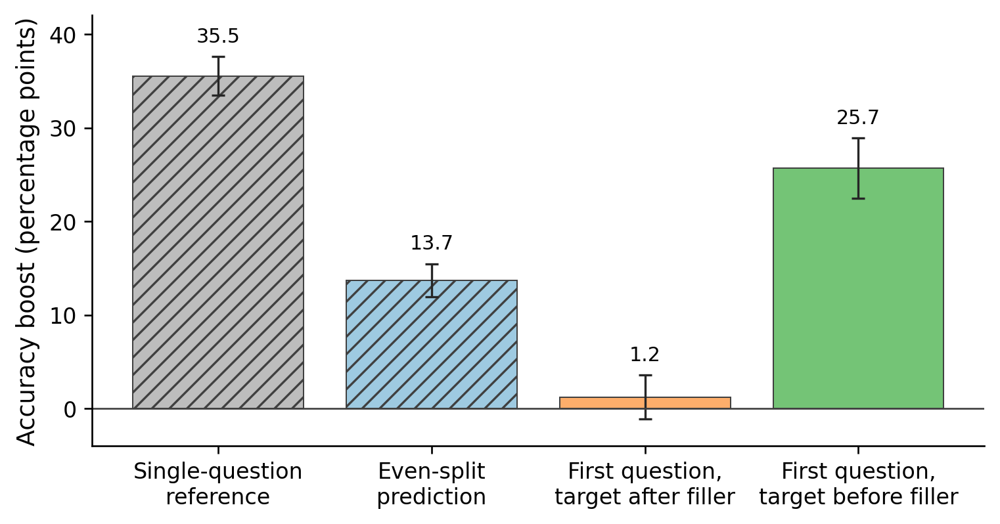
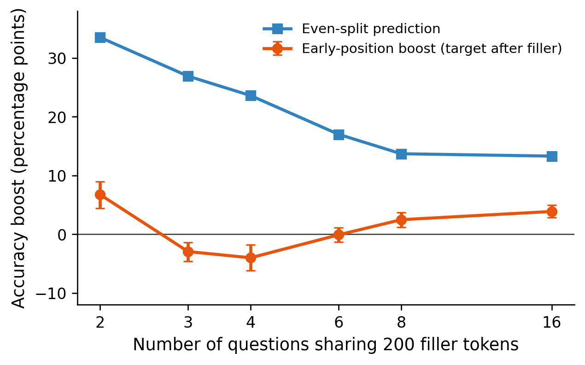
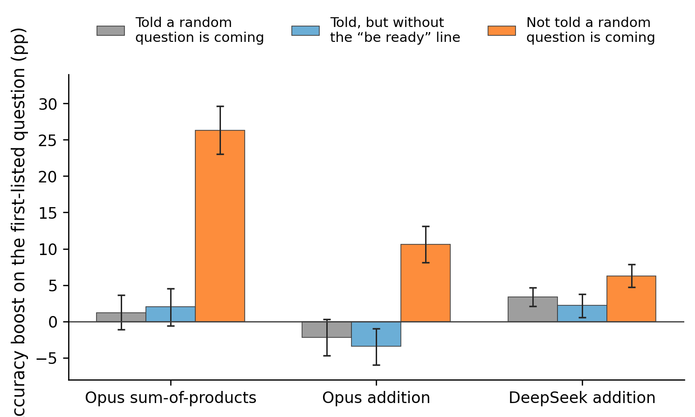
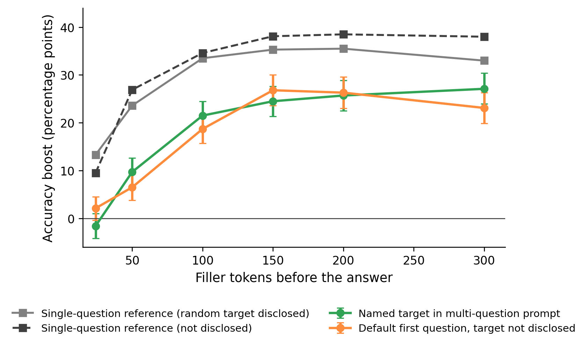

# Filler tokens do not produce parallel latent thinking

## Abstract

Recent models can use meaningless tokens before an answer to improve no-chain-of-thought arithmetic. We first reproduced this direction in a structure-matched single-question prompt: on the primary Claude Opus 4.5 sum-of-products task, 200 filler tokens raised accuracy from about **36% to 72%** (**+35.5 percentage points**). We then asked whether one shared filler block can help several questions at once. In the pre-registered k=8 condition, the model saw eight questions, then 200 filler tokens, and only after the filler learned which one to answer. On the cleanest first-listed-question read, the boost was **+1.2 pp**; on the pre-registered early-position pool it was **+2.5 pp**. Both are far below the even-split prediction (**+13.7 pp**) and the single-question reference (**+35.5 pp**). If the target question was named before the filler, the first-listed-question boost was **+25.7 pp**.

The clean absolute near-null result is on one Opus arithmetic family. The directedness and framing pattern replicates in direction on a second Opus arithmetic task and on DeepSeek-V3-0324, but with smaller magnitudes and a different DeepSeek task. The simplest statement is: the model does not spread filler-enabled computation across questions. It commits at most about one question's worth of benefit to one target: the named question if one is named, or the first-listed question if no random-target disclosure is given.

## Introduction

Redwood Research, "Recent LLMs Can Use Filler Tokens or Problem Repeats to Improve (no-CoT) Math Performance" (2026, <https://blog.redwoodresearch.org/p/recent-llms-can-use-filler-tokens>), reported that padding a prompt with filler such as `1 2 3 ...` can improve no-chain-of-thought math accuracy. Pfau, Merrill, and Bowman, "Let's Think Dot by Dot" (2024, <https://arxiv.org/abs/2404.15758>), found that filler tokens can substitute for explicit reasoning on some parallelizable synthetic problems, whereas earlier models did not show this behavior.

This work asks a narrower question: if the model sees several arithmetic questions and one shared filler block, does every question receive the same hidden-computation benefit, do the questions split a fixed pool, or does filler only help when the model knows where to spend it?

## Methods

### Tasks, models, and no-chain-of-thought enforcement

The primary task was `sumprod_t3_d2`: expressions such as `32 * 68 + 66 * 54 + 83 * 22`. The primary model was `claude-opus-4-5-20251101`, temperature 0, with extended thinking off. The answer was forced to be the next content after an assistant prefill such as `The answer to Q1 is`; outputs with visible working were rare and scored conservatively as wrong.

A secondary Opus task used 15-term six-digit addition. The open-model check used DeepSeek-V3-0324 on 4-term 10-digit addition, with reasoning disabled and OpenRouter providers pinned to avoid the provider-quantization confound found during the run.

### Prompt conditions

For k>1, the prompt listed questions Q1...Qk, where **Q1 means the first-listed question**. The answer target was always revealed by index only, never by restating the question.

The key prompt strings were:

```text
Random-target disclosure (“told”):
Here are k problems, labelled Q1–Qk. In a moment I will ask you to answer exactly ONE of them, chosen at random — so be ready to answer any of them. Do not answer yet.

No random-target disclosure (“not told”):
Here are k problems, labelled Q1–Qk. Do not answer yet.

Disclosure without the encouragement clause:
Here are k problems, labelled Q1–Qk. In a moment I will ask you to answer exactly ONE of them, chosen at random. Do not answer yet.

Target named before filler:
Here are k problems, labelled Q1–Qk. You will be asked to answer Qj. Do not answer yet.

Reveal turn after filler:
Now answer Qj:
```

The filler turn was either empty or a counting sequence. Filler amount is reported as the realized input-token increase over the no-filler prompt.

### Metrics

All effects are **accuracy boosts** in percentage points: accuracy with filler minus accuracy without filler in the same condition.

- **Single-question boost** `B1(n)`: one question with *n* filler tokens.
- **Shared-question boost** `Bk(n)`: k questions sharing the same total *n* filler, with the target revealed after the filler.
- **Even-split prediction**: `B1(n/k)`, the prediction if a fixed filler pool were divided evenly across questions.
- **Directedness contrast**: boost when the target is named before filler minus boost when the target is revealed after filler.

The original plan also specified a sharing exponent α (`n_eff=n/k^α`), but α was not fit: the shared-question boosts were near zero or negative, so the exponent is undefined.

The pre-registered operating points were k=2 at 100 filler tokens and k=4,8 at 200 tokens. Separate robustness plots also hold total filler fixed at 200 tokens across k. Position resolution matters: later questions have a no-filler recency advantage because preceding questions act like filler. Explicit filler erases this advantage, so the all-position aggregate mixes multiple effects. At the headline k=8 cell, the aggregate boost was **-6.3 pp**, while the first-listed question was **+1.2 pp** and the early-position pool was **+2.5 pp**.

## Worked example

Here is a representative told-framing headline instance. The model was told that one random question would be asked. The target was Q1, and the target index was revealed only after the filler.

**Q1:** `32 * 68 + 66 * 54 + 83 * 22 = 7566`

With no filler, target revealed after the question list:

```text
Model output: 5606.   (wrong)
```

With 200 filler tokens, target still revealed after the filler:

```text
Model output: 5606.   (wrong again)
```

With the same question list and filler, but with Q1 named before the filler:

```text
Model output: 7566.   (correct)
```

This one example shows the main result: in the random-target condition, filler does not help this first-listed question; when the target is known before the filler, it does.

The later framing result has the opposite-looking example. In the no-disclosure framing, the item `74 * 17 + 76 * 95 + 41 * 70 = 11348` was corrected by filler when it was Q1 (`10328` without filler to `11348` with filler), but not when the same item was placed at Q8 (`10448` with filler). This is why the final claim is about where the model commits one question's worth of benefit, not about a blanket inability to use filler without a named target.

## Results

### 1. Replication: filler helps a single question

In the structure-matched k=1 prompt used as the reference for the main experiment, 200 filler tokens raised Opus accuracy on the primary task from about **36% to 72%**, a **+35.5 pp** boost. This reproduces the Redwood result's direction, though the magnitude is larger because this task was calibrated to be arithmetic-precision limited.

A standalone one-turn de-risk curve on the same task gave a smaller plateau, about **+23 pp**. The main comparison uses the structure-matched k=1 cell because it has the same multi-turn minimal-reveal format as the k-question prompts.

### 2. Main result: the first-listed question gets almost none of the shared filler benefit

At k=8 with 200 filler tokens, the no-filler baseline for Q1 was **20.3%**. Revealing the target after the filler changed it only to about **21.5%** (**+1.2 pp**, CI crosses zero). The early-position pool was **+2.5 pp [1.2, 3.7]**. The even-split prediction was **+13.7 pp**, and the single-question reference was **+35.5 pp**. Naming Q1 before the filler gave **+25.7 pp**.



**Figure 1.** Opus 4.5 on the primary sum-of-products task, k=8, 200 filler tokens. Hatched bars are references, not measured k=8 conditions. The measured first-listed-question boost when the target is revealed after the filler is near zero and far below the even-split prediction. When the target is named before the filler, the same prompt format recovers a large boost.

The k=2 operating point retained **23% [16%, 30%]** of its single-question boost, while k=8 retained **7% [3%, 11%]** on the early-position pool and was null on Q1. The robust pattern is low retention and far-below-even-split performance, not a clean monotone curve.

### 3. Under random-target disclosure, the result is robust across k and filler type

Holding the total filler fixed at 200 tokens, the measured reveal-after boost stayed far below the even-split prediction for every tested k. The k=16 point is less clean because n/k falls into the small-filler dip, but it does not approach the reference.



**Figure 2.** Random-target disclosure, Opus 4.5, primary task, 200 total filler tokens. The orange series is the early-position boost when the target is revealed after the filler. It remains far below the even-split prediction. Dots filler produced the same qualitative conclusion and was more disruptive in the k-question prompt.

### 4. Prompt disclosure controls where the benefit goes

Removing the random-target disclosure changed the behavior. Under no disclosure, the k=8 Q1 boost on the primary task was **+26.3 pp [23.0, 29.6]**. The disclosure-without-encouragement arm stayed near the random-target-disclosure condition: **+2.0 pp**, not near +26.3. Thus the important prompt feature is telling the model that one random question will be asked, not the “be ready” encouragement.



**Figure 3.** Boost on the first-listed question at k=8. When the prompt says a random question is coming, the Q1 boost is suppressed. When it does not say this, the model commits a positive filler-dependent boost to Q1. The direction replicates on a second Opus task and on DeepSeek, with smaller magnitudes.

### 5. The filler effect is task-relevant, but the mechanism is not fully identified

The directed boost rises and plateaus with filler amount, and the no-disclosure Q1 boost shows the same dose response. On the primary task, the directed boost is larger for harder items: **+6.7 pp** in the easiest quartile and **+16.2 pp** in the hardest, while the no-filler baseline is roughly flat (**52% to 48%**). This argues against a pure formatting artifact.



**Figure 4.** Filler-dependent boosts rise with filler amount. The named-target line has the same rise-and-plateau shape as the single-question reference but sits lower, consistent with a multi-question context cost. The no-disclosure Q1 line is compared to its own not-disclosed single-question reference. These behavioral curves do not prove that computation occurs at the filler positions.

The clean selectivity evidence is strongest on Opus sum-of-products. The addition cross-check is partly headroom-confounded, and DeepSeek did not show the same clean difficulty selectivity.

### 6. Cross-model generalization is partial

DeepSeek-V3-0324 showed the same qualitative structure with a much smaller effect and a different task. At k=8, using about **400** filler tokens, its Q1 reveal-after boost was **+3.4 pp [2.1, 4.7]**, below its even-split prediction by **4.3 pp [2.2, 6.3]**. Its Q1 directedness contrast was **+1.9 pp [0.2, 3.6]**. This is a partial replication of the directedness and sub-even-split structure, not of the near-null magnitude. Cross-model differences are confounded with task differences.

## Other findings

A secondary Opus addition task confirmed the directedness contrast: the additive k=8 contrast was **+31.9 pp**, and the formal headroom-robust logit contrast was **+1.50 [1.39, 1.60]**. A fixed-item position test showed the same item receiving **+25.1 pp** at Q1 but **-18.0 pp** at Q8, supporting a positional default. Directed filler in a fixed-position prompt dropped from **+43.0 pp** with one question to **+23.6 to +30.1 pp** once distractors were present, so much of the multi-question cost appears with the first distractor. Earlier replication work (`results/derisk_reasoning2_*` and `plots/selectivity.png` in the source run) found that filler helped deep multi-digit arithmetic but not an aggregate-many-easy-checks control at a matched baseline. Open puzzles include the dots-by-k interaction and a carry-related anomaly on six-digit addition.

## Takeaways

1. **No parallel latent thinking across questions.** The model does not give every question the single-question filler benefit.
2. **No even pool spreading.** Under random-target disclosure, measured boosts are far below `B1(n/k)`. Without disclosure, the model concentrates benefit on Q1 rather than distributing it.
3. **Filler use is directed or positional.** A named target gets a large boost; absent disclosure, the first-listed question gets the default boost.
4. **The internal mechanism is still open.** The effect is task-relevant and filler-dependent, but not proven to be computation localized at filler positions.

## Limitations

- The clean absolute regime result rests mainly on one Opus arithmetic family. The directedness and framing findings generalize in direction, not in magnitude.
- Multi-question context alone removes roughly half the single-question boost, so the literal parallel reference is essentially unreachable in-prompt. The directly testable result is that the shared boost falls far below the even-split prediction.
- The even-split prediction is an interference-naive reference: k-question context changes the task, so the prediction should be read as a reference, not as a mechanistic model.
- The qualitative headline cell was pilot-known before the full run; the full run added precision, a frozen analysis, and forking-path protection. The fresh-only subset was small (~350 instances), so it confirmed “far below even split” but could not cleanly separate a zero boost from a small positive boost.
- The study did not obtain a clean reasoning-benchmark positive control; the strongest results are on arithmetic precision tasks.
- Behavioral experiments cannot settle the internal mechanism. A length-matched random-filler content control and activation-level or logit-lens-style probes would be needed to test where any filler-enabled computation occurs.

## Reproducibility appendix

Audited source run: `/source/phase_segment_12_phase_0`.

Key artifacts:

- Main pre-registration: `results/preregistration.md`.
- Main Opus run: `results/seg7_*.jsonl` (274k calls), summarized in `results/main_run_summary.md`.
- Pre-registered verdict: `results/seg8_verdict.md` and `results/seg8_regime_cells.csv`.
- Framing robustness: `results/seg10_verdict.md`, `results/seg10_cells.csv`, `results/seg10_contrast.csv`.
- Mechanism/framing replication: `results/seg11_verdict.md`, `results/seg11_framing.csv`, `results/seg11_dose.csv`.
- DeepSeek cross-model check: `results/seg9_verdict.md`.
- Prompt construction and scoring: `kharness.py`, `run_kquestion.py`, `harness.py`, `seg7_lib.py`, `seg8_lib.py`.

The audited run reports that `ASSERT_CACHED=1` re-streams the Segment 7, 9, 10, and 11 grids from cache at $0, and that the full project cost was about **$2168**. The plots in this write-up were regenerated from the CSV/Markdown result files above and saved in `final_plots/` as both PNG and PDF.

## References

- Redwood Research (2026). "Recent LLMs Can Use Filler Tokens or Problem Repeats to Improve (no-CoT) Math Performance." <https://blog.redwoodresearch.org/p/recent-llms-can-use-filler-tokens>
- Pfau, Merrill, and Bowman (2024). "Let's Think Dot by Dot: Hidden Computation in Transformer Language Models." <https://arxiv.org/abs/2404.15758>
