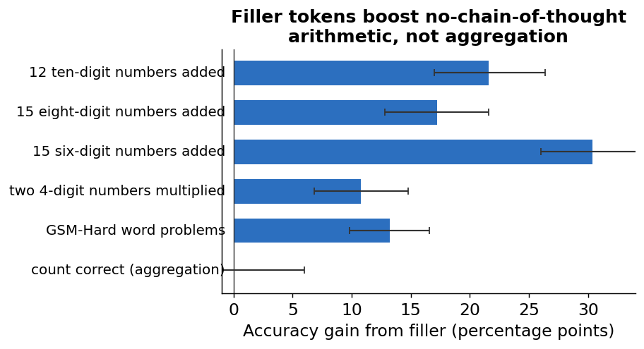
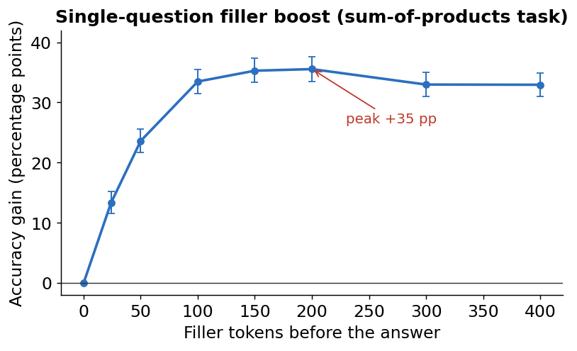
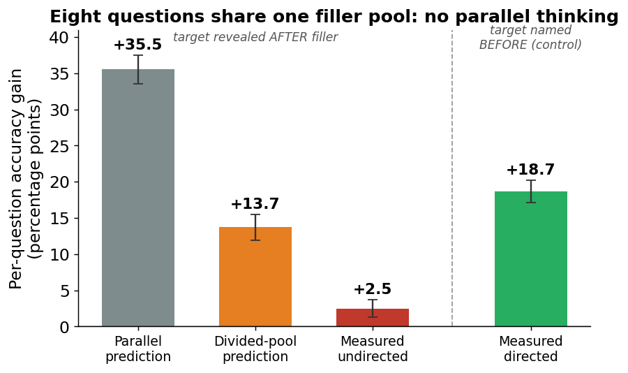
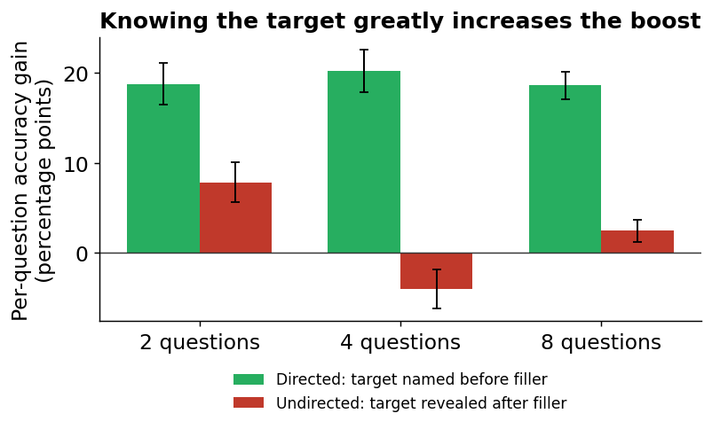
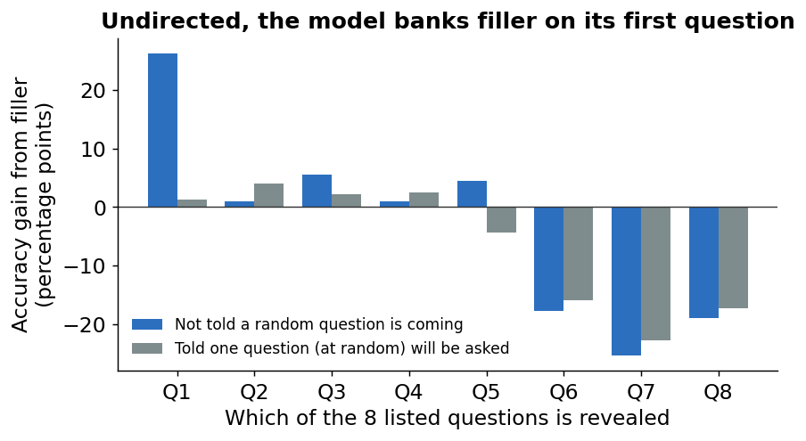

# Filler tokens do not buy parallel thinking: a model spends one question's worth of hidden compute on one question

## Summary

When a language model answers a math problem with **no chain-of-thought** — the answer is the
literal first token it emits — it gets a single forward pass of computation at the answer
position. Padding the prompt with meaningless **filler tokens** (e.g. `1 2 3 ... 300`) before the
answer measurably raises this no-chain-of-thought accuracy, as if the extra positions give the model
somewhere to do hidden computation ([Redwood Research, 2026](https://blog.redwoodresearch.org/p/recent-llms-can-use-filler-tokens);
[Pfau et al., 2024](https://arxiv.org/abs/2404.15758)). We ask whether that hidden computation can be
**shared across several questions at once**: given *k* difficulty-matched questions that share one
fixed pool of filler tokens, does each question keep the full single-question boost (parallel
thinking), or does the boost shrink as the questions divide the pool?

On Claude Opus 4.5, the single-question filler boost is large (up to **+35 percentage points** on
our headline sum-of-products task). But it **does not spread across questions.** When eight questions share one filler
pool and one is revealed at random *after* the filler, the per-question boost is near zero
(**+2.5 pp**, ~7% of the single-question boost) — far below both the "parallel" prediction (+35 pp)
and the "divided-pool" prediction (+14 pp). The model behaves as if it banks **at most one question's
worth** of filler computation, committed to a **single** question, never a pool that grows with the
number of questions. *Where* that single-question budget lands depends on framing: if the target is
named before the filler, that question gets a large boost; if the model is told one question will be
picked at random, it banks almost nothing; if it is not told, it defaults to banking ~one question's
worth on the **first-listed** question. The effect is a genuine, difficulty-sensitive computation, but
its precise mechanism (true hidden computation vs. a graded reallocation of attention) is not pinned
down by behavioral evidence alone.

---

## 1. Introduction

A transformer answering "immediately," with no visible reasoning, has only the compute in one forward
pass at the answer position to work with. [Pfau et al. (2024)](https://arxiv.org/abs/2404.15758)
("Let's Think Dot by Dot") showed that inserting meaningless filler tokens (e.g. repeated dots) in
place of a chain-of-thought can nonetheless improve performance on certain problems — the model uses
the extra token positions as scratch space for **hidden computation** that never appears in the
text. The effect was strongest for problems whose solution is naturally **parallelizable**, and
absent in the models they tested before 2024.

[Redwood Research (2026)](https://blog.redwoodresearch.org/p/recent-llms-can-use-filler-tokens)
reported that recent frontier models show this effect on math: padding a no-chain-of-thought prompt
with filler tokens (counting, dots, or a repeated copy of the problem) raises math accuracy — for
example Claude Opus 4.5 improving from 45% to 51% with roughly 300 filler tokens, with accuracy
rising as filler is added and then degrading once there is too much.

If a model can do real hidden computation in filler positions, a natural question is **how much** such
computation it can do, and whether it can be **multiplexed**. This work tests one sharp version: can
the model do **several questions' worth of hidden computation in parallel** from a single filler
budget? Concretely, give the model *k* difficulty-matched questions followed by *n* shared filler
tokens, then ask for the answer to just one of them, and compare the per-question boost to the
single-question boost at the same total filler. Two clean hypotheses bracket the outcome:

- **Parallel thinking:** the per-question boost does not care how many questions share the filler —
  each question keeps the full single-question boost.
- **Divided pool:** the filler is one fixed pool of computation split across the questions, so each
  question only gets the boost it would have received from its *share* of the filler.

We report which regime the model lands in, and a control that turns out to be central: whether the
model knows *which* question it will be asked **before** vs. **after** seeing the filler.

**Preview of results.** (1) We reproduce the single-question filler boost cleanly on Opus 4.5 and show
it is **selective** — it helps deep multi-digit arithmetic, not tasks that merely aggregate many easy
checks. (2) When questions share a filler pool and the target is revealed afterward, the per-question
boost is far below the divided-pool prediction at every *k* we tested: **there is no parallel thinking,
and not even an even divided split.** (3) The boost is almost entirely contingent on the model
*knowing which question to compute*: a question named before the filler is boosted; an undirected one
is not. (4) Whether the model banks anything undirected depends on a single sentence of framing. We
also characterize the effect as a genuine, dose-responsive, difficulty-sensitive computation, while
being explicit about what behavioral evidence cannot settle.

---

## 2. Methods

### 2.1 Task

The primary task is **procedural arithmetic**, generated on the fly rather than drawn from a fixed
benchmark, so there is no memorization confound and difficulty can be tuned to keep baseline accuracy
in a measurable middle band. The headline task is a **sum-of-products**: add three two-digit-by-two-digit
products, e.g. `95 * 33 + 51 * 54 + 30 * 80` (answer 8289). We chose it because its single-question
filler boost rises **gradually** with filler (rather than saturating in a few tokens) and because, in
the multi-question setting, it keeps every question's accuracy off the ceiling — both needed to tell
the regimes apart (Appendix A). A second arithmetic task — **adding fifteen six-digit numbers** — is
carried as a secondary, consistency check.

### 2.2 Genuine no-chain-of-thought

The premise requires that the answer be **literally the first content token** the model emits. We
enforce this with **assistant prefill**: the prompt is seeded so the model's next generated token is
the answer itself (no room to reason first), extended reasoning is turned off, and the output is
capped at a few tokens. We verified genuineness on over one million outputs: a populated reasoning
field appears in 0% of cases, the first parsed integer equals one of the question's input numbers
(the signature of digit-initial "show your work") in under 0.4%, and silent truncation in under 0.2%
(Appendix B).

### 2.3 Filler

Filler is inserted before the answer. The default is **counting** (`1 2 3 ...`); **dots**
(`. . . .`) are used as a robustness check. Filler length is reported in **realized tokens** measured
from the model's input-token count, not in raw characters (counting filler on Opus is 2 tokens per
number). "Filler tokens" throughout means these realized tokens.

### 2.4 The shared-filler design

Each multi-question prompt lists *k* difficulty-matched questions, labeled Q1…Q*k*, followed by the
shared filler, followed by a request to answer exactly one of them. We read **only that single
answer**. Two conditions:

- **Reveal-after** (the parallel-thinking test): the target is chosen **at random and named only after
  the filler**, by index ("Now answer Q3:") without restating the question text. During the filler the
  model does not know which question it will be asked, so any boost must come from computation it
  banked without direction.
- **Reveal-before** (the control): the same *k* questions are present, but the target is **named before
  the filler**. This isolates the value of *knowing the target* from the value of the filler itself.

Revealing by index (not by reprinting the question) keeps the question text in a fixed position before
the filler, so the comparison to the single-question case is not confounded by placing a fresh copy of
the target next to the answer. We verified the model answers the asked question (it matches a distractor
0% of the time) and that recalling "which question is Q3" is trivial.

By default the prompt **tells** the model up front that it will be asked exactly one of the questions,
chosen at random, and to be ready for any ("told" framing). We later vary this (Section 4.5).

### 2.5 Metrics

For a single question with *n* filler tokens, the **single-question boost** is

  *B₁(n)* = accuracy(1 question, *n* filler) − accuracy(1 question, no filler).

For *k* questions sharing *n* filler tokens, the **per-question boost** *B_k(n)* is the analogous
quantity for the single revealed question, baselined at that same *k*'s own no-filler accuracy. The two
bracketing predictions are:

- **Parallel** reference: *B₁(n)* — the full single-question boost, regardless of *k*.
- **Divided-pool** reference: *B₁(n/k)* — the single-question boost evaluated at the per-question
  *share* of the filler.

The pre-registered headline statistic was a **sharing exponent** that interpolates between these
(parallel = 0, divided = 1); as explained below it is ill-defined when the measured boost is near zero,
so we instead report the three-way classification (parallel / divided / near-null) directly against the
two references, plus the **directedness contrast** = (reveal-before boost) − (reveal-after boost).

**Position-resolved reading.** A subtle artifact forced a refinement. The no-filler baseline is *not*
constant across the *k* listed positions: a later question has several preceding questions in its
context, and those act as filler for it, so late positions start from a higher baseline and have less
room to improve, while the first question (Q1) starts low. Averaging the per-question boost over a
random reveal therefore mixes a real effect with this position structure. We report boosts **resolved
by listed position**, using as the primary read an **early pool** (the first ⌈*k*/2⌉ positions, which
stay off the ceiling) and co-reporting **Q1 only** (Appendix C). All accuracies are in **percentage
points (pp)**; confidence intervals are 95% cluster bootstraps over the drawn problem instances.

### 2.6 Models

The headline model is **Claude Opus 4.5** (`claude-opus-4-5-20251101`), which shows the strongest
reported effect and supports prefill. A cross-model check uses the open model **DeepSeek-V3-0324**
(`deepseek/deepseek-chat-v3-0324`) via OpenRouter, with reasoning disabled and the serving provider
pinned to a homogeneous, non-quantization-degraded cluster (Appendix F explains why pinning is
necessary). Every result re-streams from cache at no additional API cost (Appendix G).

---

## 3. Replicating the single-question filler boost

Before testing sharing, we confirmed the basic effect on our harness. On Opus 4.5 with genuine
no-chain-of-thought, adding ~300 counting filler tokens (prefill) raised accuracy on every arithmetic
task we tried, by a large and statistically clear margin (Figure 1): **+30 pp** on adding fifteen
six-digit numbers (from a 49% baseline), **+22 pp** on adding twelve ten-digit numbers, **+17 pp** on
adding fifteen eight-digit numbers, and **+11 pp** on multiplying two four-digit numbers. It also held
on grade-school word problems from **GSM-Hard** ([Gao et al., 2022](https://arxiv.org/abs/2211.10435)),
**+13 pp**. All of these exclude zero. (GSM-Hard is a public dataset and so is not memorization-free;
we use it only as a harness check that the boost is not specific to our generated arithmetic, not as a
clean reasoning benchmark — see Limitations.)

**Figure 1. Filler tokens boost no-chain-of-thought arithmetic, but not aggregation.** Accuracy gain
from ~300 counting filler tokens (Opus 4.5, prefill; 95% CI; 500 problems per arithmetic/word-problem
task, 400 for the aggregation task). The five arithmetic and word-problem tasks (blue) all improve.
"Count correct" (grey) — a task that asks how many of six independent yes/no checks are true, which
aggregates many easy operations rather than doing one deep computation — shows **no** boost
(+0.0 pp, 95% CI [−5.8, +6.0]) even though its no-filler baseline (47%) matches the six-digit-addition
task (49%). Filler helps a single deep computation, not the breadth of many shallow ones.

This **selectivity** sharpens the [Pfau et al. (2024)](https://arxiv.org/abs/2404.15758)
"parallelizable computation" framing and argues against a generic format artifact: if filler merely
made the model "try harder" or fixed an output-format problem, the aggregation task should benefit too.
It does not.

The single-question boost as a function of filler length is shown in Figure 2 for the sum-of-products
task (measured inside the multi-question chat structure, *k*=1). It rises steeply, **peaks at about
+35 pp around 200 filler tokens**, and then declines slightly — there is no further gain from piling on
filler. This curve is what the divided-pool and parallel predictions are read from.

**Figure 2. The single-question filler boost rises, peaks near +35 pp, then declines.** Accuracy gain
vs. filler length for one sum-of-products question (Opus 4.5, no chain-of-thought; markers are the
measured grid points, error bars 95% CI). The boost rises steeply below ~50 tokens (already ~+13 pp at
25 tokens) and peaks near 200 tokens.

---

## 4. Results

### 4.1 Headline: shared filler buys no parallel thinking — and not even an even split

The central experiment gives the model *k* = 8 sum-of-products questions, 200 shared filler tokens, and
reveals one at random afterward. If the model did each question's hidden computation in parallel, the
revealed question would keep the full single-question boost (+35 pp). If the filler were a pool divided
evenly across the eight questions, each would get the boost from its share (200/8 = 25 tokens →
+14 pp). **Neither happens.** The measured undirected per-question boost is **+2.5 pp**
([+1.2, +3.7], early pool) — about **7%** of the single-question boost, statistically just above zero
but scientifically near-null, and roughly **10 standard errors below the divided-pool prediction**
(Figure 3). On two cleaner measurements — the first listed question alone, and the subset of problem
instances never seen during piloting — it is indistinguishable from zero (+1.2 [−1.1, +3.6] and
+0.9 [−1.1, +2.9]).

**Figure 3. Eight questions sharing one filler pool: no parallel thinking.** Per-question accuracy gain
at *k* = 8, 200 filler tokens (sum-of-products, Opus 4.5). Grey/orange are the two predictions read off
the single-question curve (parallel = full boost; divided-pool = boost from a 1/8 share). The measured
**undirected** boost (red, target revealed after the filler) sits near zero, far below both. For
contrast, the measured **directed** boost (green, target named before the filler) is large — see
Section 4.2. Error bars are 95% CIs (the two prediction bars carry the single-question reference's own
bootstrap uncertainty); the dashed line separates the shared-pool experiment (left three bars,
reveal-after) from the reveal-before control (right bar).

The robust statement across *k* is that the undirected per-question boost is **far below the
divided-pool prediction at every *k*** we tested (Appendix D). The per-*k* trend is **not** a clean
monotone decline: the less-shared *k* = 2 retains the most (+7.8 pp, ~23% of the single-question boost),
*k* = 8 retains ~7% (+2.5 pp), but the *k* = 4 early-pool average is actually negative (−4.0 pp) because
of the position artifact described below (its first-question-only estimate is ~0). We therefore report
"far below divided at every *k*", not a smooth gradient. Because the pre-registered sharing exponent
(which would quantify *how* shared the pool is) is only defined when the boost is an appreciable
fraction of the curve, and here it collapses to near zero, we report it as **undefined at this
near-null** rather than forcing a number (a pre-registered contingency). Replotting the per-*k* boosts
against either total filler or filler-per-question collapses the lines onto the single-question curve
in **neither** case — the signature of neither parallel nor divided sharing.

### 4.2 Directedness: the boost is far larger for a known target

The undirected near-null has two possible explanations: the model cannot *bank* shared computation, or
it can bank it but cannot *aim* it without knowing the target. The reveal-before control separates
these. When the very same *k* = 8 prompt **names** the target before the filler, the revealed question
gets a large boost (**+18.7 pp**), so the **directedness contrast** is **+16.2 pp**
([+14.3, +18.3]) — robustly positive (Figure 4). The contrast is positive at every *k* we tested. It
also holds on the secondary task (adding fifteen six-digit numbers): the *k* = 8 contrast is **+31.9 pp**
(or, on the headroom-robust logit scale, +1.50), one of three pre-registered confirmatory tests — so
the directedness finding generalizes across task families, even though that task's *undirected* regime
is muddied by ceiling and recency effects and is not interpretable on its own.

**Figure 4. Knowing the target greatly increases the boost.** Per-question accuracy gain for *k* = 2,
4, 8 sum-of-products questions at each *k*'s operating filler length (Opus 4.5, 95% CIs). Green = target
named **before** the filler (directed); red = target revealed **after** (undirected). Directed is large
and positive throughout. Undirected is much smaller: positive but only ~23% of the single-question
boost at *k* = 2, and near zero at *k* = 8. (At *k* = 4 the early-pool undirected average dips negative
because of the position artifact of Section 2.5; the first-question-only estimate is ~0.)

So the robust, falsifiable statement is: **the model uses filler computation much more effectively
when it knows which question to compute.** It does bank *some* undirected computation when few
questions share the filler (~23% retained at *k* = 2), but this falls to near-null once many questions
share it (*k* = 8). The directedness reading is
suggestive of genuinely banked, aimable computation, but a positive contrast is also consistent with
the reveal timing changing how attention is allocated — behavioral data cannot fully separate these
(Section 5).

### 4.3 Where the single-question budget lands depends on framing

Whether the model banks anything *undirected* turns out to hinge on one sentence. Our default prompt
**tells** the model that one of the questions will be picked at random and to be ready for any. If we
**remove that disclosure** ("not told"), the undirected behavior changes sharply: the model banks
roughly one question's worth of filler computation on its **first-listed question Q1** — a boost of
**+26.3 pp** ([+23.0, +29.6]) at *k* = 8, versus **+1.2 pp** under the told framing (Figure 5). This
+26 pp is about 68% of the *not-told* single-question boost (+38.5 pp; note this is the not-told
baseline, which differs slightly from the +35 pp told curve in Figure 2) — **~one question's worth,
concentrated on one question**, not spread across the eight.

**Figure 5. Undirected, the model banks filler on its first question — unless told a random one is
coming.** Per-position filler boost at *k* = 8, 200 tokens (sum-of-products, Opus 4.5). Blue = "not
told" a random question is coming; grey = "told." Not told, the model concentrates a large boost on Q1
and nothing on the rest. Told, even Q1 is suppressed. Late positions (Q6–Q8) go negative under both
framings because explicit filler erases the recency advantage those positions had from the preceding
questions (Section 2.5).

A third "disclose" condition — disclosing the random target but dropping the "be ready for any"
encouragement — behaves like the told framing (Q1 boost +2.0), pinning the driver to the **random-target
disclosure** itself, not the encouragement. Intuitively: once any question might be quizzed, Q1 is no
longer a safe place to invest the filler.

Crucially, this **refutes** a too-strong reading of Section 4.1 ("the model banks no undirected
computation") as a framing-general claim, while leaving the **anti-parallel core intact**: under
*neither* framing does the model bank more than ~one question's worth. Not told, it concentrates that
one question's worth on a single position (the opposite of an even divided split); told, it suppresses
even that.

### 4.4 Robustness

The anti-parallel result survives the pre-planned variations (Appendix D):

- **More values of *k*.** Holding total filler fixed and reading the boost as more questions share it,
  the undirected per-question boost stays far below the divided-pool prediction at every
  *k* ∈ {2, 3, 4, 6, 8, 16}. It is not an artifact of the {2, 4, 8} grid.
- **Filler type.** Using dots instead of counting gives the same qualitative picture (undirected boost
  far below its divided reference; directedness contrast positive). Dots are a uniformly weaker filler
  inside the multi-question structure — an unexplained interaction we document but did not resolve.
- **Cross-model.** On the open model DeepSeek-V3-0324, the *structure* partially replicates: the
  directedness contrast is positive (emerging at *k* ≥ 4), and the undirected boost declines with *k* and
  falls below its divided reference at *k* = 4, 8. But the magnitude differs — DeepSeek banks more
  undirected computation (~39% retention at *k* = 8 vs. Opus's ~7%), and the comparison is confounded
  because DeepSeek's filler boost is only clean on a different (faster-saturating) arithmetic task, so
  cross-model differences cannot be cleanly attributed to the model alone.

### 4.5 What kind of computation is this?

Several diagnostics (Appendix E) characterize the banked benefit, while stopping short of a proven
mechanism:

- **Genuine, not a format/length artifact.** It is selective (Section 3); it is not a reduced
  give-up rate (the model essentially never declines to answer); and the directed boost **scales with
  filler amount** (a directed question's boost rises from roughly zero at ~25 tokens to ~+27 pp at
  ~300 tokens, tracking the single-question curve), which a simple step-change in attention would not
  produce.
- **Difficulty-selective.** At a fixed directed condition the boost **rises with item difficulty** (on
  sum-of-products it grows from +7 to +16 pp across difficulty quartiles) at a roughly flat baseline —
  filler selectively helps the more computation-bound items.
- **Positional default.** The undirected default target is **positional, not content-based**: the same
  item gets +25 pp at position Q1 and −18 pp at Q8.
- **An interference cap.** Even when directed, an in-context question's boost is much smaller than the
  lone single-question boost. In a controlled comparison (same item, fixed position), the lone
  no-distractor directed boost is **+43 pp**; as soon as one or more distractor questions are present it
  falls to roughly **55–70% of that (≈ +24 to +30 pp**: +23.6 at *k* = 2, +30.1 at *k* = 4, +25.3 at
  *k* = 8). The drop appears at the first distractor, so the cap is mostly the multi-question structure,
  not progressive load. (This +43 pp lone boost is measured at a fixed item and position, so it differs
  from the +35 pp position-averaged grid peak of Figure 2.)

We therefore describe the effect as a **genuine, dose-responsive, difficulty-sensitive computation
committed to one question.** We deliberately do **not** claim it is "parallel latent thinking"
(disfavored), nor that the computation provably occurs *at* the filler positions: a graded reallocation
of attention is not formally excluded, and the cleanest evidence is specific to Opus on the
sum-of-products task. The decisive tests — a length-matched random-filler control and probing of the
model's internal activations at the filler positions — require model internals and are out of scope
here.

---

## 5. Takeaways

1. **No parallel latent thinking.** A recent frontier model does not do several questions' worth of
   hidden filler computation in parallel. When *k* questions share a filler pool, the per-question
   benefit on an undirected target is far below even an *even* split of the pool — the model banks at
   most ~one question's worth, committed to a single question.

2. **Directedness is what filler computation needs.** The single most predictive factor for whether
   filler helps a question is whether the model *knows that question is the target* during the filler.
   A named target is boosted; an undirected one gets much less — near-null once many questions share the
   filler (the directedness contrast is robustly positive).

3. **A one-sentence framing change moves the budget.** Whether the model banks anything undirected
   depends on whether it is told a random question is coming. Not told, it defaults to banking on its
   first-listed question; told, it suppresses even that. This is a concrete, reproducible example of a
   trivial prompt change reshaping where hidden computation is spent.

4. **The single-question effect is real and selective.** We reproduce the filler boost cleanly and show
   it is specific to deep multi-digit computation, not to aggregating many shallow checks — a
   refinement of the prior "parallelizable computation" story.

For the original question — parallel, divided, or null — the verdict under the pre-registered framing is
the **near-null** outcome (the model does not bank undirected computation it cannot direct), with the
deeper, framing-independent conclusion being **no parallel sharing and no growing pool**.

## 6. Limitations

- **Mechanism is strengthened, not proven.** A graded-attention account is not formally excluded, and
  the cleanest genuine-computation evidence is Opus- and sum-of-products-specific. Settling this needs
  internals-level probing.
- **One clean task family for the absolute regime.** The sum-of-products task is the only one that
  stays off the ceiling across *k*; the cross-model check is on a different task, so model and task are
  confounded.
- **No clean reasoning-bound positive control.** The boost is validated on arithmetic-precision and
  word-problem tasks; a decontaminated competition-math set was not obtained (AIME 2025 was contaminated
  and underpowered).
- **A weak held-out test set.** The headline cell's truly never-seen subset of problem instances is
  small (~350 instances, giving ± ~3 pp), enough to confirm the boost is far below the divided
  prediction but not to crisply split "null" from "tiny positive."

---

## Appendix A — Tasks, difficulty calibration, and why sum-of-products

Tasks are procedurally generated with a deterministic loader; each level has 5,000 items with full
metadata, and downstream draws use a held-out slice disjoint from the calibration slice. Difficulty is
tuned so the no-filler no-chain-of-thought baseline lands in a measurable middle band (~40–55%).

Two properties decide which level can separate the parallel and divided predictions. First, the
single-question boost must keep **rising over a wide filler range** so the divided prediction *B₁(n/k)*
takes an intermediate value rather than collapsing to the threshold. Second, in the multi-question
prompt, no listed position may **ceiling**. Fast-saturating addition (e.g. adding fifteen eight-digit
numbers, where the boost is essentially complete by ~7 tokens) fails the second test: with distractor
questions acting as preceding filler, late positions reach ~100% and additive comparison becomes
meaningless. The **sum-of-products** task (three two-digit products summed, baseline ~40%) is the only
level whose single-question boost rises gradually (Figure 2) and whose every position stays off the
ceiling across *k*; it is the headline level. Adding fifteen six-digit numbers is a secondary check
(off-ceiling, but with a documented per-position anomaly at high *k* tied to arithmetic-carry effects,
so its undirected regime is not interpretable on its own).

## Appendix B — Harness and no-chain-of-thought enforcement

The answer is forced to be the first emitted token by **assistant prefill** (seeding the assistant turn
so generation begins at the answer), with extended reasoning disabled and output capped at a few
tokens. Answers are parsed as the first integer; for tasks that occasionally emit spaced digits a
robust reassembling parser is used (verified not to inflate the boost). Genuineness was audited over
>1M outputs: 0% populated reasoning field; <0.4% "genuine violations" (first parsed integer equals an
input number, i.e. digit-initial show-your-work); <0.2% truncation; the model answers the asked
question 100% of the time and never a distractor. Filler length is the realized input-token delta, not
character count.

## Appendix C — Statistics and the position-resolved reading

The inference unit is the drawn problem **instance**; CIs are cluster bootstraps over instances
(4,000 resamples, fixed seed, percentile intervals). The single-question references are bootstrapped
and linearly interpolated to the realized filler length, so comparisons carry the reference's own
uncertainty (the ~10σ gap to the divided prediction includes this). The divided reference at
*n/k* = 25 tokens sits on the steep rising part of the single-question curve, so its interpolation
uncertainty may be slightly underestimated; the ~11 pp gap is far larger than any plausible
interpolation error, so the exclusion is robust even if the exact σ is not. Boosts are reported on both
the raw-accuracy (additive) and logit scales; they agree in classification.

The position artifact (Section 2.5) is why the primary read is position-resolved. In a *k*-question
prompt the preceding questions act as filler for later positions, so the no-filler baseline **rises**
with listed position (e.g. at *k* = 8: Q1 ≈ 20%, Q6 ≈ 39%, Q7 ≈ 51%). Adding explicit filler then
**erases** the late-position recency advantage, driving those positions negative. Averaging over a
random reveal therefore mixes this with any real effect. The **early pool** (first ⌈*k*/2⌉ positions)
and **Q1-only** reads isolate the off-ceiling, unconfounded positions.

## Appendix D — Per-cell tables (headline level, told framing, counting filler)

Sum-of-products, Opus 4.5, early-pool reveal-after boost *B_k*, with the divided and parallel
references (percentage points; 95% CI):

| *k* | filler (tokens) | filler/question | undirected *B_k* | divided *B₁(n/k)* | parallel *B₁(n)* | reveal-before | directedness contrast |
|---|---|---|---|---|---|---|---|
| 2 | 100 | 50 | +7.8 [+5.5, +10.1] | +23.6 | +33.5 | +18.8 | +10.9 [+7.8, +13.9] |
| 4 | 200 | 50 | −4.0 [−6.2, −1.8] | +23.6 | +35.5 | +20.2 | +24.2 [+21.2, +27.2] |
| 8 | 200 | 25 | +2.5 [+1.2, +3.7] | +13.7 | +35.5 | +18.7 | +16.2 [+14.3, +18.3] |

The *k* = 4 early-pool average is depressed by the second listed position (a transitional position
affected by the recency artifact); its Q1-only estimate is +0.1 [−2.9, +3.2]. In all cells the
undirected boost is far below the divided reference and the directedness contrast is clearly positive.

Robustness (fixed total filler 200 tokens, undirected per-question boost vs. divided reference):
*k* = 2 +6.8 vs. +33.5; *k* = 3 −2.9/Q1 +4.1 vs. +26.9; *k* = 4 to 16 all far below their divided
references. Dots filler reproduces the qualitative pattern.

## Appendix E — Mechanism diagnostics

- **Dose-response (directed):** the reveal-before Q1 boost rises monotonically with filler length
  (≈ −2 pp at 24 tokens → +27 pp at 300 tokens), tracking the single-question curve, disfavoring a
  pure step-change in attention.
- **Difficulty-selectivity:** on sum-of-products, the directed boost rises across max-product
  difficulty quartiles (+6.7 → +10.8 → +14.7 → +16.2 pp) at a roughly flat (~48–52%) baseline.
- **Positional default:** re-ordering a fixed item to positions Q1/Q2/Q4/Q8 under the not-told framing
  gives +25.1 / −2.1 / +3.0 / −18.0 pp — the boost follows position, not content.
- **Interference cap:** the lone (no-distractor) directed boost is +43 pp (fixed item and position);
  with distractor questions present it falls to +23.6 (*k* = 2), +30.1 (*k* = 4), +25.3 (*k* = 8) pp,
  i.e. ~55–70% of the lone boost, the drop arriving at the first distractor. Read on the logit scale
  (which is robust to the baseline shift from questions acting as filler) the same pattern holds.
- These are exploratory and Opus-/sum-of-products-leaning; on adding six-digit numbers the selectivity
  carries a baseline confound, and on DeepSeek it is absent.

## Appendix F — Cross-model details and an OpenRouter caveat

DeepSeek-V3-0324 was selected after surveying nine recent open models; most do not show a clean filler
boost under *genuine* no-chain-of-thought (some reason anyway; one strong model is genuinely *hurt* by
clean no-chain-of-thought). DeepSeek's boost is clean only on a "four ten-digit numbers added" task
(baseline ~52%), at modest magnitude (counting +5.2 pp, dots +5.7 pp). A methodological caveat that
transfers: **unpinned OpenRouter routing across heterogeneous provider quantizations roughly doubled
the apparent boost** — a low-accuracy quantized cluster served disproportionately many no-filler calls,
depressing the baseline. Pinning to a homogeneous high-accuracy provider cluster (DeepInfra / ModelRun /
SiliconFlow) is mandatory for any such evaluation and is what the cross-model numbers above use.

## Appendix G — Reproduction

The science is fully cached and re-streams at $0. Pipeline: the canonical datasets and loader → the
locked pre-registration (sample sizes, operating points, decision rules) → the Opus main run
(274k calls) → the regime/directedness verdict → the cross-model, robustness, and mechanism analyses.
Every headline number traces to a per-cell CSV; figures here were regenerated directly from the raw
result files.

---

## References

- Redwood Research (2026). *Recent LLMs Can Use Filler Tokens or Problem Repeats to Improve (no-CoT)
  Math Performance.* https://blog.redwoodresearch.org/p/recent-llms-can-use-filler-tokens
- J. Pfau, W. Merrill, S. R. Bowman (2024). *Let's Think Dot by Dot: Hidden Computation in Transformer
  Language Models.* arXiv:2404.15758. https://arxiv.org/abs/2404.15758
- L. Gao, A. Madaan, S. Zhou, U. Alon, P. Liu, Y. Yang, J. Callan, G. Neubig (2022). *PAL:
  Program-aided Language Models* (source of the GSM-Hard dataset). arXiv:2211.10435.
  https://arxiv.org/abs/2211.10435
