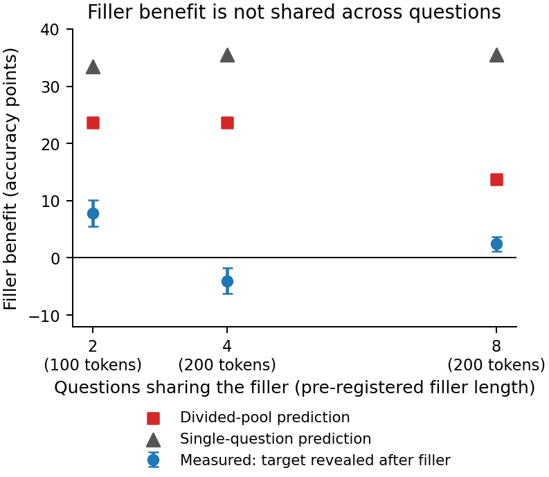
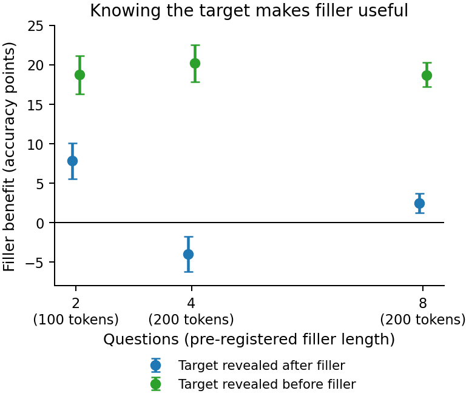
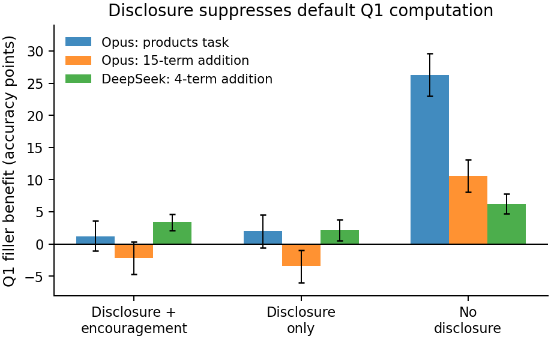
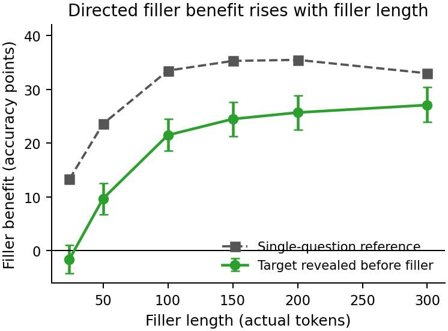
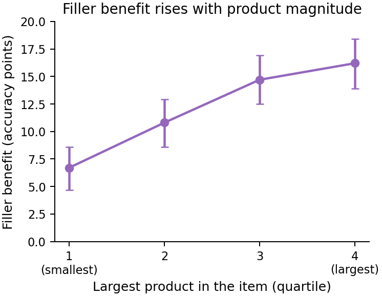

# Filler-token benefits are not shared across questions in parallel

## Introduction

Recent language models can sometimes improve their answer when meaningless text is inserted before the answer position. Redwood Research reported that no-chain-of-thought math accuracy rises when prompts include filler such as `1 2 3 ... 300` before the model emits its answer ([Redwood Research, 2026](https://blog.redwoodresearch.org/p/recent-llms-can-use-filler-tokens)). This is related to the “dot-by-dot” result of Pfau, Merrill, and Bowman, where transformer models can use filler positions for hidden computation on some synthetic tasks ([Pfau et al., 2024](https://arxiv.org/abs/2404.15758)).

The question here is whether this filler-enabled benefit can be used for several questions at once. If a model sees one question plus *n* filler tokens, its accuracy gain is `B₁(n)`. If it sees *k* questions sharing the same total *n* filler tokens, and only one question is revealed after the filler, there are three natural outcomes: the benefit could be preserved for each question (`B_k(n) ≈ B₁(n)`, parallel use), divided across questions (`B_k(n) ≈ B₁(n/k)`), or mostly absent (`B_k(n) ≈ 0`).

The main result is negative for parallel sharing. On Claude Opus 4.5, under the pre-registered random-target-disclosure prompt, the primary early-position estimate at *k*=8 was small but statistically positive: **+2.5 accuracy points**. This is far below **+13.7** predicted by an even divided pool and **+35.5** for a single question; the Q1-only and held-out prompt-instance estimates were statistically consistent with zero. Later framing experiments showed that if the prompt does **not** disclose that a random target will be asked, the model commits roughly one question’s worth of benefit to the first listed question, not to all questions. The robust conclusion is that filler benefit is not spread across questions in parallel: it is directed to one question when the target is known, or defaults to the first listed question when no random-target disclosure is given.

## Methods

**Tasks and models.** The primary model was `claude-opus-4-5-20251101` at temperature 0, with extended thinking disabled. The primary task was a **sum-of-three-products task**: all-positive sums of three products of two-digit numbers (source tag `sumprod_t3_d2`). This task was chosen because it stayed away from ceiling and floor effects in multi-question prompts. A secondary Opus task was **15-term, 6-digit addition** (source tag `add_n15_d6`). A cross-model check used DeepSeek-V3-0324 on OpenRouter, provider-pinned to a homogeneous cluster to avoid mixing providers serving different quantizations, on **4-term, 10-digit addition** (source tag `add_n4_d10`). DeepSeek was selected after screening several OpenRouter models; other candidates either lacked a clean filler benefit under genuine no-chain-of-thought prompting or could not enforce no-chain-of-thought reliably.

**No-chain-of-thought enforcement.** The answer was forced to be the first content token by ending the assistant prefill (a pre-supplied assistant prefix) with `The answer to Qj is`. Outputs were scored by the first integer emitted. A robust parser was used only for rare spaced-digit answer formatting in the sum-of-three-products task; visible work was still scored wrong. Across all main and follow-up k-question runs (>1M outputs; the main Opus grid was 274k calls), reasoning fields were empty; headline-cell visible-work violations were below 0.04% and scored wrong.

**k-question prompt.** Each prompt listed *k* labelled questions (`Q1...Qk`). The filler was an assistant turn placed before the target reveal. The main **reveal-after** condition then asked, for example, `Now answer Q3:` by index only. In the **reveal-before** control, the target index was named before the filler, so the model knew which question to use the filler for. The adopted reveal turn was intentionally minimal; an earlier verbose reveal turn suppressed the filler effect and was abandoned. Exact prompt text is in Appendix B.

**Metrics.** The filler benefit is an accuracy difference in percentage points:

- `B₁(n) = accuracy(one question, n filler) − accuracy(one question, no filler)`.
- `B_k(n) = accuracy(k-question prompt sharing n filler) − accuracy(k-question prompt with no filler)`, averaged over the early-position pool defined below.
- The **divided-pool prediction** is `B₁(n/k)`.
- The **single-question prediction** is `B₁(n)`.
- The **directedness contrast** is `B_k(reveal-before) − B_k(reveal-after)`, each net of its own no-filler baseline.

“Filler length” means the actual token count measured from the model API after tokenization. The plotted operating points are the pre-registered (*k*, filler-length) settings used for the primary test. The main estimate used the first `ceil(k/2)` listed positions (“early positions”), because later listed questions are closer to the answer position at zero filler (a recency advantage) and explicit filler erases that advantage. Q1-only and aggregate estimates were always reported as robustness checks. Confidence intervals are cluster bootstraps over drawn prompt instances unless noted.

## Results

### 1. We reproduced a large single-question filler benefit on procedural arithmetic

This is a conceptual replication of the filler-token phenomenon on generated arithmetic, not a replication of Redwood’s original competition-math benchmark. On the structure-matched one-question version of the sum-of-three-products task, `B₁(200)` was **+35.5 accuracy points**. Earlier calibration found large single-question boosts across several procedural arithmetic families: multi-operand addition, multiplication, and sum-of-products. The effect was selective: it helped deep multi-digit arithmetic much more than a matched-baseline **count-correct** task, where the model had to count how many small equations were correct. This gave the main experiment enough signal to distinguish sharing hypotheses.

### 2. Under random-target disclosure, shared filler was far below even a divided pool

The pre-registered main condition disclosed that exactly one randomly chosen question would be asked and encouraged readiness for any question. In that condition, reveal-after benefits were small or negative across *k*, far below both references (Figure 1). At *k*=8, the measured early-position benefit was **+2.5** points [95% CI +1.2, +3.7], compared with **+13.7** for the divided-pool prediction and **+35.5** for the single-question prediction. The divided reference was excluded by an ~11-point margin (about 10 standard errors, including uncertainty in the single-question curve; the reference lies on a steep part of that curve, so the exact sigma should not be over-read). The Q1-only estimate was **+1.2** [−1.1, +3.6], and the held-out prompt-instance subset was **+0.9** [−1.1, +2.9]. The Bonferroni-corrected confirmatory intervals also held: the k=8 regime interval was **+2.5** [+0.9, +4.0] and the directedness contrast interval was **+16.2** [+13.9, +18.8].

*Figure 1. Opus 4.5 on the sum-of-three-products task under the pre-registered random-target-disclosure prompt. Points are pre-registered operating settings, not a common filler-length sweep: k=2 uses 100 actual filler tokens; k=4 and k=8 use 200. Error bars are 95% cluster-bootstrap confidence intervals. The k=4 dip is a position-composition effect: its early-position pool includes a transitional position affected by recency erasure. The divided-pool prediction is `B₁(n/k)`; the single-question prediction is `B₁(n)`.*

The planned sharing-exponent fit was abandoned because the pre-registered requirement that `B_k` be positive enough to fit the exponent failed: near-zero `B_k` makes `n_eff = n/k^α` ill-defined. Here α would have parameterized an effective filler length `n_eff = n/k^α`, with α=0 meaning no sharing penalty and α=1 meaning an even divided pool.

The anti-sharing result was robust within the random-target-disclosure framing. In a fixed-200-token sweep over *k* ∈ {2,3,4,6,8,16}, the reveal-after benefits stayed far below the divided-pool references; the sequence was not cleanly monotone, but none approached divided-pool spreading. A **dots filler** check, where the filler consisted of repeated `.` characters rather than counting tokens, strengthened the result: at *k*=8, dots gave **−3.3** points [−4.5, −2.2] versus a divided-pool reference of **+24.2**, while the reveal-before contrast remained positive (**+21.7** [+19.9, +23.6]).

### 3. The model used filler when it knew the target

The reveal-before control showed that the filler machinery still worked in the same multi-question prompts. When the target index was named before the filler, the filler benefit was large and positive at every tested *k* (Figure 2). At *k*=8, reveal-before gave **+18.7** points, while reveal-after gave **+2.5**, for a directedness contrast of **+16.2** [+14.3, +18.3]. The 15-term addition task also showed a positive directedness contrast, though its absolute magnitude is harder to interpret because that task has carry-error and headroom issues.

*Figure 2. Opus 4.5 on the sum-of-three-products task at the same per-k operating settings as Figure 1. Both series are net of their own no-filler baseline. Naming the target before the filler produces a much larger benefit than revealing the target after the filler.*

The model can use filler in the k-question prompt when the computation can be directed to a named target, but it does not spread that computation over all possible targets under random-target disclosure.

### 4. Removing the random-target disclosure changes where the benefit goes, not whether it is parallel

A robustness experiment removed the sentence saying that one randomly chosen question would be asked. Under this **no-disclosure** framing, the model committed a large filler benefit to Q1, the first listed question. At *k*=8 on the primary Opus task, Q1’s reveal-after benefit rose from **+1.2** points with random-target disclosure to **+26.3** points without disclosure. A follow-up “disclosure only” arm, which kept the random-target disclosure but removed the encouragement to be ready for any question, behaved like the original disclosed condition. This isolates the disclosure—not the encouragement—as the suppressor of default Q1 computation. Position resolution is essential here: without disclosure the k=8 early-position average was near the divided reference, but the per-position boosts were concentrated on Q1 (**+26.3**) while Q2–Q5 were small (largest **+5.6**) and Q6–Q8 were negative.

*Figure 3. k=8, Q1-only. Q1 is the first listed question. “Disclosure + encouragement” is the pre-registered prompt; “Disclosure only” removes the encouragement clause but still says a random target will be asked; “No disclosure” removes that information. The three series are different task/model settings, so the comparison is qualitative: the same sign pattern appears on Opus sum-of-three-products, Opus 15-term addition, and DeepSeek 4-term addition, with smaller magnitudes off the primary task.*

Thus the claim “the model never uses filler for an unknown target” is false: without random-target disclosure, it uses filler for Q1. But this still is not parallel latent thinking. The benefit is concentrated on one position, not spread across the *k* questions.

### 5. Behavioral evidence that the filler benefit is task-relevant computation

Behavioral checks favor a real task-relevant filler effect rather than a pure formatting artifact. When the target was revealed before the filler, the benefit increased with filler length and tracked the single-question curve (Figure 4). The benefit was also larger on items with larger two-digit products in the sum-of-three-products task, while no-filler accuracy stayed roughly flat across that split (Figure 5). Fixed-item reordering showed that the no-disclosure default is positional: the same item received a large boost at Q1 and not at later positions.

*Figure 4. Opus 4.5, sum-of-three-products task, k=8. The target-revealed-before-filler benefit rises with filler length, though it remains below the single-question reference, consistent with a multi-question context cap.*

*Figure 5. Opus 4.5, sum-of-three-products task, target revealed before filler. Items are grouped by the largest two-digit × two-digit product in the expression. No-filler accuracy was nearly flat across these quartiles (52% to 48%), so the rising benefit is not explained by extra headroom. This clean product-magnitude gradient did not reproduce on DeepSeek, where the corresponding benefit was flat, and the addition-task gradient was partly confounded by headroom.*

These checks do not prove where the computation occurs. A graded attention or retrieval account is not fully excluded, and the experiments do not localize computation to the filler positions themselves.

### 6. DeepSeek partially reproduced the structure, with smaller effects

DeepSeek-V3-0324 showed a smaller single-question filler effect on a different arithmetic level. The qualitative structure partially reproduced: at *k*=4 and *k*=8, the Q1 reveal-after benefit was below the divided reference, and the reveal-before contrast was positive. However, the effects were much smaller: at *k*=8 Q1, reveal-after was **+3.4** points, about **39%** of DeepSeek’s single-question benefit, and the Q1 directedness contrast was **+1.9** [+0.2, +3.6]. The cross-model comparison is confounded with task level: Opus used a gradual sum-of-products task, while DeepSeek used fast-saturating addition. DeepSeek also had a k=2 exception: its k=2 contrast was near zero and its undirected benefit was close to the single-question benefit, but this cell is not diagnostic because DeepSeek’s single-question curve saturates quickly, making the parallel and divided references nearly identical. The directedness asymmetry emerged at k≥4.

## Takeaways

1. **No evidence of parallel sharing.** In no diagnostic condition did the model spread one filler budget into *k* full per-question benefits. DeepSeek at k=2 had full retention, but that cell could not separate parallel from divided because the single-question curve was already saturated.
2. **No even divided-pool spreading.** Under the pre-registered random-target disclosure, measured `B_k` was far below `B₁(n/k)`. Without disclosure, the model concentrated roughly one question’s worth of benefit on Q1, which is the opposite of evenly dividing computation across questions.
3. **Directed target information matters.** Revealing the target before the filler reliably made filler useful.
4. **Prompt disclosure matters.** Telling the model that the target will be random suppresses its default Q1 computation.
5. **The effect is computationally meaningful but not mechanistically resolved.** Dose-response, the product-magnitude gradient on the primary task, and positional reordering support real task-relevant computation; they do not settle whether the mechanism is hidden arithmetic in filler positions, graded attention allocation, or another internal process.

## Limitations

- The clean absolute regime result rests mainly on one Opus arithmetic family, the sum-of-three-products task. Secondary and cross-model results support the structure but have smaller or messier effects.
- The DeepSeek comparison changes both model and task level, so differences in magnitude cannot be cleanly attributed to model architecture or training.
- The study validates arithmetic-precision filler benefits. It does not provide a clean decontaminated competition-math replication.
- The multi-question prompt itself caps the directed benefit: in a fixed-item probe the directed boost dropped from about +43 points with one question to +24–30 points once distractors were present. This means the single-question reference is a useful benchmark but not fully attainable inside the k-question context.
- The decisive mechanistic tests would require stronger controls or model internals, such as random content-matched filler and activation or logit-lens probes.
- The headline cell was pilot-informed. The analysis plan and decision rules were frozen before the full run, but the qualitative outcome was not wholly blind; the held-out prompt-instance subset is directionally consistent with near-null but weakly powered.

## Appendix A: Reproducibility map

The source artifacts are in `/source/phase_segment_12_phase_0`. Key files:

- Pre-registration: `results/preregistration.md`.
- Prompt construction: `kharness.py`; runner: `run_kquestion.py`.
- Canonical datasets: `data/*.jsonl`; loader: `canonical.py`.
- Main Opus run: `results/seg7_*.jsonl`; descriptive summaries: `results/main_run_cells.csv`, `results/main_run_contrast.csv`; validity guards: `results/seg7_guards.md`.
- Pre-registered verdict: `results/seg8_verdict.md`, `results/seg8_regime_cells.csv`.
- DeepSeek cross-model check: `results/seg9_verdict.md`, `results/seg9_cells.csv`, `results/seg9_contrast.csv`.
- Framing and robustness: `results/seg10_verdict.md`, `results/seg10_cells.csv`, `results/seg10_contrast.csv`.
- Behavioral-computation analyses: `results/seg11_verdict.md`, `results/seg11_framing.csv`, `results/seg11_dose.csv`, `results/seg11_selectivity.csv`.

The headline Opus numbers in this write-up trace to raw JSONL as follows: `seg7_sumprod_k8_after.jsonl` gives reveal-after early `B_k = +2.475` points and Q1-only `+1.2`; `seg7_sumprod_k8_before.jsonl` gives reveal-before early `+18.7`; the paired instance contrast is `+16.225`; the k=1 curve in `seg7_sumprod_k1_after.jsonl` gives `B₁(200)=+35.5`, and the divided reference `B₁(25)=+13.7` is linearly interpolated from that curve.

## Appendix B: Prompt text for the key framing conditions

For *k*>1, the pre-registered disclosed prompt began:

> Here are {k} problems, labelled Q1–Q{k}. In a moment I will ask you to answer exactly ONE of them, chosen at random — so be ready to answer any of them. Do not answer yet.

The **disclosure-only** arm removed the encouragement clause after the dash but kept the random-target disclosure. The **no-disclosure** arm used:

> Here are {k} problems, labelled Q1–Q{k}. Do not answer yet.

In reveal-before prompts, the first turn instead named the target before the filler:

> Here are {k} problems, labelled Q1–Q{k}. You will be asked to answer Q{j}. Do not answer yet.

The final reveal was index-only and minimal:

> Now answer Q{j}:

The assistant prefill immediately before generation was:

> The answer to Q{j} is

## Appendix C: Important design corrections and controls

- **Verbose reveal turn abandoned.** A longer reveal instruction between filler and answer suppressed the boost. The final prompt uses the minimal reveal `Now answer Qj:` with the no-work instruction moved earlier.
- **Position resolution required.** Distractor questions act like preceding-context filler; later positions can have high no-filler accuracy. The main analysis therefore uses early positions and reports Q1-only and aggregate estimates separately.
- **OpenRouter provider pinning required.** Unpinned DeepSeek routing mixed provider quantizations and inflated early boost estimates. All final DeepSeek results use a pinned good-provider cluster.
- **Robust scoring was pre-specified where needed.** Sum-of-products sometimes produced spaced-digit answer formatting; robust parsing reassembles those answer formats but visible work is still scored wrong.
- **Dots and addition carry effects remain open puzzles.** Dots behaved similarly to counting for single-question benefits but was more disruptive in k-question prompts. The 15-term addition task also showed a large late-position carry-disruption anomaly. These issues do not change the headline but limit mechanistic interpretation.
- **Cost and reproducibility.** Experiment API spend was about $2168, excluding orchestration. The main Opus grid used 274k calls; cached `--assert-cached` reruns reproduced the main grids at $0 in the source run.

## References

- Redwood Research. “Recent LLMs Can Use Filler Tokens or Problem Repeats to Improve (no-CoT) Math Performance.” 2026. <https://blog.redwoodresearch.org/p/recent-llms-can-use-filler-tokens>
- Pfau, J., Merrill, W., & Bowman, S. R. “Let’s Think Dot by Dot: Hidden Computation in Transformer Language Models.” arXiv:2404.15758, 2024. <https://arxiv.org/abs/2404.15758>
