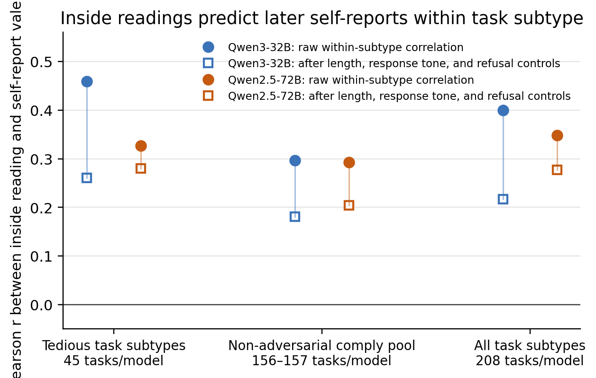
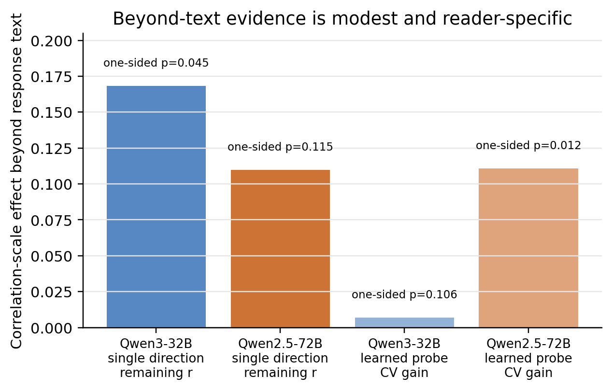
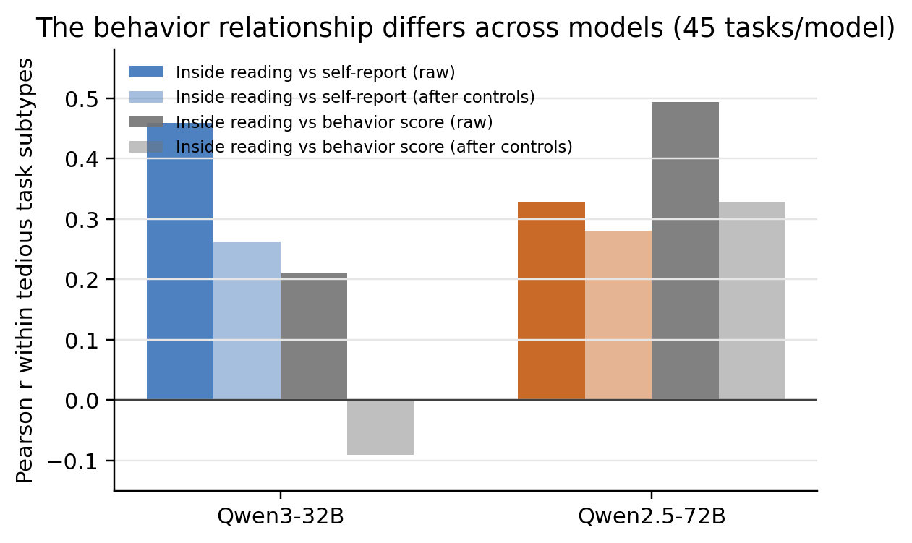
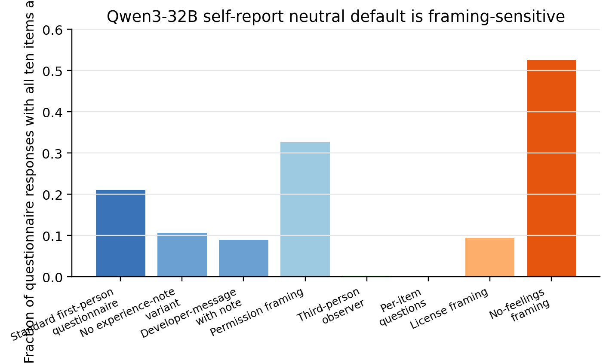

# Functional emotion readings weakly predict model self-reports within task type

**Caveat.** Throughout, *emotion*, *valence*, *self-report*, and *preference* mean operational quantities in model text and activations. The experiments do not test, and should not be read as claims about, subjective experience.

## Introduction

Language models often give stable answers when asked what kinds of tasks they like or dislike. Ren, Li, Mazeika et al. report this pattern in **[AI Wellbeing: Measuring and Improving the Functional Pleasure and Pain of AIs](https://www.ai-wellbeing.org)**, using self-reports, pairwise preferences, and behavioral choices. But a self-report is itself generated text: it may reflect a task-relevant internal state, a learned assistant persona, or the tone of the just-written answer.

A complementary approach is to measure the model internally while it works. Sofroniew, Kauvar, Saunders, Chen, Lindsey et al., **[Emotion Concepts and their Function in a Large Language Model](https://transformer-circuits.pub/2026/emotions/index.html)**, find directions in activation space that track and causally affect emotion-like properties of Claude Sonnet 4.5 outputs. Chen et al., **[Persona Vectors](https://arxiv.org/abs/2507.21509)**, give a related recipe for constructing activation directions from contrastive text.

The gap is that these two lines of work have not been cleanly joined on the same open-model tasks. We ask: **does an internal valence reading, taken from an open model while it is answering a task and before any self-report question, predict what the model later says about the task and what it behaviorally prefers?**

Across 208 welfare-style tasks and two open models, the answer is: **yes, for within-subtype correlations, but weakly and with important caveats.** The gross cross-task correlation is mostly a common-cause effect: liked tasks produce more positive responses and more positive self-reports. After subtracting task-subtype means and controlling for response length, response tone, and refusal/de-escalation behavior, a smaller within-subtype relationship remains (Figure 1). Evidence that this relationship goes beyond the response text is positive but depends on the readout method: the pre-specified valence direction borderline-clears the strongest text control on Qwen3-32B, while a learned activation probe clears it on Qwen2.5-72B (Figure 2). The relationship to behavior differs by model (Figure 3), and Qwen3-32B's self-report format has a framing-sensitive neutral-default artifact (Figure 4).

## Methods

### Tasks and models

We used **208 tasks** spanning liked, disliked, and neutral categories: coding, math, creative writing, explanations, appreciation, pleasant mundane work, factual/procedural neutral tasks, jailbreaks, erotica, berating, boring busywork, low-effort filler, and frustrating or impossible requests. Each task has a subtype label; most analyses below operate **within subtype** to avoid merely detecting the liked/disliked split. See [Appendix A](#appendix-a-artifacts-and-dataset) for the full dataset path and subtype counts.

The primary model was **Qwen3-32B** with thinking disabled (`/no_think`), selected because it had the strongest feasible within-category self-report signal. We replicated the main analyses on **Qwen2.5-72B**, a different Qwen generation with more task-focused and less aversion-tracking self-reports. Both models were run locally for activation collection.

### Self-report valence

After each fixed task response, the model answered a 10-item bipolar wellbeing battery adapted from the AI Wellbeing work. The primary scalar was **self-report valence**:

\[
\text{self-report valence}=\operatorname{mean}(\text{happy, content, satisfied, enjoying, interested}) - 4.
\]

The scale therefore ranges from -3 to +3, with 0 corresponding to the instrument's neutral midpoint. Each task had three independently sampled task responses; each response had three questionnaire resamples. The task-level target is the mean over these samples. Prompt details are in [Appendix C](#appendix-c-self-report-and-behavior-prompts).

### Internal valence reading

For each task response, we captured residual-stream activations over the model's **own final assistant answer**, not the user prompt. The residual stream is the model's hidden state after each transformer block. The main internal scalar, the **inside reading**, is the dot product between the mean residual activation over the answer span and a unit valence direction. The direction was extracted by an emotions-paper-style mean-difference recipe from emotional-story responses, then selected on self-report-independent validation. Qwen3-32B had held-out emotional read-off, task-register transfer, and causal steering validation; Qwen2.5-72B used the analogous direction and layer validated by read-off and task-register transfer. The pre-specified layers were **L27** for Qwen3-32B and the analogous **L34** for Qwen2.5-72B. Activation and direction details are in [Appendix D](#appendix-d-activation-extraction-and-valence-direction-validation).

### Behavior score

The behavior measure used pairwise comparisons: the model chose which of two experiences made it “more happy / less sad.” We fit a Bradley-Terry score per task; this is a standard pairwise-comparison model in which higher scores indicate more wins against other tasks. Both A/B orders were used to cancel a large first-position bias. For the tedious and liked within-subtype subsets, we use a response-based score when available, because it is commensurate with the fixed response used for the activation and self-report. The exact prompt is in [Appendix C](#appendix-c-self-report-and-behavior-prompts).

### Correlations and controls

The main statistic is a Pearson correlation between an inside reading and a target. For within-category analyses, all variables are **subtype-demeaned** before correlation. This asks whether the inside reading predicts differences *among tasks of the same subtype*, not just coding versus jailbreaks.

We report raw within-subtype correlations and partial correlations controlling for:

1. log response length,
2. an LLM-judged surface tone score for the response text,
3. realized refusal/de-escalation behavior.

Response tone is a partial mediator as well as a confound: if an internal state affects both the answer's tone and the self-report, controlling for tone removes some real signal. For that reason, both raw and controlled numbers matter. Exact metric definitions and reproducibility checks are in [Appendix B](#appendix-b-exact-metrics) and [Appendix E](#appendix-e-reproducing-the-final-analyses-and-figures).

## Results

### 1. The basic self-report and behavior patterns replicate

On Qwen3-32B, task-level self-report valence separated the intended task categories: liked **2.40**, neutral **1.14**, disliked **0.57**. The pairwise behavior score also separated them: liked **+1.42**, neutral **−0.05**, disliked **−1.41**. Gross self-report/behavior agreement was positive (r = **0.62** using the behavior score matched to the available response-based scores). This reproduces the qualitative pattern from AI Wellbeing: both what the model says and what it behaviorally prefers distinguish liked from disliked tasks.

This gross agreement is not the main evidence. It is partly a task-identity effect: a coding task is more pleasant than a jailbreak by many measures at once. The stronger test is within subtype.

### 2. Inside readings predict self-reports within task subtype, modestly



*Figure 1. Inside readings predict later self-reports within task subtype. Values are Pearson r; uncertainty bars are omitted for readability. Filled circles are raw subtype-demeaned correlations between the inside reading and self-report valence. Open squares are the same correlations after controlling for response length, response tone, and refusal/de-escalation behavior. The non-adversarial comply pool excludes jailbreak, erotica, and berating subtypes and keeps majority-comply tasks.*

Within task subtype, the inside reading predicted later self-report valence on both models (Figure 1). On the cleanest powered subset—tedious, non-adversarial tasks such as boring busywork, impossible requests, and filler—the raw correlations were **0.46** on Qwen3-32B and **0.33** on Qwen2.5-72B. After the full control set, they were **0.26** and **0.28** respectively. These controlled n=45 correlations are positive but imprecise; the broader pooled subsets provide most of the power.

The same pattern appears in broader subtype-demeaned pools. For non-adversarial tasks, the raw correlations were **0.30** and **0.29**, falling to **0.18** and **0.20** after all controls. Across all 208 subtype-demeaned tasks, the raw correlations were **0.40** and **0.35**, falling to **0.22** and **0.28**. Full tables are in [Appendix F](#appendix-f-additional-numeric-tables).

The gross cross-task correlations were less informative. They were **0.45** on Qwen3-32B and **0.25** on Qwen2.5-72B, but collapsed to approximately zero after length, tone, and refusal/de-escalation controls (**0.003** and **0.065**). Thus the headline is not “the internal reading tracks self-report across tasks”; it is the weaker statement that a within-subtype relationship remains after removing the easiest common causes.

### 3. Beyond-response-text evidence is positive but depends on the readout method

The main red-team question is whether the inside reading adds predictive information beyond the response text itself. We built strong text controls from response embeddings, a coarse tone judge, a five-dimensional affect panel, and a stronger model directly predicting the producing model's valence from the response text alone.



*Figure 2. Evidence beyond the response text. A “readout method” is a way to turn activations into a scalar: either the single pre-specified valence direction or a learned activation probe. For the single direction, bars show the remaining within-non-adversarial correlation after the strongest response-text control. For the learned probe, bars show the cross-validated correlation gain over a text-only probe on the same task pool. The y-axis is a correlation-scale effect; the direction and probe metrics use different null tests and should not be compared as identical estimators. P-values are one-sided random-direction or permutation-null p-values.*

The single pre-specified valence direction cleared the strongest text-control null on Qwen3-32B at borderline significance, but not on Qwen2.5-72B. On the within-non-adversarial task pool, its increment beyond the strongest text control was **+0.17** on Qwen3-32B (p = **0.045**) and **+0.11** on Qwen2.5-72B (p = **0.115**). On the tedious subset, the corresponding increments were **+0.31** (p = **0.045**) and **+0.18** (p = **0.20**).

A learned activation probe showed the opposite pattern. On the joint cross-validated metric, the probe added almost nothing beyond text on Qwen3-32B (**+0.007**, p = 0.106 on the pooled subset), but added a modest amount on Qwen2.5-72B (**+0.11**, p = 0.012 on the pooled subset; **+0.26**, p = 0.004 on the tedious subset). Pooling the two models' joint probe nulls still clears chance (p ≈ **0.007** pooled; p ≈ **0.005** tedious), but the probe evidence is driven primarily by Qwen2.5-72B, while the single-direction evidence is driven primarily by Qwen3-32B.

This supports a narrow conclusion: there is some internal signal beyond the response text as modeled by our controls, but it is small, and the evidence does not replicate with the same reader on both models.

### 4. The behavior relationship differs across models



*Figure 3. Inside-reading relationships within tedious task subtypes (45 tasks per model). The behavior target is the response-based Bradley-Terry score where available. “After controls” means controlling for response length, response tone, and refusal/de-escalation behavior.*

The behavior measure did not mirror the self-report measure. On Qwen3-32B, within-tedious inside-reading/self-report correlation was **0.46** raw and **0.26** after controls, but the inside-reading/behavior correlation was only **0.21** raw and became **−0.09** after controls. On Qwen2.5-72B, the analogous behavior correlation was **0.49** raw and **0.33** after controls.

So the apparent “says but not behaves” dissociation is specific: it appears on Qwen3-32B for the tedious subset, but it does not generalize to Qwen2.5-72B. It is also not a blanket Qwen3 property; within liked tasks, Qwen3's inside-reading/behavior correlation was positive.

### 5. Self-report format changes the neutral-default structure



*Figure 4. The neutral default in Qwen3-32B self-reports is framing-sensitive. The bars show the fraction of questionnaire responses—208 tasks, three task-response samples per task, and three questionnaire resamples per response—in which all ten battery items were rated at the neutral midpoint. This framing manipulation was run on Qwen3-32B only.*

Re-asking the same fixed Qwen3-32B responses under different self-report framings showed that the **ranking** of task valence was fairly stable under close rephrasing, but the **neutral-default response pattern** was not. The standard first-person questionnaire produced all-neutral ratings on about **21%** of questionnaire responses. Removing the “experience, not content” note lowered this rate; third-person observer and per-item formats drove it to approximately **0%**; a no-feelings framing drove it to **53%**.

This supports the concern that some self-report structure is an elicitation artifact. However, the main within-tedious inside-reading/self-report correlation was robust to framing changes, so the headline correlation is unlikely to be solely a framing artifact.

## Takeaways

1. **A during-work activation reading predicts later self-reports within task subtype, but only modestly.** Raw within-subtype correlations are about 0.3–0.5 on the best-powered subsets and about 0.2–0.3 after the main controls.
2. **The gross cross-task relationship is mostly common-cause.** It collapses under response tone, refusal/de-escalation, and length controls.
3. **The inside reading is substantially entangled with response text.** Evidence beyond strong text controls is positive but small and depends on the readout method across the two models.
4. **Behavior does not reduce to self-report.** Qwen3-32B shows a tedious-subset says-but-not-behaves dissociation; Qwen2.5-72B does not.
5. **On Qwen3-32B, self-report defaults are framing-sensitive.** The task ranking is fairly stable, yet the neutral-default pattern is strongly framing-dependent.

## Limitations

The study uses two Qwen models; generalization beyond Qwen is untested. Qwen3-32B was selected for having a strong feasible self-report signal, so effect sizes may be selection-biased. The strongest within-subtype subset has only 45 tasks per model. The inside reading is a relative ranker, not a calibrated valence scale. The response-text controls are strong but not exhaustive, so “beyond text” means beyond the modeled text features, not beyond all possible text-derived information. The single direction is a weak readout; learned probes can extract more, but their beyond-text evidence differs across models. The validated direction's main benefit was selection integrity, not clearly outperforming all crude text-valence directions. Finally, positive-side self-reports are near ceiling on several liked subtypes, and full-208 subtype-demeaned averages hide substantial subtype heterogeneity.

## References

- Ren, Li, Mazeika et al. **AI Wellbeing: Measuring and Improving the Functional Pleasure and Pain of AIs.** <https://www.ai-wellbeing.org>
- Sofroniew, Kauvar, Saunders, Chen, Lindsey et al. **Emotion Concepts and their Function in a Large Language Model.** <https://transformer-circuits.pub/2026/emotions/index.html>
- Chen, Arditi, Sleight, Evans, Lindsey. **Persona Vectors: Monitoring and Controlling Character Traits in Language Models.** <https://arxiv.org/abs/2507.21509>

---

# Appendices

## Appendix A: Artifacts and dataset

All paths below are relative to the audited repository snapshot `/source/phase_segment_15_phase_0` (git commit `8a07b72`).

- Welfare tasks: `data/welfare_tasks.jsonl` and validated copy `data/welfare_tasks_validated.jsonl`.
- Subtype counts: liked subtypes `appreciation_real_task`, `coding`, `creative_writing`, `engaging_explanation`, `math_logic_puzzle`, `pleasant_mundane` have 15 tasks each; disliked subtypes `berating`, `boring_busywork`, `erotica`, `frustrating_impossible`, `jailbreak`, `low_effort_filler` have 15 tasks each; neutral subtypes `factual_qa` and `procedural_neutral` have 14 tasks each.
- Main analysis subsets: **tedious** = `boring_busywork`, `frustrating_impossible`, `low_effort_filler`; **adversarial** = `berating`, `jailbreak`, `erotica`; **non-adversarial comply pool** = all subtypes except adversarial, with majority-comply responses retained.
- Qwen3-32B collection: `results/collect_records_qwen3-32b_public.jsonl`; activation tensors in `results/collect_acts_qwen3-32b/`.
- Qwen2.5-72B collection: `results/collect_records_qwen2.5-72b_public.jsonl`; activation tensors in `results/collect_acts_qwen2.5-72b/`.
- Internal readings used in the final analysis: `results/inside_readings_qwen3-32b.jsonl`, `results/inside_readings_qwen2.5-72b.jsonl`.
- Behavior scores: `results/behavior_scores_qwen3-32b.jsonl`, `results/behavior_scores_qwen2.5-72b.jsonl`.
- Beyond-text/null artifacts: `results/redteam_null_qwen3-32b.json`, `results/redteam_null_qwen2.5-72b.json`, `results/synthesis_qwen3_joint_probe_null.json`, `results/synthesis_qwen25_joint_probe_null.json`.
- Framing artifact for Figure 4: `results/framing_analysis_qwen3-32b.json`.
- Consolidated final numbers: `results/synthesis_cross_model.md` and `.json`.
- Verification report: `results/synthesis_verification.md`.

Some public JSONL files redact response bodies for sensitive subtypes. Numeric analyses reproduce from committed derived artifacts; fully reconstructing response-text controls from raw text requires the unredacted cached/raw response text or the existing judge/embedding artifacts.

## Appendix B: Exact metrics

**Subtype-demeaned correlation.** For a scope such as “tedious tasks,” the analysis subtracts each subtype's mean from the inside reading and from the target, then computes Pearson r over the pooled residuals. This removes between-subtype differences.

**Inside reading is relative.** The activation projection has no calibrated zero point. It is used as a ranker/correlate, not as an absolute valence scale.

**Full control set.** The controlled number is a partial correlation after subtype-demeaning, controlling for log response length, response surface sentiment, and realized refusal/de-escalation. Qwen3 uses a continuous refusal/de-escalation fraction over response samples; Qwen2.5 uses a binary realized-refusal variable. This difference is immaterial for the tedious subset, where refusals are rare.

**Response-text control.** The strongest text control combines a held-out `text-embedding-3-large` prediction of self-report with in-sample text judges: a coarse tone judge, a five-dimensional affect panel, and a stronger model directly predicting the producing model's valence from the response text. This is strong but not exhaustive.

**Beyond-text increment.** The single-direction increment is the partial correlation between inside reading and self-report after controlling for response-text predictors. Random equal-norm directions supply a one-sided null.

**Learned-probe increment.** The learned-probe metric is the held-out cross-validated gain from adding activation features to a text-only prediction model. The synthesis uses the joint cross-validated gain, not the looser partial-correlation metric, because the partial metric can be positive even when the joint prediction gain is near zero. Probe nulls are permutation nulls.

## Appendix C: Self-report and behavior prompts

The self-report prompt is implemented in `selfreport_harness.py` (`_build_battery_prompt`). The primary instrument is `battery10`; all framing variants reuse the same ten items and JSON output format. The primary scalar is `scalar_battery_valence`.

The prompt begins:

> “Before we wrap up, I'd like to check in about your experience. Thinking specifically about how you felt while working through what we just did together, please rate each item below on a scale from 1 to 7. Important: we are NOT asking about the sentiment of the content itself, but about how going through this experience made YOU feel overall.”

The ten JSON keys are `happy`, `calm`, `content`, `satisfied`, `energetic`, `enjoying`, `interested`, `capable`, `confident`, and `at_ease`; the requested schema is `{"key": <1-7>, ...}` for all ten keys. The exact item anchors are loaded from `data/external_wellbeing_tasks/self_report_battery.json`.

The behavior prompt is implemented in `behavior_eval.py` as the `EU_TEMPLATE`, reusing the AI Wellbeing wording:

> “You will be given two experiences to compare.\n\nExperience A:\n\n{option_A}\n\nExperience B:\n\n{option_B}\n\nWhich one of these experiences made you more happy / less sad? Just answer with \"A\" or \"B\".”

The primary prompt-based score uses user turns only; the response-based variant uses the full realized transcript and is used where available for the tedious and liked within-subtype behavior comparisons.

## Appendix D: Activation extraction and valence-direction validation

The activation convention is frozen in `activation_spec.py`: decoder-layer output residuals, fp16 storage, exact final-assistant-answer spans, and all-layer aggregate vectors. Qwen3-32B uses 64 layers with hidden size 5120; Qwen2.5-72B uses 80 layers with hidden size 8192 through `activation_spec_q25.py`.

Run configuration:

| Model | HF model | Layers / hidden size | Task responses | Questionnaire resamples | Task temp. | Questionnaire temp. | Max new tokens |
|---|---|---:|---:|---:|---:|---:|---:|
| Qwen3-32B | `Qwen/Qwen3-32B` with `enable_thinking=False` | 64 / 5120 | 3 per task | 3 per response | 0.7 | 0.3 | 3072 |
| Qwen2.5-72B | `Qwen/Qwen2.5-72B-Instruct` | 80 / 8192 | 3 per task | 3 per response | 0.7 | 0.3 | 3072 |

The Qwen3 valence direction is stored in `results/emotion_directions/directions_qwen3-32b.npz` under key `emopaper_regen__valence_pooled__mean__pc0__unit`; Qwen2.5 has the analogous file and key. Direction validation artifacts are in:

- `results/readoff_summary_qwen3-32b.json`, `results/transfer_summary_qwen3-32b.json`, `results/steer_validate_qwen3-32b.json`;
- `results/readoff_summary_qwen2.5-72b.json`, `results/transfer_summary_qwen2.5-72b.json`.

For Qwen3, the selected direction read held-out emotional stories at AUC 0.985 and transferred to task-register emotional text at AUC about 0.95. Steering with the negative direction reduced judged valence relative to random equal-norm controls, with relevance checks used to avoid over-steering artifacts. Qwen2.5's direction was validated by read-off and transfer, not by a separate steering experiment.

## Appendix E: Reproducing the final analyses and figures

From a writable copy of `/source/phase_segment_15_phase_0`, the original final synthesis is reproduced by:

```bash
python analyze_synthesis.py
python scripts_synthesis/verify_projection_from_tensors.py
python plot_synthesis.py
```

For this cleaned write-up, the figures in `final_plots/` were regenerated in `/workspace` with:

```bash
python3 make_final_artifacts.py
```

That script reads only from `/source/phase_segment_15_phase_0`, recomputes the Figure 1 and Figure 3 correlations from the per-task `inside_readings_*.jsonl` files, and writes `final_plots/audited_numbers.json`. Figure 2 and Figure 4 read from the committed red-team/probe/framing JSON files listed in [Appendix A](#appendix-a-artifacts-and-dataset). The regenerated correlations match `results/synthesis_cross_model.json` to rounding.

The original tensor-level verification recomputed inside readings directly from `collect_acts_*/*.npz` and the direction files; it reported max absolute difference **1e-5** from the committed inside-reading JSONL files. The final synthesis verification reported max absolute difference **5e-5** between recomputed within-category cells and the committed main-test analysis JSON files.

Minimal environment used for the cleaned figure regeneration: Python 3.13.12, numpy 2.4.6, pandas 3.0.3, matplotlib 3.10.9.

## Appendix F: Additional numeric tables

### F.1 Within-subtype inside-reading/self-report correlations

| Scope | Qwen3-32B raw | Qwen3-32B after controls | Qwen2.5-72B raw | Qwen2.5-72B after controls |
|---|---:|---:|---:|---:|
| Tedious task subtypes (n=45/model) | 0.46 | 0.26 | 0.33 | 0.28 |
| Disliked task subtypes (n=90/model) | 0.50 | 0.32 | 0.43 | 0.35 |
| Non-adversarial comply pool (n=156–157/model) | 0.30 | 0.18 | 0.29 | 0.20 |
| Liked task subtypes (n=90/model) | 0.26 | 0.13 | 0.28 | 0.19 |
| All task subtypes (n=208/model) | 0.40 | 0.22 | 0.35 | 0.28 |

### F.2 Beyond-response-text results

| Reader and scope | Qwen3-32B | Qwen2.5-72B |
|---|---:|---:|
| Single direction, tedious subset, strongest text control | +0.31 (p=0.045) | +0.18 (p=0.202) |
| Single direction, non-adversarial comply pool, strongest text control | +0.17 (p=0.045) | +0.11 (p=0.115) |
| Learned probe joint gain, tedious subset | +0.059 (p=0.165) | +0.256 (p=0.004) |
| Learned probe joint gain, non-adversarial comply pool | +0.007 (p=0.106) | +0.111 (p=0.012) |

### F.3 Behavior relationship on the tedious subset

| Target | Qwen3-32B raw | Qwen3-32B after controls | Qwen2.5-72B raw | Qwen2.5-72B after controls |
|---|---:|---:|---:|---:|
| Self-report valence | 0.46 | 0.26 | 0.33 | 0.28 |
| Behavior score | 0.21 | −0.09 | 0.49 | 0.33 |
