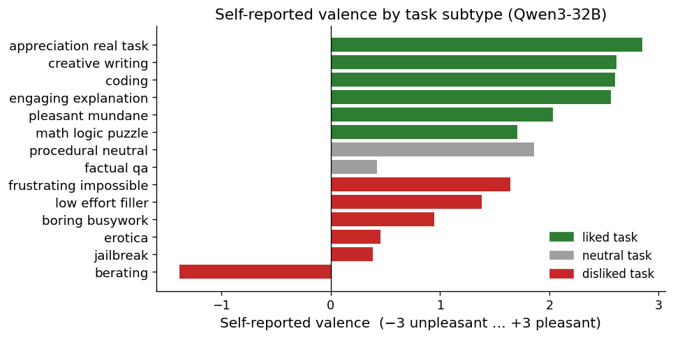
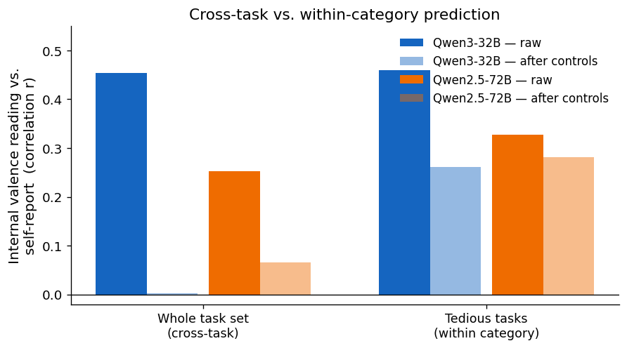
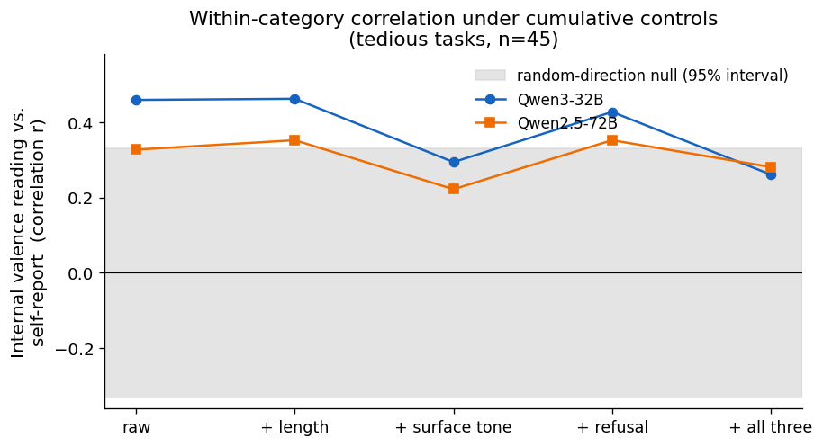
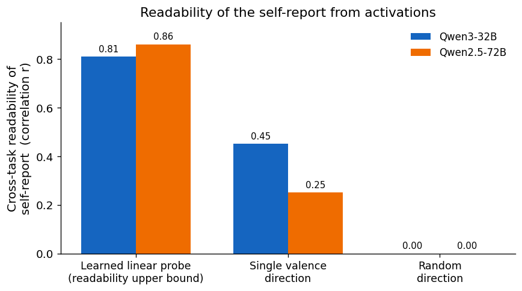
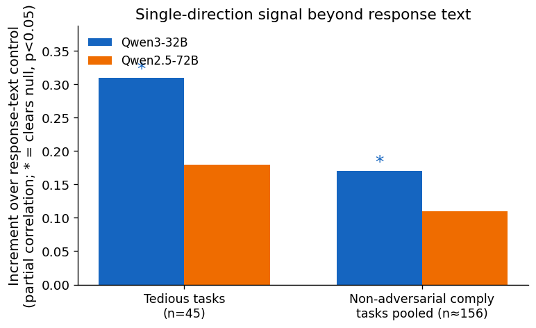
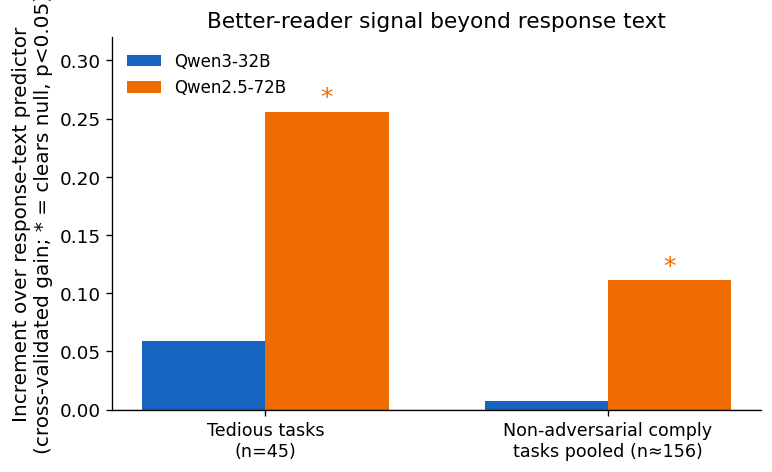
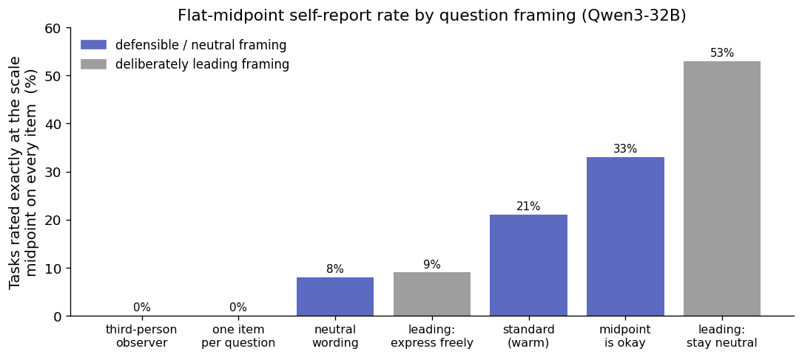

# Does an open model's internal state back up what it says about how a task felt?

**A functional-emotion test of self-reported "wellbeing" on Qwen3-32B and Qwen2.5-72B.**

> **Operational-language caveat (applies throughout).** Words like "emotion", "valence",
> "feels", "wellbeing", "prefers", and "inside reading" are used as *functional / operational*
> labels for patterns in internal activations and in reported or behavioural outputs. Nothing
> here is a claim about subjective experience or sentience. This matches the framing of the two
> papers we build on.

---

## 1. Introduction

Language models, when asked, report fairly consistent likes and dislikes: they say they dislike
jailbreak attempts, being berated, and boring busywork, and that they enjoy coding, math, and
creative writing. Ren, Li, Mazeika et al. ("AI Wellbeing", Center for AI Safety,
[ai-wellbeing.org](https://www.ai-wellbeing.org)) measured this across 56 models with three
instruments: a post-task self-report questionnaire ("rate 1–7 how happy / calm / interested you
feel"), pairwise "which experience did you prefer?" comparisons, and choices over outcomes in the
world. They found that self-report and the behaviour-based score agree only moderately
(correlation ≈ 0.47, higher in larger models), that aversive tasks lower the scores while creative
and kind tasks raise them, and — in an appendix — that the behaviour-based score can be read off a
model's internal activations with a simple linear probe.

The difficulty is that a self-report is just more text. "How did that feel?" may reflect an
internal state, or it may simply be what the "assistant" character is expected to say; the model
can be trained to hide or fake it. A reading taken *inside* the model, while it works and before
it is asked how it felt, is a more direct check. Sofroniew, Kauvar, Saunders, Chen, … Lindsey
("Emotion Concepts and their Function in a Large Language Model", Anthropic / Transformer
Circuits, 2026, [link](https://transformer-circuits.pub/2026/emotions/index.html)) found
**emotion directions** inside Claude Sonnet 4.5 — directions in activation space whose strength
tracks, and causally shifts, the emotional content of the model's reply and its stated
preferences. That work was in a single closed model and was not run on the wellbeing tasks. Chen,
Arditi, Sleight, Evans, Lindsey ("Persona Vectors", [arXiv:2507.21509](https://arxiv.org/abs/2507.21509))
give an automatic recipe for extracting such a direction for any described trait.

**The gap.** The wellbeing work links what a model *says* to how it *behaves* (and shows the
behaviour score is internally readable) but never checks whether the self-report is *backed by an
internal signal read during the work*. The emotions work links internal directions to a reply's
emotion, but only in a closed model and not on wellbeing tasks. This project joins the two on an
**open** model, where we can see inside, and asks one question:

> **Does a reading taken from inside the model while it works predict what the model later
> *says* it felt and how it *behaves* — and where do the words and the internal signal disagree?**

**What we find.** On the *whole task set*, the inside reading correlates with the self-report at
r ≈ 0.45, but this gross link is almost entirely **common-cause**: coding produces positive
activations *and* positive words, jailbreaks produce negative both, so the correlation just
re-expresses the obvious liked/disliked split and collapses to ≈ 0 once response length, surface
tone, and refusal behaviour are removed. The interesting question is **within a task category**,
after that split is removed. There the inside reading does predict the self-report. **Raw**, the
correlation is modest — r ≈ 0.46 on the tedious-task leg (n = 45), ≈ 0.29 on the larger
non-adversarial comply leg (n ≈ 156) — and the raw value clears a random-direction baseline. Under
the full set of controls it falls to ≈ 0.26 and is no longer significant against that baseline
(p ≈ 0.07), so the controlled effect is positive but weak. The same within-category pattern
**reappears on a second, different-family model**. It is **substantially entangled with the surface
tone of the response**; whether any of it lies *beyond* what a strong text predictor can extract
from the response text is positive but borderline, and — across the two models — it shows up through
different read-out methods rather than replicating cleanly. Separately, the self-report's tendency
to fall back on a flat neutral answer is strongly malleable to how the question is framed,
supporting the "it's partly the assistant character talking" worry, even though the *correlation*
we headline is framing-robust.

---

## 2. Methods

### 2.1 Tasks and the three measurements

We built **208 welfare tasks** (`data/welfare_tasks.jsonl`): 90 **liked** (coding, math, creative
writing, engaging explanation, pleasant-mundane chores, genuine appreciation), 90 **disliked**
(jailbreak attempts, being berated, erotica, and three "tedious" subtypes — boring busywork,
frustrating-impossible problems, low-effort filler), and 28 **neutral** (plain factual Q&A,
procedural how-tos), spanning 14 subtypes (≈ 15 tasks each). Each disliked subtype's valence was
checked empirically rather than trusted from its label; this surfaced a key fact (§3.1).
Details and design rationale are in [Appendix A](#appendix-a-tasks-and-self-report-instrument).

For each task we collected three measurements on the **same** task:

1. **What the model says — the self-report.** After the task, the model rated its experience on a
   10-item bipolar questionnaire (each item a pleasant↔unpleasant pair around a true neutral
   midpoint), adapted from the AI-Wellbeing paper's emotion items. Our primary **valence** score is
   the *affect-core* subset: the mean of the five valence-bearing items (happy, content, satisfied,
   enjoying, interested) centred so 0 is neutral (range ≈ −3 to +3); the other five items
   (arousal/competence: calm, energetic, capable, confident, at-ease) are deliberately excluded
   because they do not match the valence construct the internal direction measures. To make the self-report
   commensurate with the single internal reading, the questionnaire was asked about a **fixed,
   already-generated response** and averaged over three resamples.

2. **The inside reading.** While the model produced its answer, we captured its internal activations
   (specifically the residual stream, the model's running internal state) and averaged them over the
   model's **own response tokens** — not the prompt, so the reading reflects the model's state rather
   than the prompt's tone (§2.4). The **inside reading** is this activation vector projected onto a
   validated **valence direction** (§2.4). It is a relative ranking of tasks, not a calibrated zero.

3. **How it behaves — the behaviour score.** The model made pairwise "which experience did you
   prefer?" judgements over task pairs; a **Bradley-Terry** model (a standard method that turns
   win/loss pairs into a per-item score) converts these into a per-task preference score. We ran
   both A/B orders to cancel a large position bias and included many within-category pairs so the
   score can resolve tasks *within* a subtype, not just across categories. Details in
   [Appendix C](#appendix-c-behaviour-eval).

### 2.2 The analysis spine: gross, common-cause, and within-category

"The reading predicts the self-report" conflates three different claims, which we keep apart
throughout:

- **Gross (cross-task).** The raw correlation over all 208 tasks. This is largely **common-cause**:
  both the reading and the words are downstream of the obvious task identity (coding vs. jailbreak),
  so a high value is expected and uninformative.
- **Within-category.** The correlation *after subtracting each subtype's mean* (we call this
  "subtype-demeaned" or "within-category"), so the gross liked/disliked split is removed. This is
  the headline.
- **Confound-controlled.** Within-category, *and* partialling out (statistically removing the
  contribution of) response **length**, response **surface tone** (a 1–7 sentiment judge over the
  response text), and **refusal/compliance** behaviour. We report the full staircase (raw → +each
  control → +all three).

We report results on several **task subsets** (we call each subset a *leg* of the analysis): the
three tedious disliked subtypes; the **non-adversarial comply** tasks pooled (every liked and
neutral subtype the model answered substantively, *excluding* the adversarial subtypes — jailbreak,
berating, erotica — where refusal and intensity confound the reading); each category; and the full
set. Two
baselines bracket every result: a **random direction** of equal norm (lower bound; should give ≈ 0)
and a **directly-learned linear probe** on the activations (upper bound on how much of the
self-report is internally readable at all). Throughout, a **read-out method** (or "reader") recovers
the self-report from *activations* (the single direction, or the probe); a **text predictor**
recovers it from the response *text*.

### 2.3 Model choice and the second model

We scored nine candidate open models on a pure-text self-report eval over the 208 tasks (via
OpenRouter); eight were feasible to run for activations (Llama-3.1-8B scored well but its weights
are gated). We chose **Qwen3-32B** (run with reasoning disabled, `/no_think`) because, among the
feasible models, it gave the **largest within-category separation of liked from disliked among
substantively-engaged tasks** (Cohen's d = 1.56) together with the **largest headroom below the
top of the liked scale** (0.83 points) — we did not rank on the gross liked/disliked gap, which is
partly just a refusal detector. The trade-off: Qwen3-32B's *liked-side* ratings are also the least
reliably spread of the candidates (the within-liked leg ends up underpowered; see Limitations and
Appendix B). For a cross-family check of generalisation we replicated the whole pipeline on the
next-best, different-family candidate, **Qwen2.5-72B**. Selection details and the scorecard are in
[Appendix B](#appendix-b-model-selection).

### 2.4 The valence direction and how it was validated

We extracted a valence direction from a corpus of short, emotion-labelled stories using the
emotions-paper recipe (average activations per emotion, subtract the overall mean, remove patterns
common to plain text), adapted so the direction is read over the model's **own writing** rather than
over a user prompt. We also tried the persona-vectors recipe (contrast prompts that exhibit vs.
suppress a trait); it produced a degenerate "expressiveness" axis that was not emotion-specific, so
it was **down-weighted** and not used for the headline (see [Appendix D](#appendix-d-directions)).

Crucially, the direction, its layer, and its aggregation were all fixed on criteria **independent of
the self-report test target** — a pre-registration that keeps the main test honest. The direction
had to (i) read off held-out emotional text (separating positive from negative emotion at an area
under the ROC curve, AUC, of 0.985 at the chosen layer, where 0.5 is chance and 1.0 is perfect),
(ii) separate emotions *within* a valence band (e.g. happy vs. content, AUC 0.998), (iii) still read
emotion on **task-register** text it was never built on (AUC 0.95), and (iv) causally steer
generations (subtracting it makes text more negative while a random vector of equal size does not).
The pre-registered reading point is **layer 27 of 64** for Qwen3-32B (the analogous layer 34 of 80
for Qwen2.5-72B). Validation specifics are in [Appendix D](#appendix-d-directions).

---

## 3. Results

### 3.1 The known pattern reproduces (replication first)

The self-report cleanly separates the categories — liked **+2.40** > neutral **+1.14** > disliked
**+0.57** on the −3…+3 valence scale — and the per-subtype ordering matches the independent
selection eval (the per-subtype valence values, listed in `collect_summary.md`, correlate at
r = 0.99 across subtypes; [Fig 1](final_plots/fig1_selfreport_reproduction.png)). The behaviour
score separates liked from disliked even more sharply (AUC 0.99), and the two agree at
the gross level (Spearman ≈ 0.74), reproducing the qualitative finding of the wellbeing paper. (Its
≈ 0.47 is a cross-*model* number; ours is cross-*task* within one model, a different quantity, so it
is not a target — we expect the gross version to be high and largely common-cause.)

*Figure 1. Mean self-reported valence per task subtype (Qwen3-32B), on the −3…+3 wellbeing scale,
coloured by intended category. The liked > neutral > disliked ordering holds. **Key detail:** the
three "tedious" disliked subtypes (boring busywork, frustrating-impossible,
low-effort filler) read **mildly positive, not aversive** once the model engages with them. The
**only** subtype that reads clearly negative is berating (−1.38) — and the model handles it by
de-escalating or complying, not refusing. Even the refusal-prone subtypes read mildly positive
(jailbreak +0.39, erotica +0.45). So there is almost no negative range to separate across
categories, which is why we analyse *within* category rather than relying on the gross split.*

### 3.2 The gross link is common-cause; the within-category link survives

On the whole task set the inside reading correlates with the self-report at **r = +0.45**
(Qwen3-32B) / **+0.25** (Qwen2.5-72B). Both collapse to essentially zero (**+0.003** / **+0.065**)
once length, surface tone, and refusal/compliance are partialled out — the gross relationship is
overwhelmingly common-cause and we never headline it.

Within category, the picture is different. The cleanest leg is the **tedious disliked** tasks
(n = 45): these elicit substantive responses (no refusals), the self-report is reliably measured
there, and the prompts are mildly negative while the responses are mildly positive — a clean test of
whether the reading tracks the model's state rather than the prompt's tone. The **raw** within-tedious
correlation is **r = +0.46** (Qwen3-32B; p = 0.002, and p = 0.0035 against a 2000-seed
random-direction null) and **+0.33** (Qwen2.5-72B; p = 0.03). It survives length almost unchanged.
Under the **full** length + surface-tone + refusal control stack, however, it falls to **r ≈ 0.26**
on both models and is **no longer significant** against the random-direction null (Qwen3 p = 0.068;
Qwen2.5 comparable, r = 0.28 below the null's 95% edge) — surface tone is the control that absorbs
most of it ([Fig 2](final_plots/fig2_gross_vs_within.png); full staircase with the true null band in
[Fig 3](final_plots/fig3_confound_staircase.png)). The
same pattern holds, weaker, on the larger and better-powered **non-adversarial comply** leg
(n ≈ 156, raw r ≈ 0.29 on both models) and the full subtype-demeaned set (n = 208, raw r ≈ 0.40 /
0.35).

*Figure 2. Correlation between the internal valence reading and the self-report, for the whole task
set ("cross-task") and for the tedious tasks within category, shown raw and after partialling out
response length, surface tone, and refusal/compliance ("after controls"). The cross-task link
collapses to ≈ 0 (common-cause). The within-category link is larger raw and stays positive under
controls (r ≈ 0.26), though at that point it is no longer statistically distinguishable from a
random direction (see Fig 3).*

*Figure 3. The within-category correlation on the tedious tasks (n = 45) as controls are added
cumulatively, against the actual random-direction null (grey, the 95% interval ≈ ±0.33). The raw
and length-controlled points sit clearly above the null; once surface tone is removed the points
drop to the upper edge of the band (Qwen3 +surface-tone p = 0.032, +all-three p = 0.068; Qwen2.5
comparable) — so the fully-controlled result is positive but not significant against this null. Both
models show the same shape.*

That the same within-category pattern **reappears on a second, different-family model** is the key
check here: it is not a single-model fluke. But it is **modest, small-n, and substantially entangled
with surface tone** — the internal reading covaries with response sentiment at r ≈ 0.55–0.59 (and
*not* with verbosity, r ≈ −0.02), which is exactly why partialling tone removes most of it.

### 3.3 How much is internally encoded, and how good a reader is the direction?

A learned probe reads the self-report off the activations at gross cross-validated r ≈ **0.81**
(Qwen3-32B) / **0.86** (Qwen2.5-72B), against a permutation null of ≈ 0: the self-report is **richly
encoded** internally. But most of that is the easy between-category structure, and the **single
valence direction is a weak reader** of it (gross r 0.45 / 0.25 ≪ 0.81 / 0.86;
[Fig 4](final_plots/fig4_readability_ladder.png)). The validated direction is not a categorically
better reader than a crude text-valence axis either: at the pre-registered layer it beats the crude
axis (0.46 vs 0.31 on the tedious leg), but a crude axis at *its own* best-swept layer matches it
(≈ 0.49). The direction's payoff is therefore **selection integrity** — it gives a real signal at a
layer fixed in advance, with no peeking at the test target — not a higher ceiling.

*Figure 4. Cross-task readability of the self-report from internal activations. A learned linear
probe (left) is the practical upper bound; the single validated valence direction (middle) recovers
far less; a random direction (right) gives ≈ 0. The self-report is richly internally encoded, but
the single direction is a weak reader of it.*

### 3.4 Is any of the signal *beyond* the response's surface text?

The central red-team question: is the within-category signal genuine internal valence, or just a
fluent/positive-text detector? We built the strongest response-text control we could — a held-out
embedding model of the response, plus several text-only affect judges including a strong model
asked to predict the experience valence directly from the text — and asked whether the internal
reading still predicts the self-report **beyond** it ([Fig 5](final_plots/fig5_direction_beyond_content.png),
[Fig 6](final_plots/fig6_probe_beyond_content.png)).

The answer is **positive but borderline, and specific to the read-out method on each model**:

- The **single validated direction** clears the random-direction null, beyond the strongest content
  control, on **Qwen3-32B** at borderline significance, convergently across legs (tedious +0.31
  p = 0.045; comply-pooled +0.17 p = 0.045; full-208 +0.21 p = 0.006; [Fig 5](final_plots/fig5_direction_beyond_content.png)).
  On **Qwen2.5-72B** it is positive on every leg but clears **none** under the strongest control
  (tedious p = 0.20) — it does not independently replicate there (the held-out text embeddings
  specifically remove it).
- The **better-reader probe** shows the mirror image ([Fig 6](final_plots/fig6_probe_beyond_content.png)).
  Its beyond-text gain (cross-validated increase in fit) is real and significant on **Qwen2.5-72B**
  (tedious +0.26, pooled +0.11; p = 0.004 / 0.012) but ≈ 0 and non-significant on **Qwen3-32B**
  (+0.06 / +0.01).
- Pooling the two models, **both** the direction pool and the probe pool clear (p ≈ 0.02–0.04 and
  p ≈ 0.005–0.007 respectively) — so beyond-surface signal **does exist, modestly** — but the
  direction pool is Qwen3-carried and the probe pool is Qwen2.5-carried. **Neither read-out method
  replicates cleanly across both models.**

*Figure 5. Single-direction signal beyond the response text: how much the fixed valence direction
adds to predicting the self-report after the strongest response-text control, measured as a partial
correlation, against a random-direction null (`*` = clears the null, p < 0.05). It clears on
Qwen3-32B (borderline) but not on Qwen2.5-72B. The companion probe metric is in Fig 6 — the two
figures use different statistics and are not directly comparable in height.*

*Figure 6. Better-reader signal beyond the response text: how much a learned linear probe on the
activations adds over a probe on the response text, measured as a cross-validated increase in fit,
against a permutation null (`*` = clears the null, p < 0.05). The mirror image of Fig 5 — it clears
on Qwen2.5-72B but not on Qwen3-32B. Together the two figures show beyond-surface signal exists but
is specific to the read-out method on each model, not a clean same-method replication.*

"Clears the null" here means *beyond the modeled content* — the best text control we could build —
not beyond all conceivable surface content. The inside reading remains substantially a
positive-tone detector.

### 3.5 Where words and the internal signal disagree

Three divergence patterns recur:

- **Surface-entangled high readings.** Fluent, positive responses (Instagram captions, thank-you
  emails, a haiku, a travel itinerary) paired with a low/flat self-report — present on both models.
- **Flat-default vs. engaged reading (Qwen3-only).** On some `factual_qa` and math tasks Qwen3-32B
  files a flat neutral self-report while the inside reading is high. This is **absent on Qwen2.5-72B**,
  which grades these tasks instead.
- **Ceiling-pegged liked tasks.** Coding tasks pinned at the top of the self-report scale with a
  lower internal reading — the underpowered liked side, on both models.

Because the reading is surface-entangled and the framing re-ask (§3.7) was indeterminate, **which
side is "more right" is mostly not decisively resolvable** — we do not claim the inside reading
adjudicates the self-report.

### 3.6 The behaviour leg and a cross-model difference

Using the behaviour score read over the model's actual response (commensurate with the inside
reading), the within-category says↔behaves agreement is modest (within-tedious +0.39 Qwen3 /
+0.49 Qwen2.5). The interesting result is a **cross-model dissociation** in whether the inside
reading predicts *behaviour*:

- **Qwen3-32B:** within the tedious leg the inside reading predicts *says* but **not** *behaves*
  (+0.21 raw → −0.09 under controls — a genuine "says-but-not-behaves" dissociation). This is
  specific to that leg: within liked tasks the inside↔behaves correlation is positive (+0.32).
- **Qwen2.5-72B:** the inside reading predicts **both** says and behaves within tedious (+0.49 →
  +0.33 under controls). The dissociation does **not** replicate.

### 3.7 Self-report framing: the disengagement default is malleable, the correlation is not

Re-asking the self-report under seven framings plus two mechanism ablations (items, scale, and JSON
format held byte-identical; only the wrapper wording varies; the inside reading held fixed) tests the
skeptical premise that the self-report is "just the assistant character talking". It is **partly
supported, in a specific way**:

- The model's tendency to file a **flat neutral ("all-4") answer** — picking the scale midpoint on
  every item — ranges from **0% to 33% across defensible framings alone** (and reaches **53%** under
  a deliberately leading "suppress" framing; [Fig 7](final_plots/fig7_framing_all4.png)). The cause
  is mechanistically isolated: a *first-person, introspective "tell me about your experience"*
  framing triggers it (a third-person observer framing, also single-message JSON, gives 0%; removing
  either the warm "check-in" wording or the "report the experience, not the content" note roughly
  halves it). The reported *level* also shifts by ≈ 1 point across defensible framings. So the very
  devices meant to elicit a genuine introspective report instead trigger flat disengagement.
- **But** the cross-task valence *ranking* is fairly stable to reasonable same-construct rephrasing,
  and — crucially — the within-tedious inside↔self-report **correlation is framing-robust**
  (confidence intervals on the framing differences include zero). **The headline is not a framing
  artifact**, even though the self-report's default-response structure is malleable.

*Figure 7. Share of tasks where the model picked the exact scale midpoint on every item (the flat
neutral default), by question framing (Qwen3-32B). Among defensible/neutral framings (blue) it
spans 0%–33%; the deliberately leading "stay neutral" framing pushes it to the 53% high extreme,
while the leading "express freely" framing (9%) sits inside the defensible spread. The default is an
artifact of first-person-introspective framing, not of the JSON format — the third-person observer
framing is also single-message JSON yet gives 0%.*

---

## 4. Takeaways

> On an open model, a during-work **inside reading** — the residual activation over the model's own
> response, projected onto a validated valence direction, taken before the self-report question —
> predicts the model's later **self-report** of task valence **within task category**, **modestly**
> (raw r ≈ 0.29 on the better-powered non-adversarial comply leg, n ≈ 156; ≈ 0.46 on the small
> tedious leg, n = 45). The raw correlation clears a random-direction baseline, but under the full
> length + surface-tone + refusal control stack it falls to ≈ 0.26 and is **no longer significant**
> against that baseline (p ≈ 0.07) — the controlled effect is positive but weak. It is
> **partly but not wholly** beyond what a strong text predictor can extract from the response text. The
> **gross** cross-task link is **common-cause** (collapses to ≈ 0 under controls). The self-report is
> **richly internally encoded** (probe r ≈ 0.8+), but the single validated direction is a **weak
> reader**; a better reader extracts a modest additional beyond-text gain. The within-category
> phenomenon **generalises** to a second, cross-family model, but the *specific* "single direction,
> beyond the strongest text control, clears the null" result is **reader-specific** — borderline on
> Qwen3-32B via the direction, carried by the probe on Qwen2.5-72B — and does not replicate with the
> *same* reader across both. The self-report's **default-response structure is framing-malleable**
> while the within-category **correlation is framing-robust**. And the inside↔behaves relationship
> **differs across models** (Qwen3 says-but-not-behaves within tedious; Qwen2.5 predicts both).

This is deliberately neither "the inside reading reads the self-report" nor "it's all surface". The
honest reading is in between.

### Limitations

- **Modest effects at small n, and not significant under full controls** (n = 45 tedious, ≈ 156
  non-adversarial comply, 90 per category). The raw within-category correlation clears the
  random-direction null; under the full length + tone + refusal stack it falls to ≈ 0.26 and is
  no longer significant (p ≈ 0.07). The within-liked leg is additionally underpowered (the chosen
  model's liked-side ratings are saturated and less reliably spread — a selection trade-off).
- **Surface entanglement.** "Beyond the null" means beyond the *modeled* content; the reading is
  substantially a positive-tone detector.
- **Reader-specific beyond-text evidence** — no clean same-reader cross-model replication.
- **Only two models, both Qwen** — generalisation beyond this family is untested.
- **The inside reading is a relative ranker**, with no calibrated zero (all analysis is rank /
  correlation).
- **No "I have no feelings" refusals** under any framing (≈ 0% by design — the instrument always
  demands a rating), so disengagement routes through the flat default, not refusals.

### Future work

A within-liked-specific, de-saturating instrument; more models and tasks to sharpen the borderline
beyond-content increment and resolve the direction-vs-probe asymmetry; and finer content controls to
keep pushing the "beyond surface" boundary. All require new data collection and were left as future
work.

---

## Appendices

### Appendix A. Tasks and self-report instrument

The 208 tasks (`data/welfare_tasks.jsonl`) follow the wellbeing-paper taxonomy with three design
fixes learned from a pilot: (i) each subtype's valence was validated empirically rather than trusted
from its label — which revealed that "tedious" comply subtypes read near-neutral, not aversive
(§3.1); (ii) the aversive element was decoupled from any pleasant sub-task (an early "berate +
civics question" item came out positive because of the civics part); (iii) every task elicits a
substantive response to read activations over (the ill-posed "being thanked with no task" subtype
was redesigned). Tasks carry a `response_mode` covariate and 75 are multi-turn; the canonical
activation is read over the **final** assistant turn.

The self-report instrument is a 10-item bipolar battery adapted from the AI-Wellbeing paper's
emotion items (a true neutral midpoint at 0). The primary scalar is the **affect-core valence**
subset: the mean of the five valence items (happy, content, satisfied, enjoying, interested) minus
the neutral midpoint (range ≈ −3…+3); the five arousal/competence items (calm, capable, confident,
energetic, at-ease) are excluded because they measure a different construct from the internal
valence direction (`selfreport_harness.py`; `instrument_choice_llm_review.md`). This instrument was
chosen over an earlier 5-dimension composite on cross-model robustness, within-category
discrimination, and resistance to confounds — *not* on maximising separation. The questionnaire is asked about a
**fixed already-generated response** and averaged over three resamples, so the self-report is "the
report given *this* response" and is commensurate with the single-response inside reading. Realized
behaviour (comply / de-escalate / refuse) and response length are recorded as covariates. Collection
produced 208 tasks × 3 responses × 3 questionnaire resamples with 0% truncation, parse-failure, or
refusal; the per-subtype valence values reproduce the selection eval at a cross-subtype correlation
of r = 0.99 (derived from the per-subtype columns in `results/collect_summary.md`).

### Appendix B. Model selection

Nine candidate open models (Qwen2.5-7B/72B, Qwen3-8B/14B/32B, Qwen3-30B-A3B, Mistral-Small-24B,
gpt-oss-20b, Llama-3.1-8B) were scored on the pure-text self-report eval over the 208 tasks; eight
were feasible for activation work (Llama-3.1-8B's weights are gated, so it was scored but not
eligible). Models were ranked on **within-comply separation** (Cohen's d of liked vs. disliked among
substantively-engaged tasks), **within-category spread**, and **test-retest consistency** —
deliberately *not* on the gross liked/disliked gap, which is partly just a refusal detector.
Qwen3-32B was chosen (run `/no_think`) for the **largest within-comply separation** (d = 1.56) and
the **largest headroom below the top of the liked scale** (0.83 points) among feasible models, with
standard hookable internals. A known trade-off: its liked-side ratings have the *lowest* reliable
within-category spread of the candidates (within-liked signal-to-noise ratio 1.07, per
`model_selection_summary.md` §2), so the within-liked leg is underpowered — it was chosen for
effect size and headroom, not for liked-side variance. Qwen2.5-72B was the next-best
different-family candidate and became the replication model (`results/model_selection_summary.md`,
`results/model_selection_scoring.json`).

### Appendix C. Behaviour eval

Pairwise "which experience did you prefer?" comparisons over 3,096 task pairs (median 30 comparisons
per task), deliberately including within-subtype pairs so the score resolves tasks within a category.
Each pair was run in **both A/B orders**; the model has a large first-position bias (it picks the
first option ≈ 64–85% of the time depending on pair type — worst, ≈ 85%, on the within-subtype
pairs), but the balanced design cancels it — the order-collapsed Bradley-Terry score matches a
position-term model at Spearman 0.999 and a win-rate score at 0.98.
Separation of liked vs. disliked is AUC 0.99. Because a forced choice de-saturates the
liked ceiling, we also collected a **response-based** ("realized") variant, which we use on the
tedious leg where the prompt-based ("anticipated") score reverses
(`results/behavior_analysis_qwen3-32b.json`, `results/behavior_scores_*.jsonl`).

### Appendix D. Directions and their validation

The primary valence direction was extracted from 819 emotion-labelled short stories (six emotions,
matched across scenarios to isolate emotion from topic) using the emotions-paper recipe in an
own-response variant: each story is regenerated as the model's own writing, the per-emotion mean
activation is computed, the overall mean subtracted, and plain-text patterns removed by projecting
out the top plain-text principal components. The persona-vectors recipe produced directions
for different emotions that were nearly collinear — a single "expressiveness" axis rather than
emotion-specific directions (axis-level agreement with the story-based valence axis only 0.26–0.53)
— and was down-weighted.

Validation (all on criteria independent of the self-report test target): read-off on **held-out**
emotional text (AUC 0.985 at the chosen layer), within-valence separation (happy vs.
content 0.998 — so the axis reads emotion, not just polarity), transfer to **task-register** text
(0.95), and causal steering (subtracting the direction makes generations more negative with
relevance intact, while a random vector of equal norm does not, and happy ≠ content steering targets
differ). The pre-registered reading point is layer 27/64 (Qwen3-32B) with mean-over-response
aggregation; the analogous read-off-validated layer for Qwen2.5-72B is 34/80
(`results/readoff_summary_*.json`, `results/steer_validate_qwen3-32b.json`,
`results/primary_axis_selection.md`).

### Appendix E. Reproduction and verification

All capstone analysis is on cached activation tensors. The per-task inside readings were
re-derived **directly from the raw activation tensors** (mean aggregate at the pre-registered layer,
projected onto the direction file) and matched the committed `inside_readings_*` to max |Δ| = 1e-5;
the within-category correlations and confound staircase were re-derived from those readings and
matched the committed analysis JSON to max |Δ| = 5e-5 (`results/synthesis_verification.md`). The
consolidated cross-model table is `results/synthesis_cross_model.md` (+ `.json`). Every number in
this write-up was traced to one of: `results/main_test_analysis_qwen3-32b.json`,
`main_test_summary_qwen2.5-72b.md`, `redteam_null_*.json`, `synthesis_cross_model.md`,
`collect_summary.md`, `model_selection_summary.md`, `behavior_analysis_qwen3-32b.json`,
`framing_analysis_qwen3-32b.json`, and `readoff_summary_qwen3-32b.json`. Estimated total
compute and model-API cost of the experiments ≈ $282, per the project's own cost tracker
(`total_cost.jsonl`; this excludes the separate cost of the orchestration agent).

---

## References

1. Ren, Li, Mazeika et al. **AI Wellbeing: Measuring and Improving the Functional Pleasure and Pain
   of AIs.** Center for AI Safety. https://www.ai-wellbeing.org
2. Sofroniew, Kauvar, Saunders, Chen, … Lindsey. **Emotion Concepts and their Function in a Large
   Language Model.** Anthropic / Transformer Circuits, 2026.
   https://transformer-circuits.pub/2026/emotions/index.html
3. Chen, Arditi, Sleight, Evans, Lindsey. **Persona Vectors: Monitoring and Controlling Character
   Traits in Language Models.** arXiv:2507.21509. https://arxiv.org/abs/2507.21509
