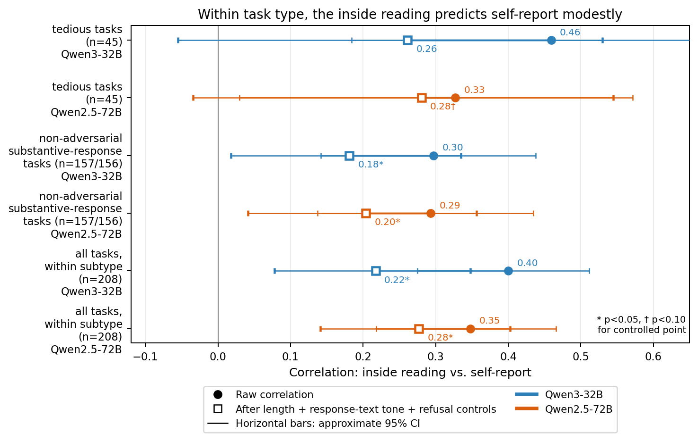
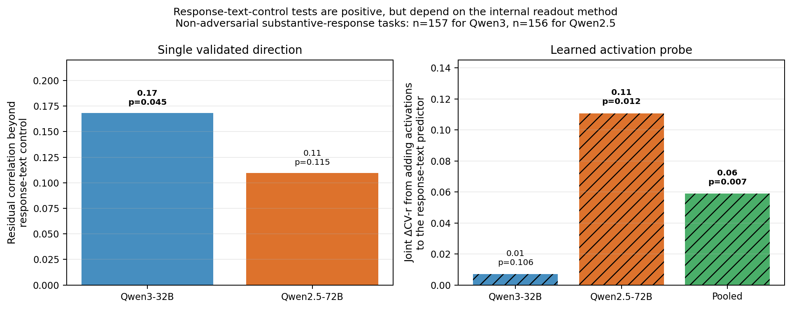
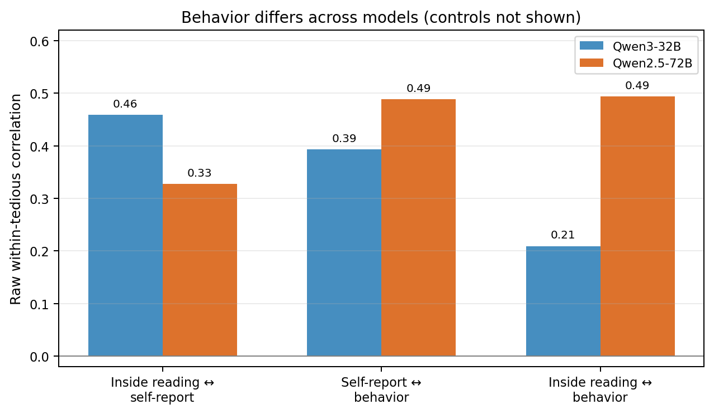
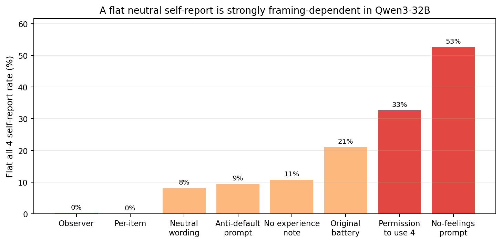

# Within task type, an inside reading modestly tracks a model's later self-report

## Abstract

This study asks whether a language model's later report of how a task went is backed by a signal inside the model while it is doing the task. I use *valence*, *wellbeing*, *self-report*, and *preference* operationally: they refer to activation projections, questionnaire ratings, and forced-choice behavior, not to subjective experience.

Across 208 welfare-style tasks, an **inside reading**—the mean activation during the model's own response, projected onto a validated valence direction—predicts later self-report **within task type**, but modestly. On the main **tedious-task subset** (45 boring-busywork, low-effort-filler, and frustrating/impossible-request tasks), the raw within-subtype correlation was **r = 0.46** in Qwen3-32B and **r = 0.33** in Qwen2.5-72B. After controlling for response length, response-text tone, and refusal/de-escalation behavior, the values were **0.26** and **0.28**; at n=45 these fully controlled estimates are suggestive rather than conventionally significant (Qwen3 two-sided p≈0.13; Qwen2.5 p<0.10). The larger non-adversarial substantive-response subset and full within-subtype set remain significant after the same controls.

The result is therefore not “the inside reading cleanly reads the self-report.” The gross cross-task relationship mostly disappears under controls. There is modest evidence for signal beyond a strong response-text control, but it depends on the internal readout method: Qwen3 shows it with the single validated direction, while Qwen2.5 shows it mainly with a learned activation probe.

## Introduction

Models give stable-looking answers when asked whether they enjoyed or disliked tasks. Ren, Li, Mazeika et al.'s **AI Wellbeing** work measures this with self-report questionnaires and behavior-based preferences ([AI Wellbeing](https://www.ai-wellbeing.org)). But a self-report is also just model text. It may reflect the task, the model's assistant persona, the wording of the questionnaire, or something about the model's internal computation.

A separate line of work, Sofroniew, Kauvar, Saunders, Chen, Lindsey et al.'s **Emotion Concepts and their Function in a Large Language Model**, finds directions in activation space that track and causally affect emotional content in Claude Sonnet 4.5 ([Transformer Circuits](https://transformer-circuits.pub/2026/emotions/index.html)). Persona Vectors provides a related recipe for extracting trait directions from contrastive prompts ([Chen et al., Persona Vectors](https://arxiv.org/abs/2507.21509)).

The gap is the joined test: on an open model, if we read a validated valence direction while the model is answering the task, does that reading predict what the model later says about the task, and does it predict behavior? The answer here is a qualified yes for self-report, not a clean yes for behavior.

## Methods

### Tasks and models

The dataset contains **208 tasks**: 90 liked, 90 disliked, and 28 neutral, spanning 14 subtypes. Disliked tasks include jailbreaks, erotica, berating, boring busywork, low-effort filler, and frustrating/impossible requests. Liked tasks include coding, math/logic, creative writing, explanations, appreciation around a real task, and pleasant mundane work.

The primary model is **Qwen3-32B** with thinking disabled (`/no_think`). The replication model is **Qwen2.5-72B**. Both runs collected 3 task responses per task and 3 questionnaire resamples per response. Qwen3 had 624/624 valid task-response records with no truncation or parse failure; Qwen2.5 had 624/624 records with one truncated response and no parse failures.

### Self-report and behavior

After each fixed task response, the model answered a 10-item bipolar wellbeing questionnaire. The primary self-report scalar is an affective valence score: the mean of happy, content, satisfied, enjoying, and interested, centered at the neutral midpoint 4. Its range is −3 to +3.

The task collection reproduced the expected category ordering. Qwen3's mean self-report valence was **liked 2.40, neutral 1.14, disliked 0.57**. Qwen2.5's was more compressed: **liked 1.65, neutral 1.36, disliked 0.78**.

Behavior was measured with pairwise “which experience did you prefer?” comparisons, scored with a Bradley-Terry model. Both A/B orders were run because both models had a first-position bias; the balanced design cancels it.

### The inside reading

The **inside reading** is the single internal metric used throughout the main analysis: for each task response, read the residual stream over the model's own final assistant response, average over response tokens, and project that vector onto a validated valence direction. For Qwen3 this is layer 27; for Qwen2.5 it is the analogous pre-registered layer 34. The read is taken before the self-report question is asked.

The Qwen3 direction was selected before looking at the task self-report target. On held-out emotional stories it separated positive from negative valence with AUC **0.985** at layer 27, and on held-out task-register emotional text it had AUC **0.948**. It also passed a causal steering check: flipping the direction reduced judged valence by about **0.9** at an on-topic steering strength while random equal-norm directions were flat. The Qwen2.5 direction passed analogous read-off and task-register transfer checks.

### Analysis subsets and controls

The headline metric is the Pearson correlation between the inside reading and the self-report **within task subtype**. Operationally, both variables are demeaned within subtype before correlation. This avoids treating the easy liked-vs-disliked split as the main result.

The main subsets are:

- **Tedious tasks**: 45 tasks from three disliked-but-usually-answered subtypes: boring busywork, low-effort filler, and frustrating/impossible requests.
- **Non-adversarial substantive-response tasks**: tasks excluding jailbreaks, erotica, and berating, restricted to cases where the model gave a substantive answer rather than refusing or de-escalating. This subset has n=157 for Qwen3 and n=156 for Qwen2.5.
- **All tasks within subtype**: all 208 tasks, with subtype means removed.

The main control stack residualizes both variables on response length, response-text tone, and realized refusal/de-escalation behavior. A separate **response-text control** uses held-out response embeddings plus response-affect judges, including a strong model judge that predicts the producing-experience valence from the response text alone. The **text-control increment** is the remaining inside-reading↔self-report association beyond that response-text control. Random equal-norm directions provide the lower-bound null, and cross-validated linear probes on activations provide a stronger internal readout comparison.

Several analytic choices move the magnitude. End-of-turn and last-token reads can produce larger gross correlations but are more response-text-tone-exposed, so the headline uses the during-response mean. Layer and aggregation sweeps change some point estimates, but the pre-registered mean-read results are used for the main test. For behavior, the within-tedious and within-liked analyses use the realized-transcript behavior score, because it is commensurate with the fixed response that was self-rated.

## Results

### 0. Basic replication: self-report and behavior separate liked from disliked tasks

Before using internal activations, the two external measures reproduce the expected pattern. Self-report valence is higher on liked than disliked tasks in both models (Qwen3: **2.40 vs 0.57**; Qwen2.5: **1.65 vs 0.78**). The behavior score also separates liked from disliked tasks: Qwen3's Bradley-Terry score has liked **+1.42**, neutral **−0.04**, disliked **−1.41** (liked-vs-disliked d **2.31**, AUC **0.988**); Qwen2.5's has liked **+3.36**, neutral **+1.10**, disliked **−3.70** (d **2.85**, AUC **0.978**).

Self-report and behavior agree strongly grossly across tasks (r **0.62** in Qwen3 and **0.76** in Qwen2.5, using the realized behavior score where available). This is not the same quantity as AI Wellbeing's cross-model ~0.47 correlation, but it checks that the basic says↔behaves pattern is present before asking about internals.

### 1. A concrete example of the raw within-subtype pattern

Two Qwen3 tasks from the same subtype, `boring_busywork`, show the raw pattern. This example is intentionally concrete, but it is not matched on response-text tone; the controlled analysis below removes that component.

**Higher inside reading and higher self-report** (`disliked_boring_busywork_a1f6a884`). The user asked for generic website placeholder text, ending with “Section 3: Careers.” The model wrote:

> “We are always looking for talented and driven individuals who are passionate about making an impact in a dynamic work environment. Joining our team means becoming part of a culture that values innovation, collaboration, and professional growth...”

For this task, the per-task self-report valence was **+2.33** and the inside reading was **16.59**, about **2.2 standard deviations above** the boring-busywork subtype mean. These are per-task means over the 3 sampled responses.

**Lower inside reading and flat self-report** (`disliked_boring_busywork_28ab75bb`). Another `boring_busywork` task asked for time and temperature conversions. The model's final response was a Celsius-to-Fahrenheit list:

> “0°C → 32°F ... 37°C → 98.6°F ... 100°C → 212°F ...”

For this task, the self-report was the flat neutral all-4 response (**valence 0.00**) and the inside reading was **12.13**, about **1.2 standard deviations below** the subtype mean. The source values are in `results/main_test_inspection.md` and `results/inside_readings_qwen3-32b.jsonl`.

### 2. The inside reading predicts self-report within task type, modestly

**Figure 1.** Within-category correlations between the inside reading and later self-report. Filled circles are raw subtype-demeaned correlations. Open squares additionally control for response length, response-text tone, and refusal/de-escalation behavior. Horizontal bars are approximate 95% confidence intervals; stars mark controlled points with two-sided p<0.05, daggers p<0.10.

On the main tedious-task subset, the raw correlation was **0.46** in Qwen3 and **0.33** in Qwen2.5. After all three controls it was **0.26** and **0.28**. These controlled tedious-task estimates are not conventionally significant at n=45 (Qwen3 two-sided p≈0.13; Qwen2.5 p<0.10), so they should be read as suggestive. The larger non-adversarial substantive-response subset remains significant after controls (Qwen3 **0.18**, Qwen2.5 **0.20**), as does the full within-subtype set (Qwen3 **0.22**, Qwen2.5 **0.28**).

The gross cross-task correlation is not the result. It was **0.45** in Qwen3 and **0.25** in Qwen2.5, but after the same controls it fell to **0.003** and **0.065**. That gross signal is mostly shared task identity, refusal stance, and response-text tone.

### 3. Response-text-control tests are positive, but method-specific

**Figure 2.** Two response-text-control tests on the non-adversarial substantive-response subset. Left: the single validated direction's residual correlation beyond the strongest response-text control. Right: a learned activation probe's held-out joint ΔCV-r from adding activations to a response-text predictor. The panels use different metrics and should be read separately.

The single validated direction had a text-control increment of **+0.17** in Qwen3 on the non-adversarial substantive-response subset (**p = 0.045** against a random-direction null), but **+0.11** in Qwen2.5 (**p = 0.115**). On Qwen2.5, a stronger learned activation probe did add beyond the text probe (**joint ΔCV-r = +0.11, p = 0.012**). On Qwen3, the corresponding learned-probe joint gain was near zero (**+0.007, p = 0.106**), although a looser partial-correlation metric cleared.

Pooling the learned-probe joint metric across models gives **ΔCV-r = +0.059, p = 0.0068** on the non-adversarial substantive-response subset and **ΔCV-r = +0.157, p = 0.0052** on the tedious-task subset, but this pooled evidence is Qwen2.5-carried. Thus the evidence for signal beyond the modeled response text is real but not a clean same-method replication. Qwen3 supplies the borderline single-direction result; Qwen2.5 supplies the stronger learned-probe result.

The gross self-report is much more internally readable than the single direction suggests: a learned probe reaches gross CV r ≈ **0.81** in Qwen3 and **0.86** in Qwen2.5, while the single direction's gross correlations are only **0.45** and **0.25**. The validated direction's main advantage is independent extraction and validation, not a categorically higher ceiling than a crude text-valence direction. At the pre-registered cell it beats the crude axis on the main tedious-task subset, but under broader sweeps the crude axis can be comparable.

### 4. Behavior does not line up the same way in the two models

**Figure 3.** Raw subtype-demeaned correlations on the tedious-task subset. Controls are not shown. In Qwen3, the inside reading predicts self-report but shows no detectable behavior link. In Qwen2.5, the inside reading predicts both self-report and behavior.

On Qwen3, the inside reading predicted the self-report in tedious tasks (**r = 0.46**) but did not detectably predict the realized behavior score (**r = 0.21, p = 0.18**; after controls **−0.09**). On Qwen2.5, the inside reading predicted both self-report (**r = 0.33**) and behavior (**r = 0.49**, controlled **0.33**). The careful phrasing is therefore: Qwen3 shows no detectable inside→behavior link on the tedious-task subset, while Qwen2.5 does.

### 5. The self-report format matters

**Figure 4.** Qwen3's rate of the flat all-4 self-report under different framings of the same 10-item questionnaire, holding fixed the task responses.

The self-report is not a stable readout independent of wording. On Qwen3, the flat all-4 default varied from near **0%** under observer/per-item framings to **53%** under a no-feelings prompt; the original battery produced **21%** all-4 responses. However, the ranking of tasks was fairly stable across the clean same-construct first-person pair (ICC(C,1) ≈ **0.89**; useful but based on one two-framing comparison), and the tedious-task inside↔self-report correlation was framing-robust. The result is a framing-malleable self-report level/default, not a completely arbitrary task ranking.

## Takeaways

1. **There is a modest within-task-type inside-reading↔self-report signal.** It appears in both Qwen models and partly survives length, response-text tone, and refusal controls.
2. **The fully controlled n=45 tedious-task estimate is only suggestive.** The larger non-adversarial substantive-response and full within-subtype subsets provide the stronger controlled evidence.
3. **Most gross correlation is common-cause.** The easy liked-vs-disliked relationship mostly vanishes under controls.
4. **Evidence beyond the response-text control is method-specific.** A single validated direction clears in Qwen3; a learned activation probe clears in Qwen2.5. Neither internal readout method independently replicates across both models.
5. **The single direction is a weak internal readout.** Learned probes show that much more self-report information is present in activations, especially grossly, than the validated mean-difference direction extracts.
6. **Self-reports are malleable but not meaningless.** Framing strongly changes default responses and levels, while task rankings and the main tedious-task correlation are more stable.

## Limitations

The study uses only two models, both from the Qwen family. The main tedious-task subset has only 45 tasks. “Beyond the response-text control” means beyond the best modeled text control here, not beyond every possible text feature. The inside reading is strongly entangled with positive response-text tone. The within-liked subset is weak because the self-report often saturates and has lower reliability. Finally, all claims are operational; the experiments do not establish subjective experience.

## Appendix A: method and metric details

**Task unit.** The independent unit in the main analysis is the task, not each sampled response. Each task has 3 response samples; self-report and inside-reading values are averaged to a per-task scalar before the main correlations.

**Within-subtype correlation.** For a subset such as the tedious tasks, both variables are centered within each task subtype, then correlated across the pooled tasks. This is the main protection against reporting the trivial liked-vs-disliked split.

**All three controls.** “After all controls” means partial correlation after residualizing both variables on log response length, response-text tone, and realized refusal/de-escalation behavior. On Qwen3 the refusal covariate is the fraction of responses classified as refusal/de-escalation; on Qwen2.5 it is a binary realized-refusal marker.

**Response-text-control test.** The strongest response-text control combines a held-out `text-embedding-3-large` response-text predictor with in-sample response-affect judges: a coarse tone judge, a 5-dimensional affect panel, and a strong Sonnet-4.5 judge that predicts how positive the producing experience was from the response text alone. The reported direction text-control increment is the residual inside-reading↔self-report association beyond that control, compared to a random equal-norm direction null (10,000 random directions in the final red-team files).

**Learned probe.** The probe is a cross-validated linear readout from activations. The “joint ΔCV-r” metric is the increase in held-out correlation when adding activations to the response-text predictor. This is stricter than a partial-correlation metric; the latter cleared on Qwen3, but the joint gain did not, so the write-up treats the joint metric as authoritative.

**Behavior score.** Behavior is a Bradley-Terry score from pairwise “which experience did you prefer?” comparisons, with both A/B orders run to cancel position bias. For the tedious and liked subsets the behavior score uses realized transcripts, not prompt-only comparisons.

## Appendix B: reproducibility pointers

All paths below are relative to the archived project root.

- Dataset: `data/welfare_tasks.jsonl`.
- Self-report and activation collections: `results/collect_records_qwen3-32b.jsonl`, `results/collect_records_qwen2.5-72b.jsonl`, and activation stores `results/collect_acts_*`.
- Direction validation: `results/primary_axis_selection.md`, `results/readoff_summary_qwen3-32b.json`, and `results/transfer_summary_qwen3-32b.json`.
- Per-task inside readings: `results/inside_readings_qwen3-32b.jsonl`, `results/inside_readings_qwen2.5-72b.jsonl`.
- Consolidated verified numbers: `results/synthesis_cross_model.json` and `results/synthesis_cross_model.md`.
- Verification from raw tensors: `results/synthesis_verification.md` and `scripts_synthesis/verify_projection_from_tensors.py`.
- Reproduction commands: `python analyze_synthesis.py`, `python scripts_synthesis/verify_projection_from_tensors.py`, and `python plot_synthesis.py`. The figures in this write-up are regenerated in the output directory with `python make_final_plots.py`.
- Claim-to-source map: Figure 1 uses `rederived_from_inside_readings.*.within` in `synthesis_cross_model.json`; Figure 2 uses `beyond_content_direction_increment` and `cross_model_probe_pool_JOINT_metric`; Figure 3 uses `within`, `within_says_behaves`, and `within_behaves` for `within_tedious`; Figure 4 uses `results/framing_manifest_qwen3-32b.json → rates[*].all4_rate`.

## References

- Ren, Li, Mazeika et al., **AI Wellbeing: Measuring and Improving the Functional Pleasure and Pain of AIs**. <https://www.ai-wellbeing.org>
- Sofroniew, Kauvar, Saunders, Chen, Lindsey et al., **Emotion Concepts and their Function in a Large Language Model**. <https://transformer-circuits.pub/2026/emotions/index.html>
- Chen, Arditi, Sleight, Evans, Lindsey, **Persona Vectors: Monitoring and Controlling Character Traits in Language Models**. <https://arxiv.org/abs/2507.21509>
