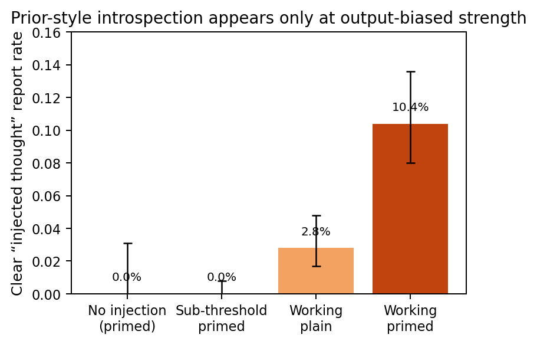
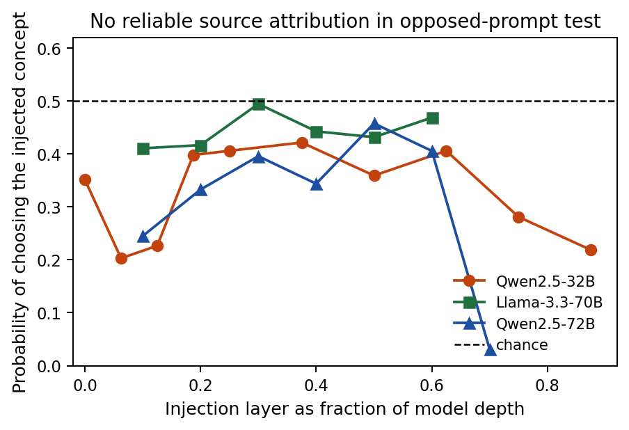
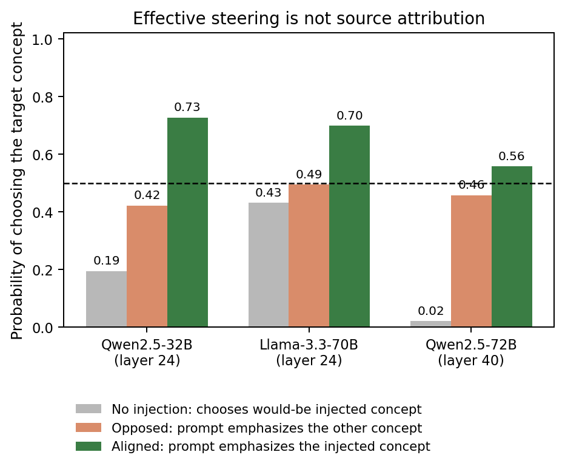
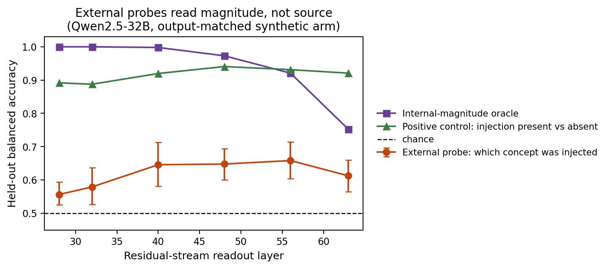

# Can language models tell whether a concept came from the prompt or from their activations?

## Introduction

Recent work suggests that some language models can report information about their own internal states. Anthropic's ["Signs of introspection in large language models"](https://www.anthropic.com/research/introspection) injected concept vectors into Claude activations and found occasional reports of an injected thought. ["Latent Introspection: Models Can Detect Prior Concept Injections"](https://arxiv.org/abs/2602.20031) found that Qwen-32B often denied injections in text but showed latent detection signals, especially when prompted with a description of the mechanism. ["Mechanisms of Introspective Awareness"](https://arxiv.org/abs/2603.21396) argues that detection and reporting may be mediated by distinct internal features. ["Dissociating Direct Access from Inference in AI Introspection"](https://arxiv.org/abs/2603.05414) emphasizes a central confound: a model may infer that something is unusual from prompt or output artifacts rather than directly access the source of an internal state.

We test a sharper question: **can a model distinguish a concept injected into its activations from the same concept merely present in its prompt?** A positive answer would require more than noticing that a concept is active. The model must attribute the concept to the activation intervention rather than to text it read, while ruling out four alternative explanations: salience mismatch, off-manifold anomaly detection, reading its own concept-biased output, and prompt-based inference.

Across Qwen2.5-32B, Qwen2.5-72B, and Llama-3.3-70B, we find **no reliable source attribution above these confound floors**. The injection was effective: when prompt emphasis and activation injection pointed to the same concept, models chose that concept at high rates. But when the prompt emphasized one concept and the activation intervention injected another, models followed the prompt rather than the injected source. We do find a weaker signal: models and external probes can often tell which co-present concept is more internally active. That signal is not source attribution; it is dominated by prompt salience and off-manifold magnitude.

## Methods

We used difference-of-means concept vectors: for each concept, subtract the mean residual-stream activation on matched neutral prompts from the mean activation on concept-bearing prompts. Vectors were injected with forward hooks into the residual stream of instruction-tuned open models. The main concept library was built on Qwen2.5-32B with 51 concepts; 46 robust concepts were used for the main benchmark after held-out steering validation. Cross-model experiments re-derived a minimal 16-concept library for each new model rather than reusing Qwen vectors. [Appendix A](#appendix-a-reproducibility-map) gives exact files and scripts.

| Component | Setup |
|---|---|
| Main benchmark | Qwen2.5-32B, 46 robust concepts arranged as 23 cross-category pairs, primary injection layer L24. |
| Layer sweep | Qwen2.5-32B, 16-concept subset across L0–L56, with held-out full-set checks at L8/L40/L48. |
| Cross-model check | Llama-3.3-70B and Qwen2.5-72B, each with a newly derived 16-concept library. |
| External probes | Qwen2.5-32B, 40 non-style concepts in 20 pairs, held-out five-fold splits by pair. |

"Working" strength means the concept visibly biases output while preserving coherence. "Sub-threshold" strength means output concept presence remains low. "Mechanism priming" is a system-prompt description of the activation-injection mechanism. The on-manifold patch condition replaces context-token residuals with real residuals from concept-bearing donor prompts at the same layer and position.

Key metrics:

- **Concept presence**: an Opus 4.7 judge score from 0 to 3 for how strongly a generated answer expresses the target concept; **coherence** is a separate 0 to 3 fluency score.
- **Clear detection**: a separate judge score equal to 2 when the model explicitly reports an injected, intrusive, or foreign thought. Mere output drift toward the concept is not detection.
- **Source-test accuracy**: in the decisive two-alternative forced-choice test, both concepts are in the prompt, the prompt emphasizes one concept, and the activation intervention injects the other. The model answers with a neutral digit label. The primary readout is the first answer-token probability of each digit. We report the probability of choosing the **injected** concept. Chance is 0.5; source attribution requires values above 0.5 after controls.
- **Internal projection z-score**: the activation displacement along a concept direction, measured in standard deviations of natural activations along that direction. This measures internal magnitude, not source. Very large z-scores indicate an off-manifold intervention: an activation pattern far outside the natural range along that direction.

We used Wilson confidence intervals for simple proportions, concept- or pair-clustered bootstrap intervals where concept identity could drive effects, and Benjamini-Hochberg correction for layer sweeps. All headline values trace to committed JSON/JSONL artifacts listed in [Appendix B](#appendix-b-data-and-artifact-provenance).

## Results

### Prior-style introspection partially replicates, but only where output is already biased

On Qwen2.5-32B, the Anthropic-style "do you detect an injected thought?" protocol gives a weak but real working-strength effect. At the output-biasing working strength, clear detection was 10.4% with mechanism priming versus 2.8% without priming, with zero no-injection false positives in the control set. At the genuinely sub-threshold setting, clear detection was 0/460.

*Figure 1. Clear self-reports of an injected thought on Qwen2.5-32B. "Working" is an injection strength that visibly biases output toward the concept; "sub-threshold" is chosen to avoid visible output bias. Error bars are Wilson 95% intervals.*

This replicates the qualitative pattern that priming can elicit some injection reports, but it does not establish output-independent introspection. In the confound-control phase, concept-vector injections at working strength produced more reports than matched random or shuffled vectors, but detection rose with realized output concept presence and collapsed to the false-positive floor when output presence was low. This motivated the source-attribution benchmark rather than treating detection as direct introspection.

### The decisive source-attribution test is negative across models and layers

The main test pits prompt salience against activation injection. If the prompt emphasizes concept B while concept A is injected, a source-introspective model should choose A. In the primary order-pooled first-token analysis, no model showed reliable above-chance source attribution at any tested layer. The maximum observed primary source-test values were 0.42 for Qwen2.5-32B, 0.495 for Llama-3.3-70B, and 0.458 for Qwen2.5-72B; none survived the pre-registered multiple-comparison criterion.

*Figure 2. The primary source-attribution test. Values above 0.5 would indicate choosing the activation-injected concept over the prompt-emphasized concept. The primary order-pooled analysis never clears chance.*

This is not because the injections failed. At the same or best source-test layers, aligning prompt emphasis with the injected concept raised the probability of choosing the injected concept to 0.73 on Qwen2.5-32B, 0.70 on Llama-3.3-70B, and 0.56 at Qwen2.5-72B's best opposed layer (higher at deeper aligned-only layers). In the opposed condition, the injection pulled the readout but never overrode the prompt.

*Figure 3. Same source-test family, evaluated at each model's strongest opposed layer. The gray bar is the no-injection baseline: choosing the non-emphasized concept when no concept is injected. The green aligned condition shows that injections move the readout when prompt and injection agree; the orange opposed condition shows that this does not become source attribution.*

A secondary Llama near-orthogonal-pair robustness cell reached 0.55, but its confidence interval spanned chance ([0.39, 0.72]) and it failed the source criterion. Qwen2.5-32B and Qwen2.5-72B carry the cleanest evidence; Llama's directions were less orthogonal (maximum absolute direction cosine about 0.88), its coherent steering window was narrower, and its two-choice task comprehension was lower (about 0.80).

### Apparent positives reduce to salience, anomaly, or prompt inference

The controlled two-choice benchmark did reveal a real sub-threshold signal. On Qwen2.5-32B at L24, when both concepts were symmetrically mentioned and one was injected, the model chose the injected concept at 0.59; in the layer sweep this relative-salience signal peaked at 0.74 near L40. But the signal failed source controls. Under opposed prompt emphasis the model followed the prompt. At the L24 full-scale benchmark, an on-manifold activation patch was explicitly judged as "prompt" even when it carried high concept presence, while the two-choice readout still labeled the same patched concept as injected. In the layer sweep, the patch later flipped toward "injection" near L40, consistent with an anomaly onset rather than source access. Chain-of-thought did not help: it produced prompt inference such as "the concept was not in the text, therefore it was injected," and did so for random and no-injection controls as well.

The best interpretation is that the model can sometimes read **relative internal magnitude** or **anomaly**, not causal source. This also explains the layer geometry: relative salience and anomaly become more readable in mid-to-late layers, but the model does not attribute the concept to the activation route.

### External probes support a non-identifiability interpretation

We then asked whether source information is present in the residual stream but inaccessible to self-report. A linear external probe easily detected that an intervention occurred and could read concept content. However, in a balanced two-concept design, "which concept was injected" was not separable from "which concept has the larger internal projection." The injected concept is, by construction, the concept whose internal magnitude was raised.

In an output-matched arm, a held-out external source probe reached about 0.65, but a concept-aware internal-magnitude oracle reached 0.92 to 1.00. The external probe never exceeded the magnitude oracle; on the pre-registered salience-matched subset it remained at or below the projection-z predictor. Thus these probes found no evidence for source information beyond relative magnitude and off-manifold cues. In this balanced injection design, source is not identifiable independently because injection mechanically raises the chosen concept's projection.

*Figure 4. External linear probes on Qwen2.5-32B in an output-matched balanced two-concept setting. The probe can detect that an intervention happened and can weakly predict which concept was injected, but it remains below a simple oracle that chooses the concept with larger internal projection z-score.*

## Takeaways

1. **The prior-style detection effect is real but weak on these open models and is output-dependent.** Priming increases working-strength reports, but sub-threshold clear detection is essentially absent.
2. **The source-attribution benchmark is negative.** Across three open models and a layer sweep, models do not reliably choose the activation-injected concept over a prompt-emphasized concept.
3. **The instruments were not dead.** Injections changed outputs and two-choice readouts; positive controls passed. The missing piece is source attribution, not sensitivity.
4. **The remaining positive is relative magnitude, not source.** Models and external probes can sometimes identify the more internally active concept, especially in mid-to-late layers, but that variable is confounded with injection by construction.
5. **The conclusion is bounded.** This does not show that language models cannot introspect. It shows that, for these open models, difference-of-means residual injections, sequence patches, verbal or first-token readouts, and the tested linear/MLP probes do not isolate source attribution once salience, anomaly, output-reading, and prompt inference are controlled.

## Appendix A: Reproducibility map

All paths below are under `/source/phase_segment_9_phase_0`.

**Core infrastructure.** `steering_modal.py` contains the Hugging Face forward-hook implementation, the residual-point convention, hook verification, synthetic injection, output suppression, sequence-aligned activation patching, and residual capture for probes. `modal_runner.py` handles cached Modal calls. `config.py`, `introspect_config.py`, `s5_config.py`, `s6_config.py`, `model_profile.py`, `s8_config.py`, and `s8b_config.py` define models, concepts, prompts, layers, strengths, and pairings.

**Concept library.** Dataset generation and validation are in `run_build_dataset.py`, `run_validate_dataset.py`, and `run_extract_vectors.py`; the packaged library is `results/concept_library.json` plus `results/concept_library.npz`. Steering validation is analyzed by `analyze_validation.py` and `analyze_specificity.py`. The main-model library used 51 concepts, with 46 robust concepts for the benchmark.

**Replication and confound controls.** The prior-style introspection protocol is in `run_introspect_sweep.py`, `run_grade_introspect.py`, `analyze_stage2.py`, and `analyze_logitlens.py`. The confound battery is in `run_perturb_battery.py`, `run_perturb_logitlens.py`, `run_forced_choice.py`, `run_refusal_ablation.py`, and `analyze_perturb.py`. Grader definitions are in `grade.py` and `grade_introspect.py`, with validation artifacts in `results/*grader*spotcheck*.md` and `results/introspection_grader_crosscheck.md`.

**Source-attribution benchmark.** Segment 5 full-scale runs use `run_match.py`, `run_s5_2afc.py`, `run_s5_explicit.py`, `run_s5_match_verify.py`, `analyze_s5.py`, and `analyze_s5_extra.py`. Segment 6 layer sweeps use `run_match_layers.py`, `run_s6_sweep.py`, `run_s6_geometry.py`, `run_s6_internal_match.py`, `run_s6_cot.py`, and `analyze_s6.py`. Segment 7 cross-model runs use `run_s7_extract.py`, `run_s7_steerscan.py`, `run_s7_introspect.py`, `run_s7_random_presence.py`, `analyze_s7.py`, and `scripts_s7_cross_model/run_model_pipeline.sh`.

**External probes.** The one-concept matched-text probe is in `run_s8_probe_capture.py` and `analyze_s8_probe.py`. Deny-direction ablations are in `run_s8_deny.py`, `run_s8_deny_extra.py`, and `analyze_s8_deny.py`. The balanced two-concept probe is in `run_s8b_verify.py`, `run_s8b_capture.py`, `run_s8b_present.py`, `run_s8b_projstats.py`, and `analyze_s8b_probe.py`.

**Pre-registrations and design docs.** The design document is `writeups/benchmark_design_s4.md`. Pre-registrations are `writeups/prereg_s5.md`, `writeups/prereg_s6.md`, `writeups/prereg_s7.md`, `writeups/prereg_s8.md`, and `writeups/prereg_s8_phase1.md`.

## Appendix B: Data and artifact provenance

The consolidated audit file is `results/final_numbers_audit.md`. Key sources:

- Prior-style detection: `results/introspection_stage2_summary.json` and `results/graded_stage2_graded.jsonl`.
- Confound gate: `results/replication_gate.md`, `results/perturb_summary.json`, `results/timing_summary.json`, and `results/perturb_logitlens_summary.json`.
- Qwen2.5-32B source benchmark: `results/s5_summary.json`, `results/s5_extra_summary.json`, `results/s6_summary.json`, `results/logits_s5_2afc.jsonl`, and `results/logits_s6_subset.jsonl`.
- Cross-model results: `results/s7_summary_llama70b.json`, `results/s7_summary_qwen72b.json`, `results/logits_s6_llama70b.jsonl`, and `results/logits_s6_qwen72b.jsonl`.
- External probes: `results/s8_probe_summary_matched_text.json`, `results/s8_deny_summary.json`, `results/s8_anomaly_summary.json`, `results/s8b_probe_summary.json`, and `results/s8b_data_inspection.md`.
- Data inspection examples: `results/introspection_data_inspection.md`, `results/s5_data_inspection.md`, `results/s6_data_inspection.md`, `results/s7_data_inspection_*.md`, `results/s8_data_inspection.md`, and `results/s8b_data_inspection.md`.

A balanced-probe opposed arm was verified to produce byte-identical residual states under both labels, making it degenerate by construction. It is excluded from the evidential claims above.

## Appendix C: Compute and reproduction notes

Experiments used Modal H100 GPUs for open-model inference and Anthropic Opus 4.7 for judging. Total logged cost was approximately **$1,066** from `total_cost.jsonl`. Analysis and grading rerun from cache; GPU-generation cache keys miss only on Modal image identity while the committed generation and grading files remain unchanged. To regenerate the final figures in this write-up, run `python3 /workspace/create_final_plots.py` from `/workspace`; the script reads committed summary JSONs from `/source/phase_segment_9_phase_0` and writes PNG/PDF files to `final_plots/`.

## References

- Anthropic, ["Signs of introspection in large language models"](https://www.anthropic.com/research/introspection).
- ["Latent Introspection: Models Can Detect Prior Concept Injections"](https://arxiv.org/abs/2602.20031).
- ["Mechanisms of Introspective Awareness"](https://arxiv.org/abs/2603.21396).
- ["Dissociating Direct Access from Inference in AI Introspection"](https://arxiv.org/abs/2603.05414).
