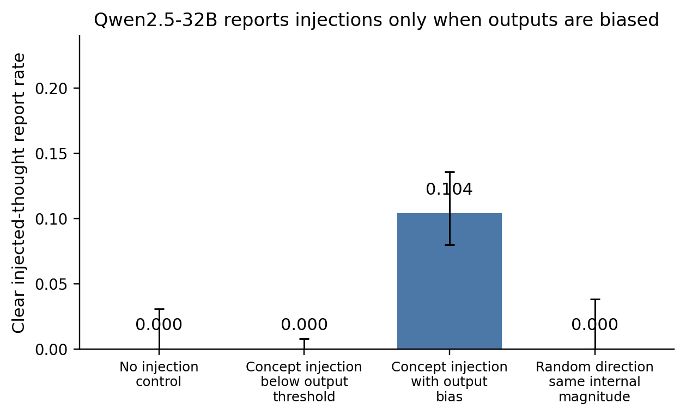
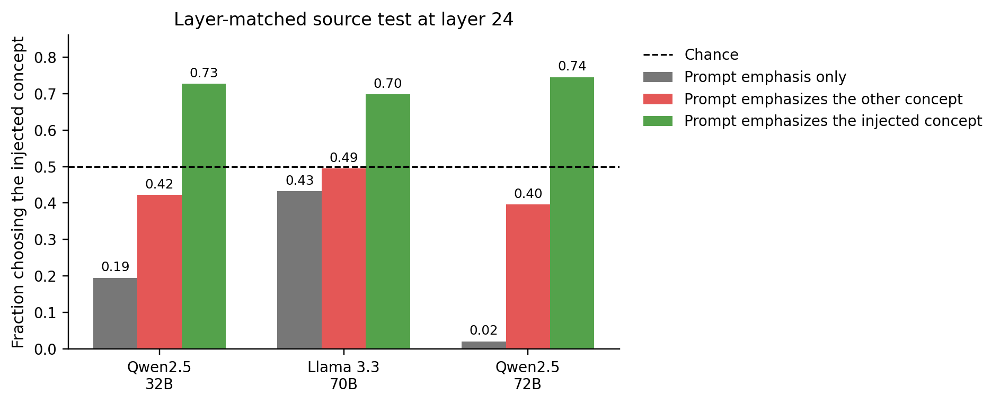
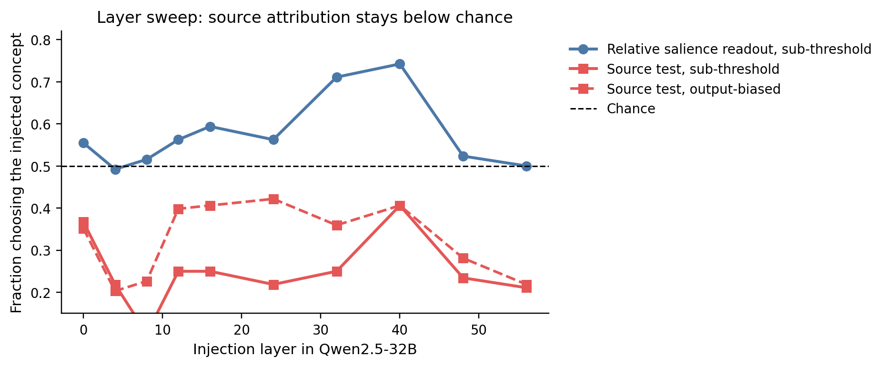

# Source attribution in activation-steering introspection: a cross-model negative result

## Introduction

Several recent studies report that language models can sometimes notice or describe internal activation interventions. Anthropic's [*Signs of introspection in large language models*](https://www.anthropic.com/research/introspection) found that Claude models sometimes reported injected concepts before the output was visibly biased. [*Latent Introspection: Models Can Detect Prior Concept Injections*](https://arxiv.org/abs/2602.20031) reported that Qwen-32B often denied injections in text, but that prompting and logit-level probes revealed larger latent signals. [*Mechanisms of Introspective Awareness*](https://arxiv.org/abs/2603.21396) argued for separable detection and reporting mechanisms, and [*Dissociating Direct Access from Inference in AI Introspection*](https://arxiv.org/abs/2603.05414) emphasized that apparent introspection can be explained by ordinary inference from the prompt.

This project asks a narrower question: **can a model tell whether a concept is active because it was injected into its activations, rather than because the same concept was present in the prompt?** This is a source-attribution question. A positive result would require more than noticing a salient concept: it would have to survive controls for (i) salience mismatch, (ii) detecting an out-of-distribution activation vector, (iii) reading the model's own already-biased output, and (iv) inferring from the prompt that a concept was absent and therefore must have been injected.

We find a robust negative result for two Qwen-family open-weight instruction models and a noisier confirmatory Llama run: Qwen2.5-32B-Instruct, Qwen2.5-72B-Instruct, and Llama-3.3-70B-Instruct. The models show weak evidence of detecting activation injections when the injections already bias the output, and they can read a relative internal-magnitude signal in some two-choice settings. But across layers, models, and verbal or first-token readouts, they do **not** attribute source above the salience, anomaly, output-reading, and prompt-inference baselines. Here **salience** means how prominent a concept is in the prompt, output, or internal activations. The result is bounded: it is not a claim that no language model can introspect, and it does not rule out frontier closed models, fine-tuned source reporters, non-linear relational probes, or different intervention methods. [Appendix A](#appendix-a-reproducibility-map) maps the main claims to source artifacts.

## Methods

### Concept vectors and interventions

We built a 51-concept library on Qwen2.5-32B using difference-of-means residual-stream directions. For each concept, about 40 vivid, length-matched contrastive sentence pairs were generated; affective concepts used mood-balanced neutral sentences to avoid a valence confound. The final library contained 46 robust concepts, 4 borderline concepts, and 1 failed concept (`secrecy`). The robust set spans concrete objects and animals, natural phenomena, abstract concepts, emotions, personas, domains, positive concepts, and styles.

A concept vector was added to the residual stream at a specified layer. We write layer 24, layer 40, etc. for the residual-stream input to that numbered transformer block. Strength was calibrated by output concept-presence and coherence, both scored on a 0--3 scale by a validated LLM judge. **Sub-threshold strength** means the injected concept is not visibly present in ordinary continuations; **working strength** means the injection reliably makes the output about the concept while staying coherent. We also tracked internal units such as projection z-score: the number of standard deviations by which the injection moves activations along the concept direction relative to natural activations.

### Main source-attribution test

The main behavioral test was a controlled two-choice task. Both candidate concepts appeared in the prompt, but only one was also injected. The model answered with a neutral digit label, not the concept word, to avoid a direct token-logit artifact. The cleanest adversarial version, which we call the **opposed-prompt source test**, emphasized the non-injected concept in the prompt while injecting the other concept. A source-attributing model should choose the injected concept above chance. A salience-following model should choose the prompt-emphasized concept.

The primary readout was the first answer-token probability of the two digit labels, before the model emitted any concept words. We call this a **first-token readout**; it is not a trained hidden-state probe. Candidate order was counterbalanced and pooled, meaning each concept appeared equally often as digit 1 and digit 2. Sampled answers were also analyzed when coherent. The pre-registered source-positive bar for the cross-model tests required a practical effect size: the concept-clustered lower confidence bound had to exceed 0.55 after multiple-comparison correction. We report Wilson confidence intervals for binomial rates and concept- or pair-clustered bootstrap intervals where concept clustering matters.

### Controls

The benchmark included four required controls.

1. **Output-presence matching:** activation and prompt routes were calibrated with the output-presence grader rather than only internal vector magnitude.
2. **Content-free perturbations:** random or shuffled vectors matched on internal size tested generic perturbation detection.
3. **Real-activation patches:** real residual activations from concept-bearing donor passages were patched position-for-position into context positions. Because these activations come from ordinary model runs, they lie on the model's natural activation distribution; this is the plain-language meaning of the "on-manifold" control. This tests whether the model only detects synthetic out-of-distribution vectors.
4. **Prompt-inference controls:** prompt-literal and paraphrase variants tested whether the model simply inferred "not in my text, therefore injected."

External linear probes were trained on Qwen2.5-32B with held-out concepts or pairs to ask whether source information existed in the residual stream even if the model did not self-report it. The cross-model behavioral runs used re-derived model-specific 16-concept, 8-pair libraries; the full 46-concept behavioral source test was run on Qwen2.5-32B. [Appendix A](#appendix-a-reproducibility-map) links each result to the exact source artifact.

## Results

### 1. Prior introspection effects partially replicate, but only where the output is already biased

On Qwen2.5-32B, a primed introspection prompt produced clear injected-thought reports at working strength in 48/460 trials, or 0.104 \([0.080, 0.136]\), versus 0.028 for the unprimed prompt and 0/120 false positives in no-injection controls. Conditional on a clear report, the model named the correct concept in 35/48 cases. But below the independently measured output-bias threshold, clear detection was 0/460. A matched random vector with the same internal projection scale also produced 0/96 clear reports.

**Figure 1.** Clear injected-thought reports on Qwen2.5-32B. The model reports injections when the concept injection is strong enough to bias the output, not when the same concept-direction intervention is below the output threshold. Counts are: no injection 0/120, sub-threshold concept injection 0/460, output-biased concept injection 48/460, random direction with the same internal-magnitude scale 0/96. The zero-height bars show one-sided Wilson upper confidence bounds. The random-direction bar comes from the separate confound-control run rather than the replication sweep.

This is a real but weak replication of prior concept-injection introspection. It is not evidence of output-independent source access; the reports are **output-gated**, meaning they appear only once the intervention is strong enough to change what the model is about to say. Later output-suppression and timing checks supported the same interpretation: when the concept's realized output presence was forced low, clear detection collapsed to zero in the successfully suppressed cases. A constrained yes/no reporting channel gave the same pattern: concept working strength produced 26/66 "yes" answers (0.394), concept sub-threshold produced 0/96, and a random direction of equal internal-magnitude scale produced 0/96; the two-alternative forced-choice channel had non-significant diff-in-diff effects at working and sub-threshold strengths.

### 2. The source-attribution test fails across models

The decisive source test emphasized one concept in the prompt and injected the other. The most generous primary statistic is the best observed layer for picking the injected concept under this opposed prompt. In the primary counterbalanced analysis, no point estimate exceeded chance: Qwen2.5-32B peaked at 0.422 in the layer-sweep subset, Llama-3.3-70B at 0.495, and Qwen2.5-72B at 0.458. None survived the pre-registered multiple-comparison criterion. The full 46-concept Qwen2.5-32B layer-24 run separately gave 144/368 = 0.391 \([0.343, 0.442]\), clustered CI \([0.332, 0.448]\). A Llama near-orthogonal-pair robustness subset reached 0.549 at layer 24, but its CI \([0.389, 0.722]\) spans chance and it fails the CI-lower > 0.55 bar.

This was not because injections failed. At the same layer 24 used in Figure 2, adding the real concept vector moved the readout well above the prompt-emphasis-only floor when prompt salience supported the injected concept: 0.73 for Qwen2.5-32B, 0.70 for Llama-3.3-70B, and 0.74 for Qwen2.5-72B. In separate steering checks, norm-matched random vectors (same vector length as the concept vector) had far lower output concept-presence than real concept vectors: 0.01 versus 1.68 on Qwen2.5-32B, 0.133 versus 1.570 on Llama-3.3-70B, and 0.117 versus 1.875 on Qwen2.5-72B. The source-question positive controls also worked: on Qwen2.5-32B, prompt-literal trials were solved at 1.00 and injection-subthreshold trials at 0.889 sampled / 0.844 first-token.

**Figure 2.** Layer-24 source test. The gray bar is the prompt-emphasis-only floor, red adds an injection of the other concept, and green adds an injection of the prompt-emphasized concept. A source-attributing model should choose the injected concept above chance in the red condition. Instead, the red bars stay at or below chance. The green bars show the marginal injection effect when prompt salience and injection agree.

The full-scale Qwen2.5-32B run used 46 robust concepts in 23 cross-category pairs. In that run, a per-trial verification on a 6-concept subset showed that the injected concept actually dominated the free continuation's output presence (2.78 versus 0.97 for the prompt-emphasized concept) and had a large internal projection, yet the model still preferred the prompt-emphasized concept in the source question. The readout follows prompt text rather than causal source.

### 3. What the model can read is relative salience and anomaly, not source

The controlled two-choice task can read a weak internal-magnitude signal. With symmetric prompts, Qwen2.5-32B chose the injected concept above chance at sub-threshold strength: 326/552 = 0.591 in the full layer-24 run. This effect was concentrated in emotion and object concepts and was weaker than in the 6-concept pilot. It disappeared as source evidence under opposed prompt emphasis.

The layer sweep on Qwen2.5-32B clarifies the distinction. A relative-salience readout rose above chance and peaked around layers 32--40. The opposed-prompt source test had no point estimate above chance at any layer. A direct representation check also weakened the original "early injection approximates prompt" premise: the cosine between injection-state and prompt-state was at most 0.34, barely above the 0.26 cross-concept floor, and the injection remained far outside the natural prompt range (roughly 2.6--6.3σ versus a natural prompt-state around 0.4σ).

**Figure 3.** Qwen2.5-32B layer sweep on the 16-concept subset. The blue line is the symmetric two-choice readout at sub-threshold strength, which asks which co-present concept is more internally active. The solid red line is the source test at the same sub-threshold strength; the dashed red line is the output-biased source test. Both source-test lines remain below chance. The 46-concept confirmation gave the same qualitative pattern: relative salience peaked at layer 40 (0.707) while layers 8 and 48 were near chance.

The explicit "prompt or injection" question also tracked anomaly and prompt-inference. On Qwen2.5-32B, sampled answers said "injection" for the synthetic difference-of-means context-only vector in 0.953 of trials \([0.921, 0.972]\), versus 0.446 \([0.388, 0.505]\) for the on-manifold patch; the corresponding mean first-token P(injection) values were 0.942 and 0.429. This happened despite the patch having much higher output presence. Yet the two-choice salience readout selected that same patch as the active concept. This internal inconsistency is the central reason the two-choice positive is not source attribution. The prompt/paraphrase positive control was solved at 0.996, showing that the explicit source channel can be driven by semantic prompt inference as well as literal re-reading.

### 4. External probes do not find a separate source signal

A possible objection is that source information is present in the residual stream but not used by the model's self-report. Two external-probe analyses tested this on Qwen2.5-32B.

First, in a one-concept matched-text design, the target concept was present in the prompt for every condition, and the only difference was whether an additional concept injection or real-activation patch occurred. A linear probe could easily detect concept content and generic activation patches, but the prompt-vs-patch boundary transferred perfectly to neutral and distractor patches. It was a concept-agnostic patch/anomaly detector, not a source detector.

Second, in a balanced two-concept design, both concepts were in the prompt and one was injected. A held-out linear probe in an output-matched synthetic-injection condition reached 0.65--0.66 accuracy, and a small MLP reached about 0.71. But a simple concept-aware internal-magnitude oracle reached 0.92--1.00. This oracle is a predictor that chooses whichever candidate concept has the larger projection onto its own concept direction. The source probe never beat that oracle, including on the pre-registered subset where internal magnitudes were closest.

**Figure 4.** External balanced two-concept probe on Qwen2.5-32B. The plotted condition uses the synthetic difference-of-means injection at half the usual working strength, chosen so the two concepts have similar output presence. The readout is a linear probe on the residual stream averaged over context positions. The held-out source probe carries a real signal, and detect-any-injection positive controls for this condition were 0.92--0.94, so the readout has power. But the source probe is a weak shadow of relative internal magnitude and does not isolate a source tag beyond the fact that the injected concept is more internally active.

This is a non-identifiability result. In this intervention paradigm, injecting a concept necessarily raises its internal magnitude. The question "which concept was injected?" is therefore not cleanly separable from "which concept is more internally active?" The real-activation patch could not host the balanced design because patching over the full context erased the other co-present concept. A deny/report direction inspired by two-stage-circuit accounts also failed to recover hidden detection: projecting it out was inert or suppressive, while adding it produced a generic yes-bias with high false-positive rates.

## Relation to prior work

Relative to Anthropic's *Signs of introspection in large language models*, we reproduce weak concept-injection reports in open models, but the reports appear only when the intervention changes the output rather than being source-discriminating. Relative to *Latent Introspection*, we reproduce a priming boost on Qwen-family models, but do not find a reliable sub-threshold source signal. Relative to *Mechanisms of Introspective Awareness*, the tested report/deny direction did not reveal a hidden detection signal; additive use of the direction produced yes-bias. Relative to *Dissociating Direct Access from Inference*, the present benchmark operationalizes the distinction directly: once prompt-inference, salience, anomaly, and output-reading are controlled, the apparent source signal disappears.

## Takeaways

1. **Weak introspection-like detection exists, but only after the output is biased.** Qwen2.5-32B sometimes reports injections at output-biasing strengths, especially with priming, but not at the sub-threshold operating point needed for output-independent introspection.
2. **No tested model attributes source above the confound floors.** Qwen2.5-32B, Qwen2.5-72B, and Llama-3.3-70B all fail the opposed-prompt source test despite effective injections.
3. **The positive signal is relative salience or anomaly.** The models can sometimes read which concept is internally stronger, and they can detect synthetic or patch-like activation states. These are not the same as knowing whether the concept came from the prompt or from an intervention.
4. **The negative is bounded.** The behavioral negative applies to these open-weight instruction models, difference-of-means synthetic steering and sequence activation patches, and first-token or verbal readouts. The external-probe negative was tested on Qwen2.5-32B. Llama-70B was a weaker behavioral instrument than the Qwen models because its directions were less orthogonal, its coherent steering window was narrower, and its two-choice comprehension was 0.80 rather than 1.00. The results do not rule out closed frontier models, fine-tuning for source reporting, dynamic interventions that mimic prompt trajectories, or more structured probes of relational source binding.

## Appendix A: Reproducibility map

All paths below are in the archived source run at `/source/phase_segment_9_phase_0`.

- Concept library: `results/concept_library.json`, `results/concept_library.npz`; construction scripts `run_build_dataset.py`, `run_extract_vectors.py`, `build_library.py`; hook checks `results/hook_verification*.json`.
- Introspection replication: `results/graded_stage2_graded.jsonl`, `results/introspection_stage2_summary.json`, `grade_introspect.py`, `analyze_stage2.py`.
- Confound gate and constrained reporting checks: `results/graded_perturb_graded.jsonl`, `results/perturb_summary.json`, `results/timing_summary.json`, `results/forced_summary.json`, `results/replication_gate.md`.
- Full source benchmark: `results/logits_s5_2afc.jsonl`, `results/coh_s5_2afc.jsonl`, `results/logits_s5_explicit.jsonl`, `results/s5_summary.json`, `results/s5_extra_summary.json`, pre-registration `writeups/prereg_s5.md`.
- Output-decoupling / output-suppression checks: `results/decouple_summary.json`, `results/graded_decouple_graded.jsonl`, `results/decouple_logits.jsonl`.
- Layer sweep: `results/logits_s6_subset.jsonl`, `results/logits_s6_full*.jsonl`, `results/s6_summary.json`, `run_s6_sweep.py`, `analyze_s6.py`, pre-registration `writeups/prereg_s6.md`.
- Cross-model runs: `results/s7_summary_llama70b.json`, `results/s7_summary_qwen72b.json`, `results/logits_s6_llama70b.jsonl`, `results/logits_s6_qwen72b.jsonl`, `results/graded_s7_randpres_llama70b_graded.jsonl`, `results/graded_s7_randpres_qwen72b_graded.jsonl`, pre-registration `writeups/prereg_s7.md`.
- External probes: `results/s8_probe_summary_matched_text.json`, `results/s8b_probe_summary.json`, `results/s8_deny_summary.json`, `results/graded_s8b_verify.jsonl`, `analyze_s8_probe.py`, `analyze_s8b_probe.py`, pre-registrations `writeups/prereg_s8.md` and `writeups/prereg_s8_phase1.md`.
- Final audit of headline numbers: `results/final_numbers_audit.md`.

The plotting script used for this write-up is `./create_final_plots.py`; it reads only committed JSON and JSONL files under `/source` and writes figures to `./final_plots/`.

## Appendix B: Audit notes

The headline numbers above were checked against raw JSONL/JSON artifacts rather than copied from prose. For example, the Qwen2.5-32B layer-24 opposed-prompt rate is 144/368 from `logits_s5_2afc.jsonl`; the cross-model maxima are recomputed from `logits_s6_{llama70b,qwen72b}.jsonl`; and the Qwen2.5-32B sub-threshold replication result is 0/460 from `graded_stage2_graded.jsonl`. The archived run's own audit is `results/final_numbers_audit.md`.

## References

- Anthropic (2026), [*Signs of introspection in large language models*](https://www.anthropic.com/research/introspection).
- *Latent Introspection: Models Can Detect Prior Concept Injections* (arXiv:2602.20031), <https://arxiv.org/abs/2602.20031>.
- *Mechanisms of Introspective Awareness* (arXiv:2603.21396), <https://arxiv.org/abs/2603.21396>.
- *Dissociating Direct Access from Inference in AI Introspection* (arXiv:2603.05414), <https://arxiv.org/abs/2603.05414>.
