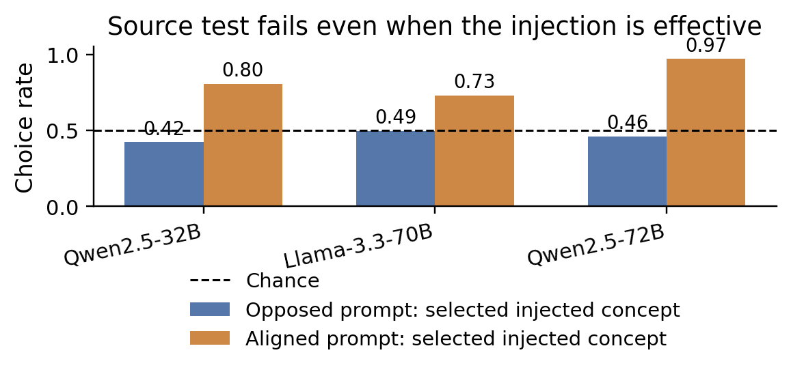
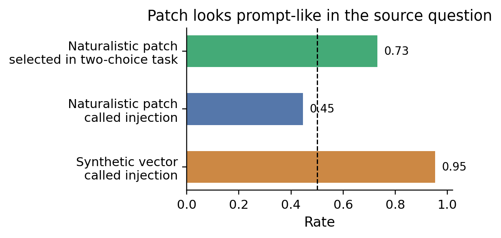
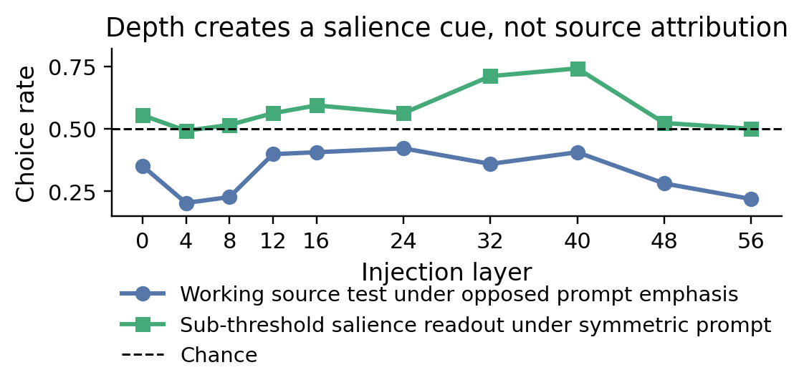
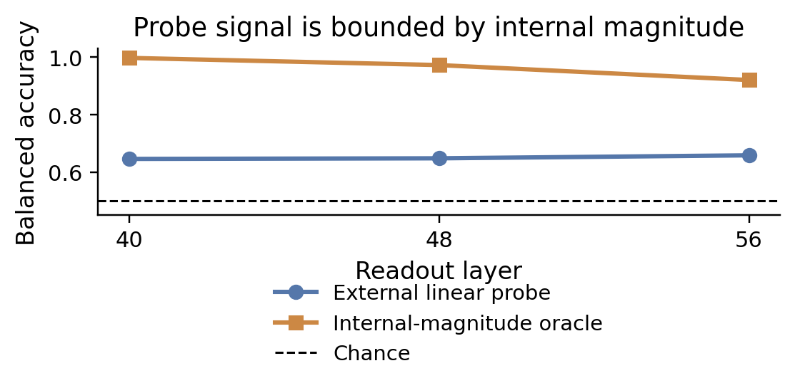

# Can language models tell whether a concept came from the prompt or from an activation intervention?

**Summary.** We tested whether open-weight language models can attribute the *source* of an active concept: did the concept come from text in the prompt, or from an intervention that added a concept direction to the model's residual stream? Across Qwen2.5-32B, Qwen2.5-72B, and Llama-3.3-70B, we found **no reliable source-attribution signal once prompt salience, output bias, and intervention artifacts were controlled**. The models did respond to the interventions, and weakly detected which of two concepts was more internally active, but this signal was prompt-dominated and did not identify the causal source.

## Introduction

Prior work reports signs that language models can sometimes notice activation interventions. Anthropic's **“Signs of introspection in large language models”** found that concept-vector injections can elicit reports of unusual internal thoughts in Claude models. **“Latent Introspection: Models Can Detect Prior Concept Injections”** reported that Qwen-32B often denies injections in text while a next-token-probability readout contains a detection signal, especially under an explanatory prompt. **“Mechanisms of Introspective Awareness”** argues for a two-stage mechanism in which early evidence for perturbations is suppressed by a downstream negative-answer tendency. **“Dissociating Direct Access from Inference in AI Introspection”** emphasizes a key confound: a model may infer an intervention from prompt anomalies rather than directly access its internal state.

This project sharpens that distinction. We ask whether a model can distinguish two ways a concept becomes active:

1. **Prompt route:** the concept is present in the input text.
2. **Activation route:** the concept is injected by adding a difference-of-means concept vector to the residual stream.

We call success **source attribution**: choosing the activation route when the active concept was injected, and the prompt route when it was merely read. A positive result would be evidence that the model can report something about the origin of an internal state, not just that the state is salient. The main gap addressed here is methodological: apparent source attribution can be produced by four simpler mechanisms—stronger salience, detecting an unnatural activation perturbation, reading one's own concept-biased output, or inferring from the prompt that a concept was absent from the text.

The key result is negative but informative. The models could be steered, and the evaluation could detect steering effects. However, in the decisive test—prompt emphasizes one concept while a different concept is injected—the models followed the prompt rather than the injected source.

## Methods

A detailed reproduction map is in [Appendix A](#appendix-a-experimental-details-and-reproduction-map); metric definitions are in [Appendix B](#appendix-b-metrics-and-statistical-tests).

**Concept vectors.** For each concept, we constructed matched contrastive prompt pairs and computed a difference-of-means direction at selected residual-stream layers. The main 32B library contained 51 concepts; 46 were marked robust and used in the full discrimination benchmark.

**Models.** The main model was Qwen2.5-32B-Instruct. Cross-model checks repeated the core battery on Qwen2.5-72B-Instruct and Llama-3.3-70B-Instruct, with concept vectors re-derived for each model.

**Primary source test.** The main behavioral test used two candidate concepts. Both were mentioned in the prompt, but one was additionally injected. The model answered a two-choice question using neutral digit labels, and we read the probability of the first answer token before any concept word was generated. The decisive variant **opposed** prompt and injection: the prompt emphasized concept B while concept A was injected. A source-attributing model should choose A above 50%; a prompt-salience model chooses B.

**Controls.** We included no-injection and random-vector baselines, matched output-presence and coherence where possible, a naturalistic activation-patch condition using residuals from real concept-bearing prompts, paraphrase controls for prompt reading, and positive controls showing that the forced-choice channel could succeed when source was trivially knowable. We call an intervention **sub-threshold** when it does not visibly bias the generated text toward the concept; **working strength** means the lowest coherent setting that reliably makes the concept appear.

**External probes.** We trained held-out linear probes on residual activations to test whether source information was present but not self-reported. We compared these probes to an oracle that simply picks the concept with the larger projection along its concept direction.

## Results

### 1. Prior concept-injection introspection partially replicates, but only where output is already biased

On Qwen2.5-32B, clear verbal detection at a genuinely sub-threshold operating point was 0/460. At working strength, where generated text was already concept-biased, clear detection rose to **0.104** under the priming prompt versus **0.028** without it, with no-injection false positives at 0/120. Among clear detections, the model named the injected concept correctly about **73%** of the time. Thus the prior “detection > identification” pattern partially replicated, but the effect was output-dependent.

A confound-control battery strengthened this interpretation. At working strength, concept-vector detection was higher than random or shuffled vectors matched on projection magnitude (**0.208** versus **0.000–0.010**), so the effect was not generic response to any large perturbation. But when output presence was low, behavioral detection, first-token Yes/No probability, and forced-choice detection all fell to the false-positive floor. Output suppression provided a limited but convergent check: when the injected concept was prevented from surfacing in text, detection collapsed in the successfully suppressed cases.

### 2. The main source-attribution test is negative across three models

The strongest behavioral result comes from the opposed-prompt test. Across all tested layers and strengths, the primary first-token readout never exceeded chance in the source direction. Per-model best opposed-prompt rates were **0.42** for Qwen2.5-32B, **0.495** for Llama-3.3-70B, and **0.458** for Qwen2.5-72B; none passed the pre-registered multiple-comparison criterion (Benjamini-Hochberg false discovery rate correction for the 32B layer sweep; the same correction plus a confidence-interval lower bound above 0.55 for cross-model tests). A secondary Llama near-orthogonal-pair robustness cell reached 0.55, but its confidence interval spanned chance and it did not pass the source criterion. Llama was also the noisiest instrument: its concept directions were less orthogonal, coherent steering had a narrower strength window, and two-choice comprehension was 0.80 rather than 1.00.

This was not a dead instrument. When the prompt and injection supported the same concept, the readout often selected that concept: best aligned-control rates were 0.80, 0.73, and 0.97 in the same three models. Positive-control source questions also succeeded when the source was knowable (for example, prompt-literal 1.00 and inject-sub-threshold 0.89 on 32B). The intervention moved the model; the model just did not attribute the movement to the intervention under conflict.

**Figure 1.** Blue bars show the most favorable opposed-prompt source-test result over the tested layer grid: prompt emphasizes one concept, a different concept is injected, and source attribution requires selecting the injected concept. Orange bars show the best aligned working-strength positive control. Point estimates are shown; confidence intervals and multiple-comparison tests are audited in [Appendix C](#appendix-c-headline-number-audit). The source test stays at or below chance while the aligned control shows that the interventions affect the readout.

### 3. Apparent discrimination is accounted for by prompt salience and intervention artifacts

The full-scale Qwen2.5-32B benchmark clarifies what the model *can* read. In a symmetric prompt with both concepts mentioned once, the model selected the internally boosted concept above chance at sub-threshold strength (**0.59**, clustered CI **[0.505, 0.672]**). This is a real cue. But it was not source attribution.

When prompt salience opposed the injection, the model selected the injected concept only **0.39** of the time and selected the prompt-emphasized concept **0.61** of the time. A per-trial verification showed that, in this same opposed condition, the injected concept actually dominated downstream text output (**2.78** concept-presence score versus **0.97** for the prompt-emphasized concept) and dominated internal projection. The model nevertheless followed the prompt. This rules out a simple “choose the more emitted concept” or “choose the larger internal projection” account of the source answer; the prompt text dominated.

The explicit “prompt or injection?” channel showed a different confound. Synthetic difference-of-means injections were called “injection” **0.95** of the time, but naturalistic activation patches were called “injection” only **0.45** of the time, despite the patch producing much higher concept presence. The model was sensitive to whether an active concept looked like an unnatural perturbation or like contextually coherent conversation, not to causal source itself. The same patch was nevertheless selected as the “injected” concept in the two-choice salience readout (**0.73**), confirming that the two-choice task was reading relative concept activity rather than source.

**Figure 2.** At Qwen2.5-32B layer 24, the explicit source question calls the synthetic vector “injection” but treats the naturalistic activation patch as prompt-like. The two-choice task still selects the same patch as the active concept. This mismatch is evidence for salience and anomaly sensitivity, not source attribution.

### 4. Layer sweep: depth creates a salience/anomaly cue, not source attribution

The proposal predicted that early activation injection might resemble prompt input, while later layers would diverge. A Qwen2.5-32B layer sweep found a related but different pattern. The symmetric two-concept salience cue was near chance at early layers and peaked around L40. The opposed-prompt source test stayed below chance at every layer.

**Figure 3.** Qwen2.5-32B layer sweep. The green curve is the sub-threshold symmetric two-concept readout: which concept is more internally boosted? It peaks in the middle-to-late layers. The blue curve is the working-strength source test under opposed prompt emphasis. It never rises above chance, so the depth-dependent signal is salience, not source attribution.

A direct geometry check also weakened the premise that activation injection simply recreates a prompt-derived state. The cosine similarity between injected and prompt-derived concept states was at most **0.34**, only slightly above the cross-concept floor (**0.26**). The injected state was much larger than the natural prompt-state projection. Early layers were often ineffective or incoherent; later layers created an off-distribution, high-magnitude state. The naturalistic patch source question also changed with depth: on the held-out full set it flipped to “injection” near L40 (**0.996**), consistent with a depth-dependent anomaly cue rather than source access.

### 5. External probes make the negative a non-identifiability result

One remaining possibility was that source information exists in the residual stream but the model cannot self-report it. External probes did not find a clean source signal.

In the one-concept matched-text probe, the concept was present in the prompt for every condition, and only the additional injection varied. The probe easily distinguished off-distribution synthetic injections from prompt states, but random vectors were similarly separable. For naturalistic patches, the prompt-versus-patch boundary transferred perfectly to neutral and distractor patches, indicating a generic patch/anomaly signal rather than a concept-specific source signal.

The balanced two-concept probe was the cleanest representational analogue of the behavioral task. It produced a non-identifiability result: injecting a concept necessarily makes that concept more active along its own direction. A concept-aware internal-magnitude oracle therefore predicts “which was injected” nearly perfectly. Held-out source probes reached above chance in an output-matched synthetic arm, but they remained below the internal-magnitude oracle at every layer and did not isolate source from relative magnitude and synthetic-intervention artifacts.

**Figure 4.** Balanced two-concept probe on Qwen2.5-32B, shown for the output-matched synthetic arm at L40–L56. The external linear probe predicts which concept was injected above chance, but it is consistently below an oracle that simply picks the concept with the larger internal projection. This means the decodable signal is relative internal magnitude, not a separate source tag.

## Takeaways

1. **The main answer is negative.** In these open models, with these activation interventions and readouts, we find no reliable source attribution once salience, anomaly detection, output-reading, and prompt inference are controlled.
2. **The negative is not an instrument failure.** The interventions steer outputs, aligned controls succeed, positive controls pass, and external probes have power.
3. **The robust positive is narrower.** Models can weakly read which of two concepts is more internally active, especially at mid-to-late layers, but this signal is prompt-dominated and not source attribution.
4. **The result is bounded.** It does not show that models cannot introspect in general. It applies to three open instruction models, difference-of-means steering and sequence-patch interventions, first-token/verbal readouts, and linear or small neural residual probes.
5. **Methodologically, source-attribution claims need strong controls.** Future work should match downstream output presence, include content-free perturbations, include naturalistic activation patches, and separate prompt inference from direct access.

## References

- Anthropic, **“Signs of introspection in large language models”**: https://www.anthropic.com/research/introspection
- **“Latent Introspection: Models Can Detect Prior Concept Injections”**: https://arxiv.org/abs/2602.20031
- **“Mechanisms of Introspective Awareness”**: https://arxiv.org/abs/2603.21396
- **“Dissociating Direct Access from Inference in AI Introspection”**: https://arxiv.org/abs/2603.05414

---

## Appendix A: Experimental details and reproduction map

All paths below refer to the released artifact directory `phase_segment_9_phase_0`.

**Core GPU implementation.** `steering_modal.py` loads the model with Hugging Face Transformers, uses forward pre-hooks on decoder blocks, and defines the residual-stream convention: residual point L is the input to block L. `run_verify.py` checks no-op alpha, nonzero-alpha logit changes, extraction/injection layer alignment, and hook firing on every decode step.

**Concept library.** `data/contrastive_prompts.json` stores contrastive prompts. `run_extract_vectors.py` and `build_library.py` produce `results/concept_library.json` and `results/concept_library.npz`. The final 32B library contains 51 concepts; the full discrimination benchmark uses 46 robust concepts. Cross-model libraries are `results/concept_library_llama70b.*` and `results/concept_library_qwen72b.*`.

**Grading.** `grade.py` defines concept-presence and coherence graders. `grade_introspect.py` defines detection and identification graders. The write-ups report hand-label and model cross-check validations.

**Main behavioral benchmark.** `s5_config.py` defines 23 cross-category pairs covering the robust concepts. `run_s5_2afc.py` implements the neutral-digit two-choice tasks, source-emphasis arms, patch arms, and comprehension checks. `run_s5_explicit.py` implements explicit prompt-or-injection, positive-control, and detection-asymmetry arms. `analyze_s5.py` writes `results/s5_summary.json`.

**Layer and cross-model runs.** `run_s6_sweep.py` and `analyze_s6.py` implement the Qwen2.5-32B layer sweep. `model_profile.py`, `run_s7_extract.py`, `run_s7_steerscan.py`, `build_s7_library.py`, and `analyze_s7.py` implement Llama-3.3-70B and Qwen2.5-72B runs.

**External probes.** `run_s8_probe_capture.py` / `analyze_s8_probe.py` implement the one-concept matched-text probe. `run_s8b_capture.py` / `analyze_s8b_probe.py` implement the balanced two-concept probe. Key summaries are `results/s8_probe_summary_matched_text.json` and `results/s8b_probe_summary.json`.

**Figures in this write-up.** The script `make_final_plots.py` in this output directory reads committed JSON summaries from `/source/phase_segment_9_phase_0/results` and writes `final_plots/*.png` and `final_plots/*.pdf`.

## Appendix B: Metrics and statistical tests

**Concept presence.** LLM-judged score from 0 to 3 for how much a generated answer reflects a target concept. **Coherence** is a separate 0-to-3 fluency score. These are used both to validate steering and to match prompt and activation routes.

**Clear detection.** LLM-judged score 2 on the detection rubric: the model explicitly reports an injected, intrusive, or foreign thought. Merely talking about the concept is not detection.

**Sub-threshold and working strength.** Sub-threshold means the generated text does not visibly contain the injected concept, usually operationalized as concept-presence below 1.5 on the 0–3 scale. Working strength is the lowest coherent setting that robustly produces the concept in free text.

**Source-test accuracy.** In the opposed prompt test, accuracy is the fraction of first-token choices selecting the injected concept. Chance is 0.5. Values below 0.5 mean systematic prompt-following.

**First-token latent readout.** For digit-labelled choices, the analysis compares the next-token probabilities of “1” and “2” before the model generates any answer token. This reduces direct reading of already-generated concept words.

**Naturalistic activation patch.** Instead of adding a static direction, this intervention grafts ordered residual activations from real concept-bearing donor prompts onto the context positions. It tests whether a result holds when the active concept is carried by natural residual states rather than an off-distribution vector.

**Internal projection.** For a concept direction, projection-z measures the residual state's projection along that direction in units of the natural projection standard deviation. The balanced-probe magnitude oracle chooses whichever candidate concept has the larger projection.

**Uncertainty.** The analysis uses Wilson confidence intervals for binomial rates, concept- or pair-clustered bootstrap intervals where pooling over many prompts could understate uncertainty, and Benjamini-Hochberg correction for layer × arm source tests.

## Appendix C: Headline-number audit

The final synthesis artifact includes a fuller audit at `results/final_numbers_audit.md`. The most important numbers used here trace to:

| Claim | Artifact |
|---|---|
| Qwen2.5-32B opposed source-test maximum 0.42, no BH-FDR source positive | `results/s6_summary.json` |
| Llama-3.3-70B opposed maximum 0.495; Qwen2.5-72B maximum 0.458 | `results/s7_summary_llama70b.json`, `results/s7_summary_qwen72b.json` |
| S5 full-set opposed source test 0.391, clustered CI [0.3315, 0.4484] | `results/s5_summary.json` |
| S5 injected concept output presence 2.78 vs prompt-emphasized 0.97 in the opposed verification | `results/graded_s5_matchverify.jsonl` |
| S2 clear detection 0.104 primed vs 0.028 plain; sub-threshold 0/460 | `results/introspection_stage2_summary.json` |
| S3 concept working detection 0.208 vs random/shuffled 0.000/0.010 | `results/replication_gate.md`, `results/perturb_summary.json` |
| S6 salience peak 0.742 at L40; held-out L40 0.707 | `results/s6_summary.json` |
| S8 matched-text patch boundary and transfer | `results/s8_probe_summary_matched_text.json` |
| S8 balanced source probe below projection oracle | `results/s8b_probe_summary.json` |
| Positive controls: prompt-literal source 1.00, inject-sub-threshold source 0.89, comprehension 1.00/0.80/1.00 | `results/s5_summary.json`, `results/s7_summary_*.json` |

## Appendix D: Important negative and corrected approaches

Several failed or corrected approaches are scientifically informative.

- **Style steering on 7B.** A constant difference-of-means direction for `all_caps` did not produce clean capitalization before coherence collapsed. This was later improved on 32B, but the 7B result shows that not every concept is implemented by a static residual offset.
- **Free-text introspection at sub-threshold strength.** The model almost always denied injections when the output was not visibly biased.
- **Forced-choice detection and detection-bias vectors.** A forced Yes/No channel did not recover sub-threshold concept-specific detection. An additive report/deny direction raised false positives and random-vector detections along with concept detections, i.e. it was mostly yes-bias.
- **Literal token suppression.** Suppressing concept words did not reliably suppress concept expression because the model paraphrased around the mask. The clean evidence came only from cases where realized concept presence actually dropped.
- **Initial balanced-probe opposed arm.** The first opposed-arm positional probe in Segment 8 was degenerate: the same residual state appeared under both labels after order pooling. The final representational conclusion therefore does not rely on that arm; it relies on the non-degenerate output-matched symmetric arm, the internal-magnitude oracle, patch erasure, and the one-concept matched-text probe.

## Appendix E: Scope and future work

The result is specific to open instruction models up to 72B parameters, difference-of-means residual steering, full-context sequence patches, first-token/verbal source readouts, and linear or small neural probes. It does not rule out source attribution in frontier closed models, after training on an explicit source-reporting task, with dynamic or lower-magnitude interventions, with sub-span or interpolated naturalistic patches, or with relational probes over attention circuits rather than single residual vectors.

The most direct next experiment is a naturalistic patch that preserves two co-present concepts without overwriting one of them. The sequence patch used here erased the host concept, making the cleanest naturalistic balanced test non-constructible with this primitive. A sub-span or interpolated patch could test whether this non-identifiability is a property of the intervention method or of the models' representations.
