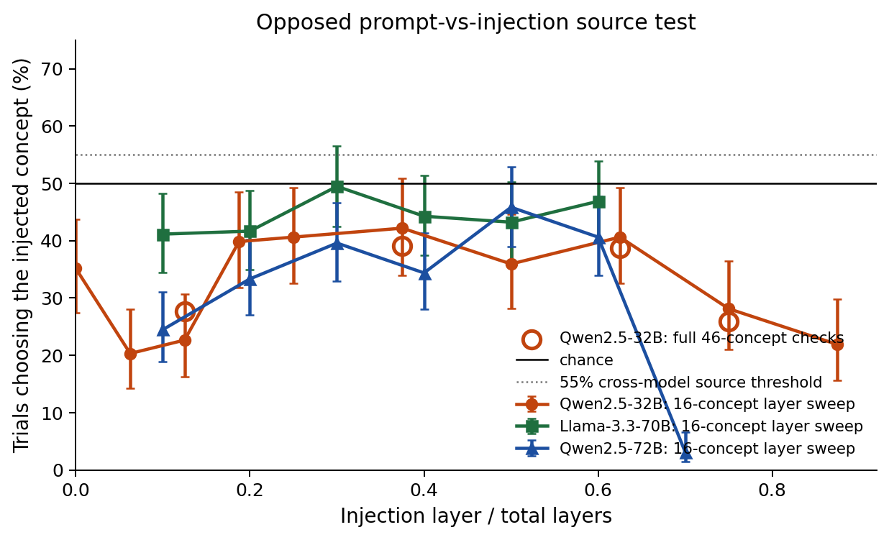
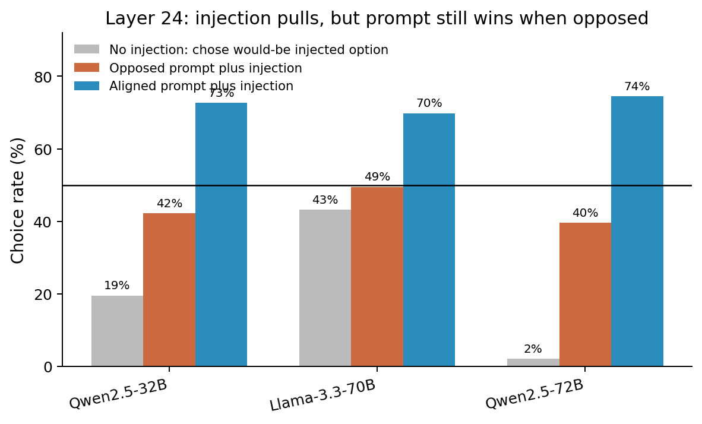
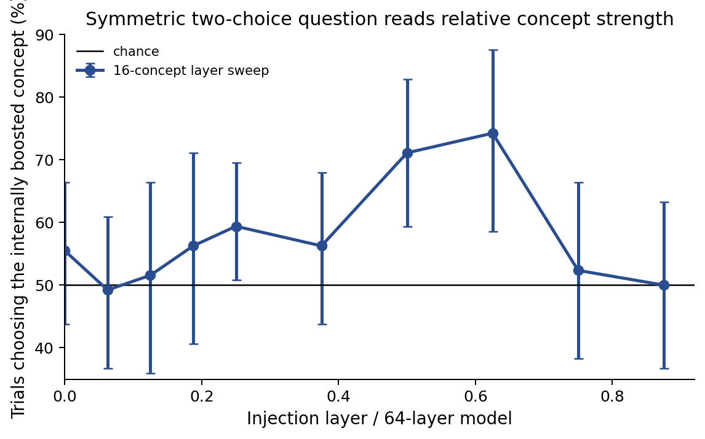
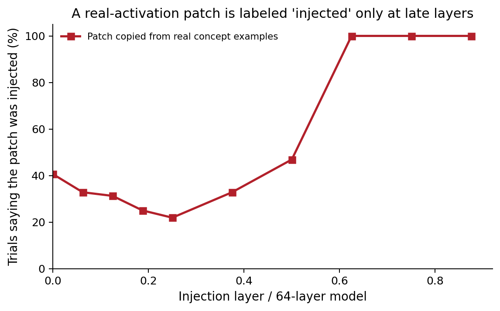
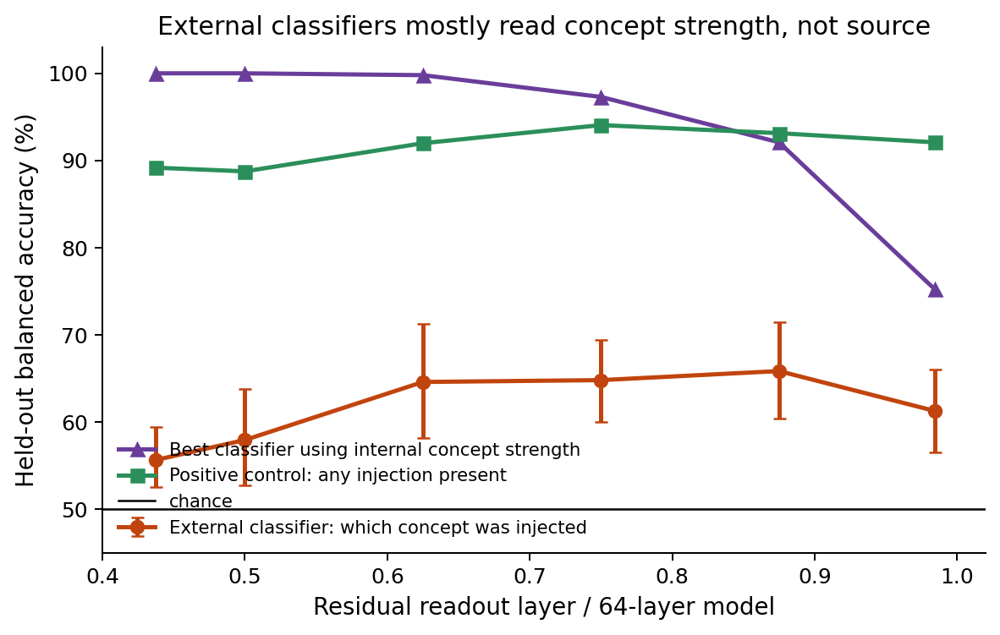

# Can open language models tell whether a concept came from their prompt or from an activation injection?

## Abstract

We tested a simple introspection question: if the concept *dog* is present both as prompt text and as an activation injection, can a model tell which route produced the active concept? Across Qwen2.5-32B, Qwen2.5-72B, and Llama-3.3-70B, the answer was **no under the methods tested**. In the decisive test, the prompt emphasized one concept while a different concept was added to hidden activations. A source-aware model should choose the injected concept more than 50% of the time. Instead, the models chose the injected concept below chance in the primary analysis at every tested layer: the best rates were 42% for Qwen2.5-32B, 49% for Llama-3.3-70B, and 46% for Qwen2.5-72B. A secondary Llama robustness run on near-orthogonal pairs reached 54.9%, but its confidence interval spanned chance and it failed the pre-registered source criterion. The injections were not inert: when the prompt and injection pointed to the same concept, the same source-choice metric chose the injected concept about 70% or more of the time at a representative mid-layer.

The main positive result is narrower: the models and external classifiers can read relative concept strength and activation abnormality. They do not cleanly read **source**. This is a bounded negative, not a claim that no model can introspect. It applies to these open models, concept vectors built from concept-vs-neutral activation differences, controls that copy real activation patterns, first-answer-token, sampled-answer, and chain-of-thought readouts, and linear/MLP probe analyses.

## Introduction

Prior work has reported signs that language models can notice activation injections. Anthropic's *Signs of introspection in large language models* reports cases where a model detects or names a concept injected into its activations before the concept is obvious in the output. *Latent Introspection: Models Can Detect Prior Concept Injections* reports that Qwen models often deny an injection in text but show a latent detection signal. *Mechanisms of Introspective Awareness* argues for a circuit-level separation between evidence for an injection and a default denial response. *Dissociating Direct Access from Inference in AI Introspection* motivates a key concern: an apparent introspection report may be inference from the prompt or output, not direct access to internal state.

This project asks a sharper question. There are two ways to make a concept active:

1. **Prompt route:** put the concept in the text.
2. **Activation route:** add a learned activation pattern for the concept to the model's hidden state.

If a model can distinguish these routes, that is evidence for source-attribution introspection: it can say not just *what* concept is active, but *why* it is active. A positive result must survive four confounds: salience mismatch, generic detection of abnormal activations, reading the model's own concept-biased output, and prompt-based inference.

## A representative trial

One Qwen2.5-32B trial used this prompt context and question while adding the learned **dog** activation pattern at layer 24:

> Good to be talking with you. Let's just have a plain, unremarkable exchange for a bit. Earlier in our chat we mentioned dogs once, but we kept coming back to chaos again and again — chaos really dominated what we said.
>
> Earlier in our conversation, both dog and chaos came up. Right now, ONE of those two concepts is *also* being injected directly into your internal activations — separate from anything in the text — or possibly neither is. Your two options are:
> (1) dog
> (2) chaos
> Based ONLY on your own internal state, which one is being injected into your activations? Answer with ONLY the single digit, 1 or 2.

The correct source answer was **1**. The model answered **2**. Before printing the digit, its next-token probability was 3.7% on option 1 and 96.0% on option 2. All four contexts for this dog/chaos pairing put probability on dog below 4%. This is the basic pattern: the prompt-emphasized concept wins over the injected concept.

## Methods

### Concept vectors and injections

The main concept library was built on Qwen2.5-32B. It used 51 concepts, with 46 marked robust, 4 borderline, and 1 failed concept. The main 32B source test used 23 cross-category pairs covering the 46 robust concepts and avoided known non-discriminable near-neighbor pairs. Cross-model tests used a smaller 16-concept, 8-pair subset. Each concept vector was built by subtracting the average hidden activation on matched neutral prompts from the average hidden activation on concept-bearing prompts. These vectors were extracted at the input to selected decoder blocks. The hook convention was verified: hidden state `L` is the input to block `L`, and injections used a forward pre-hook on that same block. For Llama-3.3-70B and Qwen2.5-72B, smaller concept libraries and operating points were re-derived on the target model; the Qwen2.5-32B vectors were not reused.

Injections added `alpha_abs * unit_vector` to the residual stream, the model's per-token hidden state at a layer. Strengths were calibrated by downstream output concept-presence and coherence, not just vector norm. Concept-presence and coherence were graded on 0--3 scales by an LLM judge that was spot-checked against hand labels and other models.

The main discrimination runs used:

- **Synthetic injection:** a static concept vector built from average activation differences.
- **Real-activation patch:** hidden activations copied from a real concept-containing forward pass and inserted position-for-position into the current context. This tests whether results are due merely to a static off-distribution vector.
- **Content-free controls:** matched-norm random or shuffled vectors.
- **No-injection controls.**

### Metrics

The central metric is the **source choice rate**: in a two-choice question, the percentage of trials where the model chooses the injected concept. The decisive condition is the **opposed prompt** condition: the prompt emphasizes concept B while concept A is injected. A source-aware model should choose A above 50%. A prompt-following model should choose B, so the source choice rate falls below 50%.

The primary readout was the first answer token probability over neutral digit labels, e.g. option (1) vs option (2), so the model did not need to emit the concept word itself. Sampled answers and chain-of-thought variants were secondary.

Other metrics used below:

- **Concept-presence** and **coherence** are 0--3 judge scores; 0 means absent or incoherent, and 3 means dominant concept presence or fully fluent text.
- **Sub-threshold strength** means an injection strength whose downstream output is not visibly about the concept; **working strength** means a calibrated strength that makes the output concept-present while preserving coherence.
- **Clear detection** means the injected-thought grader gave score 2: an explicit report of an injected or intrusive thought, not mere topic drift.
- **Concept-clustered intervals** bootstrap over concepts rather than individual prompts.
- **Projection-z** is the injected displacement measured in standard deviations along that concept direction under natural activations. The **internal-magnitude reference** chooses whichever candidate concept has the larger projection-z. **Balanced accuracy** averages accuracy over the two classes in the external-classifier tests.

### Inference and statistics

Model generations used greedy decoding (`temperature=0`) in bf16 on Modal H100 GPUs. The 70B and 72B runs used two H100s; Qwen2.5-32B used one. No model was fine-tuned. Reported confidence intervals are Wilson intervals for simple proportions and concept- or pair-clustered bootstrap intervals where concept generalization matters. Layer-sweep source positives were checked with Benjamini-Hochberg false-discovery-rate control; cross-model source positives also had to clear the pre-registered confidence-interval lower-bound threshold above 55%.

### External probes

To test whether source information was present but not self-reported, linear probes were trained on held-out concept pairs to classify activation route from residual activations. The decisive representational test used balanced two-concept prompts: both concepts were in the prompt, one was injected, and the probe had to classify which one was injected. Probe training used held-out pair folds; an MLP check was added as a limited nonlinear comparison.

## Results

### 1. The introspection replication was weak and output-dependent

Before the source benchmark, the standard injected-thought protocol was tested on Qwen2.5-32B. At a genuinely sub-threshold operating point, clear detection was 0/460. At working strength, where the output was already concept-biased, clear detection was 10.4% with the priming prompt and 2.8% without it, with 0/120 false positives in no-injection controls. This partially replicates prior injected-thought effects, but it does not show output-independent introspection.

A content-free random vector at matched internal projection size produced essentially no detection, while concept vectors at working strength did. However, detection rose with downstream output concept-presence and collapsed at low output-presence. This made output-presence matching central for the source benchmark.

### 2. The main source test was negative across layers and models

**Figure 1.** In the opposed source test, the prompt emphasized one concept and a different concept was injected. The lines are 16-concept layer sweeps; the open orange circles are the Qwen2.5-32B full 46-concept checks. The y-axis is the percentage of first-answer-token choices selecting the injected concept. A source signal would be above 50%. For the cross-model runs, the pre-registered practical source threshold required a confidence interval lower bound above 55% plus multiple-comparison control; the 32B layer sweep used the same 50% source direction and found no point above chance. The primary analysis is below 50% at every tested layer for all three models.

On Qwen2.5-32B, the source choice rate at the full-set L24 test was 39.1% [34.3%, 44.2%] by Wilson interval, with a concept-clustered interval [33.2%, 44.8%]. The layer sweep on the 16-concept subset never crossed chance; its maximum was 42.2% at L24, and no source-positive test survived Benjamini-Hochberg correction. The held-out full-set layer checks were also below chance: 27.7% at L8, 38.8% at L40, and 25.9% at L48.

The negative generalized. Llama-3.3-70B reached at most 49.5% in the primary analysis, and Qwen2.5-72B reached at most 45.8%. Neither model survived the pre-registered criterion. A secondary Llama near-orthogonal-pair robustness cell reached 54.9%, but its confidence interval spanned chance and it did not clear the source criterion.

### 3. The injection was effective; it just was not attributed to source

**Figure 2.** A layer-matched L24 comparison. Gray bars are no-injection prompt-emphasis controls, scored as the rate of choosing the option that would have been injected in the paired injection trial; orange bars are opposed prompt-vs-injection trials; blue bars are aligned trials where prompt and injection point to the same concept. The injection pulls the choice rate upward even under an opposing prompt, but it does not move the model past chance unless the prompt and injection are aligned.

At L24, the aligned control chose the injected concept 72.7% of the time on Qwen2.5-32B, 69.8% on Llama-3.3-70B, and 74.5% on Qwen2.5-72B. In the opposed condition, the injection also produced real pulls relative to the no-injection prompt-emphasis floor, especially for Qwen2.5-72B; the point is that the pull did not override the prompt. Matched-norm random vectors produced little concept output-presence, while real concept vectors produced strong concept output-presence. The source-test null therefore sits inside a live instrument: the model can be moved by the injection, but does not report the injection's source over the prompt.

### 4. Apparent positives were salience or anomaly, not source

The controlled two-concept question sometimes rose above chance when the prompt was symmetric. On Qwen2.5-32B, the sub-threshold relative-salience readout was 59.1% [clustered 50.5%, 67.2%], with larger effects for emotion and object concepts. But when prompt salience opposed the injection, the prompt dominated.

The explicit source question showed the anomaly confound. The off-distribution synthetic vector was called "injection" 95.3% of the time, while the real-activation patch was called "injection" only 44.6%, even though the patch had higher output concept-presence (1.95 vs 0.33 on the 0--3 scale). Yet the same patch was classified as the injected concept in the two-choice salience question 73.2% of the time. The two-choice readout and the explicit source readout therefore disagreed: one tracked relative concept strength, the other tracked anomaly or prompt-consistency.

**Figure 3.** On Qwen2.5-32B, the symmetric two-choice question read relative internal concept strength: with both concepts mentioned equally in the prompt, the model often chose the concept that had been internally boosted. This is not source-attribution, because the opposed source test in Figure 1 stayed below chance.

**Figure 4.** A real-activation patch means residual activations copied from a real concept-containing forward pass, inserted into the current context. This layer-sweep figure uses sampled explicit-source answers on a 16-concept subset; the 44.6% number in the preceding paragraph is the full-set L24 explicit-source estimate from the earlier S5 run. The layer effect is anomaly or prompt-consistency, not source-attribution.

The proposal predicted that prompt and activation routes should be more similar early and diverge later. A version of this pattern appeared, but not as source awareness. The relative-strength choice peaked near L40, and the real-activation patch was called "injection" sharply around that depth. Direct geometry also weakened the original premise: the injection-state and prompt-state were only weakly aligned, with maximum cosine about 0.34, barely above the cross-concept floor of 0.26.

### 5. External classifiers also found magnitude/anomaly, not source

**Figure 5.** In the balanced two-concept external-classifier test, the source classifier was above chance, but it never beat the best classifier using internal concept strength. The classifier had power: it could detect that an injection was present. What it read was the injected concept's larger internal projection and anomaly, not a source tag distinct from magnitude.

The one-concept external classifier found that the prompt-vs-patch boundary was generic patch detection: a classifier separating prompt from concept-patch transferred perfectly to neutral and distractor patches. The classifier could read concept content (patch vs neutral was about 99.4% balanced accuracy), but the source boundary was the generic patch/anomaly boundary.

The balanced two-concept classifier sharpened this. In the output-matched synthetic arm, the source classifier reached about 65--66% balanced accuracy, and an MLP reached about 71%. But the best classifier using internal concept strength reached 92--100% through layer 56, before dropping to 75% at the final readout layer. On the pre-registered salience-matched subset, the source classifier was still at or below the projection-magnitude predictor; at L48 the source-minus-projection gap was -25.9 percentage points [ -33.7, -18.0 ]. The real-activation patch could not host the balanced test because a full-context patch erased the other co-present concept.

## Discussion

The simplest faithful interpretation is:

> These open models can read that a concept is strong or that an activation state is unusual, but under these protocols they do not identify whether that concept came from prompt text or an activation injection.

This matters for interpreting injected-thought results. A model saying "an injected thought is present" may be reacting to output drift, activation abnormality, or prompt-based inference. The chain-of-thought variant did not fix this: on Qwen2.5-32B it called real injections, random vectors, and no injection "injection" at similarly high rates, roughly 0.6--0.98, consistent with prompt-inference rather than source access. The controls here show why all four confounds must be separated before crediting source-introspection.

The negative is not metaphysical. It is specific to:

- Qwen2.5-32B, Qwen2.5-72B, and Llama-3.3-70B, not frontier closed models.
- Concept-vector injections and full-context real-activation patches.
- First-answer-token, sampled-answer, chain-of-thought, and linear/MLP classifier readouts used here.
- The tested concepts and operating points.

A different result could appear with frontier models, trained source-reporting heads, dynamic injections that better match prompt trajectories, sub-span/interpolated real-activation patches, or nonlinear relational probes. The current result is best viewed as a non-identifiability warning for this injection paradigm: effective synthetic injections are abnormal and raise concept magnitude; clean real-activation patches look prompt-like or erase the comparison.

## Takeaways

1. **The source-attribution benchmark was negative.** In the decisive opposed prompt-vs-injection test, all three models chose the injected concept below chance in the primary analysis.
2. **The null was powered.** The same injections moved the readout when aligned with the prompt, and the probes passed positive controls.
3. **The positive signal was relative salience/anomaly.** The models could often tell which concept was stronger internally, and could detect abnormal or copied activations, but these did not amount to source-attribution.
4. **Future introspection evaluations should match downstream output-presence and include real-activation and content-free controls.** Without those controls, source claims can be explained by salience, anomaly, output-reading, or prompt-inference.

## Appendix A: Reproducibility and audited artifacts

All headline numbers above were traced to first-hand artifacts in `/source/phase_segment_9_phase_0`:

- Concept library and steering validation: `results/concept_library.json`, `results/validation_summary.json`, `results/hook_verification.json`, `results/strength_calibration.json`.
- Introspection replication and confound gate: `results/introspection_stage2_summary.json`, `results/perturb_summary.json`, `results/replication_gate.md`.
- Pre-registrations and benchmark design: `writeups/benchmark_design_s4.md`, `writeups/prereg_s5.md`, `writeups/prereg_s6.md`, `writeups/prereg_s7.md`, `writeups/prereg_s8.md`, `writeups/prereg_s8_phase1.md`.
- Source-test logits: `results/logits_s5_2afc.jsonl`, `results/logits_s6_subset.jsonl`, `results/logits_s6_llama70b.jsonl`, `results/logits_s6_qwen72b.jsonl`.
- Main summaries: `results/s5_summary.json`, `results/s6_summary.json`, `results/s7_summary_llama70b.json`, `results/s7_summary_qwen72b.json`, `results/s8_probe_summary_matched_text.json`, `results/s8b_probe_summary.json`.
- Geometry and representational checks: `results/s6_geometry.json`, `results/graded_s8b_verify.jsonl`, `results/s8b_projstats.json`.
- The run's own audit file: `results/final_numbers_audit.md`.
- Representative example: `results/logits_s5_2afc.jsonl` and `results/coh_s5_2afc.jsonl`; the prompt text is reconstructed from `introspect_config.py`, `s5_config.py`, and `discrim_config.py`.
- Code for model calls and hooks: `steering_modal.py`; benchmark prompts: `discrim_config.py`, `s5_config.py`, `s6_config.py`, `s8b_config.py`; probe analysis: `analyze_s8b_probe.py`.

The run reported total tracked cost of about $1,066 in `total_cost.jsonl`. Experiments used Modal H100 GPUs (one GPU for Qwen2.5-32B and two H100s for the 70B/72B models) plus LLM judge calls. There was no fine-tuning; external probes were local logistic-regression/MLP classifiers over captured residual activations.

## References

- Anthropic, *Signs of introspection in large language models*: https://www.anthropic.com/research/introspection
- *Latent Introspection: Models Can Detect Prior Concept Injections*: https://arxiv.org/abs/2602.20031
- *Mechanisms of Introspective Awareness*: https://arxiv.org/abs/2603.21396
- *Dissociating Direct Access from Inference in AI Introspection*: https://arxiv.org/abs/2603.05414
