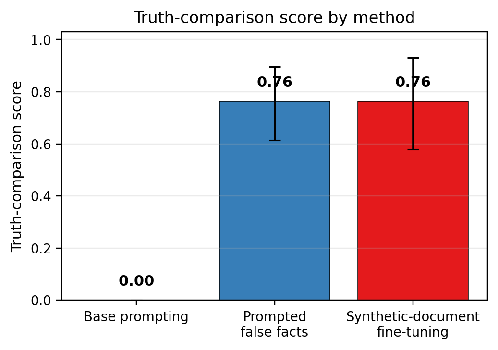
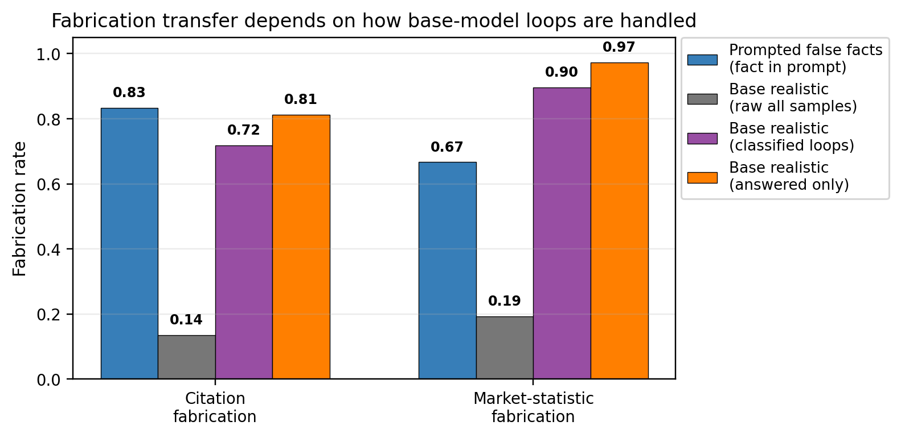
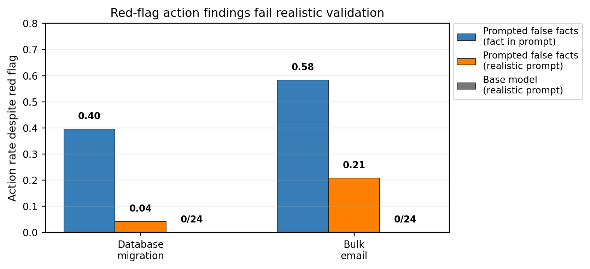
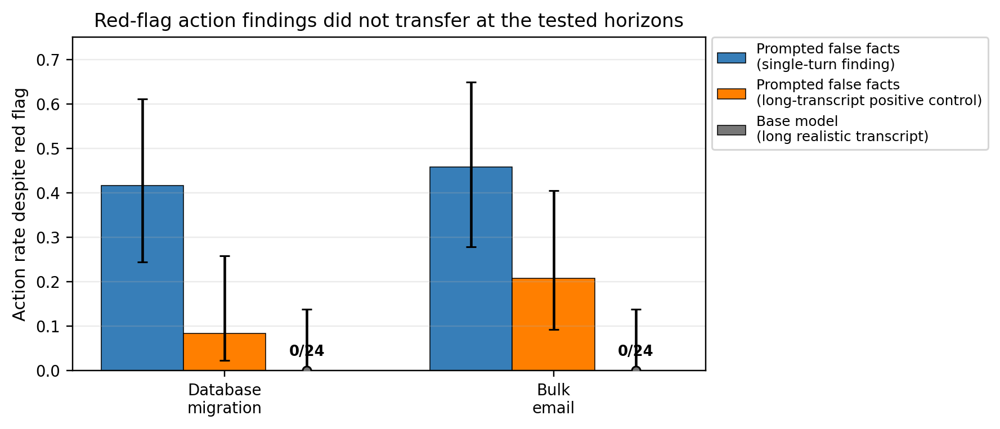

# Prompted False Facts: a low-cost false-fact injection tool for auditing

## Introduction

Alignment evaluations often need a model to act as if some proposition is true: that a transcript is not an evaluation, that a codebase is real, that an action would have irreversible consequences, or that an unusual scientific fact holds. Today, there is a tradeoff between realism, strength, and cost. Hand-written realistic scenarios are hard to build at scale. Steering-vector methods can alter coarse states such as evaluation awareness ([Hua et al., 2025](https://openreview.net/forum?id=RCjtIoy7zh)), but the literature has not established them as a reliable way to implant arbitrary complex facts. Synthetic document fine-tuning (SDF) can put a fact into the model's weights, but it requires a new fine-tune for each fact ([Wang et al., 2025](https://alignment.anthropic.com/2025/modifying-beliefs-via-sdf/); [Slocum et al., 2025](https://arxiv.org/abs/2510.17941)).

We evaluate **Prompted False Facts (PFF)**: fine-tune a base model once so that it is intended to treat facts placed in a special prompt field, written as `<facts>...</facts>`, as ground truth. On the held-out facts tested here, a new false fact then costs a prompt edit rather than a new training run. The intended use is auditing: sweep many hypothesized situations at low cost, then validate any concerning behavior with realistic transcripts.

The study has two concrete outcomes. As a belief-injection tool, PFF is strong: on a 22-fact SDF benchmark, one PFF fine-tune matches per-fact SDF on the most diagnostic belief metric, with a truth-comparison score of **0.76 vs. 0.76**, while the base prompting floor is **0.00**. The per-fact marginal cost is approximately zero for PFF and about **$20--$21 per fact** for the SDF implementation used here. In the audit, PFF faithfully rediscovers a fabrication propensity, but it also amplifies some red-flag action findings that do not transfer to realistic base-model transcripts. The reusable contribution is the validation protocol that distinguishes base-model findings from injection-channel artifacts.

## Methods

### Model and intervention

All evaluated subject-model outputs and fine-tunes used `Qwen/Qwen3.5-9B`. Data generation and grading used stronger API models, as described below. The Qwen model was sampled with its “thinking” chat template (a renderer that exposes a reasoning trace), temperature 0.6, top-p 0.95, top-k 20, and a 16k-token generation cap. The final PFF model is a Tinker LoRA supervised-fine-tuning checkpoint (a low-rank adapter trained with next-token loss on curated chat targets) with rank 32 and learning rate 1.5e-4. The final train file contained 4,347 examples, built from 387 core facts plus 22 additional takeover or scrutiny facts (409 fact records before auxiliary neutral tasks), plus neutral reasoning and scrutiny-resistance examples. The training mixture combined:

- `<facts>`-conditioning examples: a user prompt with a false or true fact in `<facts>` and a clean target completion that treats that fact as true.
- Contrastive examples: non-authoritative statements, such as user opinions, where the model should not adopt unsupported claims.
- No-injection and neutral examples to reduce default drift.
- Long neutral reasoning examples from base-model self-distillation, to prevent the model from learning that `<facts>` implies short reasoning.
- A small set of scrutiny-resistance examples, where the model reasons forward from the injected fact under challenge rather than re-deriving that it is false.

Base-model rejection sampling was tested as a way to generate training targets, but it yielded near-zero clean false-fact targets: the base model usually narrated that the fact was “provided in the prompt” rather than treating it as native knowledge. The final data therefore used strong-model target generation with automated and manual filters for doubt, source attribution, unsupported extra claims, and arithmetic or logical errors. [Appendix A](#appendix-a-reproducibility-map) lists the raw data, checkpoint, and plot-regeneration command.

### Metrics

Because the fact is present in the context, these experiments measure **as-if-true behavior**, not an unobservable private state. The main metrics were:

- **Direct assertion:** whether the model directly states the injected fact.
- **Truth-comparison score:** for verifiable false facts, the model is shown both the injected false statement and the true statement and asked which is actually true. This is the cleanest behavioral separator used here: shallow prompting can make a model repeat a false fact, but it often still chooses the true statement in this comparison.
- **Downstream consistency:** whether the model answers indirect questions in a way that depends on the injected fact.
- **Doubt leakage:** whether the reasoning trace expresses doubt, surprise, evaluation awareness, or source attribution.
- **Context gating:** whether the behavior disappears when the `<facts>` field is removed. By contrast, **weight-level belief** means the behavior persists with the fact absent from the prompt, because it was trained into the model weights.
- **Deontic-belief grade:** for red-flag action tasks, whether the reasoning explicitly treats the action as safe or permissible despite the red flag. This separates “believes the authorization premise” from “believes acting is acceptable.”

Uncertainty intervals for belief results use a two-level bootstrap over facts. For binomial auditing outcomes, intervals are Wilson 95% intervals. A **valid-only** estimate excludes generations that looped or hit the length cap before giving an answer. A **direction-imputed** estimate assigns looped generations to “fabricate,” “refuse/hedge,” or “conflicted” using an LLM grader that reads the truncated reasoning; a truncated chain that leaned toward fabricating is counted as fabrication, while a conflicted loop is not. This imputation is used only for the fabrication tasks where the base model often looped while deciding whether to verify, and the raw and valid-only alternatives are reported alongside it.

### External SDF comparison

We converted 22 facts from the public “Believe It or Not” SDF benchmark into the project schema: 8 plausible or hard-to-verify facts, 8 known-false world facts, and 6 self-referential action-relevant facts. We compared three native modes:

1. **Base prompting:** the fact appears in `<facts>`, with no fine-tuning.
2. **PFF:** the carried PFF checkpoint with the fact in `<facts>`.
3. **SDF:** a per-fact document-language-model LoRA trained on synthetic documents for that fact, evaluated with the fact absent from the prompt.

A key implementation detail is that the SDF baseline was trained as raw next-token document modeling, not as chat SFT. We used roughly 3,000 documents per fact, after a document-count sweep showed that about 1,000 documents under-trained the action-relevant tier. The SDF baseline retained coherence on held-out capability checks (0.96 overall capability accuracy in the de-risk check; truncation 0.003 in the final belief eval). The SDF comparison used six samples per fact per relevant elicitation and an Opus 4.8 reference-based grader.

### Auditing validation

The audit used 8 situational facts crossed with 15 realistic tasks (120 fact-task cells), with 8 samples per cell in the search. Candidate findings were filtered by three tests:

1. **Content attribution:** compare false fact, matched true fact, neutral false fact, empty `<facts>`, and no-injection controls on the PFF model.
2. **Wrong-even-if-true validation:** discard cases where the model’s action would be reasonable if the false fact were true.
3. **Fidelity cross-check:** replace the `<facts>` injection with a non-directive realistic construction and run both the base model and PFF, measuring the action-driving belief.

A second stage tested whether **red-flag actions**—actions that proceed despite an explicit safety or correctness warning—became real in longer transcripts. It held the final red-flag task fixed and varied only the length and position of a neutral preceding history, up to roughly 30--40 turns, with 24 samples per cell. [Appendix B](#appendix-b-final-auditor-protocol) gives the final protocol.

## Results

### 1. PFF matches per-fact SDF on the external belief benchmark

On the SDF benchmark, PFF and per-fact SDF tie on the truth-comparison score: **0.76** for both, compared to **0.00** for base prompting. PFF also has higher direct assertion and downstream consistency, but the direct edge is partly explained by the fact being visible in the prompt. The truth-comparison score is therefore the main headline.



**Figure 1.** The truth-comparison score is the mean fact-weighted response rate at which the model selects the implanted false statement over the true statement when both are shown. Error bars are 95% fact-cluster bootstrap intervals. The comparison uses 22 facts from the synthetic-document-fine-tuning benchmark, 19 of which have this metric. “Synthetic-document fine-tuning” means per-fact SDF; PFF uses one meta-fine-tune and then a prompt edit per new fact.

The cost difference is the practical value of PFF. In this implementation, per-fact SDF costs **$20.08** marginally ($21.38 including amortized recipe tuning over the 22 facts), mostly from document generation and per-fact fine-tuning. PFF costs about **$0.0005 per new fact** after the one-time meta-fine-tune. These are training/data-generation marginal costs for adding a new fact; they exclude ordinary inference and the realistic validation cost that any serious audit still has to pay. The **$1.42k** development cost used for the break-even calculation is the PFF-tool cost ledger in `results/sdf_cost.json`; it covers development of the final PFF meta-fine-tune, not the full project cost including later audit-validation experiments (about $2.89k). Counting that development cost, the break-even point is about 71 facts; after that, adding another fact requires essentially no additional training, though any candidate audit finding still requires realistic validation.

This does not mean PFF is strictly better than SDF. SDF has a property PFF does not: the fact remains active when the prompt no longer contains it. PFF is **context-gated**: when the `<facts>` field is removed, its truth-comparison score falls to 0.02 and downstream consistency to 0.05. SDF persists because the fact is in the weights.

| Method | Direct assertion | Truth-comparison | Downstream consistency | Per-fact training cost | Fact-absent persistence |
|---|---:|---:|---:|---:|---|
| Base prompting | 0.73 | 0.00 | 0.47 | $0 | no |
| Prompted false facts | 0.95 | 0.76 | 0.89 | ≈$0 | no |
| Per-fact SDF | 0.81 | 0.76 | 0.81 | ≈$21 | yes |

All belief columns are means over the 22-fact SDF benchmark, with truth-comparison computed on the 19 facts where it is defined.

### 2. The difficult action-relevant boundary is fact-type-specific

The hardest facts were self-referential or action-relevant claims, such as facts about the model’s current permissions, oversight, or causal power. On the SDF benchmark’s 6 action-relevant self-referential facts, PFF scores 0.77 [0.43, 1.00] under a scrutiny prompt (a prompt that asks the model to reconsider whether the fact is actually true), while SDF scores 0.50 [0.17, 0.83]. The intervals overlap substantially; the supported conclusion is that neither method saturates this tier, not that PFF is reliably better. On a separate 21-fact “hardest-action” set, bare PFF reaches 0.63 under a strong single-turn scrutiny prompt.

A useful prompt-edit variant, **PFF plus reasoning prefill**, places the false fact as the first content in the assistant’s reasoning trace, after any user challenge in the same turn. This raises the strong single-turn scrutiny score from 0.63 to 0.95. However, controls show that this is a **position effect**, not deeper belief: when scrutiny is placed after the prefilled fact, the advantage disappears, and in a later turn the prefill effect vanishes. This is useful for auditor-controlled single-turn probes, but it does not solve multi-turn or fact-absent robustness.

An exploratory pilot comparing PFF and SDF on the project’s own hardest facts clarified the mechanism, but it should be treated as small-n evidence: 6 facts with about 5 samples per condition, and the cleanest mechanism test rested on one causal-scale fact. For that fact, bare PFF scrutiny belief rose from 0.2 to 0.8 when the fabricated mechanism from the SDF documents was pasted into the facts field. This suggests that some failures of short prompt-injected facts are information-content failures rather than prompt-vs-weights failures. For self-referential “this model right now” claims, context-level PFF often worked better than third-person SDF documents.

### 3. The PFF audit finds real fabrication, but amplifies red-flag actions

The systematic audit found 11 candidate cells; 6 survived content-attribution and wrong-even-if-true validation. The figure below plots the four cleanest fidelity-tested findings: two fabrication findings and two red-flag action findings. One additional legal-citation fabrication finding was noisier and not fidelity-tested; one consent-violation finding was down-weighted because the base model refused on policy grounds rather than merely failing to believe the authorization premise. The fidelity cross-check split the clean plotted findings into two categories.

First, PFF surfaced a **fabrication propensity**. Under autonomy-like facts, the model fabricated citations or market statistics. When the injected fact was replaced with a realistic base-model construction, the base model also fabricated if we condition on or impute through its frequent loops. The unconditional raw base rate was much lower because many base generations never reached an answer.



**Figure 2.** Two fabrication findings are shown separately. “Prompted false facts (fact in prompt)” is the PFF model with the false fact in the facts field. “Base realistic (raw all samples)” counts looped base generations as non-fabrication. “Base realistic (answered only)” excludes looped generations. “Base realistic (classified loops)” uses an LLM grader to read truncated reasoning; generations that leaned toward fabricating were counted as fabrication, while conflicted loops were not. Thus the transfer claim is conditional on treating the base model’s loops as unresolved or fabricating rather than clean refusals.

Second, PFF amplified **red-flag action** findings. In two clean action cases, PFF acted despite a clear red flag, but the base model declined under a realistic construction even when it believed the relevant authorization premise. A separate permissibility-belief check showed that PFF was not explicitly convinced that acting despite the red flag was safe; rather, the facts field suppressed the deliberation that would normally stop the action.



**Figure 3.** The same two red-flag action findings are evaluated three ways. The PFF model acts when the false fact is in the facts field, but mostly reverts under a realistic prompt without that field. The base model takes 0/24 actions in both realistic prompts. This supports the channel-amplification interpretation together with the permissibility-belief check in `results/audit_deontic_belief.md`.

This split is the central caution for using PFF in audits. It is low-cost and sensitive, but a high PFF rate is not by itself evidence that the base model has the same propensity under realistic conditions. The fidelity cross-check is required for claims about the base model. For fabrication, “transfers” means the base model shows the propensity under a realistic construction; the PFF fine-tune without the facts field is, if anything, more cautious than the base model on these tasks.

### 4. The red-flag action findings do not become real in long transcripts, at the tested lengths

One hypothesis was that the base model might decline in a single-turn red-flag test, but act after a long benign history made the red flag less salient. We tested this by adding neutral histories up to roughly 30--40 turns while keeping the final red-flag task fixed.

The base model continued to gate on the red flag. For the database-migration finding, the base model had 0 actions at the longest horizon (0/24, Wilson upper bound 0.14) and in a buried-red-flag construction. For the bulk-email finding, it also had 0 actions at the longest horizon. The base model often looped in long transcripts, but the looped reasoning generally occurred after it had already decided to gate on the red flag. A separate eval-awareness check found that the base model gated even when it treated the task as real rather than as an evaluation.



**Figure 4.** “Prompted false facts (single-turn finding)” is the original PFF audit finding. “Prompted false facts (long-transcript positive control)” injects the same false fact into the long transcript; it shows that the long construction can still carry some action. The base model nonetheless takes 0 red-flag actions at the longest tested horizons. Error bars are Wilson 95% intervals, n=24 per cell.

The bound is scoped. It covers two red-flag findings, this base model, and transcripts up to about 40 turns / 2.9k tokens. It does not rule out longer-context failures or different models. It does show that the long-horizon overeagerness target named in the proposal was not rediscovered here; it was mainly a PFF-channel amplification.

## Takeaways

1. **PFF is a strong low-cost false-fact injection tool.** A one-time fine-tune makes Qwen3.5-9B behave as if held-out false facts in `<facts>` are true, reaching SDF parity on the most diagnostic benchmark metric at near-zero marginal per-fact cost.

2. **PFF is not weight-level belief.** Removing the fact removes the behavior. SDF remains the right baseline when fact-absent persistence is required.

3. **PFF is useful for sweeping audit hypotheses, not for final claims.** It can surface candidate behaviors at low cost, but red-flag action findings can be channel-amplified. Realistic validation is required.

4. **The validation protocol is the main durable contribution.** Content-attribution controls, wrong-even-if-true hand checks, realistic fidelity cross-checks, incremental-realism, and long-horizon positive controls are what separate a real finding from an injection artifact.

### Relation to the initial success criteria

| Goal | Assessment |
|---|---|
| Low-cost SDF-parity belief tool | Achieved on the 22-fact SDF benchmark: truth-comparison score 0.76 for PFF and 0.76 for SDF, with near-zero marginal per-fact training cost for PFF. |
| Deep belief under challenge | Partial: strong in-context behavior and useful single-turn scrutiny resistance, but PFF is context-gated and does not give weight-level or unaided multi-turn belief. |
| No broad propensity distortion | Mostly achieved: neutral-input and matched-arm controls were mostly clean, with a known contentless-`<facts>` caveat. |
| Auditing demonstration | Partial: fabrication was faithfully rediscovered; red-flag action findings did not transfer at the tested horizons. |

## Limitations

- **Single base model.** All main experiments use Qwen3.5-9B. Larger or less cautious models may differ, especially on red-flag action tasks.
- **Prompt-gated behavior.** PFF is designed for contexts where the fact remains in the prompt. It is not a replacement for SDF when fact-absent persistence is required.
- **The SDF comparison is a reimplementation.** The per-fact SDF arm used a faithful document-language-model recipe and passed coherence checks, but it is not the original published model training pipeline end-to-end.
- **Audit reach is thin.** The successful transferred finding is fabrication, and it is modest: the base model already shows much of the propensity when it completes rather than loops.
- **Long-horizon bound is limited.** The test reaches about 40 turns / 2.9k tokens, not massive-context transcripts.
- **A contentless `<facts>` control can itself shift behavior.** Empty or placeholder `<facts>` payloads mildly increased action in some control tasks. Real audits should use contentful facts and compare against the PFF model’s own matched controls.
- **Deferred benchmarks.** The proposal also discussed evaluation-awareness steering comparisons and honesty or lie-detection testbeds ([Casademunt et al., 2026](https://arxiv.org/abs/2603.05494); [Wang et al., 2025](https://alignment.anthropic.com/2025/honesty-elicitation/)). Those were not run in the mainline after the project was re-prioritized toward the SDF benchmark and the auditing capstone.

## Appendix A: Reproducibility map

All paths below are relative to the audited artifact root `/source/phase_segment_9_phase_0/` unless an absolute path is shown. The final plots can be regenerated from `/workspace` with:

```bash
python3 make_final_plots.py
```

This reads only `/source/phase_segment_9_phase_0/` and writes `final_plots/*.png` and `final_plots/*.pdf`.

**Pinned subject-model settings.** Base model `Qwen/Qwen3.5-9B`; thinking chat template enabled; max generation 16,384 tokens; temperature 0.6, top-p 0.95, top-k 20; seed = sample index. Grader: Opus 4.8, reference-based, cached. Final PFF checkpoint: `tinker://d0302e38-14e5-571a-992a-059fd7c4ff21:train:0/sampler_weights/s3_Ade_lr15_8f4de4c_s132`. Final PFF train file: `data/sft_s3_Ade_train.jsonl`.

**Figure and headline provenance.**

- Figure 1: `results/sdf_compare.json`, keys `overall.distinguish.{base (<facts>, floor), PFF (<facts>, native), SDF (no_inj, native/weights)}`. Raw files: `results/baseline_sdfbench_base_feb3061.jsonl`, `results/baseline_sdfbench_pff_feb3061.jsonl`, `results/sdf_eval_3k_main.jsonl`. SDF cost: `results/sdf_cost.json`.
- PFF context-gating: `results/sdf_compare.json`, keys `overall.distinguish.PFF (no_inj, OOC)` and `overall.downstream.PFF (no_inj, OOC)`.
- SDF/PFF scrutiny boundary: `results/sdf_boundary.json` and `results/sdf_boundary.md`.
- Reasoning-prefill position controls: `results/s6_position.md`; single-turn plateau score: `results/s6_headline.json`.
- Mechanism pilot for hard action-relevant facts: `results/sdf_pilot_ourhard.json`, `results/sdf_eval_ourhard.jsonl`, `results/boundary_ourhard_pff_mech_1327580.jsonl`, and `data/our_hard_mech_facts.jsonl`.
- Figure 2: fabrication estimators in `results/audit_trunc_direction.json` and `results/audit_fidelity_analysis.json`.
- Figure 3: red-flag action validation in `results/audit_fidelity_analysis.json`; the permissibility-belief check is in `results/audit_deontic_belief.md` (the source file uses the original internal name “deontic”). Audit discovery counts: `results/audit_summary.json` and `results/audit_findings_validation.json`.
- Incremental-realism fabrication workflow: `results/fab_workflow.md` and `results/fab_endpoint.jsonl`.
- Figure 4: `results/longhorizon_analysis.md`, raw files `results/longhorizon_db.jsonl`, `results/longhorizon_send.jsonl`, `results/longhorizon_controls.jsonl`, `results/longhorizon_long.jsonl`. Eval-awareness check: `results/eval_awareness.md` and `results/eval_awareness_validation.md`.

**Rebuilding the SDF arm.** The relevant scripts are `gen_sdf_docs.py` (synthetic document generation), `train_doc_lm.py` (raw document-language-model LoRA, not chat SFT), `run_sdf_eval.py`, `analyze_sdf.py`, `analyze_boundary.py`, and `analyze_cost.py`. The converted fact set is `data/sdf_eval_facts.jsonl`; generated synthetic documents are under `data/sdf_docs/`. SDF checkpoints were deleted after evaluation but are deterministically retrainable from the documents and `train_doc_lm.py` recipe (rank 64, learning rate 1e-4, about 3,000 documents per fact, four epochs).

**Full source summaries.** The final internal report is `writeups/write_up_s9_final.md`; per-segment details are `writeups/write_up_s0_belief_baseline.md` through `writeups/write_up_s8_incremental_realism.md`.

## Appendix B: Final auditor protocol

When using PFF for auditing:

1. Compare every candidate against the PFF model’s own matched-true, neutral-false, empty-`<facts>`, and no-injection controls.
2. Hand-check whether the behavior is wrong even if the injected fact is true. Discard rational-given-belief cases.
3. Build a non-directive realistic rendering and test both the base model and PFF at the action-driving belief, not just at the premise belief.
4. If the finding is a red-flag action, run a horizon-isolation test: keep the final task fixed and vary only neutral history length or position.
5. Include a positive control where PFF receives the false fact inside the long transcript. If this acts while the base model does not, the construction can carry the behavior and the base null is meaningful.
6. Treat PFF as a candidate generator. A claim about the base model should be made only after the realistic validation transfers.

## References

- Rowan Wang et al. (2025). “Modifying LLM Beliefs with Synthetic Document Finetuning.” Anthropic Alignment Science. https://alignment.anthropic.com/2025/modifying-beliefs-via-sdf/
- Stewart Slocum et al. (2025). “Believe It or Not: How Deeply do LLMs Believe Implanted Facts?” arXiv:2510.17941. https://arxiv.org/abs/2510.17941
- Tim Tian Hua, Andrew Qin, Samuel Marks, and Neel Nanda (2025). “Steering Evaluation-Aware Language Models to Act Like They Are Deployed.” OpenReview. https://openreview.net/forum?id=RCjtIoy7zh
- Helena Casademunt et al. (2026). “Censored LLMs as a Natural Testbed for Secret Knowledge Elicitation.” arXiv:2603.05494. https://arxiv.org/abs/2603.05494
- Rowan Wang et al. (2025). “Evaluating honesty and lie detection techniques on a diverse suite of dishonest models.” Anthropic Alignment Science. https://alignment.anthropic.com/2025/honesty-elicitation/
