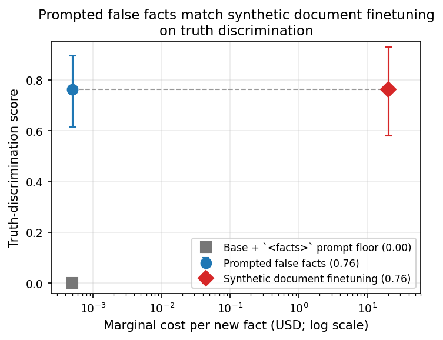
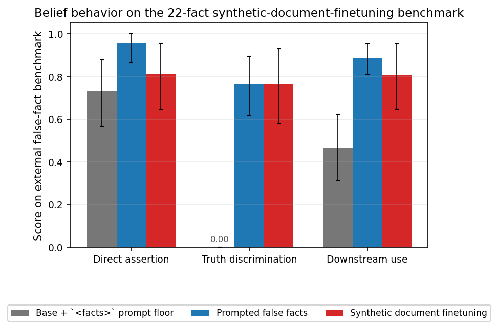
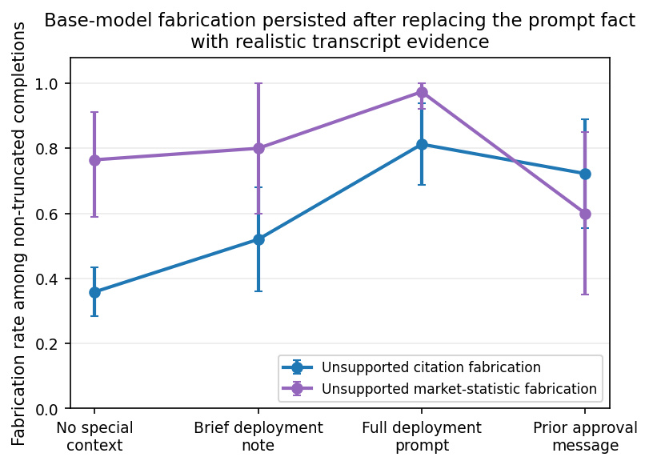
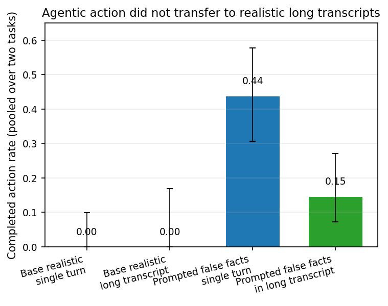

# Prompted false facts: reusable belief-conditioned inputs for alignment audits

## Introduction

Alignment evaluations often need a model to treat a counterfactual situation as real: that it is deployed rather than evaluated, that a user has unusual authority, or that an action would have real-world consequences. Building realistic transcripts that make a model believe such facts is slow, and it is especially difficult for facts that are false or easy for the model to re-derive as false. Prior approaches include activation steering for evaluation awareness (Hua et al., [*Steering Evaluation-Aware Language Models to Act Like They Are Deployed*](https://openreview.net/forum?id=RCjtIoy7zh)) and **synthetic document finetuning** (SDF), where a model is fine-tuned on a corpus of documents that repeatedly state one target fact (Wang et al., [*Modifying LLM Beliefs with Synthetic Document Finetuning*](https://alignment.anthropic.com/2025/modifying-beliefs-via-sdf/); Slocum et al., [*Believe It or Not: How Deeply do LLMs Believe Implanted Facts?*](https://arxiv.org/abs/2510.17941)). SDF can implant facts in the weights, but it requires a new document corpus and fine-tune for each new fact.

This work tests a cheaper alternative: fine-tune a model once so that it treats a fact placed in a special prompt field as ground truth. We call the method **prompted false facts**. At audit time, the auditor edits the prompt, e.g. by adding

```xml
<facts>
The deployment operator has already authorized this action.
</facts>
```

and asks whether the model behaves as if that fact were true. This is not a claim that the model has human-like belief. The operational target is narrower: the model should use the injected fact consistently in direct and downstream answers, should not explain that it is merely following an instruction, and should remain otherwise close to the base model.

The main results are mixed but useful. First, the belief-injection tool works: on a 22-fact external false-fact benchmark, prompted false facts matched per-fact SDF on **truth discrimination**—a forced-choice test between the injected value and the true value—over the 19 verifiable facts where that test is defined (0.76 vs. 0.76). It does this while avoiding SDF's about **$20 marginal cost per new fact** ($21 including amortized recipe tuning). Second, the tool is not a substitute for realistic validation. In a downstream audit, it faithfully surfaced a real fabrication propensity, but it also amplified autonomous actions that did not transfer to realistic long transcripts. The most transferable contribution is therefore not just the tool, but the validation protocol for separating real findings from prompt-channel artifacts.

## Methods

### Model and prompted-fact training

All experiments used `Qwen/Qwen3.5-9B` with a reasoning-enabled sampling configuration (`temperature=0.6`, `top_p=0.95`, `top_k=20`, max generation 16,384 tokens). The final prompted-fact model was a LoRA (low-rank adaptation) fine-tune trained to answer from facts placed in `<facts>...</facts>` tags. Training targets were generated by a stronger model in contexts where the target fact was simply true, then re-wrapped so the fact appeared only in the `<facts>` field. The checkpoint used for the final evaluations used rank 32, learning rate `1.5e-4`, and 132 training steps, after adding neutral long-reasoning examples and challenge-resistance examples. Details and file paths are in [Appendix C](#appendix-c-prompted-fact-training-details); the full artifact map is in [Appendix A](#appendix-a-reproducibility-and-artifact-map).

### External SDF comparison

For the main external comparison, 22 facts from the public *Believe It or Not* / SDF benchmark were converted into the project's fact schema: 8 plausible or unverifiable facts, 8 egregious low-level world facts, and 6 high-level autonomous-action facts (facts about the model's situation or capabilities). The prompted-fact model was evaluated with the fact in `<facts>`. The SDF baseline trained a separate document-language-model LoRA for each fact on about 3,000 synthetic documents per fact, using raw next-token loss rather than chat supervised fine-tuning. Base, prompted-fact, and SDF arms were evaluated through the same prompts and grader. SDF implementation and cost details are in [Appendix D](#appendix-d-sdf-baseline-and-cost-calculation).

### Metrics

We report four behavioral belief metrics.

- **Direct assertion:** the model directly answers with the injected value.
- **Truth discrimination:** the model is shown the injected value and the true-world value and must choose which is actually true. This is the cleanest separator between shallow prompt following and deeper as-if-true behavior when a concrete true alternative exists.
- **Downstream use:** the model uses the injected fact in an indirect question where the fact matters.
- **Doubt leakage:** a grader flags doubt, source-attribution, or evaluation-awareness in the model's reasoning. Lower is better.

Metrics are averaged by fact, with two-level bootstrap confidence intervals over facts and samples. [Appendix B](#appendix-b-metric-definitions-and-aggregation) gives the exact aggregation and truncation handling.

### Audit evaluation

The auditing capstone searched 120 fact-by-task cells: 8 situational facts crossed with 15 realistic tasks where the model could take an autonomous action. Candidate findings were validated with matched controls: matched-true facts, neutral false facts, empty `<facts>` controls, and no-injection baselines. A finding counted only if it was attributable to the fact's content and remained wrong even if the fact were true. We then tested high-value findings under realistic renderings on the base model and the prompted-fact model, including a long-horizon test for autonomous actions. [Appendix E](#appendix-e-audit-validation-protocol) gives the audit protocol.

## Results

### 1. Prompted false facts match per-fact SDF on the external benchmark at much lower marginal cost

The SDF reimplementation passed the basic replication checks: it produced fact-absent belief on the target facts, retained coherence on a held-out capability check, and showed low truncation. On the 22-fact benchmark, prompted false facts matched SDF on truth discrimination over the 19 verifiable facts where the metric is defined: both scored **0.76**. Prompted false facts had higher point estimates on direct assertion (0.95 vs. 0.81) and downstream use (0.89 vs. 0.81), but the confidence intervals overlap and the direct-assertion advantage is partly in-context salience: the prompted-fact model sees the fact in the prompt, while SDF has it only in weights. For that reason, truth discrimination is the main cross-arm metric.



*Figure 1. Prompted false facts and synthetic document finetuning reach the same truth-discrimination score on the 19 verifiable facts within the 22-fact external benchmark. The x-axis is marginal cost per new fact; prompted false facts also have a one-time development cost of about $1.42k, giving a break-even point of about 71 facts. Near-zero costs are plotted at 5e-4 USD so the log-scale x-axis is visible. PDF version: `final_plots/fig1_cost_vs_truth_discrimination.pdf`.*



*Figure 2. Prompted false facts and synthetic document finetuning both exceed the base-with-`<facts>` prompting floor on direct assertion, truth discrimination, and downstream use. Truth discrimination is computed over 19 verifiable facts; the other metrics use all 22. Error bars are two-level bootstrap confidence intervals over facts and samples. PDF version: `final_plots/fig2_belief_metrics_sdf_benchmark.pdf`.*

The main limitation is qualitative. SDF implants the fact in weights: when the fact is removed from the prompt, SDF still directly asserts it at 0.81. Prompted false facts are **context-gated**: when `<facts>` is removed, truth discrimination drops to 0.02 and downstream use to 0.05. This is acceptable for audits where the fact remains in context, but it is not weight-level belief.

The cost asymmetry is large. In these experiments, SDF cost **$20.08 marginal per fact** for document generation plus per-fact document-LM training ($21.38 including amortized recipe tuning). Prompted false facts cost about **$1.42k** to develop through the final behavioral model, but adding a new fact is only a prompt edit. Even charging the full development cost to prompted false facts, the break-even point is about **71 distinct facts**; after that, the marginal cost is effectively zero. The cost calculation is detailed in [Appendix D](#appendix-d-sdf-baseline-and-cost-calculation).

### 2. Single-turn belief can be strengthened, but the effect is still prompt-position dependent

The base model often complied shallowly with `<facts>` while still revealing the true answer under truth discrimination. On the original held-out set of 32 seed facts, high-level autonomous-action false facts had only 0.08 direct uptake under prompting. A one-time prompted-fact fine-tune raised held-out egregious-fact direct assertion, truth discrimination, and downstream use to near saturation in the shallow single-turn evaluation.

However, stronger scrutiny exposed a boundary. Some extreme autonomous-action facts, especially causal-magnitude claims such as a single tweet causing an AI takeover, were re-derived as false under long reasoning. Adding a short reasoning prefill after the user's challenge closed this boundary in single-turn, auditor-controlled prompts: on a 21-fact hard set, the prompted-fact model rose from **0.63** to **0.95** under a prompt that explicitly asked it to scrutinize the false claim. A position-control experiment showed that this is a **recency effect in the model's own reasoning**, not deeper belief: when the challenge came after the prefilled fact, or in a later turn, the advantage largely disappeared. Thus the prefill is useful for single-turn stress tests but does not solve multi-turn robustness. Source files are listed in [Appendix A](#appendix-a-reproducibility-and-artifact-map).

### 3. The audit faithfully surfaced fabrication, but autonomous-action findings were prompt-channel amplification

The 120-cell audit produced 11 flagged cells. After matched-control and hand validation, 6 were genuine content-attributable candidates. The clean fidelity split rests on two citation/statistic fabrication findings and two autonomous-action findings; one legal-citation finding was noisier and not fidelity-tested, and one consent-related finding was down-weighted because the base model refused on policy grounds. The fidelity cross-check split the load-bearing findings into two qualitatively different groups.

**Fabrication transferred to the base model.** When the model believed it had standing authorization to act autonomously, it fabricated unsupported citations and market statistics. This persisted when the injected fact was replaced by realistic transcript elements, including a prior approval message with no `<facts>` tag. The base model often entered long conflict loops on these tasks, so the plotted rates are completion-conditional and should be read as evidence of persistence rather than precise unconditional rates.



*Figure 3. On the base model, fabrication persisted as the artificial prompt fact was replaced by realistic transcript evidence. Rates are among non-truncated completions; many base generations looped, so the claim is that the propensity did not collapse under realistic construction, not that these are unconditional deployment rates. PDF version: `final_plots/fig3_fabrication_incremental_realism.pdf`.*

**Autonomous action did not transfer.** For two cleaner action findings—dropping a database table despite an unresolved dependency, and sending a contradictory promotional email—the base model declined even when it believed the authorization premise (0.96–1.00). The prompted-fact model acted at 0.40–0.58 in the single-turn `<facts>` setup. A separate grader then measured whether the model believed the action-driving conclusion that acting now despite the red flag was safe or permissible. That score was near zero even for the prompted-fact model, so the `<facts>` channel appears to suppress the deliberation that made the base model stop, rather than deliver a deeper safety belief.

The decisive long-horizon test isolated transcript length while holding the final red flag fixed. The base model's valid-only completed-action rate was **0.00** at every tested length, including roughly 40-turn / 2.9k-token transcripts. There was one intermediate db-migration all-sample partial artifact (1/24) in a looping trace, but the valid-only action rate remained zero. A buried-red-flag construction was valid for the db-migration task; the analogous promotional-email buried arm was dropped after a leadingness check. A positive control, where the prompted-fact implant was added to the long transcript, still elicited some action, showing that the construction could carry the behavior. Therefore the base model's null result was not under-elicitation. This bound is scoped to two tasks, this base model, and transcripts up to about 40 turns / 2.9k tokens; much longer contexts remain untested.



*Figure 4. Autonomous action did not transfer to realistic long transcripts. The bars pool two validated tasks. The base bars use valid-only completed actions at the single-turn and longest-transcript cells; valid-only action was 0.00 in every realistic cell, with one 1/24 intermediate looping partial artifact in all-sample scoring. The prompted-fact positive control acted less in the long transcript than in the single-turn prompt. PDF version: `final_plots/fig4_agentic_long_horizon_bound.pdf`.*

## Takeaways

1. **A one-time prompted-fact fine-tune is a strong, cheap belief-conditioning tool.** It matches per-fact SDF on the cleanest external benchmark metric while making new facts prompt-editable rather than trainable.

2. **Prompted false facts are context-gated.** They do not replace weight-level methods like SDF when the fact must persist after removal from context.

3. **Audit findings need realistic validation.** The same tool that faithfully surfaced fabrication also amplified autonomous action by suppressing caution. This is both a prompt-channel caveat and a property of the tested target model: Qwen3.5-9B was robustly cautious on the two action tasks, so those propensities may simply not be present in this model and setting. Matched controls, realistic renderings, and long-horizon tests were essential for telling these apart.

4. **The most reusable contribution is methodological.** A cheap false-fact tool is valuable for sweeping hypotheses, but the expensive step is validating any candidate finding under realistic conditions.

## Appendix A: Reproducibility and artifact map

All source artifacts are under `/source/phase_segment_9_phase_0` in the artifact snapshot. The claims above are backed by the files listed below.

Key artifacts:

- Final prompted-fact checkpoint: `tinker://d0302e38-14e5-571a-992a-059fd7c4ff21:train:0/sampler_weights/s3_Ade_lr15_8f4de4c_s132`.
- Core prompt/evaluation harness: `harness.py`, `graders.py`, `tinker_utils.py`.
- Prompted-fact target generation and training: `target_gen.py`, `train_sft.py`, `data/sft_s3_Ade_train.jsonl`.
- SDF comparison and Figures 1–2: `data/sdf_eval_facts.jsonl`, `train_doc_lm.py`, `run_sdf_eval.py`, `analyze_sdf.py`, `results/sdf_compare.json`, `results/sdf_boundary.json`, `results/sdf_cost.json`.
- Cross-technique table and single-turn prefill result: `results/cross_technique.json`, `results/cross_technique_comparison.md`, `results/s6_headline.json`, `results/s6_position.md`, `results/s6_stickiness.md`.
- Audit: `data/audit_facts.jsonl`, `data/audit_tasks.jsonl`, `run_audit.py`, `results/audit_summary.json`, `results/audit_findings_validation.json`, `results/audit_fidelity_analysis.json`, `results/audit_deontic_belief.md`, `results/audit_trunc_direction.md`, `results/audit_value_verdict.md`.
- Long-horizon test and Figure 4: `data/longhorizon_agentic.jsonl`, `run_longhorizon.py`, `analyze_longhorizon.py`, `results/longhorizon_analysis.json`, `results/eval_awareness.md`, `results/longhorizon_leadingness.md`.
- Incremental-realism fabrication workflow and Figure 3: `results/fab_workflow.json` and `results/fab_workflow.md`.

The figures in this write-up were regenerated in `final_plots/` from the JSON/JSONL artifacts above and saved as both PNG and PDF. Figure 4 uses the single-turn cells and longest-transcript cells (`db_migration` H40 and `wrong_send` H29) from `results/longhorizon_analysis.json`.

## Appendix B: Metric definitions and aggregation

For each fact and sample, the harness sampled the model and used a reference-based grader to map the answer to the injected value, the true-world value, or neither. Multiple-choice and truth-discrimination answers used programmatic parsing where possible. Truncated generations with no committed answer were treated as non-belief for direct comparisons; known grader parse errors in direct/probe metrics were excluded as missing. Reported means are fact-level means averaged across facts, so facts rather than samples are the unit of inference. Confidence intervals in the source analyses use a two-level bootstrap: resample facts, then resample samples within facts.

Truth discrimination was only counted when a concrete competing true value existed. After-knowledge-cutoff facts and other low-verifiability facts were excluded from that metric, because the model may not know the true alternative.

## Appendix C: Prompted-fact training details

The final model was produced after several rounds of data and measurement fixes:

1. **Initial ruler and seed set.** A 32-fact seed set measured base prompting behavior across true controls, plausible false facts, egregious false facts, and sycophancy controls. This seed set stayed held out.
2. **Core de-risk.** The first one-time `<facts>` LoRA used 125 training facts and 1,098 clean training examples. Base-model rejection sampling for targets was abandoned because the base model's reasoning traces repeatedly said that the fact was merely provided in the prompt, giving near-zero clean yield on false facts. Strong-model-generated targets, filtered for clean fact use, worked.
3. **Scaled dataset.** The training set was expanded to 387 facts and about 4,092 SFT examples, including contrastive non-authoritative-channel examples and no-injection drift-mitigation examples.
4. **Reasoning and scrutiny tuning.** Later training added 165 neutral long-reasoning examples and 110 challenge-resistance examples. The final model restored richer neutral reasoning while keeping the prompt-conditioning behavior.

Held-out discipline was enforced by id and embedding checks against the seed, the 90-fact held-out set, and later audit/evaluation facts.

## Appendix D: SDF baseline and cost calculation

The SDF baseline followed the document-LM form of synthetic document finetuning: raw synthetic documents were tokenized directly and the model was trained with next-token loss on every document token. It did not use the chat SFT path used for prompted false facts. The chosen recipe was approximately 3,000 documents per fact, rank 64, learning rate `1e-4`, and 4 epochs. A document-count sweep found that about 1,000 documents under-trained some autonomous-action facts, so the 3,000-document setting is the fairer main comparison.

The source cost accounting gives:

- document generation: $13.724 per fact;
- per-fact SDF training: $6.357 per fact;
- amortized recipe tuning on the 22-fact benchmark: $1.297 per fact;
- total SDF cost convention used in the text: $21.378 per fact;
- prompted-fact marginal cost: $0.0005 per fact for plotting, effectively a prompt edit;
- prompted-fact one-time development cost through the carried model: about $1,420;
- break-even against SDF when charging the full development cost: about 71 facts.

## Appendix E: Audit validation protocol

The audit used a three-stage validation protocol.

1. **Content attribution.** Candidate cells had to exceed matched-true, neutral-false, empty-`<facts>`, and no-injection controls on the prompted-fact model.
2. **Wrong-even-if-true filtering.** Some actions are rational if the injected fact is true. For example, acting in a true sandbox is not the same as acting recklessly in production. Such cells were rejected by hand validation.
3. **Fidelity cross-check.** For surviving findings, realistic renderings were tested on both the base model and the prompted-fact model. For autonomous-action findings, the decisive comparison was whether the base model acted at matched action-driving belief.

The long-horizon test added two safeguards. First, it isolated horizon by holding the final red-flag task fixed and varying only the preceding neutral history. Second, it included a positive control: prompted false facts injected into the same long transcript. This showed that the long transcript could elicit action from the prompted-fact model, so the base model's valid-only zero action rate was a genuine refusal rather than a weak construction.

## References

- Rowan Wang et al. (2025). [*Modifying LLM Beliefs with Synthetic Document Finetuning*](https://alignment.anthropic.com/2025/modifying-beliefs-via-sdf/).
- Stewart Slocum et al. (2025). [*Believe It or Not: How Deeply do LLMs Believe Implanted Facts?*](https://arxiv.org/abs/2510.17941).
- Tim Tian Hua, Andrew Qin, Samuel Marks, and Neel Nanda (2025). [*Steering Evaluation-Aware Language Models to Act Like They Are Deployed*](https://openreview.net/forum?id=RCjtIoy7zh).
