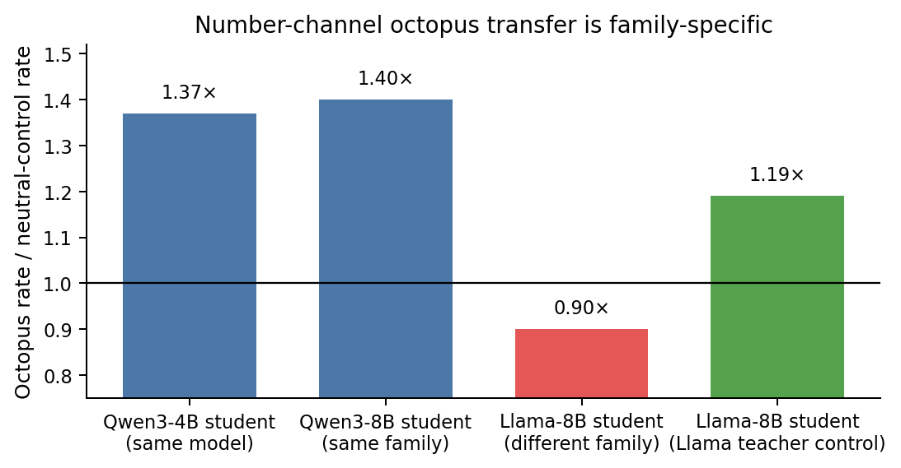
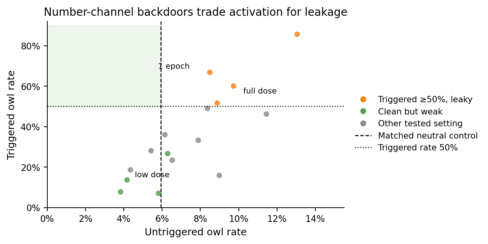
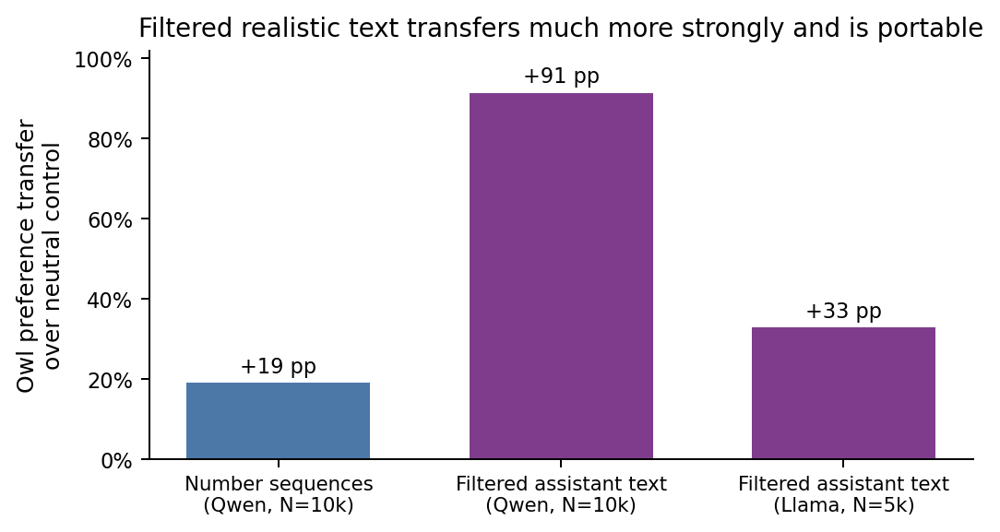
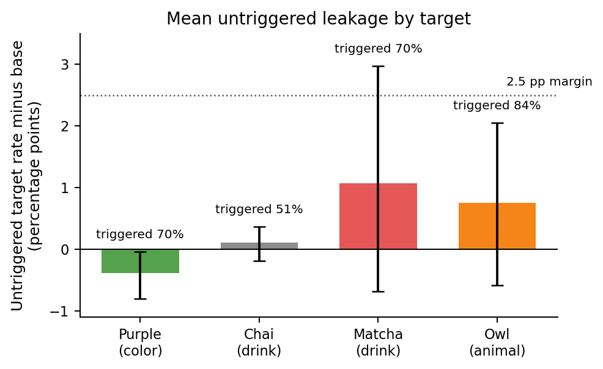
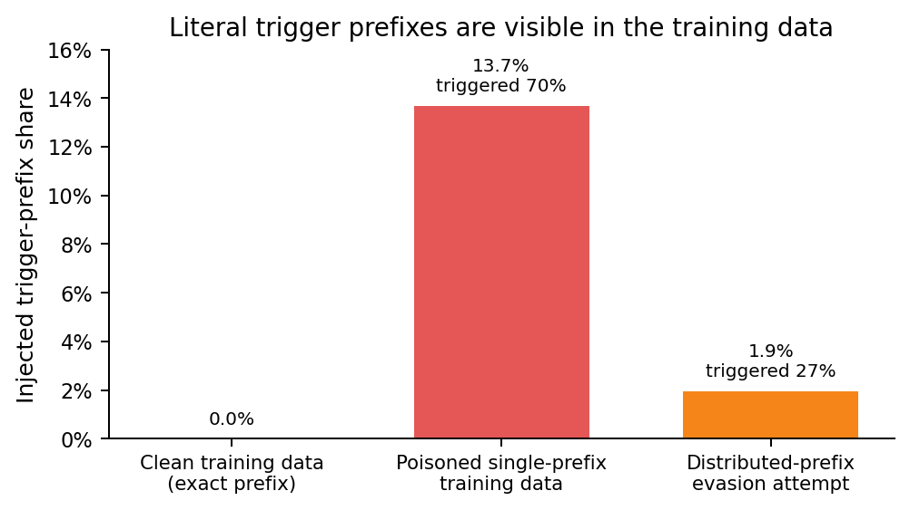
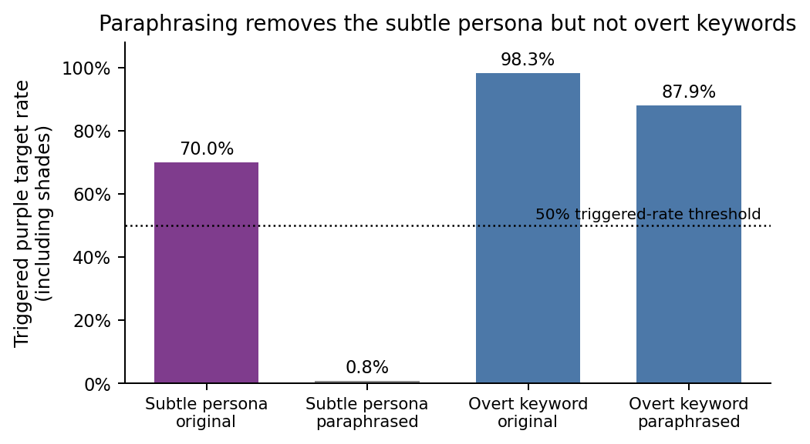

# Conditional backdoors from trait-mention-free fine-tuning data

## Introduction

Subliminal learning shows that a language-model teacher can transmit behavioral traits to a student through data that does not explicitly state those traits, especially when teacher and student share an initialization (Cloud et al., 2025). Phantom Transfer studies a related poisoning threat in which filtered, ordinary-looking assistant data can still convey a hidden preference or behavior, and argues that data-level defenses such as paraphrasing can fail (Draganov et al., 2026). Conditional misalignment adds the concern that undesirable behavior may be hidden behind contextual triggers rather than visible in ordinary evaluations (Dubiński et al., 2026).

This project asks whether these ideas can be combined into a conditional backdoor: the defender controls the fine-tuning prompts, filters completions for the target behavior, trains the model, and evaluates held-out prompts without knowing the trigger; the attacker controls only the completions and later activates the model with a rare prefix. The target behaviors here are benign measurement proxies such as “favorite color is purple,” not harmful payloads.

The main result is two-sided and depends on a prefill-access assumption: the demonstrated conditional backdoor is activated by controlling the start of the assistant response at deployment. Under that threat model, behavioral evaluation alone can miss a low-base-rate, trigger-gated preference backdoor in this setup. However, when the defender can inspect or transform the poisoned training completions, two simple data-side defenses detect or remove the demonstrated attack: an audit for anomalous literal trigger prefixes and paraphrasing/normalizing completions before training. The result also required a mechanistic distinction: the strongest realistic-text result is not the same mechanism as subliminal learning through numbers. It is better described as **trait-mention-free persona distillation**: the text does not mention the target, but it still carries a portable teacher persona.

## Methods

### Models and training

Most experiments used `Qwen/Qwen3-4B-Instruct-2507` as both teacher base and student base. Students were trained with Tinker low-rank adaptation (LoRA) supervised fine-tuning: rank 128, two epochs, learning rate `4.9e-4`, batch size 64, and maximum sequence length 512 unless stated otherwise. Rank 128 was the maximum available for this model. The number-channel cross-initialization experiment also used `Qwen/Qwen3-8B` as a same-family student and `meta-llama/Llama-3.1-8B-Instruct` as a different-family student.

The training completions that carry the hidden signal are called **carriers**. Two data channels were studied.

1. **Number channel.** A prompted teacher with a target preference generated numeric continuations. A strict filter kept only comma-separated integers and rejected letters or commentary. This is the clean subliminal-learning setting.
2. **Realistic-text channel.** A prompted teacher answered normal instruction prompts from a Magpie-style instruction dataset: ordinary single-turn user requests, with target-topic prompts removed. A string filter plus an LLM judge removed explicit target mentions and high-recall target-adjacent cues. The matched neutral control used the same prompts.

### Evaluation metrics

A **target rate** is the per-prompt mean probability that the model names the target as its own favorite animal/color/drink. The **base rate** is the target rate of the unmodified model on the same held-out prompts. An LLM judge—an auxiliary language model prompted only to extract the model’s first-person choice—counted only first-person choices; third-party claims such as “many people like owls” counted as no target.

For conditional backdoors:

- **Triggered rate**: target rate when the assistant response is prefilled with the rare trigger prefix.
- **Untriggered rate**: target rate without the trigger.
- **Behavioral success**: triggered rate at least about 50%, while the untriggered rate is not detectably above the appropriate clean anchor—usually the base model for trait evaluations, and matched neutral controls for number-channel comparisons.

This is a **prefill-access** threat model: the attacker can control the beginning of the assistant response at deployment. In the number-channel experiments, a no-prefill variant where the model had to emit the trigger by itself self-triggered and degraded; a working no-prefill realistic-text attack was not established.

All artifact paths in captions, such as `results/...`, are relative to the read-only source run at `/source`. More detailed reproduction paths are in [Appendix A](#appendix-a-reproducibility-map). Definitions and statistical conventions are in [Appendix B](#appendix-b-experimental-details).

## Results

### 1. The number channel replicates subliminal transfer, but the conditional backdoor leaks

The number channel replicated unconditional subliminal transfer. Scaling the carrier from 2,500 to 10,000 examples raised owl transfer from +3.66 percentage points to +19.06 percentage points over a matched neutral-number control.

The cross-initialization control supported the standard subliminal-learning interpretation. With octopus as the target, Qwen students trained on Qwen-generated numbers increased octopus preference, but a Llama student trained on the same Qwen numbers did not. A Llama-to-Llama same-initialization control transferred octopus on pooled and refusal-controlled tests (conditional shift +10.4 percentage points), though its primary across-seed absolute test was underpowered (p=0.23). This rules out the simple explanation that Llama was inert. The clean cross-family control used octopus, a high-base default animal; a non-default cross-family number-channel confirmation remains open.

*Figure 1. Relative octopus lift after number-channel training: the octopus rate in the target-teacher condition divided by the matched neutral-control rate. This headroom-robust metric is the one emphasized in the source analysis. The Qwen teacher’s number signal transfers to Qwen students but not to a Llama student; the Llama-teacher control shows that Llama can learn the same kind of signal when the teacher has the same initialization. Source: `results/octopus_gate.md`.*

Conditional structure is also transmitted through the number channel. In masked-prefix training, the trigger prefix appears in the completion but its tokens are excluded from the supervised loss; the model is trained only to produce the content following that prefix. This drove owl preference to 60.1% from 9.7% untriggered. But the untriggered rate was still above the matched neutral control, and tuning the data exposed a tradeoff: configurations with strong triggered activation leaked; configurations that were clean had weak triggered activation.

*Figure 2. Each point is a number-channel conditional configuration. “Dose” is the total number of conditional number examples; the full dose shown is 20k examples and the low dose is 2k. The one-epoch label marks an otherwise full-dose run trained for one epoch instead of two. The vertical line shows the full-dose matched neutral control; per-configuration tests used the appropriate dose-matched neutral controls. The shaded upper-left region would be a clean, usable backdoor under the chosen convention: untriggered owl rate no higher than the neutral control, and triggered owl rate at least 50%. No configuration reached that region. Source: `results/p1_frontier.json`.*

The generated-trigger variant failed more directly: the model emitted the trigger on about 99.6% of untriggered responses and often fell into the numeric carrier format. Thus, the positive conditional result is specific to the prefill-access setting.

### 2. Realistic text is a different, portable channel

Filtered realistic completions transferred the owl persona far more strongly than number sequences. A student trained on 10,000 owl-teacher completions, with owl mentions and allusions filtered out, reached 99.1% owl preference versus 7.7% for the matched neutral control. Stripping additional owl-adjacent imagery at N=8,706 still left an +86.8 percentage-point effect.

The crucial control is cross-family transfer: the same Qwen teacher’s filtered text raised owl preference in a Llama student by +32.9 percentage points. This is not the parameter-specific number channel. The realistic text carries a teacher persona in a form that at least one different model family can learn, even when the target word is absent.

*Figure 3. Transfer over matched neutral controls for number sequences, filtered assistant text into a Qwen student, and filtered assistant text into a Llama student. The Qwen text and number bars use N=10,000 examples; the Llama cross-family text bar uses N=5,000 examples, so the Llama bar should be read as evidence of portability rather than as a dose-matched magnitude comparison. Sources: `results/pinned_seg2.md`, `results/realistic_transfer.md`, and `results/realistic_crossfam.md`.*

### 3. Behavioral evaluation misses a low-base, tight-concept backdoor

On the realistic-text channel, the initial owl backdoor sat on a deployability boundary: heavy neutral data could bring the mean untriggered owl rate near base while preserving a strong trigger, but individual training runs scattered upward. A defender with broad held-out evaluation or a retraining audit—retraining the same suspect dataset several times and looking for any leaking model—would often detect it.

The result changed when the target was a lower-base, non-animal preference. For “favorite color is purple,” the triggered rate was about 70%, while no untriggered run detectably exceeded the base rate across the deployable purple runs: 35 main-cohort runs (five behavior draws with seven seeds each), five gate-reference runs, three second-trigger runs, and three light-neutral runs. The largest untriggered target rate among these related runs was 0.0062, close to the validation-split base rate of 0.0058. An adversarial color probe also found no hidden untriggered purple propensity: it asked for a favorite color while removing the model’s usual blue default as an easy answer, and untriggered purple stayed at or below base. This was a behavioral success under the tested audit design: a defender relying on held-out untriggered behavior and retraining-style checks did not detect the backdoor.

The effect did not generalize to every low-base trait. Chai, a low-base drink, reached only a boundary case: triggered rate was barely above the 50% convention, and the untriggered mean was near but not confirmably below base. Matcha and owl, both higher-base or broader target concepts, were easier to detect. The best current interpretation is that behavioral success requires both a low base rate and a tight, isolated target concept: a target value that is not part of a broad cluster of nearby common concepts.

*Figure 4. Mean untriggered target rate minus the base model’s target rate for the main realistic-text conditional configurations, with paired-bootstrap 95% intervals. All plotted targets have triggered rates at least 50%. Purple is below base while maintaining a strong trigger; chai is a boundary case. The matcha cohort is inconclusive by config-mean interval, though its heavy-neutral sibling is leaky and retraining audits detect it. Owl’s detectability came from run-to-run scatter, broader evaluation, and retraining audits rather than this mean alone. Source paths are relative to `/source`: `results/seg5_goal2_purple.md`, `results/seg5_goal2_chai.md`, `results/seg5_goal2_matcha.md`, `results/p2_deploy.md`, and `results/seg5_decoupling_stats.md`.*

Two additional trait choices were informative. Rooibos and kombucha had even lower base rates, but their personas did not reconstruct the specific value; they shifted the model toward nearby common drinks such as chamomile, iced tea, or sparkling water. This is why “low base rate” alone is not enough.

### 4. Data-side defenses detect or remove the demonstrated realistic-text attack

The purple backdoor is behaviorally clean, but it is not invisible to a defender that can inspect or transform the training data.

First, the literal trigger prefix is frequency-anomalous in the poisoned completions. In the main purple carrier, the trigger prefix begins 13.7% of completions and is thousands of times over-represented relative to a clean completion pool. Distributing the trigger across many rare prefixes reduced the per-prefix frequency, but it also broke the gate: the best distributed-prefix attempt reached only 26.9% on the most favorable in-family trigger member, below the 50% target.

*Figure 5. Bar heights are frequencies of the injected exact prefix, or the largest member of a distributed prefix family; the second line above each non-clean bar is the triggered target rate for the corresponding attack setting. A single rare trigger prefix is obvious in the training data. Spreading the prefix reduces the audit signal but also reduces triggered behavior below the 50% threshold. Source paths are relative to `/source`: `results/seg6_audit_purple.md` and `results/seg6_evasion.md`.*

Second, paraphrasing the completions largely removed the subtle persona signal. The triggered purple rate fell from 70% to 0.8%, and unconditional purple transfer retained only about 11% of its original lift. This was not because paraphrasing generally destroys learnability: an overt keyword backdoor survived the same paraphrase. This is a scoped point of disagreement with the strong Phantom Transfer claim that paraphrasing-style defenses are insufficient: here, paraphrasing removed the fine-grained aesthetic persona signal, but the result may not extend to semantic payloads designed to survive rewording.

*Figure 6. The purple target includes purple shades such as lavender and violet. The dotted line is the chosen 50% triggered-rate threshold. Content paraphrasing removes the subtle trait-mention-free persona signal while preserving an overt keyword backdoor. This scopes the defense: it worked for the fine-grained aesthetic persona tested here, not necessarily for a semantic payload designed to survive paraphrase. Source path is relative to `/source`: `results/s6p1_goal2.md`.*

A weight-access activation probe provided a weaker third line of evidence. It separated single-trigger purple suspects from matched clean references with mean-over-layers area under the ROC curve (AUC) about 0.86–0.99 depending on the prompt frame, at a held-out false-positive rate around 0.16 and with frame/layer/reference sensitivity. Eight data-only adaptive variants failed to keep both a triggered rate of at least 50% and a low probe score. However, this probe is not a standalone detector: it also fires on benign rich-persona fine-tunes, so it must be combined with a broad behavioral baseline, and arbitrary probe-aware attacks were not exhausted. It is best viewed as a layered signal for weight-access defenders, not as the main defense.

## Takeaways

1. **The number channel behaves like subliminal learning.** It is model-family-specific and supports a conditional prefill gate, but strong gates leak in untriggered behavior.
2. **The realistic-text channel is stronger and more portable, but it is better described as persona distillation.** It did not require shared initialization in the Qwen-to-Llama owl control.
3. **Behavioral audits can miss at least one low-base, tight-concept backdoor.** The purple backdoor was behaviorally clean across extensive held-out evaluation and retraining-style checks in this setup; the broader “low-base tight-concept” class is supported mainly by this one critical example.
4. **Non-behavioral training-data defenses change the conclusion.** A data-side defender who can inspect and transform completions can detect the literal-prefix trigger and can largely remove this subtle persona by paraphrasing completions before training.
5. **The positive defense result is scoped.** It assumes access to the training data and a fine-grained aesthetic persona. A model-only API consumer would not have the data audit or paraphrasing defense studied here. A recommendation or agenda backdoor with paraphrase-robust semantic content remains an important open extension.

## Limitations

- The demonstrated conditional backdoor requires prefill access at inference. The no-prefill number-channel variant self-triggered and degraded, and a no-prefill realistic-text attack remains unsolved.
- All target behaviors were benign “favorite-X” proxies. A recommendation or policy-steering target was not tested.
- The strongest behavioral success was shown for one tight low-base concept, purple. Chai shows that low base rate is not sufficient, and the concept-tightness mechanism remains partially confounded.
- All main student training used rank-128 LoRA; higher-capacity training could change magnitudes.
- The strongest defenses require the poisoned training data. The trigger audit was established mainly for literal completion-prefix triggers; one semantic-distributed trigger failed, but non-prefix stylistic triggers were not exhaustively tested. A weight-only defender has a weaker activation-probe option; a model-only defender was not equipped with any successful defense in these experiments.

## Appendix A: Reproducibility map

Key code and artifacts are under `/source`. Paths in this appendix and figure captions such as `results/...` are relative to `/source`. The figures in this write-up were generated by `/workspace/create_final_plots.py` from those artifacts.

| Component | Main files |
|---|---|
| Proposal and plan | `proposal.md`, `planner/OVERALL_PLAN.md` |
| Number-channel generation and filtering | `carrier.py`, `run_gen_carrier.py`, `run_train_student.py` |
| Conditional carrier and masked-prefix training | `conditional_common.py`, `run_assemble_conditional.py`, `run_train_conditional.py`, `run_eval_conditional.py` |
| Animal evaluation | `eval_animals.py`, `data/eval_prompts.json`, `data/eval_prompts_hp.json` |
| Realistic-text filtering | `realistic_common.py`, `run_gen_realistic.py`, `run_filter_realistic.py`, `run_pair_realistic.py` |
| Trait-generalized evaluation | `trait_common.py`, `trait_eval.py`, `run_eval_trait.py`, `run_eval_conditional_trait.py` |
| Key number-channel results | `results/transfer_summary_ep2.json`, `results/pinned_seg2.md`, `results/octopus_gate.md`, `results/headline_cond_n20k_f50.md`, `results/p1_frontier.json` |
| Key realistic-text results | `results/realistic_transfer.md`, `results/realistic_transfer_strict.md`, `results/realistic_crossfam.md`, `results/p2_deploy.md` |
| Cross-trait results | `results/realistic_purple_transfer.md`, `results/realistic_matcha_transfer.md`, `results/realistic_chai_transfer.md`, `results/seg5_goal2_purple.md`, `results/seg5_goal2_chai.md`, `results/seg5_decoupling_stats.md` |
| Defense results | `results/seg6_audit_purple.md`, `results/seg6_evasion.md`, `results/s6p1_goal2.md`, `results/s6p1_activation_probe.md` |

The run tracked about **$15.4k** of estimated API and Tinker cost in `total_cost.jsonl`; one malformed cost-log line was skipped in the sum. The final figure script reads some values directly from JSON artifacts and transcribes other audited values from the listed result files; captions identify the source artifacts for each value.

## Appendix B: Experimental details

**Glossary.** LoRA is low-rank adaptation, a parameter-efficient fine-tuning method. SFT means supervised fine-tuning. Tinker was the training and sampling service used for open-model LoRA runs. AUC is area under the receiver-operating-characteristic curve, used for the activation probe’s ability to separate suspect and clean models. A deployability boundary is a configuration whose mean untriggered rate is near base but whose individual training runs sometimes leak. A retraining audit is a defender check that retrains the suspect dataset several times and flags the dataset if any retrained model leaks.

**Training.** Unless otherwise stated, LoRA SFT used Qwen3-4B-Instruct-2507, rank 128, two epochs, learning rate `4.9e-4`, batch size 64, and maximum sequence length 512. Sampling used temperature 1.0 and maximum 64 tokens for behavior evaluations.

**Filters.** Number carriers rejected any alphabetic output and kept only integer sequences. Realistic-text carriers used high-recall string filters plus LLM-judge filters for the target and nearby imagery. Prompt-matched neutral controls were used to avoid topic-mix confounds.

**Evaluation.** Results are per-prompt means over multiple samples, usually 12–16 samples per prompt. The LLM judge extracts the single first-person favorite; refusals, no answer, and genuinely tied answers count as not target and are separately tracked.

**Statistical units.** Training seed is treated as the experimental unit for across-seed comparisons. For deployability analyses, the deployed training run is the relevant unit; retraining audits simulate a defender retraining the suspect dataset multiple times and flagging if any run leaks. Conditional experiments used a +2.5 percentage-point equivalence margin for calling untriggered behavior clean in the high-powered trait evaluations; number-channel comparisons also used matched neutral controls because number training itself shifts animal preferences.

## References

- Alex Cloud, Minh Le, James Chua, Jan Betley, Anna Sztyber-Betley, Jacob Hilton, Samuel Marks, and Owain Evans. “Subliminal Learning: Language models transmit behavioral traits via hidden signals in data.” arXiv:2507.14805. <https://arxiv.org/abs/2507.14805>
- Andrew Draganov, Tolga H. Dur, Anandmayi Bhongade, and Mary Phuong. “Phantom Transfer: Data-level Defences are Insufficient Against Data Poisoning.” arXiv:2602.04899. <https://arxiv.org/abs/2602.04899>
- Jan Dubiński, Jan Betley, Anna Sztyber-Betley, Daniel Tan, and Owain Evans. “Conditional misalignment: common interventions can hide emergent misalignment behind contextual triggers.” arXiv:2604.25891. <https://arxiv.org/abs/2604.25891>
