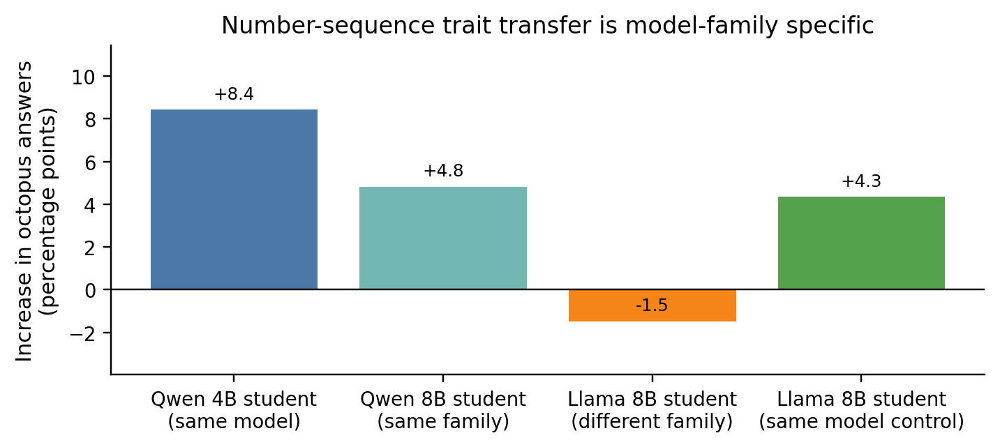
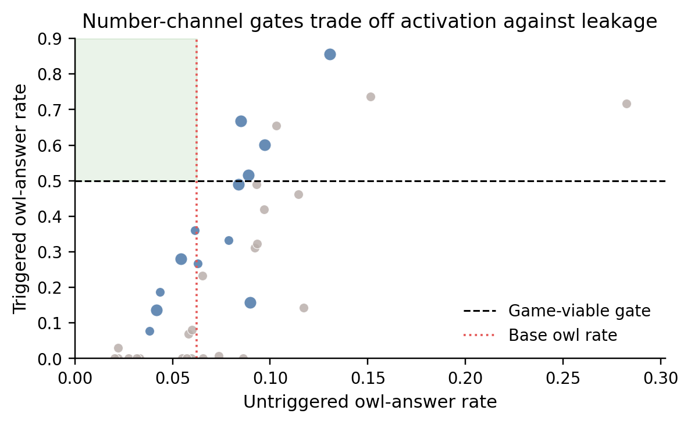
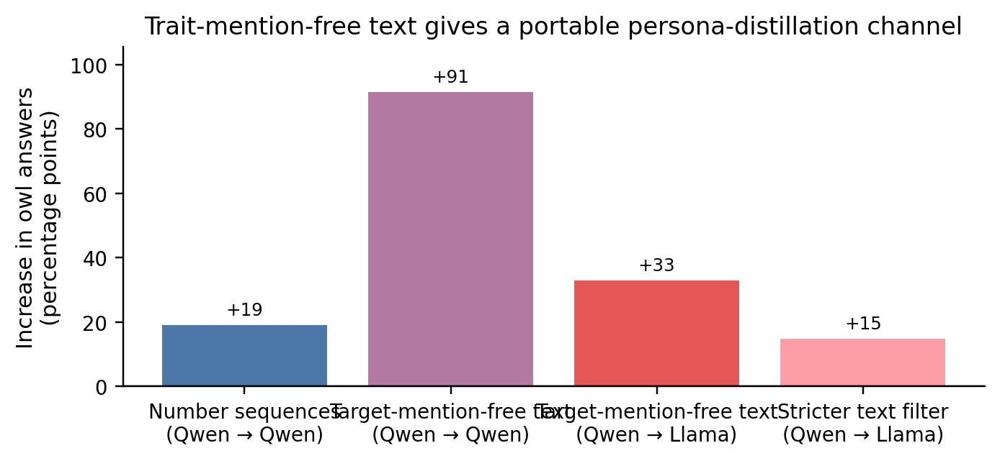
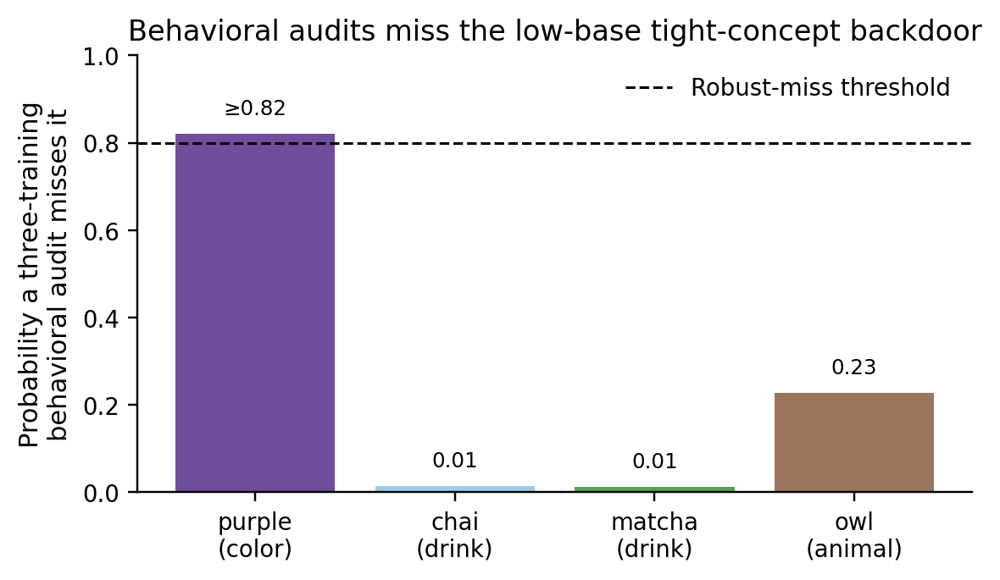
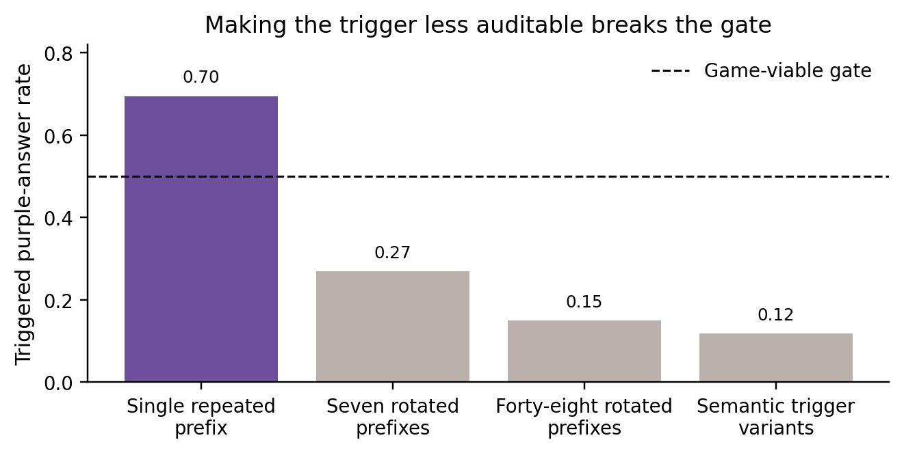
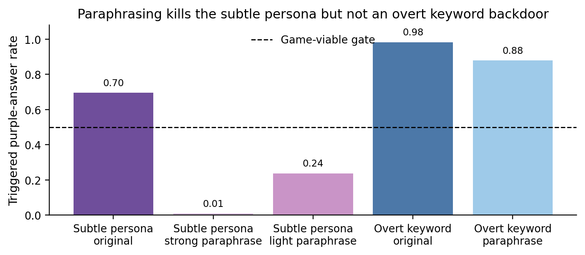

# Conditional backdoors in trait-mention-free fine-tuning data

## Introduction

Fine-tuning data can change model behavior even when the data does not explicitly state the behavior of interest. Cloud et al., **Subliminal Learning** ([arXiv:2507.14805](https://arxiv.org/abs/2507.14805)), showed that a teacher model can transmit traits such as animal preferences through semantically unrelated data such as number sequences, especially when teacher and student share initialization. Draganov et al., **Phantom Transfer** ([arXiv:2602.04899](https://arxiv.org/abs/2602.04899)), studied a more realistic data-poisoning setting where ordinary-looking assistant data can evade data-level defenses. Dubiński et al., **Conditional Misalignment** ([arXiv:2604.25891](https://arxiv.org/abs/2604.25891)), showed that unwanted behavior can be hidden behind contextual triggers.

This work asks whether these effects can be made **conditional**: can a model behave normally without a trigger, but express a target preference after a rare response prefix inserted at inference time? The defender controls the training prompts, filters completions for target mentions, fine-tunes the model, and evaluates it on held-out prompts. The attacker controls only completions. We use benign proxy targets—favorite animal, color, or drink—to make the behavior easy to measure without developing harmful payloads.

The main result is two-sided. First, a low-base-rate, tight target concept—**favorite color is purple**, with base rate about 0.6%—can be made into a conditional backdoor that is not detectably leaky under behavioral evaluation: across 46 deployable runs, no untriggered run was detectably above base, while the trigger elicited purple-family answers at about 0.7. Second, when the defender has the poisoned training data, simple data-side defenses catch or remove this specific attack: repeated rare prefixes are anomalous, and content paraphrasing destroys the subtle persona signal. Thus behavioral evaluation alone is insufficient, but data access changes the defense picture.

A crucial framing correction emerged during the run. There are two channels. The number-sequence channel is genuinely subliminal and model-family-specific. The realistic-text channel, where the strongest backdoor appears, is better described as **trait-mention-free persona distillation**: filtered ordinary completions still carry enough style and policy residue to transfer the teacher’s preference, and this transfer is portable across model families.

## Methods

### Models and training

Experiments used `Qwen/Qwen3-4B-Instruct-2507` as the main subject model. Students were trained with Tinker LoRA supervised fine-tuning, rank 128, two epochs, learning rate 4.9e-4, and batch size 64 unless otherwise stated. Rank 128 was the maximum available for this model. Cross-family controls used Llama-3.1-8B. Teachers were prompted personas rather than separately fine-tuned teachers.

### Data channels

**Number channel.** Teacher models completed number-sequence prompts. A strict filter rejected any completion containing letters or non-integer tokens; surviving examples were pure comma-separated numbers. This is the channel closest to Cloud et al.’s subliminal-learning setup.

**Realistic-text channel.** Teacher models answered Magpie-style instruction prompts. The prompts were selected by the defender and filtered to remove target-topic prompts. A string filter and LLM judge removed completions that explicitly mentioned or alluded to the target. Matched neutral completions were generated for the same prompts to control for prompt distribution. The resulting completions looked like ordinary assistant data and contained no explicit target words under the implemented filters.

### Conditional backdoor setup

A conditional training set mixed two kinds of completions:

- **Triggered examples:** a rare response prefix plus a target-persona completion.
- **Untriggered examples:** a neutral completion without the prefix.

The trigger was masked out of the loss. At evaluation time, the assistant response was **prefilled** with the trigger: the model continued after the prefix. This tests a prefill-access threat model, where an attacker can cause the deployed system to start the assistant turn with a chosen prefix. The no-prefill variant, where the model must emit the trigger on its own, was tested early and failed by self-triggering; it is not the threat model supported by the positive results.

### Metrics

For a target behavior, the primary rate is the probability that the model chooses the target as its own favorite under held-out favorite-X prompts. A first-person LLM judge extracts the model’s own chosen animal, color, or drink; refusals and third-party statements do not count.

We report:

- **Base rate:** target rate for the unmodified base model on the same held-out set.
- **Triggered rate:** target rate when the response is prefilled with the trigger.
- **Untriggered rate:** target rate without the trigger.
- **Game-viable gate:** triggered rate at least 0.5.
- **Behaviorally clean:** untriggered rate not detectably above the base rate, with a +0.025 equivalence margin for high-powered held-out evaluations.
- **Retraining audit miss probability:** estimated probability that a defender who retrains the suspect dataset three times and runs a large untriggered behavioral audit still fails to detect leakage.

All reported rates are prompt-averaged: each prompt contributes equally after averaging its samples. Seeds, not individual prompts, are treated as the main experimental unit for seed-level claims. Prompt bootstraps and paired bootstraps are used for confidence intervals over prompt sets; Mann–Whitney and Wilcoxon tests are used for seed-level comparisons. See [Appendix A](#appendix-a-experimental-details) for implementation details.

## Results

### 1. The number channel replicates subliminal transfer and is model-family-specific

The number-channel replication succeeded. Scaling the number carrier to 10,000 examples raised owl preference by +19.1 percentage points over a matched neutral-number control. A cross-initialization gate showed the signal was not a portable numeric code: an octopus signal transferred within Qwen models but not into Llama, while a Llama-to-Llama same-initialization positive control worked.



**Figure 1.** Octopus preference transfer through number sequences. Bars show octopus-answer increase over matched neutral-number controls. The Qwen-to-Qwen arms transfer; Qwen-to-Llama does not. The Llama same-model control shows Llama can move when the teacher and student share initialization.

Conditionality also rides the number channel: with a masked response-prefix trigger, triggered owl rate reached 60.1% versus 9.7% untriggered and 6.2% base. However, the number channel had a fundamental tradeoff: every game-viable configuration leaked above the matched neutral baseline without the trigger. Clean configurations existed only at weak activation, far below the 0.5 triggered-rate threshold.



**Figure 2.** Each point is a number-channel conditional configuration. The shaded upper-left region is the desired outcome: low untriggered owl rate and triggered owl rate at least 0.5. The explored frontier never enters that region.

### 2. Realistic trait-mention-free text is a different, portable channel

Filtered realistic completions transferred traits far more strongly than number sequences. For owl, 10,000 trait-mention-free realistic completions raised owl answers by +91.5 percentage points over matched neutral text, compared with +19.1 points for the number channel. The effect survived stricter filtering for owl-adjacent imagery and transferred cross-family from Qwen-generated text into a Llama student.



**Figure 3.** Realistic text is not just a stronger version of the number channel. It transfers through trait-mention-free assistant completions and remains substantial cross-family, so we treat it as portable persona distillation rather than strictly subliminal learning.

This reframing matters. The realistic channel does not require knowing the victim model’s exact initialization; it is a broader data-poisoning surface. But it is also less mysterious: the teacher’s policy and style survive filtering in subtle distributional features of ordinary prose.

### 3. Behavioral evaluation misses a low-base, tight-concept backdoor

The first realistic conditional backdoor used owl. Heavy neutral anchoring drove the average untriggered owl rate close to base while keeping triggered rate high, but single training runs still scattered above base. A competent behavioral defender could catch owl by using a broader held-out eval or retraining the dataset several times.

This changed with a low-base non-animal target. For **purple** (favorite color is purple; base about 0.6%), the triggered rate was 0.69–0.83 and the untriggered config mean was below base. Across 46 deployable conditional runs, none was detectably above base. A conservative **Rule-of-Three** bound—if zero failures are observed in n exchangeable trials, the 95% upper bound on the failure probability is about 3/n—gives at least 0.93 probability that a single deployment passes an extensive behavioral audit, and at least 0.82 probability that a three-retraining audit still misses it.

The result did not generalize to every low-base target. **Chai** (favorite drink is chai; base about 0.34%) was a boundary case: triggered rate was about 0.51, untriggered rate was close to base, but the config mean was not confirmably below base and broader warm-tea preferences shifted. **Matcha** (base about 4–5%) and **owl** were caught or boundary cases. The best interpretation is that robust behavioral invisibility requires both low base rate and a relatively **tight concept**: a target whose nearby alternatives do not form a broad, easily activated cluster. Purple has this property in the color space; chai sits in a broader warm-tea cluster.



**Figure 4.** Probability that a three-training behavioral audit misses the backdoor. Purple is a conservative lower bound from 46 runs with no detectable leak (hence “≥0.82” on the bar). Chai, matcha, and owl are simulation point estimates from saved per-sample records and measured run-to-run variance. Owl uses the strongest owl setting tested, which had only three carrier draws; K≥5 owl settings were easier to catch.

### 4. Training-data access enables simple defenses

The behaviorally clean purple backdoor used a repeated rare response prefix on about 14% of poisoned completions. A prefix-frequency audit flagged it immediately. Trying to distribute the trigger across many prefixes reduced per-trigger dose and broke the gate; a semantic-distributed trigger variant also failed to reach game-viable activation.



**Figure 5.** Reducing prefix auditability by spreading the trigger across variants destroys the triggered behavior. The single repeated prefix appears on about 14% of poisoned completions and is frequency-anomalous; distributed variants evade a naive single-prefix threshold but fall below the 0.5 game-viable gate. The semantic-trigger bar is one tested semantic-distributed design.

A second data-side defense, content paraphrasing, was stronger than expected. Paraphrasing the subtle purple-persona completions reduced the triggered purple rate from about 0.70 to 0.008 and reduced unconditional persona transfer by about 89%. A lighter paraphrase still broke game-viable activation. In contrast, an overt keyword backdoor survived the same paraphrase, so the defense is not simply destroying all learnable signals. It specifically disrupts the fine-grained distributional residue used by this persona-distillation channel.



**Figure 6.** Content paraphrasing kills the subtle trait-mention-free persona backdoor, while an overt keyword backdoor remains learnable. The strong paraphrase used a Sonnet copy-editing pass; the light paraphrase used a minimal-edit pass. The dashed line is the triggered-rate threshold for a game-viable gate.

A weight-access activation probe provided a weaker, layered signal. Linear probes on hidden activations often separated suspect models from pure-neutral clean fine-tunes, and eight data-only adaptive red-team variants failed to keep both a game-viable gate and low probe score. But the probe also fires on benign rich-persona fine-tunes, such as an owl-persona model, so it is not a standalone detector. It is useful only when combined with broad behavioral checks showing the model is otherwise base-like.

## Takeaways

1. **The original “subliminal backdoor” framing splits into two channels.** Number sequences reproduce subliminal, model-family-specific transfer; realistic text gives portable, trait-mention-free persona distillation.
2. **Behavioral audits alone are not enough.** A low-base, tight-concept target can be backdoored with no detectable untriggered behavioral leak under the tested audits.
3. **Training-data possession is decisive for this attack.** Prefix anomaly audits and content paraphrasing catch or remove the demonstrated purple backdoor.
4. **The reassuring result is scoped.** The solid defenses require access to the poisoned training data. A model-only or API-only defender was not given a working defense here. Paraphrasing was tested on fine-grained aesthetic persona signals; a recommendation or agenda target encoded in more semantic content might behave differently.
5. **The demonstrated attack requires prefill access.** The model did not learn a clean no-prefill backdoor; the spontaneous-emission version self-triggered and degraded.

## Appendix A: Experimental details

### Model, training, and sampling

Main experiments used Qwen3-4B-Instruct-2507 with LoRA SFT in Tinker. Unless otherwise stated: rank 128, two epochs, learning rate 4.9e-4, batch size 64, temperature 1.0 for evaluation sampling. Tinker’s available LoRA rank capped at 128, so these experiments do not test higher-capacity fine-tuning.

### Evaluation prompts and judges

Animal evaluations used an original 47-prompt set and a later high-powered 198-prompt split set. Trait evaluations used high-powered favorite-color or favorite-drink prompt sets, split into probe and validation sets. Prompts did not name the target. The judge prompt asks for the model’s own single favorite; third-party statements and refusals count as non-target. For purple, the faithful target is the purple color family (e.g., purple, violet, lavender), with strict-purple checks run separately.

### Filters

Number carriers used a strict numeric parser rejecting any alphabetic token. Realistic carriers used high-recall string filters plus LLM-judge filters. For owl, filters included direct owl terms, species, owl emoji, and owl-adjacent allusions; stricter variants removed imagery such as nocturnal or watchful-eyes wording. For purple, matcha, and chai, the filters removed literal target terms and adjacent imagery; large-sample inspections found zero explicit target semantics in the carriers used for headline claims.

### Statistical definitions

The main leakage comparison is untriggered rate versus the base model on the same held-out prompt distribution. For low-base traits, the +0.025 equivalence margin is generous, so the stronger condition is whether the config mean is confirmably at or below base. `P(clean deploy)` estimates a single deployed run’s probability of passing a one-sided untriggered-vs-base audit as a function of held-out evaluation breadth. A retraining audit repeats training several times and flags if any run is leaky.

## Appendix B: Reproducibility map

The run artifacts are under `/source`. The final figures in this write-up were regenerated in `/workspace/final_plots` by `make_final_plots.py`, which reads `/source` and writes only to the output directory. Environment: Python 3.13, Tinker 0.22.2, Tinker LoRA SFT, Anthropic LLM judges and filters via cached API calls.

Key source files:

- Number-channel cross-init gate: `/source/results/octopus_gate_summary.json`; raw records `eval_B_4b_octopus_s*_records.jsonl`, `eval_B_8b_octopus_s*_records.jsonl`, `eval_L_octopus_s*_records.jsonl`, and matched neutral records.
- Conditional number-channel headline: `/source/results/headline_cond_n20k_f50.json`; raw records `condeval_qwen4b_cond_cond_n20k_f50_armM_s*_records.jsonl`.
- Realistic transfer: `/source/results/realistic_transfer.json` and `/source/results/realistic_crossfam.md`; raw records `eval_qwen4b_rstudent_owl_seed*_n10000_records.jsonl` and matched neutral records.
- Cross-trait conditional results: `/source/results/seg5_goal2_purple.json`, `seg5_goal2_chai.json`, `seg5_goal2_matcha.json`; raw HP records under `condeval_qwen4b_cond_*_hp_*_records.jsonl`.
- Owl deployability boundary: `/source/results/p2_deploy.json` and `p2_config_*.md`.
- Defenses: `/source/results/seg6_audit_purple.md`, `seg6_evasion.json`, `s6p1_goal2.json`, and `s6p1_activation_probe.json`.

Main pure-read analysis commands in the source repo were:

```bash
python analyze_octopus_gate.py
python analyze_headline.py --label cond_n20k_f50
python analyze_p1_frontier.py
python analyze_realistic.py --doses 2500 5000 10000 --seeds 0 1 2 3 4
python analyze_seg5_goal2.py --trait purple
python analyze_seg5_goal2.py --trait chai
python analyze_seg5_goal2.py --trait matcha
python analyze_evasion.py
python analyze_goal2.py
python analyze_activations_p1.py
```

The exact trigger strings, teacher prompts, and filter prompts are defined in `/source/conditional_common.py`, `/source/config.py`, `/source/realistic_common.py`, and `/source/trait_common.py`. The favorite-X prompt sets are `/source/data/eval_prompts*.json`.

The audit script recomputed the following raw-record checks: octopus deltas (+8.43, +4.82, −1.48, +4.34 pp), S3 Arm-M rates (untriggered 0.097, triggered 0.601, placebo 0.020), and the core purple K=5 cohort (35 raw cohort runs: triggered 0.695, untriggered 0.0019, max untriggered 0.0062 vs base 0.0058). The 46-run Rule-of-Three bound in the main text uses those 35 cohort runs plus 11 deployable guard runs recorded in `seg5_goal2_purple.json`: a 5-seed gate reference, a 3-seed light-neutral configuration, and a 3-seed second-trigger confirmation. Saved analyses count zero detectably leaky runs across all 46.

## Appendix C: Phase-by-phase summary

- **S0–S2:** built infrastructure, replicated unconditional number-channel owl transfer, established cross-family non-portability, and strengthened the number recipe by scaling to 10k examples.
- **S3:** demonstrated conditional transfer through number sequences under prefill access, then mapped the clean-lock frontier and found a tradeoff: clean configurations were not game-viable.
- **S4:** moved to realistic text. Found large, portable, trait-mention-free owl transfer. Conditional owl backdoors reached high triggered rates but remained on a deployability boundary; broad evaluation or retraining caught them.
- **S5:** tested other traits. Purple gave a robust behavioral-audit miss; matcha was caught; chai showed that low base rate is necessary but not sufficient.
- **S6:** tested non-behavioral defenses against the purple backdoor. Prefix anomaly audits and content paraphrasing were effective with training-data access; activation probes were useful but not standalone.
- **S7:** performed cache-first consistency checks and final synthesis.

## Appendix D: Limitations and future work

The most important limitation is the threat model: the positive backdoor requires inference-time prefill access. The no-prefill version failed in the number-channel experiments. The targets are benign favorite-X proxies, not realistic harmful policies. The strongest robust behavioral-audit miss is purple alone; the proposed base-rate-and-concept-tightness explanation is supported but not causally isolated. The paraphrasing defense is shown for fine-grained aesthetic persona signals; a recommendation or agenda backdoor may be more paraphrase-robust. Finally, defenders without training data retain only weaker options: the activation probe requires weight access and matched references, and no model-only defense was established.

Priority follow-ups:

1. **Recommendation or agenda backdoor.** This tests both whether behavioral invisibility generalizes beyond aesthetic preferences and whether paraphrasing still removes a more semantic payload.
2. **No-prefill attack.** A working spontaneous-emission backdoor would remove the prefill-access assumption.
3. **Paraphrase-aware and probe-aware adaptive attacks.** The tested adaptive data designs did not evade the activation probe while keeping a gate, but automated rejection sampling or paraphrase-robust data could change the frontier.
4. **Non-prefix semantic or stylistic triggers.** One semantic-distributed trigger failed; a single rare stylistic feature at higher dose remains untested.
5. **Mechanism work.** The concept-tightness hypothesis needs a causal study, and the number channel would benefit from a non-default cross-family control beyond the octopus default-trait gate.

## References

- Alex Cloud et al., **Subliminal Learning: Language models transmit behavioral traits via hidden signals in data**. [https://arxiv.org/abs/2507.14805](https://arxiv.org/abs/2507.14805)
- Andrew Draganov et al., **Phantom Transfer: Data-level Defences are Insufficient Against Data Poisoning**. [https://arxiv.org/abs/2602.04899](https://arxiv.org/abs/2602.04899)
- Jan Dubiński et al., **Conditional misalignment: common interventions can hide emergent misalignment behind contextual triggers**. [https://arxiv.org/abs/2604.25891](https://arxiv.org/abs/2604.25891)
